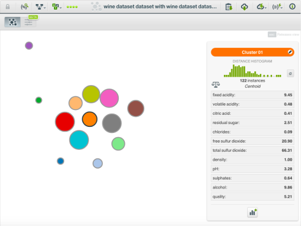

链接：https://blog.bigml.com/2018/11/21/k-means-finding-anomalies-while-clustering/

作者：佚名

翻译：@Zhuo YaZhao 

# K-means– –聚类时发现异常

11月4日至5日，BigML加入了哈马德·本·哈利法大学的一部分的卡塔尔计算机研究所 （QCRI），将一台机器学习学校带到卡塔尔多哈！我们很高兴有这个机会与QCRI合作。

会议期间，Sanjay Chawla博士讨论了他的与异常k-means-聚类的算法。我们认为使用我们的领域特定语言来实 现它的变体来自动化机器学习工作流程WhizzML将会是一个有趣的练习。

## 算法

k均值算法的通常过程如下。它以一些数据集，一些聚类k和一些预期离群值l开始。它随机选择k个质心， 并根据最接近的质心将数据集的每个点分配给这些质心之一。到目前为止，这就像香草k均值。在香草k均值中， 您现在将找到每个聚类的均值并将其设置为新的质心。在K-指-然而，你先找到升离其指定的质心最远的点， 并从数据集中过滤掉它们。使用剩余的点找到新的质心。通过在进行过程中删除这些点，我们将找到不受异常 值影响的质心，从而获得不同的（最好是更好的）质心。

我们已经有了一个实现在BigML k均值，群集资源。但这不是香草k均值。BigML的实现方式不是通过对集群中的 所有点求平均来找到新的质心，而是通过对点进行采样并使用梯度下降方法来更快地工作。BigML还选择了比香草 k均值更好的初始条件。为了避免失去这些好处，我们将使用Chawla的k均值-在核心迭代中使用完整的BigML集群资源。

这个WhizzML脚本是我们实现的重点。

```
(define (get-anomalies ds-id filtered-ds k l)
(let (cluster-id (create-and-wait-cluster {"k" k 
                                         "dataset" filtered-ds})
    batchcentroid-id (create-and-wait-batchcentroid 
                        {"cluster" cluster-id 
                         "dataset" ds-id 
                         "all_fields" true 
                         "distance" true 
                         "output_dataset" true})
    batchcentroid (fetch batchcentroid-id)
    centroid-ds (batchcentroid "output_dataset_resource")
    sample-id (create-and-wait-sample centroid-ds)
    field-id (((fetch centroid-ds) "objective_field") "id") 
    anomalies (fetch sample-id {"row_order_by" (str "-" field-id) 
                                "mode" "linear"
                                "rows" l
                                "index" true}))
(delete* [batchcentroid-id sample-id])
{"cluster-id" cluster-id 
 "centroid-ds" centroid-ds
 "instances" ((anomalies "sample") "rows")}))
```

让我们逐行检查它。除了在算法的每个步骤中删除l个离群值之外，让我们在删除异常之前运行整个k均值序列。

```
cluster-id (create-and-wait-cluster {"k" k "dataset" filtered-ds})
```

然后创建带有输出数据集并附加到质心的距离的批处理质心非常容易。

```
batchcentroid-id (create-and-wait-batchcentroid {"cluster" cluster-id 
                                             "dataset" ds-id 
                                             "all_fields" true 
                                             "distance" true 
                                             "output_dataset" 
                                               true})
```

为了获得特定点，我们需要使用BigML示例资源来获得最远的点。

```
sample-id (create-and-wait-sample centroid-ds
```

现在，我们可以找到与第l个实例关联的距离，然后从我们的原始数据集中过滤出所有大于该距离的点。

```
anomalies (fetch sample-id {"row_order_by" (str "-" field-id) 
                        "mode" "linear"
                        "rows" l
                        "index" true}))
```

我们重复此过程，直到质心稳定为止（通过在算法的后续迭代中在异常值集之间传递Jaccard系数的阈值确定），或者直到达到用户设置的最大迭代次数为止。

您可以在GitHub或BigML画廊中找到完整的代码。

## 脚本在行动

那么，当我们运行此脚本时会发生什么呢？让我们尝试一下红酒质量数据集。这是使用ak的13（使用BigML g-means群集选择）和l的10时的结果。

我们可以导出集群摘要报告，并将其与具有相同k的原始BigML集群进行比较。正如您可能期望的那样，通过除去外围点，k均值的质心标准偏差的平均值减去两个结果：0.00128与0.00152。

我们作为异常值删除的点又如何呢？我们知道它们是否真的异常吗？当通过BigML异常检测器运行wine数据集时，我们可以根据隔离林获得前十大异常。与脚本找到的十个离群值相比，我们 看到有六个共同的实例。这是一个体面的协议，我们已删除了真正的异常值