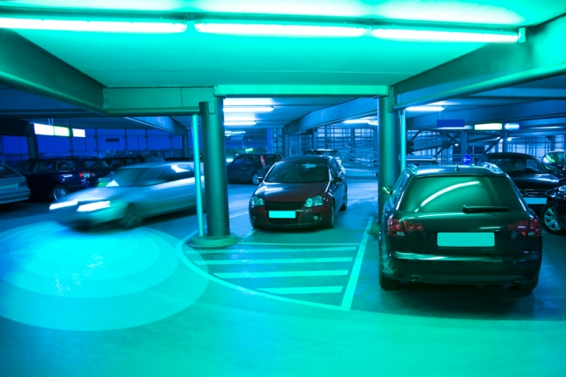

原文链接： https://news.mit.edu/2019/helping-autonomous-vehicles-see-around-corners-1028 

原文作者：Rob Matheson | 麻省理工学院新闻办公室 

翻译者：Qiang  He

---

​												标题：**帮助自动驾驶汽车转弯**

​						摘要： 通过检测阴影中的微小变化，新系统可以识别可能引起碰撞的接近物体 

正文： 为了提高自主系统的安全性，麻省理工学院的工程师开发了一种系统，该系统可以感知地面阴影的微小变化，从而确定拐角处是否有移动物体 .

 在某天自动驾驶汽车可以使用该系统来避免与另一辆汽车或行人从建筑物拐角处或停放的汽车之间出现的潜在碰撞 。将来，机器人可以在医院走廊上导航，以进行药物治疗或供应，可以使用这个系统来避免撞到人

在下周的国际智能机器人与系统会议（iros）上将发表的一篇论文中，研究人员描述了一辆自动驾驶汽车在停车场周围行驶和一个自动轮椅在走廊上导航的成功实验。当探测到接近的车辆并停车时，车载系统比传统的激光雷达（只能探测可见物体）快半秒以上。

 研究人员说，这看起来似乎不多，但是在快速移动的自动驾驶汽车上却占了几分之一秒 

“对于机器人与其他移动物体或人一起在周围环境中移动的应用，我们的方法可以提前警告机器人有人在拐弯，这样车辆就可以减速，调整路径，并提前做好避免碰撞的准备，”计算机科学和人工智能实验室（CSAIL）和电子工程和计算机科学的安德鲁和埃娜·维特比教授。“最大的梦想是为在街上快速行驶的车辆提供各种各样的‘X光视觉’。”

 当前，该系统仅在室内设置中进行了测试。在室内，机器人的速度要低得多，光照条件也更加一致，这使得系统更容易检测和分析阴影。 

 与Rus一起发表的论文有：第一作者Felix Naser SM '19，前CSAIL研究人员；CSAIL研究生Alexander Amini；CSAIL博士后Igor Gilitschenski；刚毕业的克里斯蒂娜·廖19岁；丰田研究院的Guy Rosman；麻省理工学院航空与航天专业副教授Sertac Karaman。 

**阴影摄影机的扩展**

 对于他们的工作，研究人员建立在他们称为“ ShadowCam”的系统上，该系统使用计算机视觉技术来检测和分类地面阴影的变化。麻省理工学院的教授威廉·弗里曼（William Freeman）和安东尼奥·托拉尔巴（Antonio Torralba）并非IROS论文的合著者，他们合作开发了该系统的早期版本，该版本在2017年和2018年的会议上进行了介绍。 

 对于输入，ShadowCam使用来自摄像机的视频帧序列，这些摄像机针对特定区域，例如拐角处的地板。它可以检测不同图像之间光强度随时间的变化，这可能表明某些物体在移开或靠近。这些更改中的某些更改可能很难检测到，或者用肉眼看不见，并且可以由对象和环境的各种属性确定。ShadowCam计算该信息，并将每个图像分类为包含静止的对象或动态的运动对象。如果它变成动态图像，它会做出相应的反应。

 使ShadowCam适应自动驾驶汽车需要进一步发展。例如，早期版本依赖于用称为“ AprilTags”的增强现实标签来衬砌区域，该标签类似于简化的QR码。机器人扫描AprilTags来检测和计算相对于标签的精确3D位置和方向。ShadowCam将标签用作环境的特征，以在可能包含阴影的特定像素补丁上归零。但是，使用AprilTags修改现实环境是不切实际的。  

 研究人员开发了一种结合了图像配准和新的视觉测距技术的新颖方法。图像配准通常在计算机视觉中使用，本质上会覆盖多个图像，以揭示图像中的变化。例如，医学图像配准与医学扫描重叠，以比较和分析解剖差异。 

 火星漫游者使用的视觉测距法通过分析图像序列中的姿势和几何形状来实时估算相机的运动。研究人员专门采用“直接稀疏测距法”（DSO），它可以在类似于AprilTags捕获的环境中计算特征点。本质上，DSO在3D点云上绘制环境的特征，然后计算机视觉管道仅选择位于感兴趣区域（例如拐角处的地板）的特征。 

 由于ShadowCam会获取感兴趣区域的输入图像序列，因此它使用DSO图像配准方法来覆盖机器人同一视点上的所有图像。即使机器人在移动，它也可以将阴影精确定位在相同的像素点上，以帮助检测图像之间的细微偏差。 

 接下来是信号放大，这是第一篇论文中介绍的技术。可能包含阴影的像素的颜色增强，从而降低了信噪比。这使得来自阴影变化的极其微弱的信号更容易被检测到。如果增强后的信号达到某个阈值（部分基于其与附近其他阴影的偏离程度），ShadowCam会将图像分类为“动态”。根据该信号的强度，系统可能会告诉机器人减速或停止。 

纳瑟说：“检测到该信号时，您应该格外小心。这可能是某些人从拐角处跑来跑去的阴影或停着的汽车，因此自动驾驶汽车会减速或完全停止

 **无标签测试** 

 在一项测试中，研究人员使用AprilTags和新的基于DSO的方法评估了系统在对移动或静止物体进行分类方面的性能。当人类将拐角变成轮椅的路径时，自动轮椅转向各个走廊的拐角。两种方法均达到了70％的相同分类精度，这表明不再需要AprilTags。 

 在一项单独的测试中，研究人员在停车场的自动驾驶汽车中安装了ShadowCam，该汽车的前大灯被关闭，模仿了夜间驾驶条件。他们将汽车检测时间与LiDAR进行了比较。在一个示例场景中，ShadowCam检测到汽车绕柱转弯的速度比LiDAR快0.72秒。此外，由于研究人员已针对ShadowCam专门针对车库的照明条件进行了调整，因此该系统的分类精度约为86％。 

 接下来，研究人员正在进一步开发该系统，以在不同的室内和室外照明条件下工作。将来，可能还会有一些方法可以加快系统的阴影检测速度，并自动为阴影感应标注目标区域的过程。 

