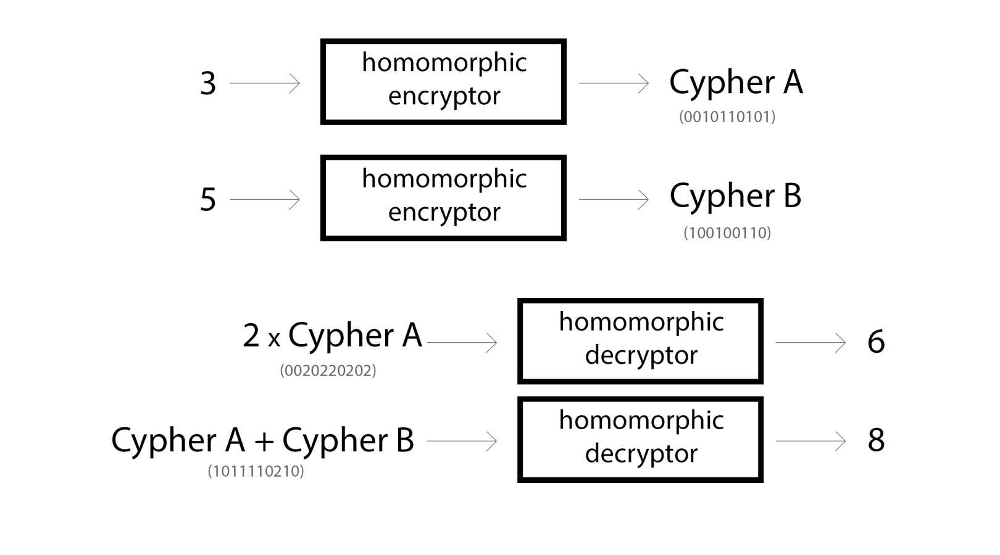
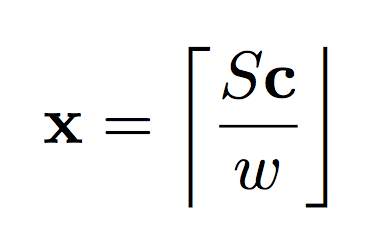

原文： http://iamtrask.github.io/2017/03/17/safe-ai/ 

作者：Andrew Trask

翻译：[@Chen Quan](https://github.com/chenquan )


**长文预警：** 在本文中，我们将训练一个在训练期间完全加密的神经网络（在未加密的数据上进行训练）。这将为神经网络带来两个有益的特性：首先，神经网络的智能可以受到更好的保护以免被他人盗取，消除了在不安全环境下训练的有价值的AI被其他智能盗取的风险；其次，网络可以**只作加密的预测**（这意味着在没有密钥的情况下，外界无法理解接受预测，从而网络对外界不会产生影响）。这在用户和超人工智能间建立了一个非常有价值的不对等权力。试想，如果AI是经过同态加密处理的，那么从AI的角度来看，**整个外部世界也是同态加密过的**。而人类可以控制密钥从而决定是解锁AI自身（在外部世界发布）还是只解码AI作出的决策（似乎显得更安全）。

**注：** 如果你对训练加密的神经网络感兴趣，可以参考[OpenMined的PySyft库](https://github.com/OpenMined/PySyft)

## 超级智能

很多人担心超人工智能总有一天会选择伤害人类。之前，史蒂芬·霍金曾呼吁建立一个[新的世界“政府”](https://futurism.com/stephen-hawking-finally-revealed-his-plan-for-preventing-an-ai-apocalypse/)来管理我们给予人工智能的能力以免其毁灭人类。这个陈述是很大胆的，我认为它反映了科学界以至全世界共同关心的问题。在本文中，我将用一些玩具性质的代码来演示针对这个问题的潜在技术解决方案。

我们的目标很朴实。我们像发明一个可以让AI变得极度聪明（聪明到可以治愈癌症，解决全球饥饿问题）的技术，不过前提是这样的智能是在人类的控制下的，即它的应用是受限的。无止境地学习固然是好的，但是知识的无限制应用却有着潜在的危险。

为了阐述这一观点，我将首先快速讲解两个振奋人心的研究领域：深度学习和同态加密。

## 第1部分：什么是深度学习？

深度学习可以理解为人工智能的一套自动化工具，主要借助与神经网络。作为计算机科学的领域之一，深度学习在很多智能任务的完成质量上超越了之前的技术，这促使了AI技术的繁荣。在这一背景下，在击败世界围棋冠军的[DeepMind的AlphaGo](https://deepmind.com/research/alphago/)中深度学习也扮演了重要角色。

**问题：** 神经网络是怎样学习的呢？

神经网络基于输入进行预测。它通过不断地试验来高效地做到这一点。这个过程从一个预测开始（起初很大情况下是随机的），之后通过接受到的“误差信号”来判断它的预测是高了还是低了（通常预测的输出为概率值）。在经过很多次尝试之后，网络开始具有了辨识能力。关于神经网络工作的具体细节，可以参阅[A Neural Network in 11 Lines of Python](http://iamtrask.github.io/2015/07/12/basic-python-network/)。

这里的重点是上面提到的误差信号。如果说网络不知道自己的预测的水平如何，它就无法进行学习，，要牢记这一点。

## 第2部分：什么是同态加密？

顾名思义，[同态加密](https://www.wired.com/2014/11/hacker-lexicon-homomorphic-encryption/)是一种加密形式。在不对称的情况下，可以用“公钥”将明文转化为乱码。关键的一点是，你可以用对应的“私钥”将加密后的文本再次解码为原始的明文。但是只有在你有“私钥”的情况下你才可以解码混淆后的明文（理论上）。

同态加密只是一种特殊的加密方式。它支持某些用户在不具有原有信息读权限的情况下对加密信息进行修改操作。举个例子来说，加密的数字信息可以在不解码的情况下进行乘法和加法操作。下面给出一个简单的例子：



现在同态加密的方案越来越多，每个方案都有着不同的特性。不过这还是一个成长中的领域，还有很多关键的问题仍待解决，我们后面会再回到这个问题上讨论。

现在我们先延续上面的内容进行讲解，从上图可以看出我们可以在经过同态加密的数据上进行乘法和加法操作。此外由于公钥可以进行单向加密，这使得我们可以用加密的数字和未加密的数字进行相应操作（对未加密的数据进行单向加密），正如上图中的 2 * Cypher 一样。（一些加密算法甚至不需要这样做，我们后面再谈）

## 第三部分：我们可以把两者结合使用吗？

深度学习和同态加密最常见的结合场景主要体现再数据隐私方面。事实证明，当数据经过同态加密之后，虽然不能够读取其中的信息，但是你仍然可以保持数据中大部分感兴趣的统计学结构。这使得人们可以在加密数据上训练模型（[CryptoNets](https://arxiv.org/abs/1412.6181)）。此外，初创对冲基金会[Numer.ai](https://medium.com/numerai/encrypted-data-for-efficient-markets-fffbe9743ba8)加密了昂贵，专有的数据来提供给任何人训练机器学习模型来预测股票市场。通常来说，他们是不能这样做的，因为这构成了珍贵/私密数据的泄漏（而常规的加密手段又会使模型训练变得不可能）。

不过，本文要做的是一个反向的过程，即对神经网络进行加密并在解码的数据上进行训练。

一个大型神经网络从整体上看复杂度是惊人的，但是将它们分解之后也只是一些简单操作的重复而已。事实上，许多先进的神经网络通常只需要以下操作来创建：

- 加法
- 乘法
- 除法
- 减法
- [Sigmoid](http://mathworld.wolfram.com/SigmoidFunction.html)
- [tanh](http://mathworld.wolfram.com/HyperbolicTangent.html)
- [指数函数](https://en.wikipedia.org/wiki/Exponential_function)

既然这样，我们在技术上是否可以加密同态神经网络本身吗？事实证明我们可以通过一些近似做到这一点。

- 加法 - 开箱即用
- 乘法 - 开箱即用
- 除法 - 开箱即用？ - 乘 (1 / 被乘数) 即可
- 减法 - 开箱即用？ - 加一个负数即可
- [Sigmoid](http://mathworld.wolfram.com/SigmoidFunction.html) - 嗯...也许有点难
- [Tanh](http://mathworld.wolfram.com/HyperbolicTangent.html) - 嗯...也许有点难
- [指数](https://en.wikipedia.org/wiki/Exponential_function) - 嗯...也许有点难

看起来我们可以很轻松地完成除法和减法，但是完成一些复杂函数则比完成加法和乘法操作困难的多。为了对深度神经网络进行同态加密，我们需要一些“秘密配方”。

## 第四部分：泰勒级数展开

可能你还记得高中或者大学里这部分的内容：[泰勒级数](https://en.wikipedia.org/wiki/Taylor_series)允许我们使用无限项的加减乘除操作的组合来计算非线性函数。这个方法完美地解决了我们的问题！（除了需要无限项这一点）。幸运的是，如果你只能计算泰勒展开式的前几项，你也可以得到一个近似的函数。下卖弄给出了一些常用函数的泰勒级数（[来源](http://hyperphysics.phy-astr.gsu.edu/hbase/tayser.html)）：


其中有指数函数！可以看到展开式只是一些加减乘除操作，这是我们可以完成的。同样地，我们可以像下图所示一样用Python实现我们需要的sigmoid函数的泰勒展开式（其展开式可以在[Wolfram Alpha](http://mathworld.wolfram.com/SigmoidFunction.html)查阅）。我们可以只取前面的部分项来观察近似结果和实际结果的差距。

```python
import numpy as np

def sigmoid_exact(x):
  return 1 / (1 + np.exp(-x))

# using taylor series
def sigmoid_approximation(x):
  return (1 / 2) + (x / 4) - (x**3 / 48) + (x**5 / 480)

for lil_number in [0.1,0.2,0.3,0.4,0.5,0.6,0.7,0.8,0.9,1.0]:
  
  print("\nInput:" + str(lil_number))
  print("Exact Sigmoid:" + str(sigmoid_exact(lil_number)))
  print("Approx Sigmoid:" + str(sigmoid_approximation(lil_number)))
Input:0.1
Exact Sigmoid:0.524979187479
Approx Sigmoid:0.5249791875

Input:0.2
Exact Sigmoid:0.549833997312
Approx Sigmoid:0.549834

Input:0.3
Exact Sigmoid:0.574442516812
Approx Sigmoid:0.5744425625

Input:0.4
Exact Sigmoid:0.598687660112
Approx Sigmoid:0.598688

Input:0.5
Exact Sigmoid:0.622459331202
Approx Sigmoid:0.6224609375

Input:0.6
Exact Sigmoid:0.645656306226
Approx Sigmoid:0.645662

Input:0.7
Exact Sigmoid:0.668187772168
Approx Sigmoid:0.6682043125

Input:0.8
Exact Sigmoid:0.689974481128
Approx Sigmoid:0.690016

Input:0.9
Exact Sigmoid:0.710949502625
Approx Sigmoid:0.7110426875

Input:1.0
Exact Sigmoid:0.73105857863
Approx Sigmoid:0.73125
```

从结果可以看到，我们只取前四项时的计算结果就已经很接近无穷项的计算结果了。完成了复杂函数的问题之后，下面我们来选择一个同态加密算法。

## 第5部分：选择加密算法

同态加密是一个相对较新的领域，其里程碑事件是2009年克雷格·金特里（Craig Gentry）发明了[第一个完全同态加密算法](https://www.cs.cmu.edu/~odonnell/hits09/gentry-homomorphic-encryption.pdf)。这个发现为后来的研究者提供了立足点。这一领域大部分振奋人心的研究是围绕实现同态加密的图灵完全的计算机展开的。相应地，人们需要寻求一个有效且安全的同态加密算法方案，可以根据任意的计算输入去完成相应的逻辑门操作。人们普遍的希望是可以将工作安全地移植到云上并且不用担心发送的数据被发送者以外的人监听。这是一个非常酷的想法，也取得了很大进展。

但是还有一个缺陷，就是大多数完全同态加密算法在普通计算机上通常是非常慢的（不实用）。这引发了另一个有趣的研究方向，即只做部分同态加密的运算从而减小运算量。这种方案降低了灵活程度但提升了运算速度，是计算中常用的折衷手段。

我们从这一点出发寻找加密算法。理论上我们需要的是一个在浮点运算的同态加密方案（但我们本文更多以整数为例），为什么不是二进制呢？二进制加密固然可行，但是它不仅要求完全同态加密方案的灵活性（性能损失），还需要我们去管理二进制表示和数学操作中的逻辑操作。相比之下，没有那么强大的针对浮点数定制的HE算法更为合适。

尽管我们确定了这个限制条件，但是还有很多的算法以供选择。这里有一些具有我们喜欢的特性的流行算法：

- [基于整数向量的高效同态加密及其应用](http://www.rle.mit.edu/sia/wp-content/uploads/2015/04/2014-zhou-wornell-ita.pdf)
- [Yet Another Somewhat Homomorphic Encryption (YASHE)](https://eprint.iacr.org/2013/075.pdf)
- [Somewhat Practical Fully Homomorphic Encryption (FV)](https://pdfs.semanticscholar.org/531f/8e756ea280f093138788ee896b3fa8ca085a.pdf)
- [Fully Homomorphic Encryption without Bootstrapping](http://eprint.iacr.org/2011/277.pdf)

以上方案中的最优方案应当是YASHE或FV。YASHE被应用与流行的CryptoNets（加密网络）算法当中，对浮点操作的支持很好。但是这个方法很复杂，为了使本文更加简单有趣，我们选择了稍逊一筹的方案（基于整数向量的高效同态加密，[安全性要差一点](https://eprint.iacr.org/2016/775.pdf)）。但是，你要注意即使你读本文时出现了新的同态加密算法，但是本文中的整数/浮点数加法和乘法同态加密的实现方案是通用的。我希望通过本文可以提高你对同态加密算法应用的理解以便开发出更多的同态加密算法去优化深度学习。

这个加密算法[Yu, Lai, and Paylor的工作](https://courses.csail.mit.edu/6.857/2015/files/yu-lai-payor.pdf)里也有一节专门提及，还有相应的[代码实现](https://github.com/jamespayor/vector-homomorphic-encryption)，核心代码位于`vhe.cpp`当中。下面我们将用Python实现相应的接口并做相应讲解。你也可以选择更高层面的实现方式或者移植到其他语言或场景下，因为这套实现方案是通用的（通用的函数名称，变量名等等）。

## 第6部分：Python中的同态加密

首先介绍一下同态加密中的术语：

- **明文：** 未加密的数据。这也被称为“信息”(message)。在我们的例子中，这将是代表我们神经网络的数值的集合。
- **密文：** 加密后的数据。我们在密文做的数学操作会改变底层的明文，最初的图示也提到了这一点。
- **公钥：** 伪随机数序列，任何人可以用它加密数据。公钥可以被传播，因为拿到的人只能用它来加密数据（理论上）。
- **私钥/密钥：** 伪随机数序列，允许您解密通过公钥加密的数据。私钥不应该分享给他人，否则你加密的数据就会被他人解码。

以上是使用中可以移动的组件。在不同的同态加密算法中，会有一些标准变量，本文中有以下标准变量：

- **S：** 代表密钥/私钥的矩阵，你需要用它来解密信息。
- **M：** 公钥。你会用它来加密东西，并执行数学运算。虽然一些算法中所有的数学运算都不需要公钥，但是公钥的使用还是相当广泛。
- **c：** 加密数据矢量，“密文”。
- **x：** 对应于你的信息，或者说你的“明文”。有些论文使用变量“m”代替。
- ***w\* :** 用于给我们的输入信息**x**重新分配权重的常量值。（使其总是更大或更小一点）。我们使用这个变量来帮助调整信噪比。使信号“变大”使得它在任何给定的操作中不易受到噪声的影响。但是，如果数据太大，则会增加我们完全损坏数据的可能性。这是一个折衷后的值。
- **E**/**e**：通常指随机噪声。在某些情况下，公钥加密的数据在加密之前被混入了噪声。混入的噪声使解密变得困难。但这也使的相同的明文在使用相同的公钥时可以产生不同的密文，这增加了密文被破解的难度。请注意，根据算法和实现，**E/e**可以是矢量或矩阵。在其他情况下，它也可能是指操作累积的噪声。稍后我们会进一步讨论。

与许多数学论文一样，大写字母对应于矩阵，小写字母对应于矢量，斜体小写字母对应于标量。同态加密有四种我们关心的操作：公钥/私钥对生成，单向加密，解密和数学运算。我们先从解密开始。 




上面的公式描述了私钥**S**和我们的“明文”**x**之间的一般关系。下面的公式告诉了我们如何使用私钥来解密数据。注意下面的式子，**e**去哪了？其实从原理上来说同态加密引入噪声的目的就是使人们在没有私钥的情况下很难解密我们的数据，但是如果你拥有密钥，噪声又显得很小以至于等于或小于舍入误差。下面公式中特殊的括号表示其中的计算结果四舍五入至最近的整数。其他的加密算法可以选择不同的舍入方式。取模运算符更是无处不在,加密的过程实际上就是生成一个满足上述等式的**c**。如果**S**是一个随机矩阵，**c**将很难被解密。简而言之，非对称情况下，生成加密密钥只需要找到私钥的逆即可。我们用Python代码来演示以下：

```python
import numpy as np

def generate_key(w,m,n):
    S = (np.random.rand(m,n) * w / (2 ** 16)) # proving max(S) < w
    return S

def encrypt(x,S,m,n,w):
    assert len(x) == len(S)
    
    e = (np.random.rand(m)) # proving max(e) < w / 2
    c = np.linalg.inv(S).dot((w * x) + e)
    return c

def decrypt(c,S,w):
    return (S.dot(c) / w).astype('int')

def get_c_star(c,m,l):
    c_star = np.zeros(l * m,dtype='int')
    for i in range(m):
        b = np.array(list(np.binary_repr(np.abs(c[i]))),dtype='int')
        if(c[i] < 0):
            b *= -1
        c_star[(i * l) + (l-len(b)): (i+1) * l] += b
    return c_star

def get_S_star(S,m,n,l):
    S_star = list()
    for i in range(l):
        S_star.append(S*2**(l-i-1))
    S_star = np.array(S_star).transpose(1,2,0).reshape(m,n*l)
    return S_star


x = np.array([0,1,2,5])

m = len(x)
n = m
w = 16
S = generate_key(w,m,n)
```

我在iPython notebook中运行这个代码后执行了以下操作（图示有相应的输出）。 


关键的是下面两个操作的结果，可以看到我们对明文做的基本算术操作改变了密文底层代表的明文。很优雅的操作，不是吗？

## 第7部分：优化加密过程


**引入:** 我们再次审视一下解密的公式,如果密钥S为单位矩阵，那么密文c就只是重新加权后的明文混入一定的噪声而已,只要具有一定量的样本就可以发现。如果这段文字你不理解的话，你需要搜索一下“单位矩阵”相关的知识再回来阅读，否则下面的内容理解起来会很吃力。

上面的例子告诉了我们加密发生的过程。这项技术的发明者并没有同时确定一对独立的“公钥”和”私钥“，而是提出了“密钥转换”技术,借助这一技术可以将私钥S转换为S'。更具体地说，这种密钥转换技术生成了可以将未加密的数据(单位矩阵作为密钥)转换为加密后的数据（随机生成的，难以被猜到的密钥）的矩阵M，M就是我们的公钥！

上面一段包含的信息很多，我们再梳理一遍：

#### 这里发生了什么...

1. 根据上面给定的两个公式，如果密钥是单位矩阵，则信息未加密。
2. 根据上面给定的两个公式，如果密钥是一个随机矩阵，则生成的信息是加密的。
3. 我们可以创建一个矩阵M，将密钥从一种形式更改为另一种形式。
4. 当矩阵M从单位矩阵转换为随机矩阵密钥时，它通过扩展完成了信息的单向加密。
5. 因为M扮演着“单向加密”的角色，所以我们称之为“公钥”，并且可以像公钥一样分发它，因为它并不能解密代码。

到此我们不做更深的讲解，下面我们看一下这个过程如何在Python中完成：

```python
import numpy as np

def generate_key(w,m,n):
    S = (np.random.rand(m,n) * w / (2 ** 16)) # proving max(S) < w
    return S

def encrypt(x,S,m,n,w):
    assert len(x) == len(S)
    
    e = (np.random.rand(m)) # proving max(e) < w / 2
    c = np.linalg.inv(S).dot((w * x) + e)
    return c

def decrypt(c,S,w):
    return (S.dot(c) / w).astype('int')

def get_c_star(c,m,l):
    c_star = np.zeros(l * m,dtype='int')
    for i in range(m):
        b = np.array(list(np.binary_repr(np.abs(c[i]))),dtype='int')
        if(c[i] < 0):
            b *= -1
        c_star[(i * l) + (l-len(b)): (i+1) * l] += b
    return c_star

def switch_key(c,S,m,n,T):
    l = int(np.ceil(np.log2(np.max(np.abs(c)))))
    c_star = get_c_star(c,m,l)
    S_star = get_S_star(S,m,n,l)
    n_prime = n + 1
    

    S_prime = np.concatenate((np.eye(m),T.T),0).T
    A = (np.random.rand(n_prime - m, n*l) * 10).astype('int')
    E = (1 * np.random.rand(S_star.shape[0],S_star.shape[1])).astype('int')
    M = np.concatenate(((S_star - T.dot(A) + E),A),0)
    c_prime = M.dot(c_star)
    return c_prime,S_prime

def get_S_star(S,m,n,l):
    S_star = list()
    for i in range(l):
        S_star.append(S*2**(l-i-1))
    S_star = np.array(S_star).transpose(1,2,0).reshape(m,n*l)
    return S_star

def get_T(n):
    n_prime = n + 1
    T = (10 * np.random.rand(n,n_prime - n)).astype('int')
    return T

def encrypt_via_switch(x,w,m,n,T):
    c,S = switch_key(x*w,np.eye(m),m,n,T)
    return c,S

x = np.array([0,1,2,5])

m = len(x)
n = m
w = 16
S = generate_key(w,m,n)
```


这种方法主要是让密钥S大多数情况下为单位矩阵，然后再用一个随机向量T和它结合在一起。虽然说T拥有了密钥所有的必要信息，但是我们还需要创建一个与S行列相同的矩阵来完成这个工作。

## 第8部分：建立异或神经网络

现在我们已经知道了如何对信息进行加密和解密（并实现了基本的加法和乘法）,是时候扩展剩余的操作来实现一个简单的XOR神经网络了。虽然从技术上来说神经网络只是一系列简单操作的集合，但为了方便我们需要将一些常用的组合操作封装为函数。下面我会描述我们需要的操作以及我们实现这些操作使用的一些高级技巧，然后会列出相关的代码实现。如果想了解更多细节可以参阅[Angel Yu, Wai Lok Lai, James Payor的研究](https://courses.csail.mit.edu/6.857/2015/files/yu-lai-payor.pdf)。

- **浮点数：** 我们将通过简单地将浮点数放大为整数来实现。这样即时输入为浮点数我们也可以作为整数处理。比方说，我们选择的放大倍数为1000。放大前0.2  *0.5 = 0.1。放大后为200*  500 = 100000.注意我们进行两次乘法运算之后必须缩放2次，即100000 /（1000 * 1000）= 0.1。这是一个你需要习惯的技巧。由于同态加密方案最后会舍入到最近的整数，所以放大也可以帮助你控制网络的精度。
- **矢量矩阵乘法：** 这是我们要完成的基本功能。事实上，将一个密钥转换为另一个密钥的M矩阵的过程实际上就是一种线性变换。
- **点积：** 在正确的上下文环境中，上面的线性变换也可以写作点积。
- **Sigmoid：** 由于我们可以做矢量矩阵乘法，我们可以借助足够的乘式来评估拟合任意多项式。由于我们知道sigmoid的泰勒级数多项式，我们可以拟合一个近似的sigmoid函数！
- **矩阵元乘法：** 这个操作的效率极低。我们必须做一个向量矩阵乘法或一系列的点积。
- **外积：** 我们可以通过矩阵的裁剪和外积来实现。

首先声明这里可能还有其它更有效的方法来实现以上操作，但是为了不破坏当前的同态加密方案我只好使用了论文中提供的函数（实现sigmoid可用的扩展）。现在让我们看看如何在Python中完成它。

```python
def sigmoid(layer_2_c):
    out_rows = list()
    for position in range(len(layer_2_c)-1):

        M_position = M_onehot[len(layer_2_c)-2][0]

        layer_2_index_c = innerProd(layer_2_c,v_onehot[len(layer_2_c)-2][position],M_position,l) / scaling_factor

        x = layer_2_index_c
        x2 = innerProd(x,x,M_position,l) / scaling_factor
        x3 = innerProd(x,x2,M_position,l) / scaling_factor
        x5 = innerProd(x3,x2,M_position,l) / scaling_factor
        x7 = innerProd(x5,x2,M_position,l) / scaling_factor

        xs = copy.deepcopy(v_onehot[5][0])
        xs[1] = x[0]
        xs[2] = x2[0]
        xs[3] = x3[0]
        xs[4] = x5[0]
        xs[5] = x7[0]

        out = mat_mul_forward(xs,H_sigmoid[0:1],scaling_factor)
        out_rows.append(out)
    return transpose(out_rows)[0]

def load_linear_transformation(syn0_text,scaling_factor = 1000):
    syn0_text *= scaling_factor
    return linearTransformClient(syn0_text.T,getSecretKey(T_keys[len(syn0_text)-1]),T_keys[len(syn0_text)-1],l)

def outer_product(x,y):
    flip = False
    if(len(x) < len(y)):
        flip = True
        tmp = x
        x = y
        y = tmp
        
    y_matrix = list()

    for i in range(len(x)-1):
        y_matrix.append(y)

    y_matrix_transpose = transpose(y_matrix)

    outer_result = list()
    for i in range(len(x)-1):
        outer_result.append(mat_mul_forward(x * onehot[len(x)-1][i],y_matrix_transpose,scaling_factor))
    
    if(flip):
        return transpose(outer_result)
    
    return outer_result

def mat_mul_forward(layer_1,syn1,scaling_factor):
    
    input_dim = len(layer_1)
    output_dim = len(syn1)

    buff = np.zeros(max(output_dim+1,input_dim+1))
    buff[0:len(layer_1)] = layer_1
    layer_1_c = buff
    
    syn1_c = list()
    for i in range(len(syn1)):
        buff = np.zeros(max(output_dim+1,input_dim+1))
        buff[0:len(syn1[i])] = syn1[i]
        syn1_c.append(buff)
    
    layer_2 = innerProd(syn1_c[0],layer_1_c,M_onehot[len(layer_1_c) - 2][0],l) / float(scaling_factor)
    for i in range(len(syn1)-1):
        layer_2 += innerProd(syn1_c[i+1],layer_1_c,M_onehot[len(layer_1_c) - 2][i+1],l) / float(scaling_factor)
    return layer_2[0:output_dim+1]

def elementwise_vector_mult(x,y,scaling_factor):
    
    y =[y]
    
    one_minus_layer_1 = transpose(y)

    outer_result = list()
    for i in range(len(x)-1):
        outer_result.append(mat_mul_forward(x * onehot[len(x)-1][i],y,scaling_factor))
        
    return transpose(outer_result)[0]
```

还有一点没有提到，就是为了节省时间我预先计算了几个密钥，矢量，矩阵并存储了起来。其中包含了矩阵元全为1的矩阵，不定长的One-hot编码向量等等。这为上面提到的裁剪操作以及其他简单操作提供了很大的便利。例如sigmoid函数的导数是sigmoid(x) * (1 - sigmoid(x))。因此预先计算这些值是很有帮助的。下面给出相应代码：

```python
# HAPPENS ON SECURE SERVER

l = 100
w = 2 ** 25

aBound = 10
tBound = 10
eBound = 10

max_dim = 10

scaling_factor = 1000

# keys
T_keys = list()
for i in range(max_dim):
    T_keys.append(np.random.rand(i+1,1))

# 单向加密转换
M_keys = list()
for i in range(max_dim):
    M_keys.append(innerProdClient(T_keys[i],l))

M_onehot = list()
for h in range(max_dim):
    i = h+1
    buffered_eyes = list()
    for row in np.eye(i+1):
        buffer = np.ones(i+1)
        buffer[0:i+1] = row
        buffered_eyes.append((M_keys[i-1].T * buffer).T)
    M_onehot.append(buffered_eyes)
    
c_ones = list()
for i in range(max_dim):
    c_ones.append(encrypt(T_keys[i],np.ones(i+1), w, l).astype('int'))
    
v_onehot = list()
onehot = list()
for i in range(max_dim):
    eyes = list()
    eyes_txt = list()
    for eye in np.eye(i+1):
        eyes_txt.append(eye)
        eyes.append(one_way_encrypt_vector(eye,scaling_factor))
    v_onehot.append(eyes)
    onehot.append(eyes_txt)

H_sigmoid_txt = np.zeros((5,5))

H_sigmoid_txt[0][0] = 0.5
H_sigmoid_txt[0][1] = 0.25
H_sigmoid_txt[0][2] = -1/48.0
H_sigmoid_txt[0][3] = 1/480.0
H_sigmoid_txt[0][4] = -17/80640.0

H_sigmoid = list()
for row in H_sigmoid_txt:
    H_sigmoid.append(one_way_encrypt_vector(row))
```

如果仔细观察的话，你会发现H_sigmoid矩阵正是我们估计sigmoid函数时需要用到的矩阵。:)最后，我们用下面的代码来训练我们的神经网络。如果你对神经网络的概念还不清楚，可以自行搜索或者查阅作者的博文[A Neural Network in 11 Lines of Python](http://yehe.isd.com/column/iamtrask.github.io/2015/07/12/basic-python-network/)，这里的异或神经网络基本上是参考这篇文章的，只是根据上面的加密操作函数做了相应替换。 

```python
np.random.seed(1234)

input_dataset = [[],[0],[1],[0,1]]
output_dataset = [[0],[1],[1],[0]]

input_dim = 3
hidden_dim = 4
output_dim = 1
alpha = 0.015

# 利用公钥实现单向加密
y = list()
for i in range(4):
    y.append(one_way_encrypt_vector(output_dataset[i],scaling_factor))

# 生成权重值
syn0_t = (np.random.randn(input_dim,hidden_dim) * 0.2) - 0.1
syn1_t = (np.random.randn(output_dim,hidden_dim) * 0.2) - 0.1

# 单向加密权重值
syn1 = list()
for row in syn1_t:
    syn1.append(one_way_encrypt_vector(row,scaling_factor).astype('int64'))

syn0 = list()
for row in syn0_t:
    syn0.append(one_way_encrypt_vector(row,scaling_factor).astype('int64'))


# 开始训练
for iter in range(1000):
    
    decrypted_error = 0
    encrypted_error = 0
    for row_i in range(4):

        if(row_i == 0):
            layer_1 = sigmoid(syn0[0])
        elif(row_i == 1):
            layer_1 = sigmoid((syn0[0] + syn0[1])/2.0)
        elif(row_i == 2):
            layer_1 = sigmoid((syn0[0] + syn0[2])/2.0)
        else:
            layer_1 = sigmoid((syn0[0] + syn0[1] + syn0[2])/3.0)

        layer_2 = (innerProd(syn1[0],layer_1,M_onehot[len(layer_1) - 2][0],l) / float(scaling_factor))[0:2]

        layer_2_delta = add_vectors(layer_2,-y[row_i])

        syn1_trans = transpose(syn1)

        one_minus_layer_1 = [(scaling_factor * c_ones[len(layer_1) - 2]) - layer_1]
        sigmoid_delta = elementwise_vector_mult(layer_1,one_minus_layer_1[0],scaling_factor)
        layer_1_delta_nosig = mat_mul_forward(layer_2_delta,syn1_trans,1).astype('int64')
        layer_1_delta = elementwise_vector_mult(layer_1_delta_nosig,sigmoid_delta,scaling_factor) * alpha

        syn1_delta = np.array(outer_product(layer_2_delta,layer_1)).astype('int64')

        syn1[0] -= np.array(syn1_delta[0]* alpha).astype('int64')

        syn0[0] -= (layer_1_delta).astype('int64')

        if(row_i == 1):
            syn0[1] -= (layer_1_delta).astype('int64')
        elif(row_i == 2):
            syn0[2] -= (layer_1_delta).astype('int64')
        elif(row_i == 3):
            syn0[1] -= (layer_1_delta).astype('int64')
            syn0[2] -= (layer_1_delta).astype('int64')


        # 为了监视训练情况，下面我将解码损失值
        # 如果当前环境并不安全，我会将加密后的损失值发送至安全的地方解码
        encrypted_error += int(np.sum(np.abs(layer_2_delta)) / scaling_factor)
        decrypted_error += np.sum(np.abs(s_decrypt(layer_2_delta).astype('float')/scaling_factor))

    
    sys.stdout.write("\r Iter:" + str(iter) + " Encrypted Loss:" + str(encrypted_error) +  " Decrypted Loss:" + str(decrypted_error) + " Alpha:" + str(alpha))
    
    # 使输出更美观
    if(iter % 10 == 0):
        print()
    
    # 加密误差达到指定值后停止训练
    if(encrypted_error < 25000000):
        break
        
print("\nFinal Prediction:")

for row_i in range(4):

    if(row_i == 0):
        layer_1 = sigmoid(syn0[0])
    elif(row_i == 1):
        layer_1 = sigmoid((syn0[0] + syn0[1])/2.0)
    elif(row_i == 2):
        layer_1 = sigmoid((syn0[0] + syn0[2])/2.0)
    else:
        layer_1 = sigmoid((syn0[0] + syn0[1] + syn0[2])/3.0)

    layer_2 = (innerProd(syn1[0],layer_1,M_onehot[len(layer_1) - 2][0],l) / float(scaling_factor))[0:2]
    print("True Pred:" + str(output_dataset[row_i]) + " Encrypted Prediction:" + str(layer_2) + " Decrypted Prediction:" + str(s_decrypt(layer_2) / scaling_factor))
 Iter:0 Encrypted Loss:84890656 Decrypted Loss:2.529 Alpha:0.015
 Iter:10 Encrypted Loss:69494197 Decrypted Loss:2.071 Alpha:0.015
 Iter:20 Encrypted Loss:64017850 Decrypted Loss:1.907 Alpha:0.015
 Iter:30 Encrypted Loss:62367015 Decrypted Loss:1.858 Alpha:0.015
 Iter:40 Encrypted Loss:61874493 Decrypted Loss:1.843 Alpha:0.015
 Iter:50 Encrypted Loss:61399244 Decrypted Loss:1.829 Alpha:0.015
 Iter:60 Encrypted Loss:60788581 Decrypted Loss:1.811 Alpha:0.015
 Iter:70 Encrypted Loss:60327357 Decrypted Loss:1.797 Alpha:0.015
 Iter:80 Encrypted Loss:59939426 Decrypted Loss:1.786 Alpha:0.015
 Iter:90 Encrypted Loss:59628769 Decrypted Loss:1.778 Alpha:0.015
 Iter:100 Encrypted Loss:59373621 Decrypted Loss:1.769 Alpha:0.015
 Iter:110 Encrypted Loss:59148014 Decrypted Loss:1.763 Alpha:0.015
 Iter:120 Encrypted Loss:58934571 Decrypted Loss:1.757 Alpha:0.015
 Iter:130 Encrypted Loss:58724873 Decrypted Loss:1.75 Alpha:0.0155
 Iter:140 Encrypted Loss:58516008 Decrypted Loss:1.744 Alpha:0.015
 Iter:150 Encrypted Loss:58307663 Decrypted Loss:1.739 Alpha:0.015
 Iter:160 Encrypted Loss:58102049 Decrypted Loss:1.732 Alpha:0.015
 Iter:170 Encrypted Loss:57863091 Decrypted Loss:1.725 Alpha:0.015
 Iter:180 Encrypted Loss:55470158 Decrypted Loss:1.653 Alpha:0.015
 Iter:190 Encrypted Loss:54650383 Decrypted Loss:1.629 Alpha:0.015
 Iter:200 Encrypted Loss:53838756 Decrypted Loss:1.605 Alpha:0.015
 Iter:210 Encrypted Loss:51684722 Decrypted Loss:1.541 Alpha:0.015
 Iter:220 Encrypted Loss:54408709 Decrypted Loss:1.621 Alpha:0.015
 Iter:230 Encrypted Loss:54946198 Decrypted Loss:1.638 Alpha:0.015
 Iter:240 Encrypted Loss:54668472 Decrypted Loss:1.63 Alpha:0.0155
 Iter:250 Encrypted Loss:55444008 Decrypted Loss:1.653 Alpha:0.015
 Iter:260 Encrypted Loss:54094286 Decrypted Loss:1.612 Alpha:0.015
 Iter:270 Encrypted Loss:51251831 Decrypted Loss:1.528 Alpha:0.015
 Iter:276 Encrypted Loss:24543890 Decrypted Loss:0.732 Alpha:0.015
 Final Prediction:
True Pred:[0] Encrypted Prediction:[-3761423723.0718255 0.0] Decrypted Prediction:[-0.112]
True Pred:[1] Encrypted Prediction:[24204806753.166267 0.0] Decrypted Prediction:[ 0.721]
True Pred:[1] Encrypted Prediction:[23090462896.17028 0.0] Decrypted Prediction:[ 0.688]
True Pred:[0] Encrypted Prediction:[1748380342.4553354 0.0] Decrypted Prediction:[ 0.052]
```

以上是我训练这个网络时得到的输出。因为加密噪声和低精度的问题模型调优会更困难一些，同时模型的训练也很慢，这是由于加密和解密操作的开销。虽然我也想做一些更简单的样例，但是从我们的主题和概念出发，首先要保证的是方案的安全性。

### 重点：

- 网络的权重全部是加密的。
- 训练数据是未加密的。
- 在训练之后，网络可以被解密以提高性能或二次训练（或切换到不同的加密密钥）。
- 训练损失和输出的预测都是加密的值。我们必须解码它们才能解释网络的行为。

## 第9部分：情感分类

为了提供一些更真实的场景，这里提供了基于优达学城的纳米学位中的网络实现的情感分类网络，网络是在IMDB的评价上训练的。你可以在[这里](https://github.com/iamtrask/iamtrask.github.io/blob/master/notebooks/VHE%2B-%2BSentiment%2BClassification.ipynb)找到完整的代码 

```python
import time
import sys
import numpy as np

# 让我们调整之前的网络来适配这个问题
class SentimentNetwork:
    def __init__(self, reviews,labels,min_count = 10,polarity_cutoff = 0.1,hidden_nodes = 8, learning_rate = 0.1):
       
        np.random.seed(1234)
    
        self.pre_process_data(reviews, polarity_cutoff, min_count)
        
        self.init_network(len(self.review_vocab),hidden_nodes, 1, learning_rate)
        
        
    def pre_process_data(self,reviews, polarity_cutoff,min_count):
        
        print("Pre-processing data...")
        
        positive_counts = Counter()
        negative_counts = Counter()
        total_counts = Counter()

        for i in range(len(reviews)):
            if(labels[i] == 'POSITIVE'):
                for word in reviews[i].split(" "):
                    positive_counts[word] += 1
                    total_counts[word] += 1
            else:
                for word in reviews[i].split(" "):
                    negative_counts[word] += 1
                    total_counts[word] += 1

        pos_neg_ratios = Counter()

        for term,cnt in list(total_counts.most_common()):
            if(cnt >= 50):
                pos_neg_ratio = positive_counts[term] / float(negative_counts[term]+1)
                pos_neg_ratios[term] = pos_neg_ratio

        for word,ratio in pos_neg_ratios.most_common():
            if(ratio > 1):
                pos_neg_ratios[word] = np.log(ratio)
            else:
                pos_neg_ratios[word] = -np.log((1 / (ratio + 0.01)))
        
        review_vocab = set()
        for review in reviews:
            for word in review.split(" "):
                if(total_counts[word] > min_count):
                    if(word in pos_neg_ratios.keys()):
                        if((pos_neg_ratios[word] >= polarity_cutoff) or (pos_neg_ratios[word] <= -polarity_cutoff)):
                            review_vocab.add(word)
                    else:
                        review_vocab.add(word)
        self.review_vocab = list(review_vocab)
        
        label_vocab = set()
        for label in labels:
            label_vocab.add(label)
        
        self.label_vocab = list(label_vocab)
        
        self.review_vocab_size = len(self.review_vocab)
        self.label_vocab_size = len(self.label_vocab)
        
        self.word2index = {}
        for i, word in enumerate(self.review_vocab):
            self.word2index[word] = i
        
        self.label2index = {}
        for i, label in enumerate(self.label_vocab):
            self.label2index[label] = i
         
        
    def init_network(self, input_nodes, hidden_nodes, output_nodes, learning_rate):
        # 设置输入层，隐藏层和输出层的节点数
        self.input_nodes = input_nodes
        self.hidden_nodes = hidden_nodes
        self.output_nodes = output_nodes

        print("Initializing Weights...")
        self.weights_0_1_t = np.zeros((self.input_nodes,self.hidden_nodes))
    
        self.weights_1_2_t = np.random.normal(0.0, self.output_nodes**-0.5, 
                                                (self.hidden_nodes, self.output_nodes))
        
        print("Encrypting Weights...")
        self.weights_0_1 = list()
        for i,row in enumerate(self.weights_0_1_t):
            sys.stdout.write("\rEncrypting Weights from Layer 0 to Layer 1:" + str(float((i+1) * 100) / len(self.weights_0_1_t))[0:4] + "% done")
            self.weights_0_1.append(one_way_encrypt_vector(row,scaling_factor).astype('int64'))
        print("")
        
        self.weights_1_2 = list()
        for i,row in enumerate(self.weights_1_2_t):
            sys.stdout.write("\rEncrypting Weights from Layer 1 to Layer 2:" + str(float((i+1) * 100) / len(self.weights_1_2_t))[0:4] + "% done")
            self.weights_1_2.append(one_way_encrypt_vector(row,scaling_factor).astype('int64'))           
        self.weights_1_2 = transpose(self.weights_1_2)
        
        self.learning_rate = learning_rate
        
        self.layer_0 = np.zeros((1,input_nodes))
        self.layer_1 = np.zeros((1,hidden_nodes))
        
    def sigmoid(self,x):
        return 1 / (1 + np.exp(-x))
    
    
    def sigmoid_output_2_derivative(self,output):
        return output * (1 - output)
    
    def update_input_layer(self,review):

        # 清除之前的转台，将每层中的值置为0
        self.layer_0 *= 0
        for word in review.split(" "):
            self.layer_0[0][self.word2index[word]] = 1

    def get_target_for_label(self,label):
        if(label == 'POSITIVE'):
            return 1
        else:
            return 0
        
    def train(self, training_reviews_raw, training_labels):

        training_reviews = list()
        for review in training_reviews_raw:
            indices = set()
            for word in review.split(" "):
                if(word in self.word2index.keys()):
                    indices.add(self.word2index[word])
            training_reviews.append(list(indices))

        layer_1 = np.zeros_like(self.weights_0_1[0])

        start = time.time()
        correct_so_far = 0
        total_pred = 0.5
        for i in range(len(training_reviews_raw)):
            review_indices = training_reviews[i]
            label = training_labels[i]

            layer_1 *= 0
            for index in review_indices:
                layer_1 += self.weights_0_1[index]
            layer_1 = layer_1 / float(len(review_indices))
            layer_1 = layer_1.astype('int64') # round to nearest integer

            layer_2 = sigmoid(innerProd(layer_1,self.weights_1_2[0],M_onehot[len(layer_1) - 2][1],l) / float(scaling_factor))[0:2]

            if(label == 'POSITIVE'):
                layer_2_delta = layer_2 - (c_ones[len(layer_2) - 2] * scaling_factor)
            else:
                layer_2_delta = layer_2

            weights_1_2_trans = transpose(self.weights_1_2)
            layer_1_delta = mat_mul_forward(layer_2_delta,weights_1_2_trans,scaling_factor).astype('int64')

            self.weights_1_2 -= np.array(outer_product(layer_2_delta,layer_1))  * self.learning_rate

            for index in review_indices:
                self.weights_0_1[index] -= (layer_1_delta * self.learning_rate).astype('int64')

            # 我们希望这里同时可以进行解密以便我们观察网络训练情况
            total_pred += (s_decrypt(layer_2)[0] / scaling_factor)
            if((s_decrypt(layer_2)[0] / scaling_factor) >= (total_pred / float(i+2)) and label == 'POSITIVE'):
                correct_so_far += 1
            if((s_decrypt(layer_2)[0] / scaling_factor) < (total_pred / float(i+2)) and label == 'NEGATIVE'):
                correct_so_far += 1

            reviews_per_second = i / float(time.time() - start)

            sys.stdout.write("\rProgress:" + str(100 * i/float(len(training_reviews_raw)))[:4] + "% Speed(reviews/sec):" + str(reviews_per_second)[0:5] + " #Correct:" + str(correct_so_far) + " #Trained:" + str(i+1) + " Training Accuracy:" + str(correct_so_far * 100 / float(i+1))[:4] + "%")
            if(i % 100 == 0):
                print(i)

    
    def test(self, testing_reviews, testing_labels):
        
        correct = 0
        
        start = time.time()
        
        for i in range(len(testing_reviews)):
            pred = self.run(testing_reviews[i])
            if(pred == testing_labels[i]):
                correct += 1
            
            reviews_per_second = i / float(time.time() - start)
            
            sys.stdout.write("\rProgress:" + str(100 * i/float(len(testing_reviews)))[:4] \
                             + "% Speed(reviews/sec):" + str(reviews_per_second)[0:5] \
                            + "% #Correct:" + str(correct) + " #Tested:" + str(i+1) + " Testing Accuracy:" + str(correct * 100 / float(i+1))[:4] + "%")
    
    def run(self, review):
        
        # 输入层


        # 隐藏层
        self.layer_1 *= 0
        unique_indices = set()
        for word in review.lower().split(" "):
            if word in self.word2index.keys():
                unique_indices.add(self.word2index[word])
        for index in unique_indices:
            self.layer_1 += self.weights_0_1[index]
        
        # 输出层
        layer_2 = self.sigmoid(self.layer_1.dot(self.weights_1_2))
        
        if(layer_2[0] >= 0.5):
            return "POSITIVE"
        else:
            return "NEGATIVE"        
Progress:0.0% Speed(reviews/sec):0.0 #Correct:1 #Trained:1 Training Accuracy:100.%0
Progress:0.41% Speed(reviews/sec):1.978 #Correct:66 #Trained:101 Training Accuracy:65.3%100
Progress:0.83% Speed(reviews/sec):2.014 #Correct:131 #Trained:201 Training Accuracy:65.1%200
Progress:1.25% Speed(reviews/sec):2.011 #Correct:203 #Trained:301 Training Accuracy:67.4%300
Progress:1.66% Speed(reviews/sec):2.003 #Correct:276 #Trained:401 Training Accuracy:68.8%400
Progress:2.08% Speed(reviews/sec):2.007 #Correct:348 #Trained:501 Training Accuracy:69.4%500
Progress:2.5% Speed(reviews/sec):2.015 #Correct:420 #Trained:601 Training Accuracy:69.8%600
Progress:2.91% Speed(reviews/sec):1.974 #Correct:497 #Trained:701 Training Accuracy:70.8%700
Progress:3.33% Speed(reviews/sec):1.973 #Correct:581 #Trained:801 Training Accuracy:72.5%800
Progress:3.75% Speed(reviews/sec):1.976 #Correct:666 #Trained:901 Training Accuracy:73.9%900
Progress:4.16% Speed(reviews/sec):1.983 #Correct:751 #Trained:1001 Training Accuracy:75.0%1000
Progress:4.33% Speed(reviews/sec):1.940 #Correct:788 #Trained:1042 Training Accuracy:75.6%
```

## 第10部分：数据加密的优势

与本文类似的一种实现方式是让网络在加密数据上进行训练并输出加密的预测值。这是一个很好的想法，但是仍有一些缺陷。首先，加密的数据意味着这些数据对于没有私钥的人来说是没有任何意义的这使得个人来源的数据无法在相同的深度学习网络上训练。但是大多数的商业应用又有这个需求，需要汇总消费者的数据。从理论上讲我们希望每个消费者有属于自己的一份私钥，但同态加密要求所有人共用一份私钥。

但是，加密网络就不会受到这种限制了。

用上面的方法，首先你经过一段时间训练得到了一个合格的神经网络，然后加密之后将公钥发送给A(A可以用他的数据继续训练网络一段时间），之后你拿回神经网络,用不同的密钥再次加密之后发给B方,B同样可以用他的数据训练网络。由于网络本身是加密的，你可以拥有网络智能的完全控制权.A和B无法知道他们用的是不是相同的网络，一切过程都是在他们看不到或者无法使用网络的前提下进行的。由此你可以保持对神经网络知识产权的控制，每个用户又可以保持自身数据的隐私性。

## 第11部分：未来的工作

会有更加安全更加快速的同态加密算法。我认为将工作移植到YASHE会是一个正确的选择。也许一个框架更适合用户使用进行加密,因为经过了系统的复杂抽象。大体来说,要使这些想法达到生产级的水平，同态加密必须要更快一点。不过这方面的进展也很迅速，我相信不久的将来就可以实现。

## 第12部分：潜在应用

**去中心化的AI：** 公司可以直接在现场部署模型进行训练或使用而无需担心网络被盗取的风险。

**保护消费者隐私：** 上面提到的应用为用户掌控自己的数据提供了可能性,他们可以"选择加入"某些网络的训练而不是把自己的数据全部发送至某地。公司也无法利用网络下方对知识产权造成的风险来拒绝这一要求。数据是有着强大的力量，但它应当回归到用户手中。

**受控的超级智能：** 网络可以变得很聪明，但是只要它没有私钥，它做的预测就无法对外界造成影响。