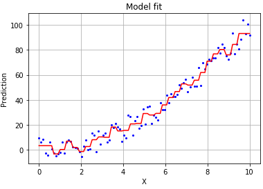

原文： http://blog.datadive.net/monotonicity-constraints-in-machine-learning/  

作者：佚名

翻译：Zhuo YaZhao 

# 机器学习中的单调性约束

在实际的机器学习和数据科学任务中，通常使用ML模型来量化两个或多个值之间的全局语义上有意义的关系。例如，一家连锁酒店可能希望使用ML来优化其定价策略，并使用一种模型来估计以给定的价格和一周中的某天预订房间的可能性。对于这样的关系，假设在所有其他条件相同的情况下，用户更喜欢便宜的价格，因此在更低的价格下需求就更高。但是，很容易发生的是，在构建模型时，数据科学家发现该模型的行为异常：例如，该模型预测，在周二，客户宁愿为房间支付110美元，而不是100美元！

通常，从业人员会忽略这种约束，尤其是在使用非线性模型（例如随机森林，梯度提升树或神经网络）时。虽然单调约束一直是学术研究的主题（请参阅有关基于树的方法的单调约束的调查论文），但图书馆缺乏支持，这使得从业人员很难解决该问题。

幸运的是，近年来，各种ML库在为模型设置单调性约束方面取得了很大进展，其中包括LightGBM和XGBoost这两个最流行的梯度提升树库。单调性约束也已内置到Tensorflow Lattice中，该库实现了一种用于创建插值查找表的新颖方法。

## LighGBM和XGBoost中的单调性约束

对于基于树的方法（决策树，随机森林，梯度提升树），可以在模型学习阶段通过不对会破坏单调性约束的单调特征创建拆分来强制单调性。 在下面的示例中，让我们在玩具数据集上使用LightGBM训练模型，在该数据集上我们知道X和Y之间的关系是单调的（但有噪声），并比较默认模型和单调模型。

```python
import numpy as np
size = 100
x = np.linspace(0, 10, size) 
y = x**2 + 10 - (20 * np.random.random(size))
```

  

让我们在此数据上拟合拟合梯度提升模型，将其设置min_child_samples为5。

```Python
import lightgbm as lgb
overfit_model = lgb.LGBMRegressor(silent=False, min_child_samples=5)
overfit_model.fit(x.reshape(-1,1), y)

#predicted output from the model from the same input
prediction = overfit_model.predict(x.reshape(-1,1))
```

该模型将略微过拟合（由于较小min_child_samples），这可以通过将X的值与Y的预测值作图来看出：红线并不是我们想要的单调性。

由于我们知道X和Y之间的关系应该是单调的，因此可以在指定模型时设置此约束。

  

```python
monotone_model = lgb.LGBMRegressor(min_child_samples=5, 
monotone_constraints="1")
monotone_model.fit(x.reshape(-1,1), y)
```

参数monotone_constraints =“ 1”表示输出应单调递增wrt。第一个功能（在我们的情况下恰好是唯一的功能）。在训练了单调模型之后，我们可以看到该关系现在是严格单调的。

  

而且，如果我们检查模型的性能，我们可以看到，不仅单调约束提供了更自然的拟合，而且模型的泛化也更好（如预期的那样）。通过测量新测试数据的均方误差，我们发现单调模型的误差较小。

```python
from sklearn.metrics import mean_squared_error as mse
size = 1000000
x = np.linspace(0, 10, size) 
y = x**2  -10 + (20 * np.random.random(size))
 
print ("Default model mse", mse(y, overfit_model.predict(x.reshape(-1,1))))
print ("Monotone model mse", mse(y, monotone_model.predict(x.reshape(-1,1))))

Default model mse 37.61501106522855
Monotone model mse 32.283051723268265
```

其他强制单调性的方法 基于树的方法不是在数据中设置单调性约束的唯一选择。该领域的最新进展是Tensorflow Lattice，它实现了基于格的模型，该模型本质上是内插的查找表，可以近似化数据中的任意输入-输出关系，并且可以选择是单调的。Tensorflow Github中有一个详尽的教程。

如果已经给出曲线，则可以使用数据splinefun来将单调样条曲线拟合到数据上。
