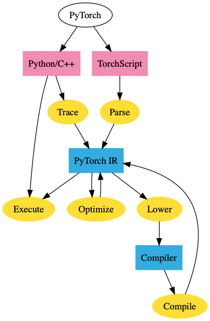
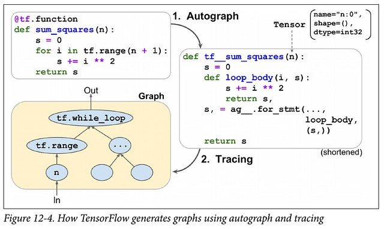

原文： https://thegradient.pub/state-of-ml-frameworks-2019-pytorch-dominates-research-tensorflow-dominates-industry/ 

作者：The gradient

翻译：[Quan Chen](https://github.com/chenquan)

自2012年深度学习重新获得重视以来，许多机器学习框架便争相成为研究人员和行业从业人员的新宠。从早期的学术成果Caffe和Theano到庞大的行业支持的PyTorch和TensorFlow，这些大量的选择使其难以跟踪最流行的框架实际上是什么。

如果您仅浏览Reddit，则可能会假设[每个人都在](https://www.reddit.com/r/MachineLearning/comments/b6wgmo/d_tensorflow_is_dead_long_live_tensorflow/) [切换](https://www.reddit.com/r/MachineLearning/comments/7ziagd/d_discussion_on_pytorch_vs_tensorflow/) [到](https://www.reddit.com/r/MachineLearning/comments/bo0nxh/d_what_are_you_using_tensorflow_vs_pytorch/) [PyTorch](https://www.reddit.com/r/MachineLearning/comments/9kys38/r_frameworks_mentioned_iclr_20182019_tensorflow/)。

在2019年，**机器学习框架之战还有两个主要竞争者：PyTorch和TensorFlow**。我的分析表明，研究人员正在放弃TensorFlow并大量涌向PyTorch。同时，在行业中，Tensorflow当前是首选平台，但长期以来可能并非如此。

# PyTorch在研究领域的主导地位不断提高

让我们检查数据。下图显示了在每个顶级研究会议上，PyTorch论文与使用Tensorflow或PyTorch的论文之间的比率。所有的线条都在**向上倾斜**，并且在2019年的每个主要会议上，**大多数论文**都使用PyTorch实现。

&nbsp;会议传奇
CVPR，ICCV，ECCV-计算机视觉会议 NAACL，ACL，EMNLP-NLP会议 ICML，ICLR，NeurIPS-通用ML会议

有关数据收集过程的详细信息
该图是通过刮擦过去几年在大型ML会议上发表的每篇论文而生成的。论文根据它们是否提及PyTorch或TensorFlow进行分类，但不包括与Google或Facebook关联的作者以及同时提及Tensorflow和PyTorch的论文。这些因素的消融可以在<a href="https://thegradient.pub/p/cef6dd26-f952-4265-a2bc-f8bfb9eb1efb/" style="box-sizing: inherit; background-color: transparent; text-decoration: underline; color: rgb(34, 34, 34); transition: all 0.5s ease 0s;">附录中</a>找到<a href="https://thegradient.pub/p/cef6dd26-f952-4265-a2bc-f8bfb9eb1efb/" style="box-sizing: inherit; background-color: transparent; text-decoration: underline; color: rgb(34, 34, 34); transition: all 0.5s ease 0s;"></a>

------

这些数字的互动版本可以在[这里](https://chillee.github.io/pytorch-vs-tensorflow/)找到。

如果您需要更多证据证明PyTorch在研究界到底有获得了多快的发展，下面是PyTorch与TensorFlow原始计数的图表。

| CONFERENCE | PT 2018 | PT 2019 | PT GROWTH | TF 2018 | TF 2019 | TF GROWTH |
| :--------: | :-----: | :-----: | :-------: | :-----: | :-----: | :-------: |
|    CVPR    |   82    |   280   |   240%    |   116   |   125   |   7.7%    |
|   NAACL    |   12    |   66    |   450%    |   34    |   21    |  -38.2%   |
|    ACL     |   26    |   103   |   296%    |   34    |   33    |   -2.9%   |
|    ICLR    |   24    |   70    |   192%    |   54    |   53    |   -1.9%   |
|    ICML    |   23    |   69    |   200%    |   40    |   53    |   32.5%   |

**在2018年，PyTorch是少数派。现在，它是绝大多数**，使用PyTorch的CVPR 占69％，NAACL和ACL的占75％以上，而ICLR和ICML的占50％以上。虽然PyTorch在视觉和语言会议上的统治力最强（分别比TensorFlow多2：1和3：1），而且PyTorch在诸如ICLR和ICML之类的通用机器学习会议上也比TensorFlow更受欢迎。

尽管有些人认为PyTorch仍然是一个新贵的框架，试图在TensorFlow主导的世界中开拓一席之地，但数据却讲述了一个不同的故事。除了ICML之外，甚至没有其他任何会议上有TensorFlow的增长与总体论文数的增长保持同步的。在NAACL，ICLR和ACL，TensorFlow 今年的论文实际上*少于*去年。

**不必担心PyTorch的未来，而是TensorFlow。**

### 为什么研究人员喜欢PyTorch？

- **简单。**它类似于numpy，非常具有python风格，并且可以轻松地与Python生态系统的其余部分集成。例如，您可以在PyTorch模型中的任何地方简单地插入一个pdb断点，它将起作用。在TensorFlow中，调试模型需要激活会话，并且最终变得更加棘手。
- **很棒的API。**与TensorFlow的API相比，大多数研究人员更喜欢PyTorch的API。部分原因是因为PyTorch的设计更好，部分原因是TensorFlow通过多次切换API（例如 ‘layers’ -> ‘slim’ -> ‘estimators’ -> ‘tf.keras’ ）而变得残障。
- **性能。**尽管事实上PyTorch的动态图提供的优化机会很少，但有许多传闻称PyTorch的[速度](https://www.reddit.com/r/MachineLearning/comments/cvcbu6/d_why_is_pytorch_as_fast_as_and_sometimes_faster/)甚至[快](https://arxiv.org/abs/1608.07249)于TensorFlow。目前尚不清楚这是否真的成立，但至少，TensorFlow在这一领域还没有获得决定性的优势。

### TensorFlow的研究前景如何？

即使TensorFlow在功能方面与PyTorch达到了同等水平，PyTorch也已经覆盖了大多数社区。这意味着PyTorch的实现将更容易找到，作者将更有动力在PyTorch中发布代码（以便人们使用它），并且您的合作者很可能会更喜欢PyTorch。因此，即使迁移到TensorFlow 2.0的任何迁移都可能很慢，如果发生的话。

TensorFlow在Google / DeepMind中将始终拥有一定的受众群体，但是我不知道Google是否最终会对这一点放宽松。即使到现在，Google想要招募的许多研究人员已经在不同层次上偏爱PyTorch，而且我听到有人抱怨说Google内部的许多研究人员都希望使用TensorFlow以外的框架。

此外，PyTorch的统治地位可能会开始将Google研究人员与其他研究界隔离开来。他们不仅很难在外部研究的基础上进行构建，而且外部研究人员也不太可能在Google发布的代码基础上进行构建。

TensorFlow 2.0是否将允许TensorFlow恢复其一些研究对象还有待观察。尽管渴望模式肯定会吸引人，但是关于Keras API的说法却不尽相同。

# PyTorch和TensorFlow用于生产

尽管PyTorch现在在研究中处于主导地位，但快速浏览行业发现TensorFlow仍然是主导框架。例如，基于从2018年到2019年的数据 ，TensorFlow在公共工作板上有1541个新工作列表，而PyTorch有1437个工作列表，TensorFlow Medium文章有3230个新问题，而PyTorch有1200个，TensorFlow有1.37k的GitHub新星，而PyTorch有7.2k的GitHub新星等等。

因此，如果PyTorch在研究人员中如此流行，为什么它没有在工业上获得同样的成功呢？一个明显的第一个答案就是惯性。TensorFlow早于PyTorch出现，而且行业采用新技术的速度比研究人员要慢。另一个原因是TensorFlow在生产方面比PyTorch更好。但是，这是什么意思？

要回答这个问题，我们需要知道研究人员和行业的需求有何不同。

研究人员关心他们能够以多快的速度进行研究，该研究通常是在相对较小的数据集（可以容纳在一台计算机上的数据集）上运行的，并且运行在<8个GPU上。通常，这不是由性能方面的考虑来决定的，而是由他们快速实施新想法的能力来解决的。另一方面，工业界认为性能是重中之重。尽管将运行时间提高10％对研究人员而言毫无意义，但这可以直接为公司节省数百万美元的费用。

另一个区别是部署。研究人员将在自己的计算机或专用于运行研究工作的服务器群集上进行实验。另一方面，行业有很多限制/要求。

- **No Python** 一些公司将运行服务器，这些服务器的Python运行时开销太大。
- **移动性** 您无法在移动端二进制文件中嵌入Python解释器。
- **服务性** 功能全面，例如无停机更新模型，在模型之间无缝切换，在预测时进行批处理等。

TensorFlow是专门针对这些要求而构建的，并为所有这些问题提供了解决方案： graph format 和执行引擎本来就不需要Python，TensorFlow Lite和TensorFlow Serving服务分别解决了移动和服务注意事项。

从历史上看，PyTorch未能满足这些考虑，因此大多数公司目前在生产中使用TensorFlow。

## 框架“融合”

在2018年底附近，两个重大事件使事件陷入了困境：

1. PyTorch引入了JIT编译器和“ TorchScript”，从而引入了基于图形的功能。
2. TensorFlow宣布默认情况下它们将转为 eager 模式。

显然，这些都是试图解决各自弱点的举动。那么这些功能到底是什么？它们必须提供什么？

### PyTorch Torch脚本

PyTorch JIT是PyTorch的中间表示（IR），称为TorchScript。TorchScript是PyTorch的“图形”表示。您可以使用跟踪或脚本模式将常规PyTorch模型转换为TorchScript。跟踪采用一个函数和一个输入，记录使用该输入执行的操作，并构造IR。跟踪虽然简单明了，但也有其缺点。例如，它无法捕获未执行的控制流。例如，如果执行条件块，则无法捕获条件块的错误块。

脚本模式采用一个函数/类，重新解释Python代码并直接输出TorchScript IR。这允许它支持任意代码，但是实际上它需要重新解释Python。

一旦您的PyTorch模型进入此IR，我们将获得图形模式的所有好处。我们可以在不依赖Python的情况下[以C ++部署PyTorch模型](https://pytorch.org/tutorials/advanced/cpp_export.html)，或对其[进行优化](https://pytorch.org/blog/optimizing-cuda-rnn-with-torchscript/)。

### Tensorflow Eager

在API级别上，TensorFlow Eager模式与最初由Chainer流行的PyTorch Eager模式相同。这为TensorFlow提供了PyTorch Eager模式的大多数优点（易于使用，可调试性等）。

但是，这也给TensorFlow带来了同样的缺点。TensorFlow Eager的模型无法导出到非Python环境，无法优化，无法在移动设备上运行等。

这使TensorFlow与PyTorch处于同一位置，并且它们以基本上相同的方式解析它-您可以跟踪代码（tf.function）或重新解释Python代码（Autograph）。

因此，TensorFlow的Eager模式并不能真正为您提供“两全其美”的服务。尽管确实可以使用tf.function批注将Eager的代码转换为静态图形，但这绝不是一个无缝的过程（PyTorch的TorchScript也存在类似的问题）。跟踪从根本上受到限制，并且重新解释Python代码本质上需要重写许多Python编译器。当然，通过限制深度学习中使用的Python子集，可以大大简化范围。

默认情况下，在启用Eager模式时，TensorFlow会强制用户选择-使用Eager执行以简化使用并需要重写以进行部署，或者根本不使用Eager执行。虽然这与PyTorch所处的情况相同，但是PyTorch的TorchScript的选择加入性质可能比TensorFlow的“默认情况下Eager”更可口。

## 机器学习框架的现状

因此，我们得出了ML框架的当前状态。PyTorch拥有研究市场，并且正在尝试将这一成功扩展到工业领域。TensorFlow试图在不牺牲太多生产能力的情况下，在研究界中尽其所能。PyTorch对行业产生有意义的影响肯定需要很长时间-TensorFlow根深蒂固且行业发展缓慢。但是，从TensorFlow 1.0到2.0的过渡将很困难，并且为公司评估PyTorch提供了自然点。

未来将取决于谁能最好地回答以下问题。

- **研究人员的偏好会在多大程度上影响行业？**当前博士学位的毕业生开始毕业时，他们将带来PyTorch。这种偏好是否足够强大，以至于公司会出于招聘目的选择PyTorch？毕业生会创办基于PyTorch的创业公司吗？
- **TensorFlow的Eager模式能否在可用性上赶上PyTorch？**问题跟踪器和在线社区给我的印象是TensorFlow Eager严重受到[性能/内存](https://github.com/tensorflow/tensorflow/issues/30596) [问题的困扰](https://www.youtube.com/watch?v=J6XcP4JOHmk&t=1h12m46s)，而且Autograph也存在问题。谷歌将花费大量的工程精力，但是TensorFlow受到历史遗留问题的困扰。
- **PyTorch可以多快达到生产状态？**PyTorch尚有许多基本问题尚未解决-没有好的量化指标，移动性，服务性等。在这些问题解决之前，PyTorch甚至不会成为许多公司的选择。PyTorch能否为公司提供足够引人入胜的事情来做出改变？*注意：在本文发布之日，PyTorch宣布支持量化和[移动](https://pytorch.org/mobile/home/)。两者都仍处于试验阶段，但代表了PyTorch在这方面的重大进展。*
- **Google在行业中的孤立会伤害到它吗？**Google推动TensorFlow的主要原因之一是帮助其迅速发展的云服务。由于Google试图拥有整个ML垂直市场，这激励了与Google竞争的公司（微软，亚马逊，Nvidia）竞争，以支持唯一的可替代的机器学习框架。

# 下一步是什么？

多少机器学习框架会影响机器学习研究，这也许是值得赞赏的。它们不仅支持机器学习研究，还*支持和限制研究人员能够轻松探索的思想*。仅仅因为没有简单的方法可以在框架中表达它们而粉碎了多少个新生的想法？PyTorch可能已经达到了本地研究的最低要求，但是值得研究其他框架提供的内容以及它们可能带来的研究机会。

### 高阶微分：

PyTorch和Tensorflow的核心是自动分化框架。也就是说，它们允许人们采用某些函数的导数。但是，有许多方法可以实现自动分化，而大多数现代ML框架选择的特定实现称为“反向模式自动分化”，通常称为“反向传播”。事实证明，此实现对于采用神经网络的派生极为有效。

但是，计算高阶导数（Hessian / Hessian矢量乘积）的事情发生了变化。有效地计算这些信息需要所谓的“前向模式自动微分”。如果没有此功能，则计算Hessian矢量积的速度可能会慢几个数量级。

输入Jax。Jax由开发原始Autograd的同一个人所开发，并具有正向和反向模式自动分化功能。这使得高阶导数的计算速度比PyTorch / TensorFlow所能提供的快。

但是，Jax不仅提供高阶导数。Jax开发人员将Jax视为组成任意功能转换的框架，包括`vmap`（用于自动批处理）或`pmap`（用于自动并行化）。

最初的autograd有其专门的追随者（尽管没有GPU支持，ICML上有11篇论文使用了它），而且Jax可能很快会建立一个类似的专门社区，将其用于各种n阶导数。

### 代码生成

当您运行PyTorch / TensorFlow模型时，大多数工作实际上不是在框架本身中完成的，而是由第三方内核完成的。这些内核通常由硬件供应商提供，并且由高级框架可以利用的操作员库组成。这些就是MKLDNN（用于CPU）或cuDNN（用于Nvidia GPU）之类的东西。更高级别的框架将其计算图分成多个块，然后可以调用这些计算库。这些库代表数千个工作小时，并且经常针对体系结构和应用程序进行优化以产生最佳性能。

但是，最近对非标准硬件，稀疏/量化张量和新运算符的兴趣暴露了依赖这些运算符库的主要缺陷：它们不灵活。如果您想在研究中使用像胶囊网络这样的新运算操作怎么办？如果要在ML框架没有很好支持的新硬件加速器上运行模型怎么办？现有的解决方案常常不够。正如[本文最近指出的那样](https://dl.acm.org/citation.cfm?id=3321441)，现有的胶囊网络在GPU上的实现比最佳实现要慢2个数量级。

每个新的硬件体系结构，张量类别或运算符，都会大大增加此问题的难度。有许多工具可以解决不同方面的问题（ Halide, TVM, PlaidML, Tensor Comprehensions, XLA, Taco 等），但是正确的方法仍然不清楚。

如果没有更多的工作来解决这个问题，我们就有将ML研究过度适合于我们拥有的工具的风险。

# ML框架的未来

这些是TensorFlow和PyTorch未来的激动人心的时刻。他们的设计已经趋于一致，以至于任何一个框架都不会凭借其设计获得决定性的胜利。每个国家都有自己的领土-一方拥有研究，另一方拥有产业。

就个人而言，在PyTorch和TensorFlow之间，我会给PyTorch带来优势。机器学习仍然是研究驱动的领域。工业界不能忽视研究成果，而且只要PyTorch主导研究，这将迫使公司做出选择。

但是，不仅仅是快速发展的框架。机器学习研究本身也处于不断变化的状态。框架不仅会发生变化，而且5年内使用的模型/硬件/范例可能与我们今天使用的大不相同。随着另一种计算模型的普及，也许PyTorch和TensorFlow之间的战斗将变得无关紧要。

在所有这些利益冲突以及机器学习带来的所有金钱中，最好退后一步。我们大多数人都不是为了赚钱或为了协助公司的战略计划而开发机器学习软件。**我们从事机器学习的原因是我们关心** -推进机器学习的研究，使AI民主化，或者只是关注构建有趣的东西。无论您是喜欢TensorFlow还是PyTorch，我们都只是试图使机器学习软件达到最佳状态。