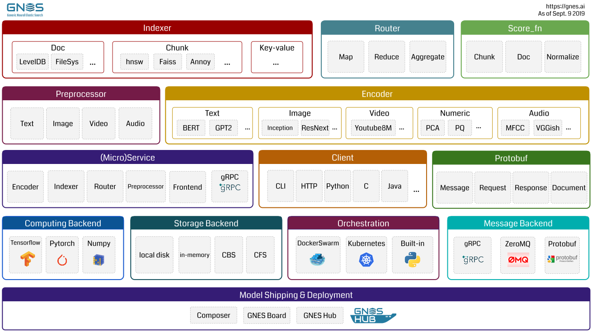

*作者：[Quan Chen](https://github.com/chenquan)*


# GNES-通用神经弹性搜索


还在为生产环境部署神经网络模型感觉到麻烦吗？`GNES`可以帮你解决高效,快速帮你实现一个可扩展,微服务化的云端部署方案.


  

>  GNES [ *jee-nes* ]是基于深度神经网络的云原生语义搜索系统。它允许对文本到文本，图像到图像，视频到视频以及任何内容形式进行大规模索引和语义搜索。 


 GNES可以对**文本到文本**，**图像到图像**，**视频到视频**以及*任何对任何*内容形式进行大规模索引和语义搜索。 

| ☁️云原生和弹性                                                | 🐣易于使用                                                    | 🔬最先进的                                                    |
| ------------------------------------------------------------ | ------------------------------------------------------------ | ------------------------------------------------------------ |
| GNES是*全微服务*！编码器，索引器，预处理器和路由器都在各自的容器中运行。它们通过版本化的API进行通信，并在Docker Swarm / Kubernetes等的编排下进行协作。扩展，负载平衡，自动恢复，它们在GNES中已上市。 | 部署仅切换VGG中的一层的更改需要多长时间？在GNES中，这只是YAML文件中的一行更改。我们将编码和索引逻辑抽象为YAML配置，这样您就可以更改或堆叠编码器和索引器，甚至无需接触代码库。 | 利用快速发展的AI / ML / NLP / CV社区，我们可以从同类最佳的深度学习模型中学习，并将它们插入GNES，以确保您始终享受最先进的性能。 |
| 🌌通用和通用                                                  | 📦建模为插件                                                  | 💯最佳实践                                                    |
| 搜索文字，图像甚至是短片？使用Python / C / Java / Go / HTTP作为客户端？不管您使用哪种内容形式或使用哪种语言，GNES都可以处理所有内容。 | 如果内置模型不满足您的要求，只需使用[GNES Hub](https://github.com/gnes-ai/hub)构建您自己的[模型](https://github.com/gnes-ai/hub)。将模型打包为Docker容器并将其用作插件。 | 我们乐于向社区学习最佳实践，从而帮助我们的GNES达到更高的可用性，弹性，性能和耐用性水平。如果您有任何想法或建议，请随时贡献。 |


## 总览



## 安装GNES

有两种获取GNES的方法，既可以作为Docker映像，也可以作为PyPi包。**对于云服务用户，我们强烈建议通过Docker使用GNES**。 

### 将GNES作为Docker容器运行

```shell
docker run gnes/gnes:latest-alpine
```


### 通过`pip`安装GNES 

You can also install GNES as a *Python3* package via:

```shell
pip install gnes
```

  