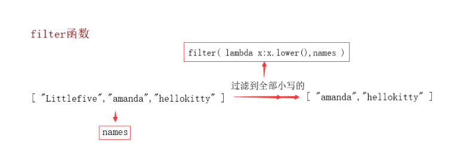
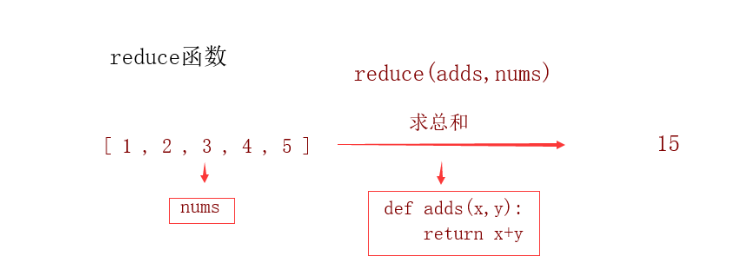

作者：Qiang He

邮箱:1422127065@qq.com


##### python高级用法之三大高阶内置函数

###### map函数

​	map(square,list) map函数接收的两个参数 一个函数 一个序列

功能说明 ：利用传进去的函数将序列的值进行处理在返回一个列表内，但是其返回值为map 一个迭代器对象 需要转化为list，原理如下图


代码示例

```
num=[1,2,3,4,5]
def square(x):
    return x**2
#map函数模拟
def map_test(func,iter):
    num_1=[]
    for i in iter:
        ret=func(i)
        # print(ret)
        num_1.append(ret)
    return num_1.__iter__() #将列表转为迭代器对象

#map_test函数
print(list(map_test(square,num)))
#map函数
print(list(map(square,num)))

#当然map函数的参数1也可以是匿名函数、参数2也可以是字符串
print(list(map_test(lambda x:x.upper(),"amanda")))
print(list(map(lambda x:x.upper(),"amanda")))
```

###### filter函数

​	 filter函数也是接收一个函数和一个序列的高阶函数，其主要功能是过滤。其返回值也是迭代器对象 




代码示例
```python
names=["Alex","amanda","xiaowu"]
#filter函数机制
def filter_test(func,iter):
    names_1=[]
    for i in iter:
        if func(i): #传入的func函数其结果必须为bool值，才有意义
            names_1.append(i)
    return names_1
#filter_test函数
print(filter_test(lambda x:x.islower(),names))
#filter函数
print(list(filter(lambda x:x.islower(),names)))
```

###### reduce函数

 reduce函数也是一个参数为函数，一个为可迭代对象的高阶函数，其返回值为一个值而不是迭代器对象，故其常用与叠加、叠乘等 



```python
#reduce函数不是内置函数，而是在模块functools中的函数，故需要导入
from functools import reduce

nums=[1,2,3,4,5,6]
#reduce函数的机制
def reduce_test(func,array,ini=None): #ini作为基数
    if ini == None:
        ret =array.pop(0)
    else:
        ret=ini
    for i in array:
        ret=func(ret,i)
    return ret
#reduce_test函数，叠乘
print(reduce_test(lambda x,y:x*y,nums,100))
#reduce函数，叠乘
print(reduce(lambda x,y:x*y,nums,100))
```

