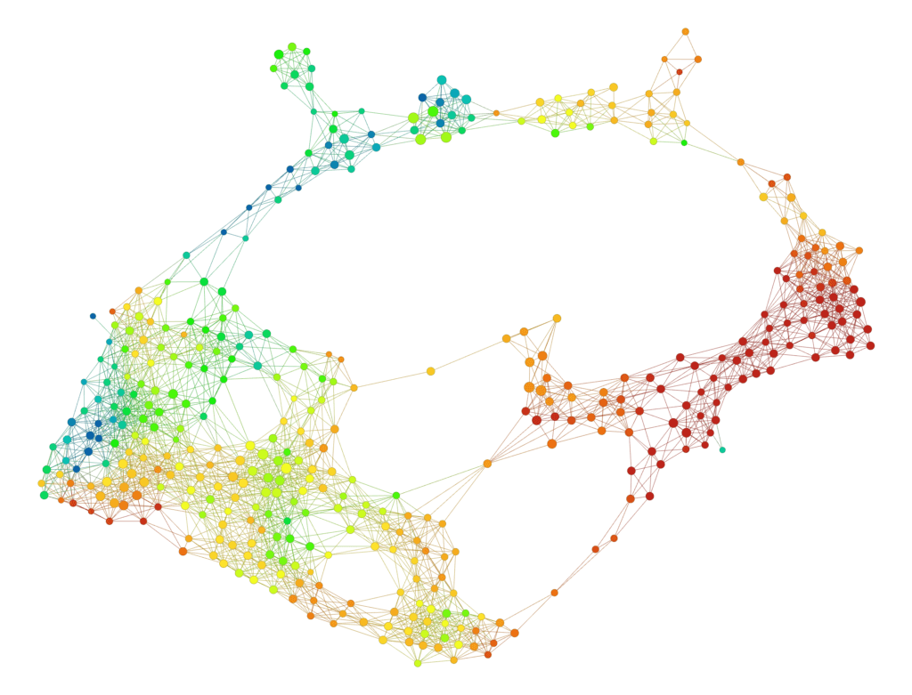
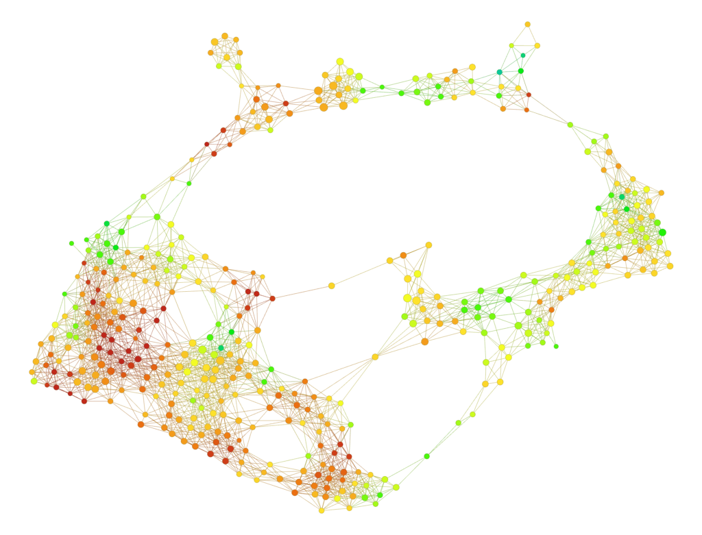

原文： https://www.ayasdi.com/blog/artificial-intelligence/prediction-needs-unsupervised-learning/ 

作者：[*Gunnar Carlsson*](https://www.ayasdi.com/blog/author/gunnar-carlsson/) 

翻译：[*Quan Chen*](https://github.com/chenquan)

# 为什么预测需要无监督学习 

即使无法实现，我们也很容易理解预测未来对我们的吸引力。但这并没有阻止整个分析公司出售这种承诺。它还说明了尝试提供有关未来的部分，不精确和概率信息的多种方法。

即使它们可以传递水晶球，这种能力显然也会对人类生存的各个方面产生巨大的影响。实际上，即使朝这个方向迈出的微小步伐，对整个社会以及特定行业和其他实体也具有重大影响。  

预测方法中的主要方法是回归（线性和逻辑），通常会针对特定环境进行高度调整。但是，还有许多其他功能，包括深度学习，支持向量机和决策树。

这些方法中的许多方法都以二进制形式（获胜者和损失者）或数值形式（点差）将特定数量的估计值作为输出，例如股票价格，运动竞赛或选举的结果。 有时，输出甚至带有不确定性的估计，例如在政治民意测验中经常引用误差幅度。现有方法显然具有价值，但是此帖子涉及两个方面：

1. 对于我们*真正*想知道的东西，预测并不总是理想的
2. 预测通常会得到增强，有时通过与无监督的学习技术相结合而得到实质性的增强

让我们从第一个前提开始，即在某些情况下预测可能不是正确的技术。

预测方法的输出通常用作优化算法的输入。例如，股票价格的预测通常用于投资组合优化，体育比赛的结果预测用于优化投注组合，选举投票的结果则用于确定政党在支持各种候选人方面的选择。有许多强大的优化方法，应用通过这些方法获得的预测信息通常是一个简单的过程。但是，为了使用它们，要求以**一个定义明确的目标函数**开始，可以将优化方法应用于该**目标函数**以使其最大化或最小化。 

这就是一个挑战。

在许多情况下，不清楚什么定义了良好的目标函数。此外，我们尝试为定义不明确的目标函数创建代理会使情况变得更糟（例如，有时我们选择易于定义和计算的函数，但这样做并不好，只是使其变得简单而已） ）。让我们考虑一些示例：

1. **我们不知道目标函数：**  政党通常将自己视为优化总体社会福祉，但实际上，我们很难用一个数字来量化社会福祉。例如，人们可能认为人均收入是合理的代表。另一方面，即使在每个人的收入增加的情况下，收入的不平等也可能减少社会福利。尽管人们对此的看法可能与他们的政治取向有关–但我们根本不知道答案。类似地，航空公司可以优化每位乘客的美元成本，从而减少每位乘客的空间并减少航班安排的灵活性。从数学上讲，完全专注于成本比较容易，但是从长远来看，以增加收入为目标来优化客户体验可能会更好。再次，没有明确的答案。。
2. **我们对目标功能持不同意见：** 假设我们正在尝试优化个人的健康状况。一个人可能会觉得最大化预期寿命的目标功能是完全合适的。这样的目标函数很容易在数学和统计上获得。另一方面，另一个喜欢啤酒的人不会觉得完全专注于预期寿命的目标功能适合他/她，因为喝啤酒会降低（略微）他或她的预期寿命。寿命较短与喝啤酒的乐趣之间的折中可能非常适合该人。
3. **我们最关心的是最大程度地减少不良后果：**  在许多情况下，对于我们来说，找到最佳策略并不重要，因为它可以确保不会发生任何灾难性的事情。在金融投资组合管理中，如果要与即将退休的客户合作，那么避免重大损失可能比优化增长更为重要。同样，如果要治疗患有心脏病的患者，则优先考虑的是避免灾难性后果（例如感染或死亡），而不是优化住院时间或将费用降至最低。

在所有这些情况下，当目标函数的作用不清楚或有争议时，预测的概念将变得更加困难。  

因为我们无法定义目标函数，所以我们不能仅依靠优化技术来解决我们面临的问题。这意味着我们需要退后一步，更好地了解我们的数据，以便可以指导自己取得更好的结果。

这就是无监督学习的地方。

无监督学习使我们能够探索各种目标函数，找到使目标函数适应个别情况的方法，并寻找可能的灾难性结果。  

这些任务无法通过输出为单个数字的方法来解决。相反，它们需要一个输出，可以与它们交互来寻址它们，因此，它们比简单的二进制或数字输出具有更多的信息和功能。同样重要的是，我们使用的方法可以让数据进行对话，因为否则我们的自然倾向就是验证我们已经认为是正确的，或者赞成我们已经决定的目标函数，或者决定我们已经确定了解分析中的所有相关因素。

在许多方面，这是在无人监督的方法中未得到充分认识的美。

好的，到目前为止我们已经建立的是：

1. 预测需要数字目标函数
2. 由于多种原因，可能很难实现目标函数
3. 无监督学习可以通过提供对数据结构的更多洞察力来帮助定义目标函数

那么，这种无监督方法需要哪些功能？

1. **定义和分析数据集的子群体： **

   在分析各种目标函数的影响时，至关重要的是了解它们对数据中不同亚群的影响。例如，某些政府政策对各种人群的影响可能大不相同。某些政府政策方针可能会整体上改善总体人口，但对某些少数人群而言却是灾难性的，因此应予以拒绝。在许多情况下，数据集的子种群或分类法没有提前定义，而是需要发现。因此，重要的是，无监督方法应提供发现亚种群和分类法的技术。对于较早发现的情况（即我们不了解或不同意目标功能的情况），此功能非常重要。

   

2. **数据中“弱信号”的位置：**

   当我们专注于最大程度地减少不良结果时，通常会在过去的数据中将那些非常严重的结果显示为异常结果或很少发生的结果（我们称之为微弱信号），然后逐渐增长随着时间的流逝进入更强的现象。在许多预测方法中并未捕获到这种情况，因为较强的信号会淹没这些方法的输出中的较弱信号。所需要的是一种进行系统的异常检测的方法，并且该方法足够丰富，可以在一个输出中同时包含强信号和弱信号。简单的数值方法不具备此功能。通常，它需要一种既可以分析又可以搜索数据集的方法。

   

3. **随时间进行无监督的分析：**
   当然，有关数据集的时间信息在任何类型的预测中都起着至关重要的作用。通常使用代数回归方法将其合并，但是对于我们正在讨论的问题类型，重要的是要了解无监督分析中与时间有关的行为。例如，总体中，总体可能会随着时间的推移而增加或减少，它们可能会分成较小的人群，也可能会合并。此类信息对于基于无监督信息进行任何类型的预测和优化非常重要。

当我们能够应对这些挑战时，预测的性能将得到实质性的改善。

例如，我们正在与一家主要制造商合作，共同解决对他们特别有价值的问题。它们制作非常复杂的小部件，而失败率至关重要。每0.01％的变化都会带来数千万美元的底线影响。他们的预测能力已被挖掘出来，不再产生有价值的信息。通过采用无监督方法，该公司确定了一条关键信息，即存在许多不同类型的故障，而这些故障在整个工厂中分布不均。这使他们能够立即采取措施来提高故障率。

那么，有哪些技术可以创建这种无监督学习和监督预测的一拳/两拳？

无监督分析的概念很多，包括聚类，主成分分析，多维缩放和[拓扑数据分析](https://www.ayasdi.com/blog/bigdata/why-topological-data-analysis-works/)（TDA）图模型。  

TDA模型具有迄今为止最丰富的功能，并且毫不奇怪，这就是我们在工作中使用的模型。它们包括上述所有功能。TDA从对数据集*X*的相似性度量开始*，*然后为*X*构造一个图，该图充当它的*相似性图*或*相似性模型*。图中的每个节点对应于*X*的子集合。与位于图结构中彼此远离的节点中的对相比，位于同一节点或相邻节点中的点对彼此更相似。图形模型当然可以可视化，但是它还有很多其他功能。

-  **分割：**

  从图结构中，可以将*X*分解分解为多个分段，每个分段在仅包含合理相似的数据点的意义上是连贯的。这可以基于图论思想手动或自动完成 

  

-  **按数量或组着色： **

  假设我们有一个数据集，配备了我们可能感兴趣的特定数量q，例如生物医学数据集中的生存时间或财务数据集中的收入。然后，我们可以通过为附加到该节点的组中X中所有数据点的q值的平均值形成一个值，从而为每个节点附加一个值。通过为q的值分配色标，我们获得了图形模型的着色，这使人们对q的行为有了更多的了解。这是一个例子。下图是一个数据集的模型，该数据集包含约200份对一项调查的回答的询问，这些询问询问了有关各种主题的问题，包括对社会机构的信任，右/左政治偏好以及各个群体的成员身份。它以关于受访者左右政治偏好的答案（从1到10的比例）来着色，低数字（蓝色）对应左偏爱，大数字（红色）对应右偏。

 类似地，如果在X内具有预定义的G组，则可以将与v对应的，也属于G的集合中的点的百分比分配给v，并且还对该百分比进行颜色编码。下图是我们在上面看到的同一张图，但现在按属于工会的受访者所占百分比上色（红色为集中工会会员身份）。

  这样可以了解G组在X中的分布，这在设计目标函数时可能非常有用。例如，人们可以观察到，工会成员的高浓度与通过按左右偏爱进行着色而获得的最暗的红色区域不重叠。  

-  **异常和微弱的信号：**

  TDA模型具有表面现象的能力，这些现象程度较小且影响相对较小。例如，一个人可能会发现一小部分人，他们的收入比其他人大，但他们的概况与他们的相似。相对于数据集的所有成员，他们的收入可能不是很高，但是，他们比模型中的“邻居”更高的事实可能很有趣。同样，可能会看到少量的信用卡交易看起来与以前观察到的交易有所不同，但彼此之间非常相似，因此需要进行更多的审查-实际上，它们可能会在将来增长。 

  

- **解释现象：** 

  给定数据集X中的组G，重要的是要了解将组G与X的其余部分区分开的特征。这可以根据统计检验来表述，以产生数据集中特征的有序列表，从而最好地区分人群和其他人群。这是另一种在设计目标函数中非常有用的功能。

总而言之，从纯粹的数值或二进制预测的概念转变为允许人们对基础数据有更好理解的方法，以设计更好的目标函数并捕获细微而微弱的现象，这从根本上来说至关重要，非常重要。TDA提供的方法非常适合这些要求。