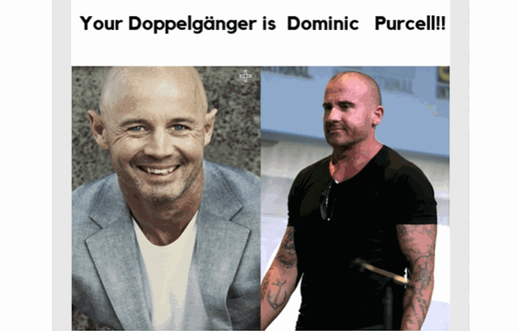

*作者：[Quan Chen](https://github.com/chenquan)*

# 寻找与自己相貌相似的名人


大家都看过模仿秀节目，节目中的人都与某些明星长得非常相似，那想不想知道自己和那位明星或者名人长得像呢？

来来来，给大家安利一个神器，使用SVM来完成匹配你的最佳名人脸。




## 运行代码：

第一次运行代码时，请解压缩`train_dir.zip`和`clf.joblib.zip`。

运行以下命令：

```shell
virtualenv --system-site-packages -p python3 ./venv
source ./venv/bin/activate  # sh, bash, ksh, or zsh
find . -name "*.DS_Store" -type f -delete
python svm.py
```

>  使用的是由 Adam Geitgey在github开源的[人脸识别库](https://github.com/ageitgey/face_recognition),进行人脸识别并计算人脸特征编码

**还可以使用另外的数据集对模型进行训练**

对于[印度电影数据集](http://cvit.iiit.ac.in/projects/IMFDB/)：

```shell
for d in ./*/ ;
do
        cd "$d" || exit; # enter each dir if it exists
				find . -mindepth 2 -type f -print -exec mv {} . \;  # merge all files 2 levels deep
        find . -type f ! -name '*.jpg' -exec rm '{}' +  # find and rm any non jpg
        ls -d  */ | xargs rm -rf;  # delete any empty dirs
        cd ..; # back to parent dir
done
```

对于[PINS数据集](https://www.kaggle.com/frules11/pins-face-recognition)：

```shell
for name in ./*/ ;
do
     newname="$(echo "$name" | cut -c8-)";  # create new name without first 7 char
     mv "$name" "$newname"; # rename dir
done
```