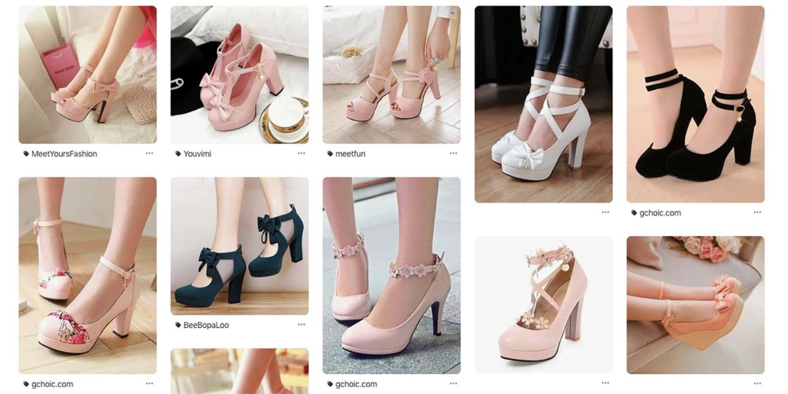
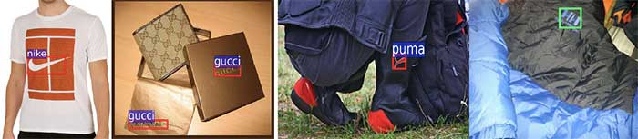
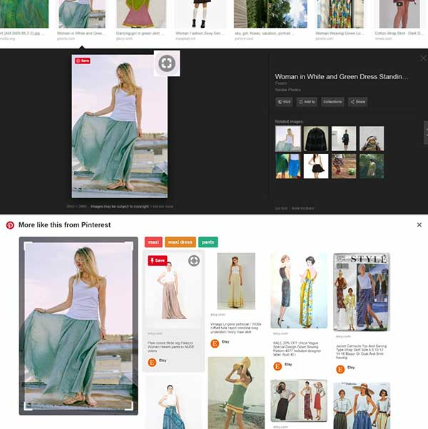
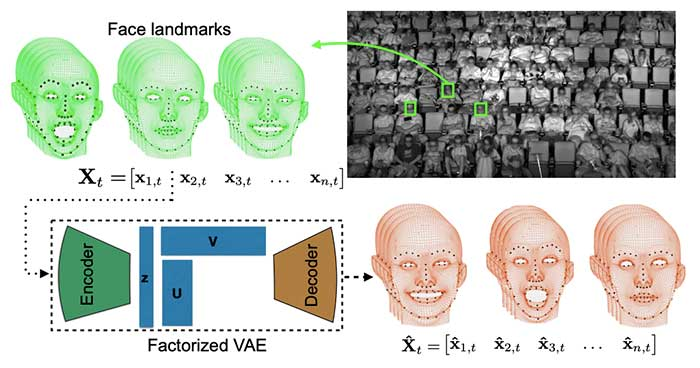
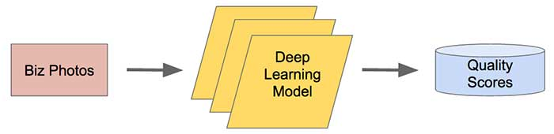
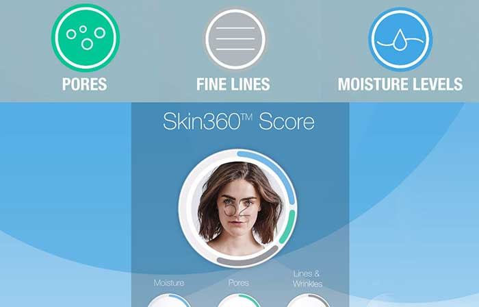
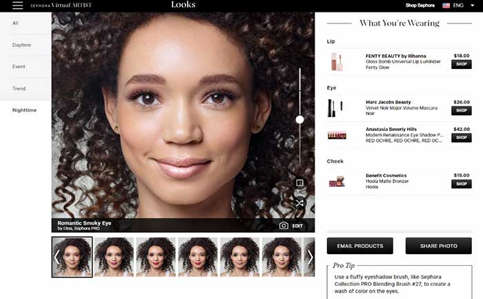

原文：https://www.topbots.com/computer-vision-in-marketing/

作者：[Gergana Mileva](https://www.topbots.com/author/gergana-mileva/)

翻译：[Quan Chen](https://github.com/chenquan)

# 市场营销中排名前7位的计算机视觉应用

多年来，计算机视觉（CV）发生了巨大的变化，为营销领域增加了令人兴奋的功能。通过使用人工智能和机器学习，这项技术使计算机能够获得对世界的直观了解。就像人们如何用眼睛和大脑来感知周围环境一样，计算机视觉可以扫描图像并将其内容转换为元数据。然后，营销人员可以收集，组织和评估该数据，以增强其营销力度。

在这里，您可以探索市场营销中的七个计算机视觉应用程序。

## 计算机视觉在营销中的常见应用

计算机视觉正在以多种方式重塑营销。请继续阅读以发现最前沿的机会，以增强您的营销力度。

 

### 1.利用GAN生成原始内容

在线营销的最大挑战之一是创建新内容。幸运的是，存在称为生成对抗网络（GAN）的神经网络，它将使此过程变得更加轻松和快捷。

GAN可以创建超逼真的视觉内容，包括视频，照片和3D模型。[姿势引导人图像生成](https://arxiv.org/abs/1705.09368)是该技术的众多应用之一。它允许您通过将姿势数据输入系统来将任何图像变换为不同的姿势。这种方法使用了两级生成器和鉴别器。生成器使用元数据和真实图像来变换照片，而鉴别器确定输入是真实的还是生成的。

使用GAN生成原始内容的另一个示例来自日本的技术公司DataGrid，该公司使用生成的对抗网络来创建[假时装模特的逼真的图像](https://www.engadget.com/2019/05/22/the-big-picture-virtual-model-imma/)。品牌可以以预算友好和高效的方式生成自己的原创内容，而不必每次都雇用新人。

 

*虚拟模型*[*Imma*](https://www.instagram.com/imma.gram/)

 

### 2.品牌对象识别

品牌必须监视社交媒体平台和其他在线渠道，以确定潜在客户，客户和评论家可以在哪里与他们互动。图像检测使品牌能够发现影响其成功的威胁和机遇。[Gumgum](https://gumgum.com/)是一家进行社交监听的公司。他们使用计算机视觉来识别品牌徽标，并在网上找到好与不好的评论。

识别社交媒体中的品牌图像并为其添加字幕以进行营销分析对于营销人员而言至关重要，因为它可以使营销人员了解客户与产品的互动，显示消费者是否与品牌建立了情感联系，能够追踪人气和随着时间的变化。

 

*徽标检测（*[*Su，Zhu and Gong，2016*](https://arxiv.org/abs/1612.09322)*）*

  

### 3.通过视觉相似性发现产品

当涉及到在线购物时，客户通常会使用搜索栏或过滤器功能来发现新产品。这通常需要大量使用标签，所有标签均手动分配给产品。由于标记完全取决于零售商，因此对于消费者来说可能会造成很大的混乱和不便，特别是如果他们不知道品牌术语。

Pinterest拥有一个名为[视觉搜索](https://newsroom.pinterest.com/en/post/introducing-the-next-wave-of-visual-search-and-shopping)的基于AI的工具，用于视觉产品发现，从而无需手动标签。消费者可以通过移动应用程序或浏览器扩展程序来选择标准图像，而不是标准的过滤系统，然后他们会看到一整套相似项目。这样，消费者不必知道品牌术语就能找到他们想要的东西。

 

*Pinterest的视觉搜索*

 

### 4.追踪消费者的注意力和情绪

面部分析算法的进步现在已经足够强大，可以评估消费者的面部表情并衡量他们的情绪。迪士尼开发了一种算法（[因子变分自动编码器](http://www.yisongyue.com/publications/cvpr2017_fvae.pdf)）来确定观众对电影的反应。红外摄像机可以在电影放映过程中检测并捕获人们的反应。该软件可以识别复杂的面部表情，甚至可以预测观众在电影某些部分的感觉。这有助于迪斯尼了解引起某些情绪的原因。

现在，了解消费者的注意力和情绪是企业的首要任务。使用情绪检测技术，商家可以衡量人流量，预测销售收入并相应地调整营销策略。

 

*使用因数分解的VAE对受众的反应进行建模（*[*Deng等，2017*](http://www.yisongyue.com/publications/cvpr2017_fvae.pdf)*）*

 

### **5.使用图像优化转换率**

配备了深度学习算法的Yelp可以为任何机构策划最漂亮的照片，以最大程度地提高其转化率。他们不使用喜欢的次数来确定最佳照片，而是根据实际重要的特征来判断照片：对比度，景深和对齐方式。

Yelp使用卷积神经网络设计了一个[照片评分模型](https://engineeringblog.yelp.com/2016/11/finding-beautiful-yelp-photos-using-deep-learning.html)。在他们的数据集中，DSLR照片是正面示例，而非DSLR图像是负面示例。他们将数据输入到深度学习模型中，从而使其能够识别出优质照片的质量。

 

[*Yelp的*](https://engineeringblog.yelp.com/2016/11/finding-beautiful-yelp-photos-using-deep-learning.html)*照片评分模型*

 

### 6.个性化客户体验的面部识别

[Lolli＆Pops](https://thecurrentdaily.com/2018/01/19/your-future-in-store-loyalty-program-will-be-fed-by-facial-recognition/)商店由面部识别软件提供支持，使他们能够在进入商店后立即[识别出有价值的顾客](https://traxretail.com/2018/06/20/5-inventive-uses-computer-vision-retail/)。使用特定的应用程序，销售人员可以查看客户的购买历史，喜好，口味和过敏状况。然后，基于AI的分析可以帮助他们为每个客户提供个性化的产品推荐。

[露得清（Neutrogena）](https://www.theverge.com/2018/1/5/16852364/neutrogena-skinfit-skin-scanner-magnifying-pores-wrinkles-dryness-app-ces-2018)还通过应用程序提供个性化的体验。他们有一个皮肤扫描小工具，您可以将其连接到智能手机。扫描仪与他们的Skin360应用程序同步，该应用程序分析您的扫描并确定您的皮肤健康。在采取所有措施并进行分析之后，您将被引导到相关的露得清产品。

 

*Skin360成绩示例*

 

### **7.虚拟试用产品**

丝芙兰使用增强现实和人工智能为顾客创建虚拟购物体验。他们的客户可以通过名为[Sephora Virtual Artist](https://sephoravirtualartist.com/landing_5.0.php?country=US&lang=en&x=&skintone=&currentModel=)的移动应用程序试用最新的彩妆产品。从口红和眼影到假睫毛，消费者可以试用丝芙兰销售的每种产品。

此外，丝芙兰还使用AI帮助消费者找到与其肤色相匹配的完美产品。他们所要做的就是上传一张照片。

 

*丝芙兰产品试穿*

 

## **借助计算机视觉提升您的营销水平**

由于消费者和品牌之间视觉共享的迅猛发展，将图像分解为数据集的能力已成为在线营销的关键。

将计算机视觉整合到营销工作中的营销人员将有机会改善营销活动，影响购买决策并增强客户体验等。随着CV的不断成熟，营销人员可以预期将来会出现许多新的功能强大的应用程序。

 