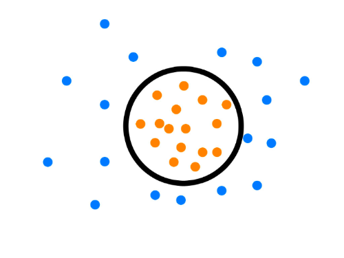

*作者：[Quan Chen](https://github.com/chenquan)*

# 异常检测算法

最近在做工业设备的异常检测算法的相关工作，因此搜罗了一些相关的资料，在这里整理一下，为自己理清思路，顺便也分享给大家。

> 在工厂设备中，控制系统的任务是判断是是否有意外情况出现，例如产品质量过低，机器产生奇怪的震动或者机器零件脱落等。相对来说容易得到正常场景下的训练数据，但故障系统状态的收集示例数据可能相当昂贵，或者根本不可能。

下面来总结一下异常检测算法三大业务场景：

1. **训练数据中存在label标签** ：label标签中有`1（正常）`或者 `0（异常）`。这种情况下，该项目属于有监督学习中的binary classification问题。
2. **训练数据中没有label标签** ：根据已知的信息，我们知道在数据中既存在正常行为的数据，也存在异常行为的数据。这种情况下，该项目属于无监督学习中的异常值检测问题。
3. **训练数据可能有label标签 ，也可能没有label标签** 。如果存在label标签，但是只有`1（正常）`一种值；如果不存在label标签，根据已知的信息，我们知道数据只存在正常行为的特征数据。这两种情况都可以归类为半监督学习的奇异值检测问题。

下面我们来说说什么是奇异值检测？异常值检测？

**novelty detection（奇异值检测）** ：当训练数据中没有离群点，我们的目标是用训练好的模型去检测另外发现的新样本

**outlier dection（异常值检测）** ：当训练数据中包含离群点，模型训练时要匹配训练数据的中心样本，忽视训练样本中的其他异常点。

异常值检测和奇异值检测都属于异常检测（anomaly detection），其中异常值检测又被称为无监督异常检测，奇异值检测又被称为半监督异常检测。

好咯，我们来聊一聊上面每一个业务场景常见的算法：

## 1. 训练数据中存在label标签

这类数据有明确的label标签，相对简单，使用常见的二分类算法。

以下介绍一些二分类算法：

- 逻辑回归算法：适用于特征维度低的数据，但模型可解释性强。
- K-近邻算法（[KNeighborsClassifie](https://scikit-learn.org/stable/modules/generated/sklearn.neighbors.KNeighborsClassifier.html#sklearn.neighbors.KNeighborsClassifier)和[`RadiusNeighborsClassifier`](https://scikit-learn.org/stable/modules/generated/sklearn.neighbors.RadiusNeighborsClassifier.html#sklearn.neighbors.RadiusNeighborsClassifier)）:最近邻分类属于 *基于实例的学习* 或 *非泛化学习* ：它不会去构造一个泛化的内部模型，而是简单地存储训练数据的实例。 分类是由每个点的最近邻的简单多数投票中计算得到的：一个查询点的数据类型是由它最近邻点中最具代表性的数据类型来决定的
- 支持向量机（[`SVC`](https://scikit-learn.org/stable/modules/generated/sklearn.svm.SVC.html#sklearn.svm.SVC), [`NuSVC`](https://scikit-learn.org/stable/modules/generated/sklearn.svm.NuSVC.html#sklearn.svm.NuSVC) 和 [`LinearSVC`](https://scikit-learn.org/stable/modules/generated/sklearn.svm.LinearSVC.html#sklearn.svm.LinearSVC)）：通过核函数建立超平面来分隔数据
- 高斯过程分类（[`GaussianProcessClassifier`](https://scikit-learn.org/stable/modules/generated/sklearn.gaussian_process.GaussianProcessClassifier.html#sklearn.gaussian_process.GaussianProcessClassifier) ）：GaussianProcessClassifier 在隐函数$f$之前设置GP先验，然后通过链接函数进行压缩以获得概率分类。
- 朴素贝叶斯
- 决策树([`DecisionTreeClassifier`](https://scikit-learn.org/stable/modules/generated/sklearn.tree.DecisionTreeClassifier.html#sklearn.tree.DecisionTreeClassifier) )
- Bagging 元估计器（ [`BaggingClassifier`](https://scikit-learn.org/stable/modules/generated/sklearn.ensemble.BaggingClassifier.html#sklearn.ensemble.BaggingClassifier)）：在集成算法中，bagging 方法会在原始训练集的随机子集上构建一类黑盒估计器的多个实例，然后把这些估计器的预测结果结合起来形成最终的预测结果。 
- 随机森林（ [`RandomForestClassifier`](https://scikit-learn.org/stable/modules/generated/sklearn.ensemble.RandomForestClassifier.html#sklearn.ensemble.RandomForestClassifier) ）：集成模型中的每棵树构建时的样本都是由训练集经过有放回抽样得来的
- 极限随机树（[`ExtraTreesClassifier`](https://scikit-learn.org/stable/modules/generated/sklearn.ensemble.ExtraTreesClassifier.html#sklearn.ensemble.ExtraTreesClassifier)）：计算分割点方法中的随机性进一步增强。 与随机森林相同，使用的特征是候选特征的随机子集；但是不同于随机森林寻找最具有区分度的阈值，这里的阈值是针对每个候选特征随机生成的，并且选择这些随机生成的阈值中的最佳者作为分割规则。 这种做法通常能够减少一点模型的方差，代价则是略微地增大偏差。
- AdaBoost （[`AdaBoostClassifier`](https://scikit-learn.org/stable/modules/generated/sklearn.ensemble.AdaBoostClassifier.html#sklearn.ensemble.AdaBoostClassifier)）：AdaBoost 的核心思想是用反复修改的数据（校对者注：主要是修正数据的权重）来训练一系列的弱学习器(一个弱学习器模型仅仅比随机猜测好一点, 比如一个简单的决策树),由这些弱学习器的预测结果通过加权投票(或加权求和)的方式组合, 得到我们最终的预测结果。
- 梯度树提升（[HistGradientBoostingClassifier](https://scikit-learn.org/stable/modules/generated/sklearn.ensemble.HistGradientBoostingClassifier.html#sklearn.ensemble.HistGradientBoostingClassifier)和[`GradientBoostingClassifier`](https://scikit-learn.org/stable/modules/generated/sklearn.ensemble.GradientBoostingClassifier.html#sklearn.ensemble.GradientBoostingClassifier) ）：梯度提升回归树（GBRT）是对于任意的可微损失函数的提升算法的泛化。 GBRT 是一个准确高效的现有程序。在[LightGBM](https://github.com/Microsoft/LightGBM)的启发下，Scikit-learn 0.21引入了两种新的梯度提升树的实验实现，即 [HistGradientBoostingClassifier](https://scikit-learn.org/stable/modules/generated/sklearn.ensemble.HistGradientBoostingClassifier.html#sklearn.ensemble.HistGradientBoostingClassifier)和 [HistGradientBoostingRegressor](https://scikit-learn.org/stable/modules/generated/sklearn.ensemble.HistGradientBoostingRegressor.html#sklearn.ensemble.HistGradientBoostingRegressor)。这些快速估计器首先将输入样本X放入整数值的箱子(通常是256个箱子)中，这极大地减少了需要考虑的分裂点的数量，并允许算法利用基于整数的数据结构(直方图)，而不是依赖于排序后的连续值。
- 神经网络模型（[`MLPClassifier`](https://scikit-learn.org/stable/modules/generated/sklearn.neural_network.MLPClassifier.html#sklearn.neural_network.MLPClassifier)，DNN）：**多层感知器(MLP)** 是一种监督学习算法，通过在数据集上训练来学习函数 $f(\cdot): R^m \rightarrow R^o$，其中 $m$ 是输入的维数，$o$是输出的维数。 给定一组特征 $X = {x_1, x_2, ..., x_m}$ 和标签$y$，它可以学习用于分类或回归的非线性函数。 
- 隐马尔科夫模型
- 神经树（Neural Trees）
- 自适应网络（Auto-associative Networks ）
- 基于自适应共振理论（Adaptive Resonance Theory Based）
- 基于径向基函数（Radial Basis Function Based ）
- Hopfield Networks
- 振荡网络（Oscillatory Networks ）

- XGBoost
- LightGBM
- CNN
- 序列模型（RNN、GRU、LSTM）

## 2. 训练数据中没有label标签

这类就属于无监督模型的范围咯，在数据中既存在正常行为的数据，也存在异常行为的数据。

- 基于最近邻的异常检测技术：假设，正常数据实例发生在密集的邻域中，而异常发生在离它们最近的邻居很远的地方。

- 基于聚类的异常检测技术：
  - 假设，正常数据实例位于其最接近的群集质心附近，而异常则离其最接近的群集质心很远。
    - Self-Organizing Maps (SOM)（可用于半监督模型）
    - K-means Clustering、SpectralClustering
    - Expectation Maximization(EM)
  - 假设，普通数据实例属于大型密集簇，而异常则属于小型或稀疏簇。（簇的大小或者密度小于一定阈值就认为是异常）
    - FindCBLOF–CBLOF
  
- Isolation Forest（[`ensemble.IsolationForest`](https://scikit-learn.org/stable/modules/generated/sklearn.ensemble.IsolationForest.html#sklearn.ensemble.IsolationForest) ）：通过随机选择一个特征,然后随机选择所选特征的最大值和最小值之间的分割值来"隔离"观测。

- Fitting an elliptic envelope（ [`covariance.EllipticEnvelope`](https://scikit-learn.org/stable/modules/generated/sklearn.covariance.EllipticEnvelope.html#sklearn.covariance.EllipticEnvelope)）：它能拟合出数据的稳健协方差估计，从而为中心数据点拟合出一个椭圆，忽略不和该中心模式相关的点。

- Local Outlier Factor（[`neighbors.LocalOutlierFactor`](https://scikit-learn.org/stable/modules/generated/sklearn.neighbors.LocalOutlierFactor.html#sklearn.neighbors.LocalOutlierFactor) ）：LOF算法计算出反映观测异常程度的得分（称为局部离群因子）。 它测量给定数据点相对于其邻近点的局部密度偏差。 算法思想是检测出具有比其邻近点明显更低密度的样本。

  

##  3. 训练数据可能有label标签 ，也可能没有label标签

这类数据中，如果存在label标签，但是只有`1（正常）`一种值；如果不存在label标签，根据已知的信息，我们知道数据只存在正常行为的特征数据。这两种情况都可以归类为半监督学习的奇异值检测问题。

- 单类支持向量机（[`svm.OneClassSVM`](https://scikit-learn.org/stable/modules/generated/sklearn.svm.OneClassSVM.html#sklearn.svm.OneClassSVM) ）：它将要学习出一个粗略且紧密的边界，界定出初始观测分布的轮廓，绘制在嵌入的$p$ 维空间中。那么，如果后续的观测值都落在这个边界划分的子空间内，则它们被认为来自与初始观测值相同的总体。 否则，如果它们在边界之外，我们可以说就我们评估中给定的置信度而言，它们是异常的。
- Local Outlier Factor（[`neighbors.LocalOutlierFactor`](https://scikit-learn.org/stable/modules/generated/sklearn.neighbors.LocalOutlierFactor.html#sklearn.neighbors.LocalOutlierFactor) ）：也可用于奇异值检测，但是需要将算法中novelty参数的值设置为True。（在上面介绍过哟）
- 基于统计的异常检测技术：(假设，正常数据实例发生在随机模型的高概率区域中，而异常发生在随机模型的低概率区域中)
  - 参数化方法（基于假设：正常的数据都是由一个参数为 Θ的分布产生的，概率函数 f(x,Θ)）
    - 基于高斯模型 数据由高斯分布产生（Rosner test、 Dixon test、Slippage Detection test）
      - 假设原数据服从某个分布（如高斯分布），然后计算 μ 和 σ ，再计算 μ ±3σ 的区间，最后落在区间之外的数据点就被认为是异常值。（可通过取log进行变换）
    - 基于回归模型(ARIMA、ARMA、神经网络、一维卷积、序列模型)
      - 基本回归分为两步：
          - 利用数据训练回归模型
          - 利用残差，表示数据的异常程度
- 基于谱异常的检测技术（假设，数据可以嵌入到较低维度的子空间中，在该子空间中，正常实例和异常看上去有很大不同）
  - PCA主成分分析 降维
- 自编码神经网络算法：如果我们只有正样本数据，没有负样本数据，或者说只关注学习正样本的规律，那么利用正样本训练一个自编码器，编码器就相当于单分类的模型，对全量数据进行预测时，通过比较输入层和输出层的相似度就可以判断记录是否属于正样本。

**注意：**

1. 最近邻和聚类高维失效
   1. 高维数据集中存在大量无关的属性使得在所有维中存在簇的可能性几乎为零；
   2. 高维空间中数据较低维空间中数据分布要稀疏，其中数据间距离几乎相等是普遍现象
2. 最近邻和聚类选择合适的距离计算方法很重要
3. 谱技术可以处理高维数据，但是其依据：数据在合适的低维空间可分
4. 分类技术可以处理上述问题，但是分类问题需要正常和异常的标签，并且正常和异常标签的数据数量并不均衡
5. 统计技术（无监督）当数据是低维的并且假设的数据分布满足时高效
6. 计算复杂性
7. 分类、聚类、统计 在训练阶段较慢，测试阶段很快
8. 最近邻、信息论、谱技术 没有训练阶段，测试阶段时间复杂度较高

*参考：*
- https://blog.csdn.net/bbbeoy/article/details/79159652
- https://blog.csdn.net/weixin_44162104/article/details/87190948 
- https://www.jianshu.com/p/be8dd319807c
- https://blog.csdn.net/bbbeoy/article/details/79159652
- https://www.cnblogs.com/wj-1314/p/10701708.html
- https://www.zhihu.com/question/22365729/answer/115048306
- https://www.cnblogs.com/bonelee/p/10930734.html
- https://blog.csdn.net/qq_23225317/article/details/83309045
- https://blog.csdn.net/weixin_42111770/article/details/87794247
- https://blog.csdn.net/ukakasu/article/details/82968054
- https://www.jianshu.com/p/aa474b66b3a7
- http://www.elecfans.com/rengongzhineng/636085_a.html