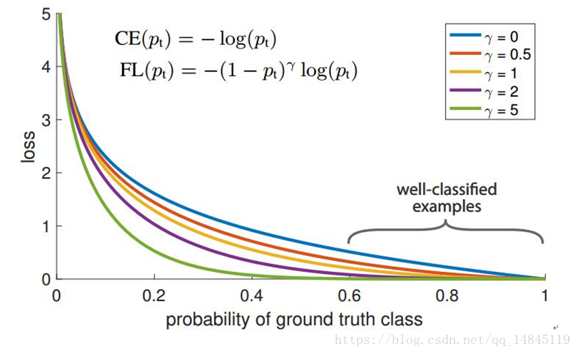
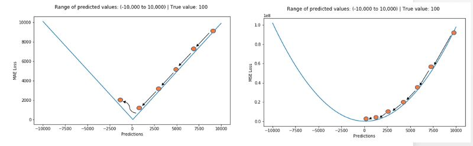
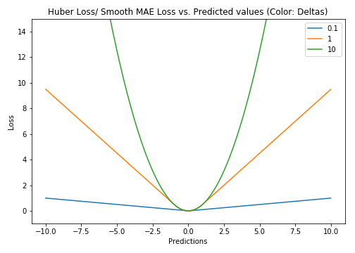
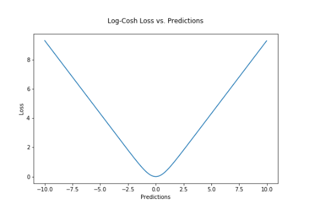
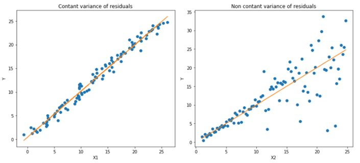
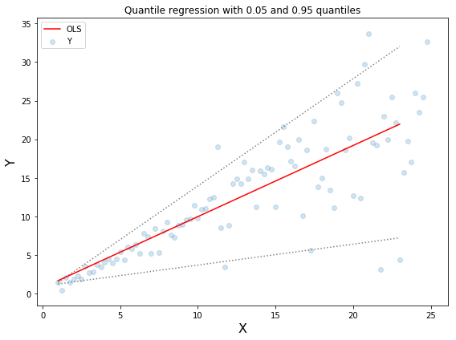
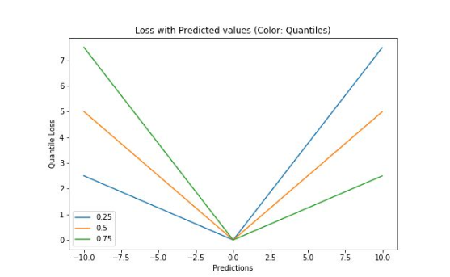
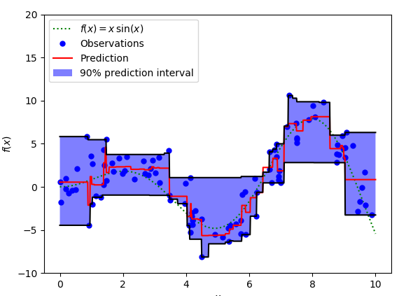

*作者：[Quan Chen](https://github.com/chenquan)*

# 机器学习常用损失函数

损失函数（loss function）是用来**评价模型的预测值f(x)与真实值y的不一致程度**。通常使用L(Y, f(x))来表示，损失函数越小，模型的鲁棒性就越好。损失函数是**经验风险函数**的核心部分，也是**结构风险函数**重要组成部分。模型的结构风险函数包括了经验风险项和正则项，通常可以表示为： 
$$
\theta^{*}=\arg \min _{\theta} \frac{1}{N} \sum_{i=1}^{N} L\left(y_{i}, f\left(x_{i} ; \theta\right)\right)+\lambda \Phi(\theta)
$$
 其中，前面的均值函数表示的是经验风险函数，$L(y_i,f(x_i;\theta))$代表的是损失函数，后面的$\lambda\Phi(\theta)$为正则项，$\lambda$为正则化系数。通常$\Phi(\theta)$使用L1,L2正则化。

## 一、对数损失函数

**平方损失函数可以通过线性回归在假设样本是高斯分布的条件下推导得到**，而逻辑回归得到的并不是平方损失。在逻辑回归的推导中，它假设样本服从**伯努利分布（0-1分布）**，然后求得满足该分布的似然函数，接着取对数求极值等等。而逻辑回归并没有求似然函数的极值，而是把极大化当做是一种思想，进而推导出它的经验风险函数为：**最小化负的似然函数**（即$max F(y, f(x)) \to min\ - F(y, f(x)))$。从损失函数的视角来看，它就成了log损失函数了。

**对数损失函数的标准形式**：
$$
L(Y, P(Y | X))=-\log P(Y | X)
$$
 逻辑回归的$P(Y=y|x)$表达式如下（为了将类别标签y统一为1和0，下面将表达式分开表示）： 
$$
P(Y=y | x)=\left\{\begin{array}{cc}{h_{\theta}(x)=g(f(x))=\frac{1}{1+\exp \{-f(x)\}}} & {, y=1} \\ {1-h_{\theta}(x)=1-g(f(x))=\frac{1}{1+\exp \{f(x)\}}} & {, y=0}\end{array}\right.
$$
 将它带入到上式，通过推导可以得到logistic的损失函数表达式，如下： 
$$
L(y, P(Y=y | x))=\left\{\begin{array}{cc}{\log (1+\exp \{-f(x)\})} & {, y=1} \\ {\log (1+\exp \{f(x)\})} & {, y=0}\end{array}\right.
$$
 逻辑回归最后得到的目标式子如下： 
$$
J(\theta)=-\frac{1}{m} \sum_{i=1}^{m}\left[y^{(i)} \log h_{\theta}\left(x^{(i)}\right)+\left(1-y^{(i)}\right) \log \left(1-h_{\theta}\left(x^{(i)}\right)\right)\right]
$$
其中$h_{\theta}=Wx+b$

## 二、平方损失函数（最小二乘法, Ordinary Least Squares ）

　　最小二乘法是线性回归的一种，最小二乘法（OLS）将问题转化成了一个凸优化问题。在线性回归中，它假设样本和噪声都服从高斯分布（为什么假设成高斯分布呢？其实这里隐藏了一个小知识点，就是**中心极限定理**，可以参考[【central limit theorem】](https://en.wikipedia.org/wiki/Central_limit_theorem)），最后通过极大似然估计（MLE）可以推导出最小二乘式子。最小二乘的基本原则是：**最优拟合直线应该是使各点到回归直线的距离和最小的直线，即平方和最小**。换言之，OLS是基于距离的，而这个距离就是我们用的最多的**欧几里得距离**(L2)。为什么它会选择使用欧式距离作为误差度量呢（即Mean squared error， MSE），主要有以下几个原因：

- 简单，计算方便；
- 欧氏距离是一种很好的相似性度量标准；
- 在不同的表示域变换后特征性质不变。

 **平方损失（Square loss）的标准形式如下** :
$$
L(Y, f(X))=(Y-f(X))^{2}
$$
 当样本个数为n时，此时的损失函数变为： 
$$
L(Y, f(X))=\sum_{i=1}^{n}(Y-f(X))^{2}
$$
 $Y-f(X)$表示的是残差，整个式子表示的是**残差的平方和**，而我们的目的就是最小化这个目标函数值（注：该式子未加入正则项），也就是**最小化残差的平方和（residual sum of squares，RSS）**。 

## 三、指数损失函数（Adaboost）

学过Adaboost算法的人都知道，它是前向分步加法算法的特例，是一个加和模型，损失函数就是指数函数。在Adaboost中，经过m此迭代之后，可以得到
$$
f_{m}(x)=f_{m-1}(x)+\alpha_{m} G_{m}(x)
$$
 Adaboost每次迭代时的目的是为了找到最小化下列式子时的参数 
$$
\arg \min _{\alpha, G}=\sum_{i=1}^{N} \exp \left[-y_{i}\left(f_{m-1}\left(x_{i}\right)+\alpha G\left(x_{i}\right)\right)\right]
$$
 **而指数损失函数（exp-loss）的标准形式如下** 
$$
L(y, f(x))=\exp [-y f(x)]
$$
 可以看出，Adaboost的目标式子就是指数损失，在给定n个样本的情况下，Adaboost的损失函数为： 
$$
L(y, f(x))=\frac{1}{n} \sum_{i=1}^{n} \exp \left[-y_{i} f\left(x_{i}\right)\right]
$$

## 四、Hinge损失函数（SVM）

 在机器学习算法中，hinge损失函数和SVM是息息相关的。在**线性支持向量机**中，最优化问题可以等价于下列式子： 
$$
\min _{w, b} \sum_{i}^{N}\left[1-y_{i}\left(w \cdot x_{i}+b\right)\right]_{+}+\lambda\|w\|^{2}
$$
 下面来对式子做个变形，令： 
$$
\left[1-y_{i}\left(w \cdot x_{i}+b\right)\right]_{+}=\xi_{i}
$$
 于是，原式就变成了： 
$$
\min _{w, b} \sum_{i}^{N} \xi_{i}+\lambda\|w\|^{2}
$$
如若取λ=1/(2C)，式子就可以表示成：

可以看出，该式子与下式非常相似：
$$
\frac{1}{m} \sum_{i=1}^{m} l\left(w \cdot x_{i}+b, y_{i}\right)+\|w\|^{2}
$$

 前半部分中的$l$就是hinge损失函数，而后面相当于L2正则项。 

**Hinge 损失函数的标准形式**
$$
L(y)=\max (0,1-y \tilde{y}), y=\pm 1
$$
 可以看出，当$|y|>=1$时，$L(y)=0$。 

## 五、 **0-1损失函数** 

$$
L(Y, f(X))=\left\{\begin{array}{ll}{1,} & {Y \neq f(X)} \\ {0,} & {y=f(X)}\end{array}\right.
$$

## 六、 **绝对值损失函数** 

$$
L(Y, f(X))=|Y-f(X)|
$$

## 七、 多分类交叉熵损失 

$$
\begin{array}{c}{\text { soft max }\left(y_{\mathrm{i}}\right)=\frac{e^{y_{i}}}{\sum_{i=1}^{n} e^{y_{i}}}} \\ {L\left(y, \hat y \right)=-\frac{1}{n} \sum_{i=1}^{n} \hat y \times \log \left(\text {soft max }\left(y_{i}\right)\right)}\end{array}
$$

# 八、focal loss 

focal loss为凯明大神的大作，主要用于解决多分类任务中样本不平衡的现象，可以获得比softmax_cross_entropy更好的分类效果。

$$
softmax(y_i) = \frac{e^{y_i}}{\sum_{i=1}^{n}e^{y_i}}\\
L(y,\hat y) =- \frac{1}{n} \sum \hat y \times \partial_{i} \times (1-softmax(y_i)^{\gamma})log(softmax(y_i))
$$

  论文中$α=0.25，γ=2$效果最好。

  

# 九、KL散度 

 KL散度( Kullback–Leibler divergence)，也叫相对熵，是描述两个概率分布P和Q差异的一种方法。它是非对称的，这意味着$D(P||Q) ≠ D(Q||P)$。特别的，在信息论中，$D(P||Q)$表示当用概率分布Q来拟合真实分布P时，产生的信息损耗，其中P表示真实分布，Q表示P的拟合分布。 
$$
L_{KL}(y, \hat y) =\sum_{i=1}^{n} \hat y \times log(\frac{\hat y_i}{y_i})=\sum_{i=1}^n y_i \times log(\frac{y_i}{\hat y_i})
$$

## 十、 最大间隔损失 

 用于拉大类间距离的损失函数，可以训练得到比传统softmax loss更好的分类效果 。

$$
L(y, \hat y) =- \frac{1}{n} \sum \hat y_i \times log (\frac{e ^{||w_i|| \times ||x_i|| \times \phi(\theta_{y_i})}}{e ^{||w_i|| \times ||x_i|| \times \phi(\theta_{y_i})}+\sum _{j=1,j \ne y_{i}}^{n} e^{||w_i|| \times ||x_i|| \times \phi(cos{\theta_i})}})
$$

最大间隔损失主要引入了夹角cos值进行距离的度量。假设bias为0的情况下，就可以得出如上的公式。

其中fai(seita)需要满足下面的条件。
$$
\phi(\theta)=\left\{\begin{array}{cc}{\cos (m \theta)} & {0 \leq \theta \leq \frac{\pi}{m}} \\ {D(\theta)} & {\frac{\pi}{m} \leq \theta \leq \pi}\end{array}\right\}
$$
 为了进行距离的度量，在cos夹角中引入了参数m。该m为一个正整数，可以起到控制类间间隔的作用。M越大，类间间隔越大。当m=1时，等价于传统交叉熵损失。基本原理如下面公式 
$$
\left\|w_{1}\right\| x\left\|x_{i}\right\| x \cos \left(\theta_{1}\right) \geq\left\|w_{1}\right\| x\left\|x_{i}\right\| x \cos \left(m \theta_{1}\right) \geq\left\|w_{2}\right\| x\left\|x_{i}\right\| x \cos \left(\theta_{2}\right)
$$
 论文中提供的满足该条件的公式如下 
$$
\phi(\theta)=(-1)^{k} \cos (m \theta)-2 k \quad \theta \in\left[\frac{k \pi}{m}, \frac{(k+1) \pi}{m}\right]
$$

# 十一、 中心损失 

 中心损失主要主要用于减少类内距离，虽然只是减少了累内距离，效果上却可以表现出累内距离小了，类间距离就可以增大的效果。该损失不可以直接使用，需要配合传统的softmax loss一起使用。可以起到比单纯softmax loss更好的分类效果。 
$$
\text { soft max }\left(y_{\mathrm{i}}\right)=\frac{e^{y_{i}}}{\sum_{i=1}^{n} e^{y_{i}}}
$$

$$
L_{softmax\_loss}(y, \hat y)=-\frac{1}{n} \sum_{i=1}^{n} \hat y_i \times \log \left(\operatorname{soft} \max \left(y_{i}\right)\right)
$$

$$
L_{center\_loss}(y, \hat y)=-\frac{1}{2} \sum_{i=1}^{n}\left\|y_{i}-cente r\left(y_{i}\right)\right\|_{2}^{2}
$$

$$
L_{frnal\_loss}\left(y, \hat y\right)=L_{softmax\_loss}\left(y, \hat y\right)+L_{c o u t e r\_ l o s s}\left(y,\hat y\right)
$$

# 十二、 平均绝对误差和曼哈顿距离

  平均绝对误差（MAE）表示了预测值与目标值之间差值的绝对值然后求平均 。
$$
\mathrm{L} 1=\frac{1}{n}\sum_{i=1}^{n}\left|y_{i}- \hat y_i\right|
$$

 曼哈顿距离表示了预测值与目标值之间差值的绝对值，曼哈顿距离也叫做L1
$$
\mathrm{L_1} =\sum_{i=1}^{n}\left|y_{i}- \hat y_{i}\right|
$$

 MAE和L1的区别在于一个求了均值`np.mean()`，一个没有求。2者的曲线走势也是完全一致的 

 MSE，MAE对比： 

    

 MAE损失对于局外点更鲁棒，但它的导数不连续使得寻找最优解的过程低效；MSE损失对于局外点敏感，但在优化过程中更为稳定和准确。 

# 十三、 Huber Loss和smooth L1

Huber loss具备了MAE和MSE各自的优点，当δ趋向于0时它就退化成了MAE,而当δ趋向于无穷时则退化为了MSE。 
$$
\operatorname{huber\_loss}_{\delta}\left(y, \hat y\right)=\left\{\begin{array}{ll}{\frac{1}{2} \sum_{i=1}^{n}\left( y_{i}-\hat y_{i}\right)^{2}} & {\left|y_{i}-\hat y_{i}\right|<=\delta} \\ {\delta \times \sum_{i=1}^{n}\left|y_{i}-\hat y_{i}\right|-\frac{1}{2} \delta^{2}} & {\text { otherwise }}\end{array}\right.
$$
 Smooth L1 loss也具备了L1 loss和L2 loss各自的优点，本质就是L1和L2的组合 
$$
smooth\_L1\_loss(y,\hat y)=\left\{\begin{array}{cl}{\frac{1}{2} \sum_{i=1}^{n}\left(y_{i}-\hat y_{i}\right)^{2}} & {\left|y_{i}- \hat y_{i}\right|<=1} \\ {\sum_{i=1}^{n}\left|y_{i}-\hat y_{i}\right|-\frac{1}{2}} & {\text { otherwise }}\end{array}\right.
$$
Huber loss和Smooth L1 loss具有相同的曲线走势，当Huber loss中的δ等于1时，Huber loss等价于Smooth L1 loss。 

    

对于Huber损失来说，δ的选择十分重要，它决定了模型处理局外点的行为。当残差大于δ时使用L1损失，很小时则使用更为合适的L2损失来进行优化。

Huber损失函数克服了MAE和MSE的缺点，不仅可以保持损失函数具有连续的导数，同时可以利用MSE梯度随误差减小的特性来得到更精确的最小值，也对局外点具有更好的鲁棒性。

但Huber损失函数的良好表现得益于精心训练的超参数δ

# 十四、 对数双曲余弦logcosh 

$$
L\left(y, \hat y\right)=\sum_{i=1}^{n} \log \left(\cosh \left(\hat y_{i}-y_{i}\right)\right)
$$

  

 其优点在于对于很小的误差来说$log(cosh(x))$与$（x^2）/2$很相近，而对于很大的误差则与abs(x)-log2很相近。这意味着logcosh损失函数可以在拥有MSE优点的同时也不会受到局外点的太多影响。它拥有Huber的所有优点，并且在每一个点都是二次可导的。 

#  十五、分位数损失 

在大多数真实世界的预测问题中，我们常常希望得到我们预测结果的不确定度。通过预测出一个取值区间而不是一个个具体的取值点对于具体业务流程中的决策至关重要。

分位数损失函数在我们需要预测结果的取值区间时是一个特别有用的工具。通常情况下我们利用最小二乘回归来预测取值区间主要基于这样的假设：取值残差的方差是常数。但很多时候对于线性模型是不满足的。这时候就需要分位数损失函数和分位数回归来拯救回归模型了。它对于预测的区间十分敏感，即使在非常数非均匀分布的残差下也能保持良好的性能。下面让我们用两个例子看看分位数损失在异方差数据下的回归表现。

  

上图是两种不同的数据分布，其中左图是残差的方差为常数的情况，而右图则是残差的方差变化的情况。我们利用正常的最小二乘对上述两种情况进行了估计，其中橙色线为建模的结果。但是我们却无法得到取值的区间范围，这时候就需要分位数损失函数来提供。
$$
L_{\gamma}(y,y_{p})=\sum_{i=y_i<y_i^p}(\gamma-1) \cdot|y_i-y_i^p|+\sum_{i=y_i \ge y_i^p}(\gamma)\cdot|y_i - y_i^{p}|
$$

  

上图中上下两条虚线基于0.05和0.95的分位数损失得到的取值区间。从图中可以清晰地看到建模后预测值得取值范围。分位数回归的目标在于估计给定预测值的条件分位数。实际上分位数回归就是平均绝对误差的一种拓展（当分位数为第50个百分位时其值就是平均绝对误差） 。

 

 分位数值得选择在于我们是否希望让正的或者负的误差发挥更大的价值。损失函数会基于分位数γ对过拟合和欠拟合的施加不同的惩罚。例如选取γ为0.25时意味着将要惩罚更多的过拟合而尽量保持稍小于中值的预测值。γ的取值通常在0-1之间，图中描述了不同分位数下的损失函数情况，明显可以看到对于正负误差不平衡的状态。 

  

 