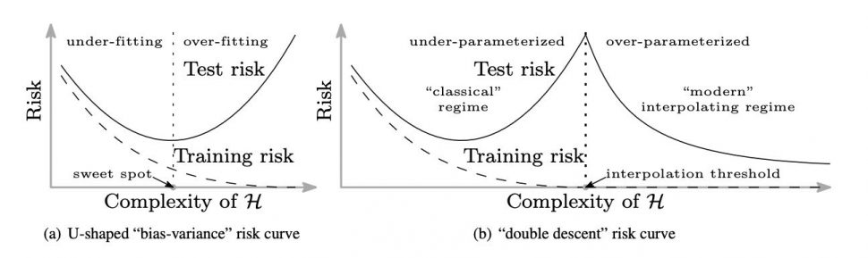

原文：http://www.offconvex.org/2019/10/03/NTK/

作者：*Wei Hu and Simon Du* 

翻译：[Quan Chen](https://github.com/chenquan)

# 超深网络和神经正切核(NTK)

（转帖在[Off the Convex Path](http://www.offconvex.org/2019/10/03/NTK/) ）

机器学习的传统观点认为，在训练误差和泛化差距之间要进行谨慎的权衡。模型的复杂性存在一个“最佳点”，因此模型（i）足够大，可以实现合理良好的训练误差，而模型（ii）足够小，可以泛化差距-测试误差和训练误差之间的差-可以控制。较小的模型会产生较大的训练误差，而使模型变大则会导致较大的泛化差距，两者都会导致较大的测试误差。当模型复杂度变化时，这可以通过测试误差的经典U形曲线来描述（见图1（a））。

但是，如今很常见的是使用高度复杂的过参数化模型，例如深度神经网络。通常对这些模型进行训练，以在训练数据上实现接近零的误差，但是它们仍然在测试数据上具有出色的性能。[Belkin等（2018年）](https://arxiv.org/abs/1812.11118)通过“双重下降”曲线对这一现象进行了描述，该曲线扩展了经典的U形曲线。可以观察到，随着模型复杂度增加到可以完全拟合训练数据的程度（即达到*插值*制度），测试误差继续下降！有趣的是，最好的测试误差通常是通过最大的模型实现的，这与关于“最佳点”的经典直觉背道而驰。下图来自[Belkin等人（2018）](https://arxiv.org/abs/1812.11118) 说明了这种现象。

图1. [Belkin等人(2018)](https://arxiv.org/abs/1812.11118)论文插图,研究了模型复杂性增加对泛化的影响：传统信念（a）与实际实践（b）

因此，有人怀疑深度学习中使用的训练算法（（随机）梯度下降及其变体）以某种方式隐式限制了训练网络的复杂性（即参数的“真实数量”），从而导致了较小的泛化差距。

由于较大的模型在实践中通常可以提供更好的性能，因此人们自然会感到奇怪：

> 无限宽的网络表现如何？

这个问题的答案对应于图1（b）的右端。这篇博客文章讲述的是一种在过去一年中引起了广泛关注的模型：深度学习机制，其宽度（即卷积滤波器中的通道数或内部完全连接的神经元数）去无穷大。乍一看，这种方法对于从业者和理论家来说似乎都是无望的：世界上所有的计算能力不足以训练无限的网络，理论家已经全力以赴地试图找出有限的网络。但是在数学/物理学中，有一种传统，就是通过在无穷大的范围内研究问题而得出对问题的见解，实际上，无穷大的限制对于理论而言也变得更加容易。

专家们可能还记得，[Neal（1994）](https://www.cs.toronto.edu/~radford/pin.abstract.html)于25年前就提出了无限宽的神经网络与核方法之间的联系，以及[Lee等人（2018）](https://openreview.net/forum?id=B1EA-M-0Z)和[Matthews等（2018）](https://arxiv.org/abs/1804.11271)最近的扩展。这些内核对应于无限宽的深度网络，这些网络的参数是随机选择的，并且*仅梯度下降训练顶层（分类）*。具体来说，如果$F(\theta,x)$表示输入的网络输出,$x$就是其中的输入，$\theta$表示网络中的参数，并且$w$是$\theta$的初始化分布（通常是具有适当缩放比例的高斯分布），则相应的内核为有$\mathrm{ker} \left(x,x'\right) = \mathbb{E}_{\theta \sim \mathcal{W}}[f\left(\theta,x\right)\cdot f\left(\theta,x'\right)]$,其中$x,x^{'}$是两个输入。

当*所有层都经过训练*时，更常见的情况又是怎样的呢？最近，[Jacot等人（2018）](https://arxiv.org/pdf/1806.07572.pdf)首次发现这也跟名为*神经正切核（NTK）*的核有关，其形式为$\mathrm{ker} \left(x,x'\right) = \mathbb{E}_{\theta \sim \mathcal{W}}\left[\left\langle \frac{\partial f\left(\theta,x\right)}{\partial \theta}, \frac{\partial f\left(\theta,x'\right)}{\partial \theta}\right\rangle\right].$

NTK和先前提出的内核之间的主要区别在于，NTK是通过网络输出相对于网络参数的梯度之间的内积来定义的。该梯度来自梯度下降算法的使用。粗略地说，对于通过梯度下降训练的足够宽的深度神经网络来说，可以得出以下结论：

> 由具有无限小步长（又称梯度流）**的梯度下降训练的**适当随机初始化的，**足够宽的**深度神经网络**等效于**具有**确定性**核**的核回归预测因子**，该核称为*神经正切核（NTK）*。

[Jacot等人（2018）](https://arxiv.org/pdf/1806.07572.pdf)的原始论文或多或少建立了这一点，但他们要求每一层的宽度都必须按顺序达到无穷大。在我们与Sanjeev Arora，Li Zhiyuan Li，Ruslan Salakhutdinov和Wang Ruong [的最新论文中](https://arxiv.org/abs/1904.11955)，我们将此结果改进为非渐近设置，其中每层的宽度仅需要大于某个有限阈值。

在本文的其余部分中，我们将首先解释NTK的产生方式以及广泛的神经网络和NTK之间的等效性证明背后的思想。然后，我们将提供实验结果，以显示无限宽的神经网络在实践中的表现。

## 神经正切核如何出现？

现在，我们描述训练超宽的全连接神经网络如何导致NTK的内核回归。[我们的论文中](https://arxiv.org/abs/1904.11955)给出了更详细的处理。我们首先指定我们的设置。我们考虑标准的监督学习设置，其中在某个基础分布中取出n个训练数据点${(x_i,y_i)}_{i=1}^n \subset \mathbb{R}^{d}\times\mathbb{R}$，并希望找到一个在给定输入的情况下可以很好地预测数据分布标签的函数。我们考虑由标准的监督学习定义的全连接神经网络$F（θ,x）$，其中$\theta$是网络中的所有参数的集合,$x$是网络的输入。为简单起见，我们仅考虑具有单个输出的神经网络，即$f(\theta, x) \in \mathbb{R}$,但是将其推广到多个输出是非常简单。

我们考虑通过最小化训练数据的二次损失来训练神经网络：$\ell(\theta) = \frac{1}{2}\sum_{i=1}^n (f(\theta,x_i)-y_i)^2.$*具有无限小学习率（又称梯度流）的梯度下降应用于此损失函数*：$\frac{d \theta(t)}{dt} = - \nabla \ell(\theta(t)),$其中$\theta(t)$表示$t$当时的参数。

让我们定义一些有用的符号。$u_i = f(\theta, x_i)$表示网络输入$x_i$的输出，我们让$u=(u_1, \ldots, u_n)^\top \in \mathbb{R}^n$表示所有训练输入时网络输出的集合。对于所有依赖时间的变量,我们使用时间索引$t$，例如$u_i(t),u_(t)$等等。使用此符号，可以方便地将训练目标写成$\ell(\theta) = \frac12 |u-y|_2^2$。

使用简单的微分，可以得到$u(t)$的动态,如下：$\frac{du(t)}{dt} = -H(t)\cdot(u(t)-y),$（参见[我们论文](https://arxiv.org/abs/1904.11955)的证明）其中$H(t)$是一个$x \times x$的正半定矩阵，$(i,j)$是$\left\langle \frac{\partial f(\theta(t), x_i)}{\partial\theta}, \frac{\partial f(\theta(t), x_j)}{\partial\theta} \right\rangle$ 的下标。

请注意$H(t)$是根据训练数据求出的（随时间变化的）内核$ker_t(\cdot,\cdot)$的*内核矩阵*：$ker_t(x,x') = \left\langle \frac{\partial f(\theta(t), x)}{\partial\theta}, \frac{\partial f(\theta(t), x')}{\partial\theta} \right\rangle, \quad \forall x, x' \in \mathbb{R}^{d}.$在此内核中，输入$x$被映射到特征向量$\phi_t(x) = \frac{\partial f(\theta(t), x)}{\partial\theta}$,该向量通过网络输出所相对于时间$t$的参数的梯度来定义。

### 大宽度限制

到目前为止，我们还没有使用神经网络非常广泛的特性。$u(t)$的演化公式通常是有效。事实证明在较大的宽度限制下，时变内核$ker_t(\cdot,\cdot)$（很有可能）总是接近*确定性*固定核$ker_{\mathsf{NTK}}(\cdot,\cdot)$，后者是 **神经切线核（NTK）**。此属性分两步证明，都需要在大宽度假设下：

1. **步骤1：在随机初始化时收敛到NTK。**假设初始化时的网络参数$(t=0),\theta(0)$是独立同分布的高斯分布。然后在适当的缩放比例下，对于任意一对输入$x,x^{'}$，可以证明在大宽度限制中依赖于随机初始化$\theta(0)$的随机变量$ker_0(x,x’)$，概率收敛到确定性值$ker_{\mathsf{NTK}}(x,x’)$。

   （从技术上讲，如何定义较大的宽度限制是很微妙的。[Jacot等人（2018）](https://arxiv.org/pdf/1806.07572.pdf)给出了一个顺序限制的证明，其中每一层的宽度一一无限地变为无限大。后来[Yang（2019）](https://arxiv.org/abs/1902.04760)考虑了一种将所有宽度以相同的速率达到无穷大的设置。而[我们](https://arxiv.org/abs/1904.11955)的论文将其改进为非渐近设置，在该设置中，我们仅要求所有图层宽度都大于有限阈值，这是最弱的极限概念。

2. **步骤2：训练期间内核的稳定性。**此外，内核在训练过程中*几乎没有变化*，即$ker_t(x,x’) \approx ker_0(x,x’)$,对于所有$t$。其背后的原因是在训练过程中权重不会移动太多，即当宽度$\to\infty$时，$\frac{|\theta(t) - \theta(0)|}{|\theta(0)|} \to 0$。直观地讲，当网络足够宽时，每个单独的权重只需移动很小的量即可使网络输出发生不可忽略的变化。当通过梯度下降训练网络时，这是正确的。

结合以上两个步骤，我们得出结论，对于任何两个输入$x,x^{'}$，很大的可能性出现$ker_t(x,x') \approx ker_0(x,x') \approx ker_{\mathsf{NTK}}(x,x'), \quad \forall t.$如我们所见，梯度下降的动力学与时变内核$ker_t(\cdot,\cdot)$密切相关。现在我们知道$ker_t(\cdot,\cdot)$本质上与NTK相同，但还有更多步骤，我们最终可以建立训练后的神经网络与NTK之间的等价关系：最终学习型神经网络当$t=\infty$时，$f_{\mathsf{NN}}(x) = f(\theta(\infty), x)$，对于NTK 等效于*内核回归*解决方案。换句话说，对于任何输入$x$我们有$f_{\mathsf{NN}}(x) \approx f_{\mathsf{NTK}}(x) = ker_{\mathsf{NTK}}(x, X)^\top \cdot ker_{\mathsf{NTK}}(X, X)^{-1} \cdot y,$其中$ker_{\mathsf{NTK}}(x, X) = (ker_{\mathsf{NTK}}(x, x_1), \ldots, ker_{\mathsf{NTK}}(x, x_n))^\top \in \mathbb{R}^n$和$ker_{\mathsf{NTK}}(X, X)$项是一个$n \times n$矩阵$ker_{\mathsf{NTK}}(x_i, x_j)$，$(i,j)$是下标。

（为了在内核回归解决方案中没有偏项，我们还假设初始化时的网络输出很小：$f(\theta(0), x)\approx0$, 这可以通过以下方式来确保：例如，通过将初始值减小一个大常数，或在初始化时在顶层复制具有相反符号的网络。

## 无限宽的神经网络在实践中表现如何？

建立了等价关系之后，我们现在可以解决无限宽的神经网络在实践中的表现如何的问题-我们只需使用NTK评估内核回归预测变量即可！我们在标准图像分类数据集CIFAR-10上测试NTK。请注意，对于图像数据集，需要使用卷积神经网络（CNN）才能获得良好的性能。因此，我们导出了NTK *卷积神经正切内核（CNTK）*的扩展，并测试了它们在CIFAR-10上的性能。在下表中，我们报告了不同CNN和CNTK的分类准确性：

| 深度 | CNN-V   | CNTK-V  | CNN-GAP| CNTK-GAP |
| :--- | :------ | :------ | :---------- | :----------- |
| 3    | 61.97％ | 64.67％ | 57.96％     | 70.47％      |
| 4    | 62.12％ | 65.52％ | 80.58％     | 75.93％      |
| 6    | 64.03％ | 66.03％ | 80.97％     | 76.73％      |
| 11   | 70.97％ | 65.90％ | 75.45％     | 77.43％      |
| 21   | 80.56％ | 64.09％ | 81.23％     | 77.08％      |

在这里，CNN-V是几乎全范围的香草CNN（无池化），而CNTK-V是它们的NTK副本。我们还测试了具有全局平均池化（GAP）的CNN，以上表示为CNN-GAP，以及与它们对应的NTK CNTK-GAP。对于所有实验，我们取消了批处理规范化，数据扩充等功能，并且仅使用SGD来训练CNN（对于CNTK，我们使用核回归的封闭式公式）。

我们发现CNTK实际上是非常强大的内核。我们发现最好的内核，即带有GAP的11层CNTK，在CIFAR-10上达到了77.43％的分类精度。这为在CIFAR-10上基于纯内核的方法的性能提供了一个重要的新基准，比[Novak等人](https://openreview.net/forum?id=B1g30j0qF7)报道的方法高10％[。](https://openreview.net/forum?id=B1g30j0qF7)[（2019）](https://openreview.net/forum?id=B1g30j0qF7)。CNTK的表现也类似于CNN。这意味着超宽的CNN可以在CIFAR-10上实现合理的测试性能。

有趣的是，全局平均池化操作可以显着提高CNN和CNTK的分类准确性。从这个观察中，我们怀疑许多改善神经网络性能的技术在某种意义上是通用的，即，这些技术也可能有益于内核方法。

## 结论思想

理解超参数化深度神经网络令人惊讶的良好性能绝对是一个具有挑战性的理论问题。现在，至少我们对一类超宽神经网络有了更好的理解（图1（b）的右端）：它们被神经切线内核捕获！仍然存在的障碍是，经典的内核泛化理论仍然无法为泛化提供现实的界限。但是至少我们现在知道，对内核的更好理解可以导致对深网的更好理解。

另一个富有成果的方向是将神经网络的不同体系结构/技巧“翻译”为内核，并检查其实际性能。我们发现全局平均池化可以显着提高内核的性能，因此我们希望诸如批处理规范化，随机失活，最大池化等其他技巧也可以使内核受益。同样，人们可以尝试将其他结构（例如递归神经网络，图神经网络和转换器）转换为内核。

我们的研究还表明，无限宽网络与有限网络之间存在性能差距。如何解释这一差距是一个重要的理论问题。

**免责声明：本文中** 表达的所有观点均为作者的观点，并不代表卡耐基梅隆大学的观点。