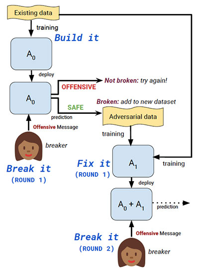

地址： https://www.topbots.com/top-conversational-ai-research-papers-2019/ 

作者： Mariya Yao 

译者：Qiang He

# 2019年对话式AI的10篇重要研究论文

### 

会话式AI已成为跨行业业务实践的组成部分。越来越多的公司正在利用聊天机器人为客户服务，销售和营销带来的优势。

即使聊天机器人已成为领先企业的“必备”资产，但其性能仍然与人类相去甚远。来自主要研究机构和技术领导者的研究人员已经探索了各种方法，可以通过增加响应的多样性，实现情感识别，提高其跟踪对话的长期能力，确保保持一致的角色来提高对话系统的性能。等

我们搜索了2019年发表的重要的对话式AI研究论文，向您介绍了在面向任务和开放域对话系统中都设置了最新技术的前10名。

## 2019年对话式AI的10篇重要研究论文  

###  1.面向任务的对话系统的可转移多域状态生成器**](https://arxiv.org/abs/1905.08743)**，By 吴建胜，ANDREA MADOTTO，EHSAN HOSSEINI-ASL，熊彩明，RICHARD SOCHER，PASCALE FUNG

#### **原始摘要**

 对域本体的过度依赖和跨域知识共享的缺乏是对话状态跟踪的两个实际但尚未研究的问题。现有方法通常在推理期间跟踪未知时隙值方面是不足的，并且通常难以适应新的域。在本文中，我们提出了一种可转移的对话状态生成器（TRADE），该函数使用复制机制从发声中生成对话状态，从而在预测训练期间未遇到的（三元组，时段，值）三元组时促进知识的传递。我们的模型由发声编码器，插槽门和状态生成器组成，它们在域之间共享。经验结果表明，对于人与人对话数据集MultiWOZ的五个域，TRADE的最新联合目标准确度达到48.62％。此外，我们通过模拟零镜头和少镜头对话状态跟踪（针对看不见的域）来显示其传输能力。TRADE在零射门域之一中达到了60.58％的联合目标精度，并且能够适应少射门的情况而不会忘记已经受过训练的域。 

#### **我们的总结**

 香港科技大学和Salesforce Research的研究小组解决了过度依赖领域本体和缺乏跨领域知识共享的问题。在实际情况中，许多时间段在不同的域之间共享所有或部分值（例如，*区域*时间段可以存在于诸如*餐厅*，*酒店*或*出租车的*许多域中），因此跨多个域传输知识对于对话状态跟踪势在必行（DST）模型。研究人员介绍**TRA** nsferable **d** ialogue统计**Ë**生成器（TRADE），它利用上下文增强的插槽门和复制机制来跟踪对话历史记录中任何地方提到的插槽值。TRADE跨域共享其参数，并且不需要预定义的本体，从而可以跟踪以前看不到的广告位值。实验证明了该方法的有效性，在具有挑战性的MultiWOZ数据集上，TRADE实现了48.62％的最新联合目标精度。 

  

#### **本文的核心思想是什么？**

- 为了克服对领域本体的过度依赖和缺乏跨领域知识共享，研究人员建议：

  - 直接生成时隙值，而不是预测每个预定义的本体项的概率；
  - 跨域共享所有模型参数。

- 该贸易模式由三个部分组成：

  - 一个**发声编码器**到编码对话的话语成固定长度的向量序列;
- 一个**槽栅**来预测某一是否*（域，时隙）*对由所述对话触发;
  - 一个**状态生成器**，可独立解码所有*（域，时隙）*对的多个输出令牌，以预测其对应值。

 

 

#### **关键成就是什么？**

- 在具有挑战性的人与人对话的MultiWOZ数据集上，TRADE的联合目标准确度达到48.62％，开创了新的技术水平。
- 此外，TRADE在零击域中的一个域中达到了60.58％的联合目标精度，证明了其将知识转移到以前未曾见过的域的能力。
- 实验还证明了该模型能够适应新的少量快照域而不会忘记已经训练好的域的能力。

 

#### **人工智能界对此有何看法？**

- 该论文在ACL 2019主会议上获得了杰出论文奖，并在同一会议上获得了NLP的会话人工智能研讨会最佳论文奖。

 

#### **未来的研究领域是什么？**

- 从其他资源转移知识以进一步提高零击性能。
- 收集具有大量域的数据集，以促进对多域对话状态跟踪中的技术的研究。

 

#### **有哪些可能的业务应用程序？**

- 当前的研究可以在多域设置中显着提高面向任务的对话系统的性能。

 

#### **在哪里可以获得实现代码？**

- 这项研究的PyTorch实现可在[GitHub](https://github.com/jasonwu0731/trade-dst)上[找到](https://github.com/jasonwu0731/trade-dst)。

 

### 2. [**神经对话系统可以有效地使用对话历史吗？实证研究**](https://arxiv.org/abs/1906.01603)**，By CHINNADHURAI SANKAR，SANDEEP SUBRAMANIAN，CHRIS PAL，SARATH CHANDAR和YOSHUA BENGIO**

 

#### **原始摘要**

当建立对话代理时，神经生成模型变得越来越流行。它们提供了灵活性，可以轻松地适应新域，并且需要最少的域工程。对这些系统的普遍批评是，它们很少有效地理解或使用可用的对话历史记录。在本文中，我们通过经验方法来研究这些模型在测试时人为地引入非自然变化或扰动其上下文的敏感性，从而了解这些模型如何使用可用的对话历史记录。我们在4个多转对话数据集上对10种不同类型的扰动进行了实验，发现常用的神经对话架构（例如递归和基于转换器的seq2seq模型）对大多数扰动（例如遗漏或重新排列发音，混排词，

 

#### **我们的总结**

最近引入的生成模型擅长产生流畅的响应，但是这些响应往往很无聊且重复，这通常归因于这些模型对对话历史的理解不足。在本文中，作者试图通过经验研究神经生成模型是否有效地利用了对话历史。为此，他们测试了递归网络和基于变压器的序列到序列模型对各种合成扰动的敏感性。该方法基于以下假设：如果模型对破坏某些类型信息的扰动不敏感，则意味着该模型将最大限度地利用此信息。实验表明，神经生成模型对发声级和词级摄动不敏感。

 

 

#### **本文的核心思想是什么？**

- 在对对话历史进行综合引入扰动的情况下，以经验方式研究生成神经系统的行为。
- 实验：
  - **话语水平扰动**（搅乱话语序列、颠倒话语顺序、删除某些话语、截断对话历史以仅包含k个最近的话语）;
  - **单词级扰动**（单词洗牌，颠倒单词顺序，均匀地减少30%的单词，删除所有名词，删除所有动词)。

 

#### **关键成就是什么？**

- 凭经验证明：
  - 即使在对话历史记录发生极端变化的情况下，模型也往往只会显示出微小的困惑，这表明它们没有有效地利用可用的信息。
  - Transformer 对单词重排不敏感，这意味着它们可以学习类似单词袋的表示形式。
  - 注意机制导致模型使用对话框前面部分中的更多信息。
  - 与递归模型相比，Transformer 对扰动不敏感，扰动会破坏发声间的对话动态。

 

#### **人工智能界对此有何看法？**

- 该论文已被提名为ACL 2019最佳论文奖的候选人。

 

#### **未来的研究领域是什么？**

- 模型对扰动的敏感性会破坏对话框历史记录中的某些类型的信息，可能会很有用：
  - 用于了解模型用于解决新对话框数据集的信息种类；
  - 作为新模型的诊断工具。

 

#### **在哪里可以获得实现代码？**

- 该代码可在[GitHub上获得](https://github.com/chinnadhurai/ParlAI/)。

 

### **3.** [**善于说服：建立个人的有说服力的社会**](https://arxiv.org/abs/1906.06725)**公益**[**说服对话系统**](https://arxiv.org/abs/1906.06725)**，作者：王学伟，史维彦，理查德·金，吴YO雄，杨思佳，张静雯和周瑜**

 

#### **原始摘要**

开发智能的有说服力的对话代理程序以改变人们的意见和行为以实现社会利益，是推进自动化对话系统的道德发展的前沿。为此，第一步是要了解在人的说服性对话中运用的战略披露和申诉的复杂组织。我们设计了一个在线说服任务，要求一位参与者说服另一位参与者向特定的慈善机构捐款。我们收集了包含1,017个对话的大型数据集，并从一个子集中注释了新兴的说服策略。基于注释，我们构建了带有上下文信息和句子级功能的基线分类器，以预测语料库中使用的10种说服策略。此外，为了了解个性化的说服流程，我们分析了个人的人口统计学和心理背景之间的关系，包括人格，道德，价值体系及其捐赠意愿。然后，我们根据个人的个人背景分析了哪种类型的说服策略导致了更多的捐赠。这项工作为开发个性化的说服性对话系统奠定了基础。

 

#### **我们的总结**

本文建立在细化可能性模型的基础上，该模型认为，有说服力的信息根据人们的世界观而量身定制时会更有效。作者从Mechanical Turk招募了参与者，从心理上对他们进行了介绍，然后请他们扮演角色，说服对方，向慈善机构Save the Children捐款。然后，研究人员根据所使用的说服策略对会话的一部分进行注释，并建立了一个混合RCNN分类器，将整个语料库分为不同的说服策略。他们分析了总体上最成功的策略以及说服策略与用户的人口统计特征和性格类型之间的相互作用。

 

 

#### **本文的核心思想是什么？**

- AI对话代理的目的通常涉及某种形式的说服，但是对他们有效的说服策略的研究受到限制，因为说服的研究传统上是社会科学而不是AI工程的一部分。
- 这项跨学科的论文建立在社会学基础上，可以在大量的人类聊天对话中识别不同的说服策略，并分析哪种策略对一般人和给定的性格类型最有效。
- 为了将说服策略分为10类，再加上一类“非策略”类，作者开发了具有以下特征的混合RCNN模型：
  - 句子嵌入
  - 上下文嵌入；
  - 句子级功能。

 

*混合RCNN分类器概述*

 

#### **关键成就是什么？**

- 研究人员发现：
  - 提供实用的捐赠信息是总体上最好的策略。
  - 向用户询问他们是否熟悉慈善机构，大大提高了对开放度五大特征的参与者的捐赠可能性。
  - 提出个人问题会大大提高订阅者对“关爱”或“自由”的捐赠概率（按照海特的道德基础理论），但会降低对订阅“公平或权威”的捐赠者的捐赠概率。

 

#### **人工智能界对此有何看法？**

- 该论文已被提名为ACL 2019最佳论文奖的候选人。

 

#### **未来的研究领域是什么？**

- 通过包含更多注释和更多对话框上下文来提高分类器的性能。
- 设计一种自适应的说服对话系统，该系统具有根据用户个人资料选择说服策略的能力。

 

#### **有哪些可能的业务应用程序？**

- 作者指出，技术是双刃剑，并具有说服人们善与恶的潜力。牢记这一点，本文中介绍的知识可用于为自动对话系统的道德设计基础提供信息。
- 按照本文中的示例，慈善机构可以使用它说服潜在的支持者捐款。
- 它也可以用于旨在帮助人们实现其个人目标的产品中。

 

#### **在哪里可以获得实现代码？**

- 作者已经在[GitLab上](https://gitlab.com/ucdavisnlp/persuasionforgood)发布了数据集和代码。

 

### **4.** [**OPENDIALKG：基于注意力的知识图**](https://www.semanticscholar.org/paper/OpenDialKG%3A-Explainable-Conversational-Reasoning-Moon-Shah/0d3c68c207fc83fb402b7217811af22066300fc9)**遍历的可解释性**[**对话推理**](https://www.semanticscholar.org/paper/OpenDialKG%3A-Explainable-Conversational-Reasoning-Moon-Shah/0d3c68c207fc83fb402b7217811af22066300fc9)**，By SEUNGWHAN MOON，PARARTH SHAH，ANUJ KUMAR和RAJEN SUBBA**

 

#### **原始摘要**

我们研究了一种对话推理模型，该模型策略性地遍历了大型公共事实知识图（KG），以引入引人入胜且在上下文中不同的实体和属性。在这项研究中，我们收集了一个新的**开放**式**Dial** og **KG**平行语料库，称为**OpenDialKG**，其中来自人与人角色扮演对话的15K的每个讲话都用地面真实引用手动注释，这些引用来自具有1M +事实的大型KG的相应实体和路径。然后，我们提出DialKG Walker模型，该模型学习对话上下文作为KG上的结构化遍历的对话上下文的符号转换，并预测自然实体，通过新颖的领域无关，基于注意力的图路径解码器引入给定的先前对话上下文。自动和人工评估表明，在域内和跨域任务中，我们的模型都可以比最新的基准或基于规则的模型检索更多自然和类似人类的响应。所提出的模型还为检索到的每个实体生成了KG行走路径，从而提供了一种解释对话推理的自然方法。

 

#### **我们的总结**

Facebook对话式AI团队采用了一种新颖的方法来创建自然的，类似于人的反应，并提供有关不同实体及其属性的引人入胜的，上下文相关的信息。首先，他们收集一个新的并行语料库**OpenDialKG**，在对话中对实体的每次提及都与其相应的真实KG路径手动链接。然后，作者介绍了一种称为**DialKG Walker**的新模型，该模型可以学习对话中提到的实体之间的知识路径以及基于大型常识知识图的原因。在多个基准上进行的实验表明，与最新的基准相比，建议的方法可产生更多自然和类似人的反应。

 

 

#### **本文的核心思想是什么？**

- 研究团队希望使开放式对话系统能够理解对话上下文并通过引入相关实体和属性来做出响应。

- 为此，他们使用大型**知识图**（100K实体和1.1M事实）和**数据驱动的推理模型**，该**模型**将对话框转换映射到KG路径，以识别将在特定对话框中提及的实体子集上下文。

- 特别是，研究小组提出了一种名为

  DialKG Walker

  的新模型，其中包括：

  - 一个基于注意力的**图解码器**，它在大型常识性KG中走出一条最佳路径，以有效地修剪不太可能的候选实体；
  - 一个并行的**零击学习模型**，该**模型**利用先前的句子，对话和KG上下文根据候选实体的相关性和路径得分对其进行排名。

- 借助大规模的公共事实知识图，引入的方法可以在跨各个域和任务的开放式对话中实现与域无关的对话推理。

 

 

#### **关键成就是什么？**

- 自动和人工评估表明DialKG Walker优于最新的基准和基于规则的模型。
- 广泛的跨域和转移学习评估证实了所提出方法的灵活性。
- 引入的OpenDialKG数据集在15K对话会话中具有91K语音，可以深入研究符号推理和自然语言对话。

 

#### **人工智能界对此有何看法？**

- 该论文已被提名为ACL 2019最佳论文奖的候选人。

 

#### **有哪些可能的业务应用程序？**

- 通过提及相关实体和属性，使跨域和任务（例如，聊天，建议）的聊天机器人能够生成更自然和更具吸引力的响应。

 

### **5.** [**对话互动的动态说话人模型**](https://www.aclweb.org/anthology/N19-1284)**，By 郝成，郝芳，马里·奥斯滕多夫（MARI OSTENDORF）**

 

#### **原始摘要**

说话者的个体差异反映在他们的语言使用以及他们的兴趣和观点上。表征这些差异对于人机交互以及人与人之间的对话分析很有用。在这项工作中，我们介绍了一种神经模型，用于学习在对话上下文中嵌入动态更新的说话者。初始模型训练是无监督的，使用上下文相关的语言生成作为目标，而上下文是对话历史记录。进一步的微调可以利用与任务有关的监督培训。研究表明，学习者对说话人的神经表示对于社交机器人中的内容排名和人与人对话中的对话行为预测非常有用。

 

#### **我们的总结**

华盛顿大学的研究小组建议，了解用户之间的个体差异对预测下一个对话行为很有用。为了发现这些个体差异，研究人员建议使用无监督的神经模型，该模型从对话历史中学习说话者嵌入。此外，为了捕获随时间的变化并在有新数据可用时改进说话者表示，引入的模型的结构允许在每次对话时动态更新说话者嵌入向量。实验结果表明，具有动态说话者嵌入功能的模型在预测人与人之间的机器人对话中的用户主题决策以及对人与人对话中的对话行为进行分类时，优于基线。

 

*动态扬声器模型*

 

#### **本文的核心思想是什么？**

- 作者介绍了一种用于学习说话者神经表示的模型：

  - 该模型以无监督的方式进行训练，以仅通过依靠该说话者的对话历史来学习每个说话者的表示。
  - 将用于分析说话者潜在模式的可学习组件整合到模型中，以帮助使说话者的学习特征与人类可解释的特征保持一致。

- 该

  动态音箱型号

  由三个部分组成：

  - 一个**潜模式分析器**来读取的话语并分析其潜模式;
  - 一个**扬声器状态追踪器**在通话过程中累积扬声器信息;
  - 一个**扬声器语言预测器**使用相应的扬声器状态重建发声。

- 学习的动态说话人嵌入可以直接用作功能，也可以针对特定的下游任务进行微调。

 

#### **关键成就是什么？**

- 引入的模型在以下下游任务中取得了可喜的结果：
  - 人类社交机器人对话中的用户主题决策预测；
  - 人与人对话中的对话行为分类。
- 对学习到的潜在模式的分析表明，该模型捕获了说话者的特征，例如意图，说话风格和性别。

 

#### **人工智能界对此有何看法？**

- 该论文在NAACL-HLT 2019上发表，NAACL-HLT是自然语言处理领域最重要的会议之一。

 

#### **未来的研究领域是什么？**

- 用一些实例指导潜伏模式以选择特定的人格特质。

 

#### **有哪些可能的业务应用程序？**

- 如本文所述，学习说话者之间的个体差异可以被整合到不同的NLP系统中，以提高他们在语言理解，语言生成，人机对话，查询完成等方面的表现。

 

#### **在哪里可以获得实现代码？**

- 作者在[GitHub上](https://github.com/hao-cheng/dynamic_speaker_model)提供了实现代码。

 

### **6.** [**通过开放域对话系统的**](https://arxiv.org/abs/1906.09308)**自演**[**近似交互式人类评估**](https://arxiv.org/abs/1906.09308)**，By ASMA GHANDEHARIOUN，JUDY HANWEN SHEN，NATASHA JAQUES，CRAIG FERGUSON，NOAH JONES，AGATA LAPEDRIZA，ROSALIND PICARD**

 

#### **原始摘要**

建立一个开放域的对话代理是一个具有挑战性的问题。当前的评估方法（主要是事后评估的单回合评估）无法在现实的交互式环境中捕获对话质量。在本文中，我们研究了交互式的人工评估并提供了必要的证据。然后，我们介绍一种新颖的，与模型无关且与数据集无关的方法来对其进行近似。特别是，我们提出了一种自演场景，其中对话系统与自己对话，并计算对话轨迹上诸如情感和语义一致性之类的代理的组合。我们表明，该度量标准比迄今为止已知的任何自动化度量标准都能更好地捕获对话模型的人工评估质量，从而实现了显着的Pearson相关性（r> .7，p <.05）。为了研究这种新颖的度量和交互式评估与最新度量和单次评估相比的优势，我们使用一组模型进行了扩展实验，其中包括一些对最近的分层对话框生成体系结构进行了新颖改进的模型通过话语层面的情感和语义知识提炼。最后，我们开源构建的交互式评估平台和收集的数据集，以使研究人员能够有效地部署和评估生成对话模型。包括通过话语级别的情感和语义知识提炼对最近的分层对话框生成体系结构进行新颖改进的几种方法。最后，我们开源构建的交互式评估平台和收集的数据集，以使研究人员能够有效地部署和评估生成对话模型。包括通过话语级别的情感和语义知识提炼对最近的分层对话框生成体系结构进行新颖改进的几种方法。最后，我们开源构建的交互式评估平台和收集的数据集，以使研究人员能够有效地部署和评估生成对话模型。

 

#### **我们的总结**

麻省理工学院的研究小组调查了评估开放域对话系统的问题。人是评估对话系统质量的最终权威，但是获得人的评级通常是相当昂贵且困难的过程。为了克服这些挑战并仍然获得可靠的评估，麻省理工学院的团队引入了一种新颖的框架来评估对话质量得分，该得分与人类评级具有很高的统计意义上的相关性。具体来说，他们提出了一系列基于心理学的指标，然后在给定这些指标的情况下拟合了一种功能，以预测人类对对话质量的评估。机器人的质量通过固定轮次中的自打进行评估，其中机器人会生成发声，并在下一轮中将其反馈为输入。实验证实，引入的自玩框架，

 

#### **本文的核心思想是什么？**

- 研究人员证明，单回合评估不能捕获开放式对话系统的常见故障，包括响应缺乏多样性，无法跟踪对话的长期方面以及无法保持一致的性格。
- 为了确保交互式多回合评估，他们提出了一系列自动化指标，包括情感，语义和参与度指标。
- 这些指标是根据漫游器与其自身的对话进行计算的，然后使用线性回归进行组合，并进行了优化，以最佳预测对话质量的人工评估。
- 作者还建议通过规范层次结构的顶层以确保其对对话的情感和语义进行编码，来改进几个层次的seq2seq生成模型。

 

*应用于可变层次递归编码器解码器基线（红色）的建议正则化图示（蓝色）*

 

#### **关键成就是什么？**

- 引入一种在自我扮演的框架中提供的指标，该指标与以下方面的人类评估密切相关：
  - 机器人同理心（r> 0.8）;
  - 通话质量（r> 0.7）。

 

#### **人工智能界对此有何看法？**

- 该论文在人工智能领先的会议NeurIPS 2019上被接受。

 

#### **有哪些可能的业务应用程序？**

- 根据本研究论文，麻省理工学院的团队提供了一个交互式评估平台，以帮助研究人员和从业人员评估并进一步改善其对话系统。

 

#### **在哪里可以获得实现代码？**

- [GitHub上](https://github.com/natashamjaques/neural_chat)提供了本文提到的所有模型的Pytorch实现。
- 要与模型进行交互，请访问[http://neural.chat](http://neural.chat/)。
- 该研究中使用的带有109K对话的Reddit数据集也可以[公开获得](https://affect.media.mit.edu/neural_chat/datasets)。

 

### **7.** [**共同优化神经反应生成中的多样性和相关性**](https://arxiv.org/abs/1902.11205v3)**，作者：高翔，李成金，张艺哲，克里斯·布罗克特，米歇尔·加利，高建峰，比尔·多兰**

 

#### **原始摘要**

尽管最近的神经对话模型显示出巨大的潜力，但它们通常会产生平淡无奇的反应。尽管已经探索了各种方法来使对话模型的输出多样化，但改进通常是以降低相关性为代价的。在本文中，我们提出了一个SpaceFusion模型来共同优化多样性和相关性，该模型通过利用新颖的正则化项实质上融合了序列到序列模型和自动编码器模型的潜在空间。结果，我们的方法产生了一个潜在空间，其中距预测响应向量的距离和方向分别大致与相关性和多样性相匹配。此属性还非常适合潜在空间的直观可视化。

 

#### **我们的总结**

微软研究团队致力于解决聊天机器人响应中的多样性。特别是，他们引入了一种在不降低相关性的情况下改善响应多样性的方法。他们的**太空融合**模型利用序列到序列模型生成预测的响应向量，并利用自动编码器模型生成潜在响应的向量。通过对两个模型使用相同的解码器，并使用新的正则化术语进行端到端联合训练，研究人员基本上融合了这些模型的两个潜在空间，并创建了结构化的潜在空间，可以在其中控制响应的相关性和多样性通过分别从预测的响应向量调整距离和方向。自动化指标和人工评估都证实了所提出方法在提高响应多样性和相关性方面的有效性。

 

*给定上下文，与预测响应向量的距离和方向分别与相关性和多样性大致匹配*

 

#### **本文的核心思想是什么？**

- 本文介绍了

  SpaceFusion

  模型，该模型旨在基于上下文生成各种相关的响应：

  - 该**序列到序列**模型产生的预测响应向量（上面的图片中的黑点）。
  - 自动**编码器**生成用于潜在响应的矢量（图片上的彩色点）。
  - 这些模型共享潜在的空间，因为使用了相同的解码器以及带有正则化的联合端到端训练。

- 正则化

  对于对齐潜在空间是必要的：

  - 插值正则化项可防止语义上不同的响应沿同一方向对齐。
  - 所述**融合**正则项可确保由两个模型所产生的矢量的均匀分布。

- 在诱发的潜在空间中，可以通过改变方向来调节响应的多样性，并可以通过调整与预测响应矢量的距离来控制响应的相关性。

 

 

#### **关键成就是什么？**

- 根据自动评估，在精度，召回率和F1得分方面，SpaceFusion模型明显优于强基准。
- 根据人类的评估，所提出的模型所产生的响应比其他系统所产生的响应更为相关和有趣，但人类所产生的响应却不那么有意义。
- SpaceFusion模型的属性使您可以直观地看到潜在空间。

 

#### **人工智能界对此有何看法？**

- 该论文在NAACL-HLT 2019上发表，NAACL-HLT是自然语言处理的主要会议之一。
- 作者关于程式化响应生成（[StyleFusion](https://arxiv.org/abs/1909.05361)）的后续工作已被EMNLP 2019接受，这是自然语言处理的另一个重要会议。

 

#### **未来的研究领域是什么？**

- 从理论上证明提议的正则化术语的有效性。
- 推广引入的模型产生[程式化的反应](https://arxiv.org/abs/1909.05361)。

 

#### **有哪些可能的业务应用程序？**

- SpaceFusion模型可以通过生成更多样化且仍然相关的响应来提高聊天机器人的性能。

 

#### **在哪里可以获得实现代码？**

- [GitHub上](https://github.com/golsun/SpaceFusion)提供了SpaceFusion模型的实现。

 

### **8.** [**构建它，解决它，以确保对话安全，解决它：对抗性攻击的鲁棒性**](https://arxiv.org/abs/1908.06083)**，By EMILY DINAN，SAMUEL HUMEAU，BHARATH CHINTAGUNTA，JASON WESTON**

 

#### **原始摘要**

在对话中检测攻击性语言已成为自然语言处理中越来越重要的应用。在公共论坛中检测到巨魔，以及在公共领域部署聊天机器人是两个例子，表明有必要防范人类的对抗性攻击行为。在这项工作中，我们为模型开发了一种训练方案，通过迭代构建，破坏模型，在模型中与人类和模型固定策略来使其对此类人为攻击变得鲁棒。在详细的实验中，我们显示此方法比以前的系统健壮得多。此外，我们表明，对话中使用的攻击性语言严重取决于对话上下文，不能像大多数以前的工作一样被视为单句攻击性检测任务。

 

#### **我们的总结**

对Tay聊天机器人的对抗性攻击导致其语言生成组件散发出令人反感的语言。Tay背后的对话系统无法承受这些攻击，因此开发人员最终将其关闭。在本文中，Facebook AI研究团队通过使用对人类对抗性攻击具有鲁棒性的模型来研究对话中攻击性语言的检测。具体来说，他们开发了一种“ **构建，修复，修复”策略的**全自动方法：将人群工作者用作**“**圈内人”，通过重新培训来修复模型，并重复整个构建，修复和修复过程经过多次迭代。实验证明了与现有系统相比该方法的鲁棒性。

 

 

#### **本文的核心思想是什么？**

- 为了构建对对抗行为具有鲁棒性的模型，Facebook AI研究团队建议使用以下算法：
  - **构建它**：构建一个可以检测令人反感的评论的模型。作者使用了在Wikipedia有毒评论数据集上训练的基于BERT的模型。
  - **打破它**：请群众工作者提交信息，以表明工人感到*反感，*但系统标记为*安全*。
  - **修复它**：在这些新示例上重新训练模型。
  - **重复**：重复**破坏它，**并**修复它**几次。
- 为了使该模型对对抗攻击更健壮，作者建议将重点放在对话上下文中的进攻性言语上，而不是对单个言语进行分类，因为一个短语本身可能完全无害，但在对话历史中却极具攻击性。

 

#### **关键成就是什么？**

- 对提出的

  构建，分解，修复它的

  方法的评估表明：

  - 与现有系统相比，它在对抗攻击方面更强大。
  - 通过这种方法收集的对抗性数据比现有数据集具有更多细微的语言，包含较少的亵渎，并且由于具有比喻性的语言，否定性和应用世界知识而具有冒犯性；
  - 使用对话历史记录中的上下文信息来识别令人反感的语言，对于使系统能够抵御对抗性的人为攻击至关重要。

 

#### **人工智能界对此有何看法？**

- 该论文在EMNLP 2019上接受了口头报告，这是自然语言处理的重要会议之一。

 

#### **未来的研究领域是什么？**

- 超越二元问题定义（安全或令人反感的），并分别考虑令人讨厌的语言类别。
- 探索其他对话任务，例如社交媒体或论坛。
- 研究引入的方法如何使神经生成模型安全。

 

#### **有哪些可能的业务应用程序？**

- 可以将提出的方法合并到不同的对话系统中，以使它们对对抗性的人为攻击更具鲁棒性。

 

#### **在哪里可以获得实现代码？**

- 作者将开放代码的整个**构建，破坏，修复**算法以及发布收集的数据和经过训练的模型。但是，这些资源在本出版物发行时不可用。

 

### **9.** [**TASKMASTER-1：迈向现实和多样化的对话数据集**](https://arxiv.org/abs/1909.05358)**，By BILL BYRNE，KARTHIK KRISHNAMOORTHI，CHINNADHURAI SANKAR，ARVIND NEELAKANTAN，DANIEL DUCKWORTH，SEMIH YAVUZ，BEN GOODRICH，AMIT DUBEY，ANDY CEDILNIK，KYU-YOUNG KIM**

 

#### **原始摘要**

数据驱动的构建对话系统方法的主要障碍是缺乏高质量的，面向目标的对话数据。为了帮助满足这一基本要求，我们引入了Taskmaster-1数据集的初始版本，该数据集包括13215个包含六个域的基于任务的对话框。使用了两个过程来创建此集合，每个过程都有其独特的优势。第一种是两人称呼的“绿野仙踪”（WOz）方法，其中受过训练的特工和众包工人互动以完成任务，而第二种是“自对话”，其中众包工人自己编写整个对话。我们不将工作人员限制在详细的脚本或很小的知识库上，因此，我们发现与现有数据集相比，我们的数据集包含更真实，更多样化的对话。我们提供了几种基准模型，包括具有基准性能的先进神经seq2seq体系结构以及定性的人工评估。对话框标有API调用和参数，这是一种简单且经济高效的方法，可避免使用复杂的注释架构。对话框模型和服务提供者API之间的抽象层允许给定模型与提供相似功能的多个服务进行交互。最后，该数据集将引起人们对书面语言与口头语言，话语模式，错误处理以及与对话系统研究，开发和设计有关的其他语言现象的兴趣。对话框标有API调用和参数，这是一种简单且经济高效的方法，可避免使用复杂的注释架构。对话框模型和服务提供者API之间的抽象层允许给定模型与提供相似功能的多个服务进行交互。最后，该数据集将引起人们对书面语言与口头语言，话语模式，错误处理以及与对话系统研究，开发和设计有关的其他语言现象的兴趣。对话框标有API调用和参数，这是一种简单且经济高效的方法，可避免使用复杂的注释架构。对话框模型和服务提供者API之间的抽象层允许给定模型与提供相似功能的多个服务进行交互。最后，该数据集将引起人们对书面语言与口头语言，话语模式，错误处理以及与对话系统研究，开发和设计有关的其他语言现象的兴趣。

 

#### **我们的总结**

在本文中，Google AI研究团队解决了缺乏高质量的面向目标的对话数据的问题。为了解决这个问题，他们引入了**Taskmaster-1**，这是一个数据集，其中包含跨越六个域的13215个对话框，并通过两个不同的过程收集。一些对话是通过基于Web的界面收集的，其中扮演“用户”的众包工人正在与人工操作员进行通信，但被认为他们正在与自动化系统进行交互。其余对话框由众包工作者根据建议的方案编写。与目前流行的基准数据集MultiWOZ相比，Taskmaster-1具有更丰富，更多样化的语言，并且涉及更多的现实世界实体。

 

#### **本文的核心思想是什么？**

- 缺乏高质量的面向目标的对话框数据集被认为是对话框生成和理解取得重大进展的主要障碍。

- 为了满足NLP社区的这一需求，Google AI团队提供了

  Taskmaster-1

  数据集：

  - 数据集包含13215个对话框：
    - 通过Oz向导系统收集了5507个**语音对话**，在该系统中，充当“用户”的众包工人与扮演“数字助理”的人类操作员进行交互。为了模仿现实世界的场景，用户被认为是他们正在与自动化系统进行交互，因此他们可以自然地表达自己的想法，但要记住，他们正在与机器人对话。
    - 众包的工作人员创建了7708个**书面对话框，**这些工人根据概述的场景自己编写了完整的对话。
  - 数据集涵盖**六个领域**：订购比萨饼，创建自动维修约会，设置乘车服务，订购电影票，订购咖啡饮料以及进行餐厅预订。

- 研究人员使用简单的API调用和参数来仅标记执行交易所需的变量（例如，电影名称，时间，门票数量）。

 

#### **关键成就是什么？**

- 与当前可用的面向任务的基准数据集（例如MultiWOZ）相比，引入了具有更丰富，更多样化语言的数据集。
- 使用自动评估指标和定性人类评估，在Taskmaster-1上评估几个强大基线模型的性能。

 

#### **人工智能界对此有何看法？**

- 该论文被选为EMNLP 2019的口头报告，这是自然语言处理中最重要的会议之一。

 

#### **有哪些可能的业务应用程序？**

- 引入的数据集可用于提高面向目标的聊天机器人和数字助理的性能。

 

#### **在哪里可以获得实现代码？**

- Taskmaster-1对话数据集可在[Google AI网站上找到](https://ai.google/tools/datasets/taskmaster-1)。

 

### **10.** [**话题聊天：面向知识公开的开放领域对话**](https://m.media-amazon.com/images/G/01/amazon.jobs/3079_Paper._CB1565131710_.pdf)**，作者：KARTHIK GOPALAKRISHNAN，BEHNAM HEDAYATNIA，QINLANG CHEN，ANNA GOTTARDI，SANJEEV KWATRA，ANU VENKATESH，RAEFER GABRIEL，DILEK HAKKANI-TUR**

 

#### **原始摘要**

建立可以与人类进行深层次，开放性对话的社交机器人，是人工智能（AI）的重大挑战之一。为此，机器人在与拥有自己的世界知识的人类进行交流时，需要能够有效利用跨越多个领域的世界知识。现有知识基础的对话数据集主要以明确的角色为对话伙伴进行样式化。这些数据集也没有探讨话题转换的深度或广度。我们引入Topical-Chat，这是一个基于知识的人与人之间的对话数据集，其基础知识涵盖8个广泛的主题，并且对话伙伴没有明确定义的角色，以帮助进一步研究开放域对话AI。

 

#### **我们的总结**

为了帮助构建可以跨多个域进行深度互动的社交机器人，Amazon Alexa AI团队引入了**Topical-Chat**，这是一个基于知识的数据集，涵盖了涵盖八个广泛主题的约11K人与人的对话。该数据集是在群众工作人员的帮助下收集的，这些工作人员被要求在提供的阅读集中进行自然，连贯的对话。对话伙伴还被要求在多个维度上注释他们的对话，例如阅读集的使用和情感。为了为将来的研究创建基准，研究人员在其数据集中训练了几个强大的模型。这些模型已经证明了他们有能力根据阅读集并以对话历史为条件来产生引人入胜的响应。

 

 

#### **本文的核心思想是什么？**

- 本文介绍了**Topical-Chat**，这是一个基于知识的人与人之间的对话数据集，其中包含跨越八个领域的超过235K语音，例如时尚，政治，书籍，体育，一般娱乐，音乐，科学和技术以及电影。
- 该数据集是通过以下方式与Amazon Mechanical Turk工人合作收集的：
  - 为工人提供了主题阅读集。
  - 然后，要求他们根据阅读材料进行自然而有趣的对话。
  - 为了反映现实世界中的对话，对话伙伴没有任何明确定义的角色，并且为他们提供的阅读集在不同程度上对称或不对称。

 

#### **关键成就是什么？**

- 介绍了[最大的社会对话集](https://developer.amazon.com/blogs/alexa/post/885ec615-314f-425f-a396-5bcffd33dd76/amazon-releases-data-set-of-annotated-conversations-to-aid-development-of-socialbots)公开可用的研究团体。
- 通过训练基于Transformer的简单模型以生成响应并使用自动化指标和人工评估对其进行评估，从而为将来的研究提供了几个可靠的基准。

 

#### **有哪些可能的业务应用程序？**

- 可以利用Topical-Chat数据集来提高开放域聊天机器人的性能，并帮助他们与人类就时尚，书籍，电影等进行连贯自然的对话。

 

#### **在哪里可以获得实现代码？**

- [GitHub上](https://github.com/alexa/alexa-prize-topical-chat-dataset/)提供Topical-Chat数据集。
