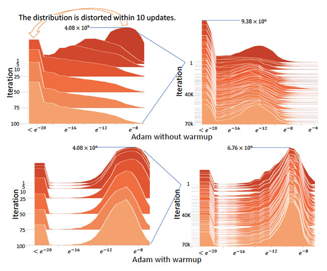
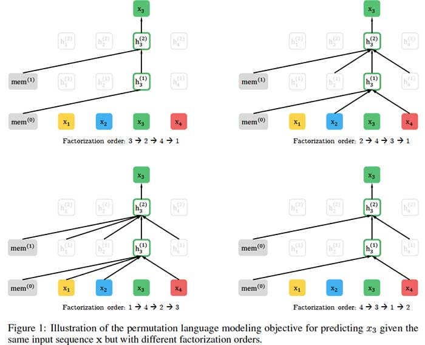
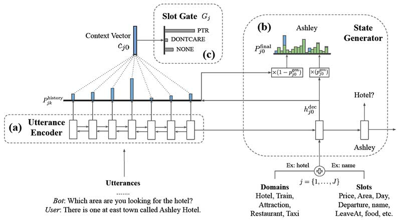
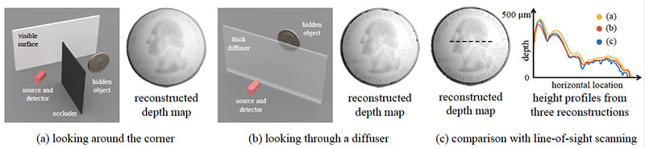
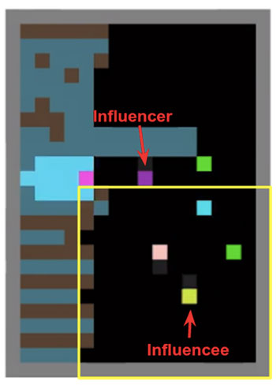
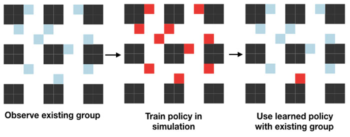

链接：https://www.topbots.com/top-ml-research-papers-2019/

作者： [Mariya Yao](https://www.topbots.com/author/mariya/) 

译者：muzhoubai

 

# 2019年开始的顶级AI项目和机器学习研究论文

 

随着AI行业发展如此之快，机器学习从业者很难找到时间来策划，分析和实施正在发表的新研究。为了帮助您快速掌握最新的ML趋势，我们将介绍我们的研究系列，其中我们整理2019年的关键AI研究论文并以易于理解的要点格式对其进行汇总。 

我们将从最重要的10篇AI研究论文开始，这些论文代表了最新的研究趋势。这些论文将为您提供有关神经网络体系结构，优化技术，无监督学习，语言建模，计算机视觉等方面的研究进展的广泛概述。我们已根据技术影响，专家意见和行业好评选择了这些研究论文。当然，还有更多的研究值得您注意，但是我们希望这将是一个好的起点。

 

## 2019年10个重要的ML研究论文

 

 

### 1.[抽奖券假说：寻找稀疏的，可训练的神经网络](https://arxiv.org/abs/1803.03635)， BY JONATHAN FRANKLE AND MICHAEL CARBIN

 

#### **原始摘要**

神经网络修剪技术可以将经过训练的网络的参数数量减少90％以上，从而减少存储需求并提高推理的计算性能，而不会影响准确性。但是，当代经验是，修剪产生的稀疏架构从一开始就很难进行培训，这同样会提高培训性能。

我们发现一种标准的修剪技术自然可以发现子网，这些子网的初始化使其能够有效地进行训练。根据这些结果，我们阐明“彩票假设”：密集的，随机初始化的前馈网络包含子网（“中奖彩票”），这些子网经过单独训练后，可达到与原始网络类似的测试精度迭代次数。我们发现中奖的彩票已经赢得了初始彩票：它们的连接具有初始权重，这使得培训特别有效。

我们提出了一种识别中奖彩票的算法，以及一系列支持彩票假说以及这些偶然初始化的重要性的实验。我们一直发现中奖票证的大小不到MNIST和CIFAR10的几种全连接和卷积前馈架构的大小的10-20％。超过此大小，我们发现的中奖彩票比原始网络学习得更快，并且达到更高的测试准确性。

 

#### **我们的总结**

神经网络通常会生成为大于初始化所需的严格范围，然后在训练到一组核心节点后将其修剪。该**彩票假说**提出，鉴于此最终修剪，必须有一个较小的起动网络，如果完全初始化，可以实现性能训练后相同的水平。研究人员通过反复训练，修剪和重新初始化神经网络，生成了所谓的“中奖票证”网络，其准确度与其父网络相等，仅为其父网络的10-20％。实验证实，所提出的方法可以通过更快的训练实现更高的测试准确性。

 

#### **本文的核心思想是什么？**

- 对于每个神经网络，只有较小的节点子集可以单独使用，以在训练后达到相同的精度。
- 可以通过迭代地训练原始神经网络，修剪其最小幅度权重并将剩余的连接重新初始化为其原始值，从而从原始大型神经网络中找到节点的子集。
- 需要迭代修剪而不是一次性修剪，才能以最小的尺寸找到最准确的中奖票证网络。

 

#### **关键成就是什么？**

- 彩票假说介绍，为神经网络的构成提供了新的视角。
- 建议一种可复制的方法，用于为给定的原始大型网络标识中奖彩票子网络。
- 为设计新的体系结构和初始化方案提供灵感，这将使神经网络效率更高。

 

#### **人工智能界对此有何看法？**

- 该论文在ICLR 2019（机器学习的重要会议之一）上获得了最佳论文奖。
- 它引发了多个研究团队（例如[Uber](https://eng.uber.com/deconstructing-lottery-tickets/)）的后续工作 。

 

#### **未来的研究领域是什么？**

- 寻找更有效的方法来获得成功的票务网络，以便可以在更大的数据集上检验该假设。
- 试用除稀疏修剪以外的修剪方法。
- 研究在深度神经网络中使用迭代修剪对学习速率预热的需求。
- 如研究人员的[后续论文](https://arxiv.org/abs/1903.01611)所述，稳定彩票假说。

 

#### **有哪些可能的业务应用程序？**

- 大大减少了训练神经网络的时间和计算需求。
- 构建足够小以在单个设备上而不是在云计算网络上进行训练的神经网络。

 

#### **在哪里可以获得实现代码？**

- 可以在[GitHub](https://github.com/google-research/lottery-ticket-hypothesis)上获得MNIST数据库的实现。

### 2. [在未经监督的离散表示学习中挑战通用假设](https://arxiv.org/abs/1811.12359), BY FRANCESCO LOCATELLO, STEFAN BAUER, MARIO LUCIC, GUNNAR RÄTSCH, SYLVAIN GELLY, BERNHARD SCHÖLKOPF, OLIVIER BACHEM

#### **原始摘要**

解开表示的无监督学习背后的关键思想是，真实世界的数据是由一些解释性变化因素生成的，这些变化因素可以通过无监督学习算法来恢复。在本文中，我们对这一领域的最新进展提供了清醒的认识，并挑战了一些常见的假设。我们首先从理论上证明，如果没有模型和数据的归纳偏差，从根本上讲，无纠缠表示的无监督学习是不可能的。然后，我们在可重现的大规模实验研究中对七个不同的数据集进行了超过12000个模型的培训，这些模型涵盖了最突出的方法和评估指标。我们观察到，虽然不同的方法成功地执行了由相应损失“鼓励”的属性，看来，如果没有监督，就很难识别出纠缠不清的模型。此外，增加的纠缠似乎并不会减少下游任务学习的样本复杂性。我们的结果表明，有关纠缠学习的未来工作应明确归纳性偏见和（内隐）监督的作用，研究强制解除学习表示的纠缠的具体好处，并考虑涵盖多个数据集的可重现的实验设置。

 

#### **我们的总结**

使机器能够理解高维数据并将其以无监督的方式转换为可用的表示形式，仍然是机器学习的主要挑战。在本文中，苏黎世联邦理工学院，马克斯·普朗克智能系统研究所和Google Research的研究人员的联合团队从理论上证明，如果不考虑学习方法和数据集的归纳偏差，就不可能在无监督的情况下学习解纠缠表示。此外，他们通过在七个数据集上训练超过12,000个模型以实证确认其发现，对最近的无监督解开学习方法进行了大规模评估。

 

#### **本文的核心思想是什么？**

- 该研究论文从理论上证明，无归纳表示的无监督学习从根本上讲是没有归纳偏差的。
- 理论发现得到了大规模可重复实验研究的支持，研究人员在七个数据集上实施了六种最先进的无监督解缠学习方法和六种从头开始的解缠措施：
  - 即使所有考虑的方法都确保聚合后验的各个维度（被采样）是不相关的，但表示的维度（被视为均值）仍然是相关的。
  - 随机种子和超参数通常比模型更重要，但调整似乎需要监督。
  - 纠缠度增加不一定意味着学习下游任务的样本复杂度降低。

 

#### **关键成就是什么？**

- 该研究的作者从理论和经验上挑战了无监督解纠学习中的普遍信念。
- 根据他们的发现，研究团队为解缠学习的未来研究提出了建议。
- 他们还为该研究领域的未来工作提供了重要的资源：
  - 一个新的图书馆，用于训练和评估纠缠的表示形式；
  - 超过10,000个经过训练的模型可以用作未来研究的基准。

 

#### **人工智能界对此有何看法？**

- 该论文在机器学习领域领先的会议之一ICML 2019上获得了最佳论文奖。

 

#### **未来的研究领域是什么？**

- 探索归纳偏见以及隐性和显性监督在无监督学习解缠表示中的作用。
- 演示了对学习的表示进行解缠的特定概念的具体实际好处。
- 在具有不同难度的各种数据集上，以可重现的实验设置进行实验，以查看结论和见解是否普遍适用。

 

#### **在哪里可以获得实现代码？**

- 用于创建实验研究的库可在[GitHub](https://github.com/google-research/disentanglement_lib)上[找到](https://github.com/google-research/disentanglement_lib)。
- 研究团队还发布了10,000多个预训练的解缠模型，这些模型也可以在[GitHub上获得](https://github.com/google-research/disentanglement_lib#pretrained-disentanglement_lib-modules)。

 

### **3.** [**无监督表示学习的元学习更新规则**](https://arxiv.org/abs/1804.00222), **BY LUKE METZ, NIRU MAHESWARANATHAN, BRIAN CHEUNG, JASCHA SOHL-DICKSTEIN**

 

#### **原始摘要**

无监督学习的主要目标是发现对后续任务有用的数据表示形式，而无需在训练过程中访问受监督的标签。通常，这涉及最小化替代目标，例如生成模型的负对数似然性，以希望对后续任务有用的表示形式会产生副作用。在这项工作中，我们建议通过元学习一种无监督的学习规则直接针对以后的期望任务，该无监督的学习规则会导致对这些任务有用的表示。具体来说，我们以半监督分类性能为目标，并元学习一种算法（一种无监督权重更新规则），该算法可生成对此任务有用的表示形式。此外，我们将无监督更新规则约束为具有生物学动机的神经元局部功能，这使它能够推广到不同的神经网络架构，数据集和数据模态。我们表明，元学习的更新规则会产生有用的功能，有时甚至胜过现有的无监督学习技术。我们进一步表明，元学习的无监督更新规则可概括为训练具有不同宽度，深度和非线性的网络。它还可以对具有随机排列的输入维的数据进行训练，甚至可以对从图像数据集到文本任务进行一般化。我们进一步表明，元学习的无监督更新规则可概括为训练具有不同宽度，深度和非线性的网络。它还可以对具有随机排列的输入维的数据进行训练，甚至可以对从图像数据集到文本任务进行一般化。我们进一步表明，元学习的无监督更新规则可概括为训练具有不同宽度，深度和非线性的网络。它还可以对具有随机排列的输入维的数据进行训练，甚至可以对从图像数据集到文本任务进行一般化。

 

#### **我们的总结**

无监督学习的主要问题之一是，大多数无监督模型仅作为副作用而不是作为模型训练的直接结果来产生有用的表示。来自Google Brain和加州大学伯克利分校的研究人员寻求使用元学习来解决无监督表示学习的问题。特别地，他们建议通过对直接优化所产生表示的值的元目标进行元训练来元学习无监督的更新规则。此外，建议的元学习方法可以跨输入数据模态，跨输入维排列以及跨神经网络体系结构进行泛化。

 

 

#### **本文的核心思想是什么？**

- 无监督学习通常发现有用的数据表示是学习过程的副作用，而不是定义的优化目标的结果。

- 为了解决这个问题，研究人员提出了

  元学习

  一种无监督的更新规则，该规则可产生对特定任务有用的表示形式：

  - 元目标直接反映了从未标记数据生成的表示形式对进一步监督任务的有用性。
  - 无监督的更新规则被约束为具有生物学动机的神经元局部功能，从而具有通用性。

 

#### **关键成就是什么？**

- 引入元学习方法，其内环由无监督学习组成。
- 展示跨输入数据模态，数据集，排列的输入维和神经网络体系结构的通用性。
- 实现与现有无监督学习技术相匹配或超越的性能。

 

#### **人工智能界对此有何看法？**

- 该论文在机器学习领域的领先会议之一的ICLR 2019上发表。

 

#### **未来的研究领域是什么？**

- 进一步研究了将手动算法设计替换为旨在通过元学习从数据中学习和学习的体系结构的可能性。

 

### **4.** [**关于适应性学习率的变化及超越**](https://arxiv.org/abs/1908.03265v1)**，**BY LIYUAN LIU, HAOMING JIANG, PENGCHENG HE, WEIZHU CHEN, XIAODONG LIU, JIANFENG GAO, JIAWEI HAN

 

#### **原始摘要**

学习率预热启发式方法在稳定训练，加速收敛和提高自适应随机优化算法（如RMSprop和Adam）的通用性方面取得了显著成功。在这里，我们详细研究其机制。根据热身背后的理论，我们确定了自适应学习率的问题（即，它在早期阶段有很大的方差问题），建议热身作为减少方差的技术，并提供经验和理论证据来验证我们的假设。通过引入一个术语来纠正自适应学习率的方差，我们进一步提出了Adam的新变体RAdam。关于图像分类，语言建模，

 

#### **我们的总结**

在本文中，Microsoft研究团队研究了用于自适应优化算法的预热启发式算法的有效性。他们表明，由于使用的训练样本数量有限，在模型训练的早期阶段，方差很大，因此自适应学习率可能会导致模型收敛到不良的局部最优。这证明在训练的前几个时期通过设置较小的学习率来使用热身试探法来减少这种差异。为了确保自动控制预热行为，研究人员引入了一种新的亚当变种，称为**Rectified Adam（RAdam）**。它根据推导显式校正自适应学习率的方差。实验证明了该方法在多种任务中的有效性，包括图像分类，语言建模和神经机器翻译。

 

 

#### **本文的核心思想是什么？**

- 除非像Adam那样的自适应学习速率算法在训练的前几个时期被赋予较小的学习速率的预热期，否则它们容易陷入可疑或不良的局部最优状态。

- 一种新的优化算法**RAdam**纠正了自适应学习率的方差：

  - 如果方差是可处理的（即，近似的简单移动平均值大于4），则计算方差校正项，并使用自适应学习率更新参数。
- 否则，自适应学习率将失活，并且RAdam充当具有动量的随机梯度下降。

 

#### **关键成就是什么？**

- 作者提供了以下假设的经验和理论证据：由于当时有限的样本量，自适应学习率在模型训练的早期阶段具有不希望有的大方差。

- 他们介绍了**Adam**的新变种**Rectified** Adam，它是：

  - 从理论上讲是合理的；
- 在图像分类，语言建模和机器翻译方面，其性能优于香草亚当，并达到了与以前最先进的预热启发式算法相似的性能；
  - 与进行预热的Adam相比，所需的超参数调整更少-特别是，它无需指定学习速率即可自动控制预热行为。

 

#### **人工智能界对此有何看法？**

- “自从我们看到新的优化器可靠地击败了旧的收藏夹以来，已经很长时间了；这看起来是一种非常令人鼓舞的方法！” – [fast.ai的创始人研究员杰里米·霍华德](https://twitter.com/jeremyphoward/status/1162118545095852032)（[Jeremy Howard）](https://twitter.com/jeremyphoward/status/1162118545095852032)。

 

#### **未来的研究领域是什么？**

- 将建议的方法应用于其他应用程序，包括命名实体识别。

 

#### **有哪些可能的业务应用程序？**

- 更快，更稳定的企业环境中使用的深度学习模型训练。

 

#### **在哪里可以获得实现代码？**

- 您可以在[GitHub上](https://github.com/LiyuanLucasLiu/RAdam)找到**RAdam**的实现代码。

 

### **5.** [**XLNET：用于语言理解的广义自回归预训练，作者：杨志林**](https://arxiv.org/abs/1906.08237)**，戴自行，杨一鸣，JAIME CARBONELL，RUSLAN SALAKHUTDINOV，QUOC V. LE**

 

#### **原始摘要**

借助对双向上下文进行建模的能力，与基于自回归语言建模的预训练方法相比，像BERT这样的基于自动编码的去噪预训练方法可以获得更好的性能。但是，BERT依赖于使用蒙版破坏输入，因此忽略了蒙版位置之间的依赖关系，并遭受了预训练-微调差异的困扰。鉴于这些优点和缺点，我们提出XLNet，这是一种广义的自回归预训练方法，该方法（1）通过最大化因式分解的所有排列的预期似然性来实现双向上下文的学习，并且（2）由于其自回归而克服了BERT的局限性公式。此外，XLNet将来自最先进的自回归模型Transformer-XL的思想整合到预训练中。根据经验，XLNet在20个任务上的表现均优于BERT，

 

#### **我们的总结**

卡内基梅隆大学和Google的研究人员开发了一种新模型XLNet，用于自然语言处理（NLP）任务，例如阅读理解，文本分类，情感分析等。XLNet是一种通用的自动回归预训练方法，它利用了自动回归语言建模（例如Transformer-XL）和自动编码（例如BERT）中的优点，同时避免了它们的局限性。实验表明，新模型的性能优于BERT和Transformer-XL，并在18个NLP任务上达到了最先进的性能。

 

 

#### **本文的核心思想是什么？**

- XLNet将

  BERT

  的**双向功能**与

  Transformer-XL

  的**自回归技术**相结合：

  - 像BERT一样，XLNet也使用双向上下文，这意味着它将查看给定令牌之前和之后的单词以预测它应该是什么。为此，相对于因式分解阶数的**所有可能排列**，XLNet最大化了序列的预期对数似然性。
  - 作为一种自回归语言模型，XLNet不依赖于数据损坏，因此避免了由于屏蔽而造成的BERT的限制-即，预训练-微调差异和未屏蔽的令牌彼此独立的假设。

- 为了进一步改善用于预训练的体系结构设计，XLNet集成了Transformer-XL的分段递归机制和相对编码方案。

 

#### **关键成就是什么？**

- XLnet在20个任务上通常比BERT表现好得多。
- 新模型在18个NLP任务（包括问题回答，自然语言推断，情感分析和文档排名）上实现了最先进的性能。

 

#### **人工智能界对此有何看法？**

- 该论文在领先的人工智能会议NeurIPS 2019上接受了口头报告。
- “国王死了。国王万岁。BERT的统治可能即将结束。XLNet是CMU和Google共同开发的一种新模型，在20个任务上胜过BERT。” – [Deepmind的研究科学家塞巴斯蒂安·鲁德](http://newsletter.ruder.io/issues/bert-gpt-2-xlnet-naacl-icml-arxiv-eurnlp-180092)（[Sebastian Ruder）](http://newsletter.ruder.io/issues/bert-gpt-2-xlnet-naacl-icml-arxiv-eurnlp-180092)。
- “ XLNet在一段时间内可能是任何NLP从业者的重要工具……[它]是NLP中的最新尖端技术。” – [卡内基梅隆大学的Keita Kurita](https://mlexplained.com/2019/06/30/paper-dissected-xlnet-generalized-autoregressive-pretraining-for-language-understanding-explained/)。

 

#### **未来的研究领域是什么？**

- 将XLNet扩展到新领域，例如计算机视觉和强化学习。

 

#### **有哪些可能的业务应用程序？**

- XLNet可以为企业解决各种NLP问题，包括：
  - 提供一线客户支持或回答产品查询的聊天机器人；
  - 基于客户评论和社交媒体进行品牌认知度评估的情感分析；
  - 在文档库或在线等中搜索相关信息。

 

#### **在哪里可以获得实现代码？**

- 作者发布了[XLNet](https://github.com/zihangdai/xlnet)的正式[Tensorflow实现](https://github.com/zihangdai/xlnet)。
- 一个[PyTorch实现](https://github.com/pingpong-ai/xlnet-pytorch)模型也可以在GitHub上。

 

### **6.** [**ALBERT：用于语言学习自我监督学习的LITE BERT**](https://arxiv.org/abs/1909.11942v1)**，作者LAN ZHENZHONG LAN，MINGDA CHEN，SEBASTIAN GOODMAN，KEVIN GIMPEL，PIYUSH SHARMA和RADU SORICUT**

 

#### **原始摘要**

在预训练自然语言表示时增加模型大小通常会提高下游任务的性能。但是，由于GPU / TPU内存的限制，更长的训练时间以及意外的模型降级，在某些时候，进一步的模型增加变得更加困难。为了解决这些问题，我们提出了两种参数减少技术，以降低内存消耗并提高BERT的训练速度。全面的经验证据表明，与原始BERT相比，我们提出的方法所导致的模型可扩展性更好。我们还使用了一个自我监督的损失，该损失专注于模拟句子间的连贯性，并表明它始终可以帮助多句子输入的下游任务。结果，我们的最佳模型在GLUE，RACE，

 

#### **我们的总结**

Google Research团队解决了预训练语言模型规模不断扩大的问题，这导致了内存限制，更长的训练时间，有时还导致性能意外下降。具体来说，他们介绍了**一种Lite BERT（ALBERT）**架构，该架构结合了两种参数减少技术：**因式分解参数化嵌入**和**跨层参数共享***。*另外，建议的方法包括用于**句子顺序预测**的自我监督损失，以提高句子间的连贯性。实验表明，最佳版本的ALBERT在GLUE，RACE和SQuAD基准测试中设置了新的最新结果，而参数却比BERT-large少。

 

#### **本文的核心思想是什么？**

- 由于可用硬件的内存限制，更长的训练时间以及随着参数数量增加而导致的模型性能意外降低，因此通过扩大语言模型来进一步改善语言模型是不合理的。

- 为了解决这个问题，研究人员介绍了

  ALBERT

  体系结构，该体系结构包含两种参数减少技术：

  - **分解嵌入参数化**，通过将大的词汇嵌入矩阵分解为两个小的矩阵，将隐藏层的大小与词汇嵌入的大小分开；
  - **跨层参数共享，**以防止参数数量随着网络的深度而增长。

- 通过引入用于**句子顺序预测**的自我监督损失来解决BERT在句子间连贯性方面的局限性，可以进一步提高ALBERT的性能。

 

#### **关键成就是什么？**

- 通过引入的参数减少技术，与原始BERT-large模型相比，ALBERT配置的参数减少了18倍，训练速度提高了1.7倍，而性能却稍差。
- 更大的ALBERT配置，其参数仍然比BERT-large少，通过获得以下信息，其性能优于所有当前的最新语言模式：
  - RACE基准的准确度为89.4％；
  - GLUE基准得分89.4；和
  - 在SQuAD 2.0基准测试中，F1得分为92.2。

 

#### **人工智能界对此有何看法？**

- 该论文已提交至ICLR 2020，可在[OpenReview论坛上找到](https://openreview.net/forum?id=H1eA7AEtvS)，您可以在其中查看NLP专家的评论和意见。审稿人主要是对本文的评价。

 

#### **未来的研究领域是什么？**

- 通过稀疏注意力和阻止注意力等方法来加快训练和推理速度。
- 通过艰苦的示例挖掘，更有效的模型训练和其他方法来进一步提高模型性能。

 

#### **有哪些可能的业务应用程序？**

- 可以在业务环境中利用ALBERT语言模型来提高各种下游任务的性能，包括聊天机器人性能，情感分析，文档挖掘和文本分类。

 

#### **在哪里可以获得实现代码？**

- 可以在[GitHub上](https://github.com/google-research/google-research/tree/master/albert)获得ALBERT的原始实现。
- ALBERT的TensorFlow实现也可[在此处获得](https://github.com/brightmart/albert_zh)。
- ALBERT的PyTorch实现可在[此处](https://github.com/lonePatient/albert_pytorch)和[此处](https://github.com/graykode/ALBERT-Pytorch)找到。

 

### **7.** [**可转让多域状态产生了面向任务的对话系统**](https://arxiv.org/abs/1905.08743)**，由****建胜武，安德烈MADOTTO，伊赫桑侯赛尼-ASL，才名熊，理查德SOCHER，帕斯卡尔丰**

 

#### **原始摘要**

对域本体的过度依赖和跨域知识共享的缺乏是对话状态跟踪的两个实际但尚未研究的问题。现有方法通常在推理期间跟踪未知时隙值方面是不足的，并且通常难以适应新的域。在本文中，我们提出了一种可转移的对话状态生成器（TRADE），该函数使用复制机制从发声中生成对话状态，从而在预测训练期间未遇到的（三元组，时段，值）三元组时促进知识的传递。我们的模型由发声编码器，插槽门和状态生成器组成，它们在域之间共享。经验结果表明，对于人与人对话数据集MultiWOZ的五个域，TRADE的最新联合目标准确度达到48.62％。此外，我们通过模拟零镜头和少镜头对话状态跟踪（针对看不见的域）来显示其传输能力。TRADE在零射门域之一中达到了60.58％的联合目标精度，并且能够适应少射门的情况而不会忘记已经受过训练的域。

 

#### **我们的总结**

香港科技大学和Salesforce Research的研究小组解决了过度依赖领域本体和缺乏跨领域知识共享的问题。在实际情况中，许多时间段在不同的域之间共享所有或部分值（例如，*区域*时间段可以存在于诸如*餐厅*，*酒店*或*出租车的*许多域中），因此跨多个域传输知识对于对话状态跟踪势在必行（DST）模型。研究人员介绍**TRA** nsferable **d** ialogue统计**Ë**生成器（TRADE），它利用上下文增强的插槽门和复制机制来跟踪对话历史记录中任何地方提到的插槽值。TRADE跨域共享其参数，并且不需要预定义的本体，从而可以跟踪以前看不到的广告位值。实验证明了该方法的有效性，在具有挑战性的MultiWOZ数据集上，TRADE实现了48.62％的最新联合目标精度。

 

 

#### **本文的核心思想是什么？**

- 为了克服对领域本体的过度依赖和缺乏跨领域知识共享，研究人员建议：

  - 直接生成时隙值，而不是预测每个预定义的本体项的概率；
  - 跨域共享所有模型参数。

- 该

  贸易

  模式由三个部分组成：

  - 一个***发声编码器\***到编码对话的话语成固定长度的向量序列;
  - 一个***槽栅\***来预测某一是否*（域，时隙）*对由所述对话触发;
  - 一个***状态生成器\***，可独立解码所有*（域，时隙）*对的多个输出令牌，以预测其对应值。

 

 

#### **关键成就是什么？**

- 在具有挑战性的人与人对话的MultiWOZ数据集上，TRADE的联合目标准确度达到48.62％，开创了新的技术水平。
- 此外，TRADE在零击域中的一个域中达到了60.58％的联合目标精度，证明了其将知识转移到以前未曾见过的域的能力。
- 实验还证明了该模型能够适应新的少量快照域而不会忘记已经训练好的域的能力。

 

#### **人工智能界对此有何看法？**

- 该论文在ACL 2019主会议上获得了杰出论文奖，并在同一会议上获得了NLP的会话人工智能研讨会最佳论文奖。

 

#### **未来的研究领域是什么？**

- 从其他资源转移知识以进一步提高零击性能。
- 收集具有大量域的数据集，以促进对多域对话状态跟踪中的技术的研究。

 

#### **有哪些可能的业务应用程序？**

- 当前的研究可以在多域设置中显着提高面向任务的对话系统的性能。

 

#### **在哪里可以获得实现代码？**

- 这项研究的PyTorch实现可在[GitHub](https://github.com/jasonwu0731/trade-dst)上[找到](https://github.com/jasonwu0731/trade-dst)。

 

### **8.** [**费马路径的理论的非视距的视线形状重构**](http://imaging.cs.cmu.edu/fermat_paths/assets/cvpr2019.pdf)**，通过****世杰辛，索蒂里斯NOUSIAS，KIRIAKOS N. KUTULAKOS，ASWIN C. SANKARANARAYANAN，斯里尼瓦沙G·纳西汉，扬GKIOULEKAS**

 

#### **原始摘要**

我们提出了一个新的费马光路理论，该光路在一个已知的可见场景和一个未知物体之间，不在瞬态相机的视线范围内。这些光路要么服从镜面反射，要么被对象的边界反射，从而对隐藏对象的形状进行编码。我们证明了费马路径对应于瞬态测量中的不连续性。然后，我们得出一个新颖的约束条件，该约束条件将这些不连续处的路径长度的空间导数与表面法线相关联。基于此理论，我们提出了一种称为费马流的算法，用于估计非视线对象的形状。我们的方法首次实现了对复杂对象（从漫反射到镜面反射）的精确形状恢复，这些对象隐藏在拐角处以及隐藏在扩散器后面。最后，

用于瞬态成像。因此，我们展示了使用SPAD和超快激光从皮秒级瞬态中恢复毫米级形状的能力，以及使用干涉仪从飞秒级瞬态中恢复了微米级的形状。我们相信我们的工作是非视线成像技术的最重要的进步。

 

#### **我们的总结**

在许多安全保护应用中，从摄像机视图中隐藏的场景引起了极大的兴趣。当前，可以通过测量从其散射的光子的强度来估计隐藏的非视线（NLOS）对象的形状。但是，此方法依赖于容易估计光子强度的单光子雪崩光电探测器，并且需要假设NLOS对象的反射是朗伯型的。研究人员提出了一种新的NLOS光子理论，该理论遵循LOS和NLOS场景之间的特定几何路径（称为**费马路径）**。所得到的方法可以在不依赖于物体反射率的情况下，重建位于某个角或在漫反射器后面的隐藏物体的表面。

 

*非视距成像*

 

#### **本文的核心思想是什么？**

- 现有的对隐藏物体进行轮廓分析的方法取决于测量反射光子的强度，这需要假设朗伯反射和可靠的光电探测器。

- 研究小组建议通过

  依靠费马原理施加的几何约束来

  重构非视线形状：

  - 费马路径对应于瞬态测量中的不连续性。
  - 具体而言，可以将瞬态测量中的不连续性识别为有助于瞬态的费马路径的长度。
  - 给定费马路径长度的集合，该过程将为NLOS表面生成一个定向的点云。

 

#### **关键成就是什么？**

- 源自引入的理论的**Fermat Flow**算法可以成功地重建隐藏物体的表面，而与所使用的特定瞬态成像技术无关。
- 费马路径理论适用于以下情况：
  - 反射型非视距（环角）；
  - 透射型NLOS（透过扩散器观察）。

 

#### **人工智能界对此有何看法？**

- 该论文在计算机视觉和模式识别的领先会议CVPR 2019上获得了最佳论文奖。

 

#### **未来的研究领域是什么？**

- 探索此处描述的几何方法与新介绍的用于对隐藏对象进行概要分析的反投影方法之间的联系。
- 将几何和反投影方法结合起来用于其他相关应用，包括声学和超声成像，无透镜成像和地震成像。

 

#### **有哪些可能的业务应用程序？**

- 摄像机或传感器可以“看到”超出其视野的增强的安全性。
- 自动驾驶汽车可能会“看见”拐角处。

 

### **9.** [**如内在动机的MULTI-AGENT的深层强化学习的社会影响**](https://arxiv.org/abs/1810.08647)，**娜塔莎雅克，ANGELIKI LAZARIDOU，爱德华·休斯，卡格拉GULCEHRE，佩德罗A.奥尔特加，DJ斯特劳斯，乔尔Z.雷波，南多德弗雷塔斯**

 

#### **原始摘要**

我们提出了一种统一的机制，通过奖励因对其他特工的行动有因果关系的特工来实现多人强化学习（MARL）中的协调和沟通。使用反事实推理来评估因果影响。在每个时间步长，代理都会模拟它可能采取的替代措施，并计算其对其他代理行为的影响。导致其他行为者行为发生较大变化的行为被认为具有影响力并得到回报。我们证明这等同于奖励代理商，因为他们的行为之间具有高度的相互信息。实验结果表明，在充满挑战的社会困境环境中，影响力会增强协调和沟通，从而极大地增加了高级RL代理商的学习曲线，并导致更有意义的学习型通信协议。通过使代理能够使用深度神经网络学习其他代理的模型，可以以分散的方式计算所有代理的影响力奖励。相比之下，先前在MARL环境中有关紧急交流的关键著作无法以分散的方式学习多种政策，而不得不求助于集中培训。因此，影响力奖励为该领域的研究提供了新的机会。在MARL环境中，以前关于紧急通讯的主要工作无法分散学习各种政策，因此不得不求助于集中培训。因此，影响力奖励为该领域的研究提供了新的机会。在MARL环境中，以前关于紧急通讯的主要工作无法分散学习各种政策，因此不得不求助于集中培训。因此，影响力奖励为该领域的研究提供了新的机会。

 

#### **我们的总结**

在本文中，作者考虑了在多主体强化学习（MARL）中从其他主体衍生内在的社会动机的问题。该方法是为了奖励对其他行为者的行为具有因果关系的行为者，以实现MARL中的协调和沟通。具体而言，证明了导致另一代理行为相对较大变化的奖励行为与最大化代理行为之间的相互信息流有关。结果，这样的归纳偏差激励代理学习协调行为。实验证实了拟议的社会影响力奖励在增强代理商之间的协调和沟通方面的有效性。

 

*紫色影响者发出信号的信号，表示黄色影响者的视场外有苹果（绿色方块）（黄色轮廓框）*

 

#### **本文的核心思想是什么？**

- 本文解决了多个代理之间长期存在的**协调和沟通**问题，包括集中培训和奖励功能或政策参数共享等局限性。
- 作者建议给代理人额外的奖励，因为**它对**另一个代理人的行为具有**因果关系**。
- 下一步，他们通过包含明确的通信协议来增强**社会影响力奖励**。
- 最后，他们为每个代理配备了**内部神经网络**，该**网络**经过训练可以预测其他代理的行为。这样就可以对代理进行独立培训。

 

#### **关键成就是什么？**

- 证明社会影响力奖励最终会导致更高的集体奖励，并在没有其他可能的情况下允许代理商学习有意义的沟通协议。
- 引入一个框架来独立培训代理，同时仍然确保他们之间的协调和沟通。

 

#### **人工智能界对此有何看法？**

- 该论文在ICML 2019上获得了荣誉提名奖，ICML是机器学习方面的领先会议之一。

 

#### **未来的研究领域是什么？**

- 使用提议的方法在代理中形成一种“同理心”，以便他们可以模拟其行为如何影响另一个代理的价值功能。
- 应用影响力奖励来鼓励网络的不同模块集成来自其他网络的信息，例如，防止分层RL崩溃。

 

#### **有哪些可能的业务应用程序？**

- 试图在操纵和控制任务中进行协作的机器人中驱动协调行为。

 

### **10.** **亚当·莱勒和亚历山大·皮萨科维奇**[**通过观察性增强自我游戏学习现有的社会**](https://arxiv.org/abs/1806.10071)**习俗**

 

#### **原始摘要**

为了使人工代理与人有效地进行协调，他们必须与现有约定保持一致（例如，如何在交通中导航，要说哪种语言或如何与队友进行协调）。团体的惯例可以看作是协调游戏中平衡的选择。我们考虑一个问题，即代理在模拟环境中学习协调游戏的策略，然后在进入现有组时使用此策略。当存在多种可能的约定时，我们表明通过多主体强化学习（MARL）学习策略很可能会找到在训练时获得高收益但无法与主体所进入的实际团队协调的策略。我们假定可以从真实约定中获取少量行为样本，并表明我们可以扩大MARL目标，以帮助其找到与真实团体的约定一致的政策。在文献中的三个环境（交通，沟通和团队协作）中，我们观察到通过少量的模仿学习来增强MARL可以大大提高MARL所发现的策略与现有的社会习俗相适应的可能性。我们证明，即使在标准培训方法很少能找到代理商合作伙伴真正约定俗成的环境中，这也能奏效。和团队协作–我们观察到，通过少量的模仿学习来增强MARL可以大大提高MARL所发现的策略与现有社会惯例完全吻合的可能性。我们证明，即使在标准培训方法很少能找到代理商合作伙伴真正约定俗成的环境中，这也能奏效。和团队协作–我们观察到，通过少量的模仿学习来增强MARL可以大大提高MARL所发现的策略与现有社会惯例完全吻合的可能性。我们证明，即使在标准培训方法很少能找到代理商合作伙伴真正约定俗成的环境中，这也能奏效。

 

#### **我们的总结**

Facebook AI研究团队解决了AI代理按照现有惯例行事的问题。通过多主体强化学习（MARL）学习策略会导致代理在训练时获得高回报，但无法与实际团队进行协调。研究人员建议通过使用小组中观察到的行为的少量样本来增强MARL目标来解决此问题。在三种测试环境（交通，沟通和团队协作）中进行的实验表明，这种方法大大提高了座席寻找符合现有团队惯例的策略的可能性。

 

 

#### **本文的核心思想是什么？**

- 在没有来自现有组的任何输入的情况下，新的代理将学习孤立运行的策略，但不一定符合该组的约定。
- 为了解决这个问题，作者提出了一种新颖的**观察性增强自我游戏（OSP）**方法，该方法使用联合MARL和行为克隆目标对代理进行训练。特别是，研究人员建议向代理提供对现有社会行为的少量观察结果（即，来自测试环境的*（状态，行为）*对的样本）。

 

#### **关键成就是什么？**

- 在具有多种约定的几种多主体情况下进行的实验（交通游戏，结合导航和通信的粒子环境以及Stag Hunt游戏）表明，OSP可以使用少量的观测数据来学习相关的约定。
- 此外，使用这种方法，代理可以学习仅使用MARL不太可能学到的约定。

 

#### **人工智能界对此有何看法？**

- 该论文被授予AAAI-AIES 2019最佳论文奖。

 

#### **未来的研究领域是什么？**

- 探索构造可学习社交惯例的代理的替代算法。
- 研究在测试期间对OSP培训策略进行微调的可能性。
- 考虑代理人的激励机制部分错位的问题，因此除了解决社会难题外，还需要就一项公约进行协调。
- 将工作扩展到更复杂的环境中，包括与人互动。

 

#### **有哪些可能的业务应用程序？**

- 这项工作是开发可自学与人类合作的AI代理的垫脚石。这对聊天机器人，客户支持代理和许多其他AI应用程序具有积极影响。