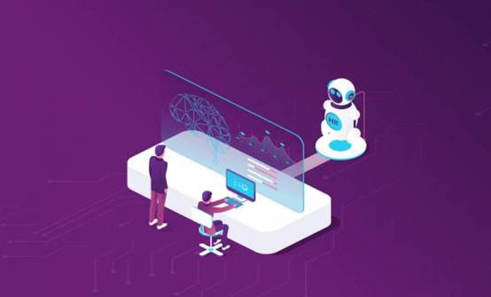
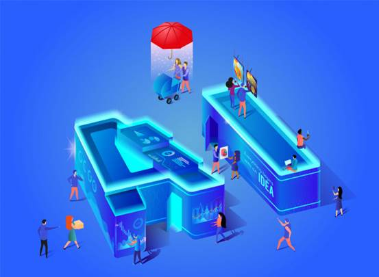

地址：https://readwrite.com/2019/12/09/a-web-developers-new-best-friend-is-the-ai-waiting-to-be-utilized/

作者：[Dave Jarvis](https://readwrite.com/author/dave-jarvis/) 

译者：muzhoubai

# Web开发人员的最佳朋友——AI

> 随着人工智能，机器学习，虚拟现实等颠覆性技术的出现，事情似乎已经超出了开发人员的讨论范围。跳到您和我听到他们的主流–他们可以使我们麻木。这是网络开发人员的新近最好的朋友，那就是等待使用的AI。

 

## 一、忽略AI的进步是一个挑战。

AI不再是Web开发领域中的流行语，因此我们所能做的就是屈服于技术。尽管与AI合作有其优势，但它易于访问，使程序自动化，创建可以激发并保持专注的空间。不可否认的是，似乎即将发生深刻的变化，但问题是AI对Web开发领域有什么影响。

仔细研究当前的Web开发空间。您会发现，这个领域已从简单的基于文本的网页发展到很大范围，包括各种吸引人的音频和视觉元素。

网站已经超越了信息媒介。以引人注目的设计为特色的动画和版式。目前正在朝着改善用户界面的方向进行罕见的深刻转变。人们期望界面更加吸引人，响应更快，并最终变得更人性化。

例如，LinkedIn是全球范围最广泛的专业网络网站，现已对其网站进行了改版，以为其用户提供更好的浏览体验。另一方面，人工智能似乎并不仅限于这些科幻幻想。 

预计在未来几年中，人工智能的市场规模将达到1530亿美元。

随着科幻电影中巨大的太空战争小说，我们对人工智能的期望也得到了发展。即使我们知道这些电影并不现实，但情况会发生变化，并且AI将在不久的将来被视为主流计算的核心路径。

 

## 二、人工智能的能力是什么？

AI提供了一些独特的增值

AI具有多种功能，包括通过回复预测和语音优化来提供复杂的客户体验。

 

## 2.1 优化语音搜索

随着Internet浏览变得更加用户有效，人们渴望更快，最高效地收集信息。语音搜索势必会发展，因为您不能忽略该功能获得发展的时间，尤其是在年轻人中。

电子商务行业是语音激活搜索的最好，最杰出的例子之一。可以看到虚拟购物助手根据用户查询展示过滤器搜索结果，从而使在线购物体验更加轻松。

人工智能在个人层面上为消费者提供了帮助，优化的语音搜索将很快成为虚拟购物设置中的必要条件。

 

## 2.2 自动化

人工智能技术通过执行单调的设计任务成功地减少了Web开发人员所花费的时间。它不仅限于这些，而且似乎已经在从网页设计到网站开发的过程中崭露头角。

产品建议，搜索引擎结果，图像设计和内容开发均受AI影响。由于这些原因，开发人员被认为更加专注于提供站点个性化的其他元素（关键元素）。

像Facebook和Google这样的全球行业领导者已经推出了AI工具包，这使得在Web应用程序中采用AI成为一项轻松的任务。

 

## 2.3 增强的用户交互。

在访问网站时遇到那些为您服务的弹出式AI聊天机器人吗？有时他们很有帮助。例如，患者通常更喜欢使用聊天机器人进行查询，而不是在医院接待处排长队。这些基于AI的聊天机器人可为访客提供答案。

聊天机器人还可以使用机器学习算法，以根据用户列出的症状进行快速诊断。通过消除所有通信障碍，AI使浏览体验更加舒适和用户友好。

人工智能使浏览体验更加舒适和用户友好。

 

## 2.4 网站开发中的AI

### 1. 自学算法使编码更容易。

人工智能用于简化工作，尤其是Web编程。对于Web开发人员而言，编码是最大的挑战之一，它要求他或她的骑士以人工智能的形式使Armor脱颖而出。

 

可以使用基本功能。其中包括添加，编辑或更新数据库记录，提供有关那些代码部分以解决问题的见解。基于这些想法，Web开发人员可以完美地编写程序，以解决自己的错误行为。

 

可以实施AI来创建从头到完整功能代码的代码（具有自我修改功能），而无需任何人工干预。借助AI的魔力，可以更快地创建应用和机器人，而又不会牺牲性能。

 

### 2. 卓越的用户体验。

用户体验是人工智能开始进入主流的地方。满足最终客户的需求对于任何企业都至关重要。没有什么比介绍聊天机器人更好地服务客户了。客户互动得到妥善处理。

 

除此之外，系统还可以自动执行日常任务。通过AI，通过响应用户对博客或文章的查询和评论来增强用户参与度变得更加容易。

 

### 3. 营销。

AI应用机器学习来做出与您的业务相关的营销预测。作为AI机器学习的结果，您将了解：

- 您的最终客户下一步打算购买什么？

- 有客户不满意的产品吗？

- 客户用来访问网站的一组设备和媒介

- 客户决定购买产品的理想时间

这些好处将缓慢而稳定地改变业务。 Web开发公司已开始充分利用人工智能。熟悉世界上最受欢迎的技术创新之一。——制作人工智能（AI）

