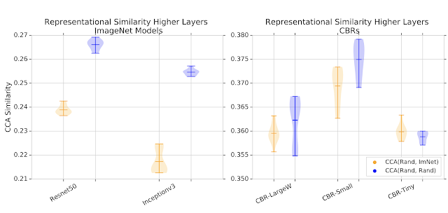
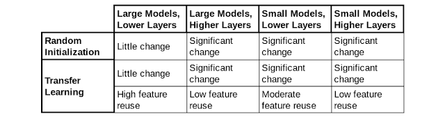
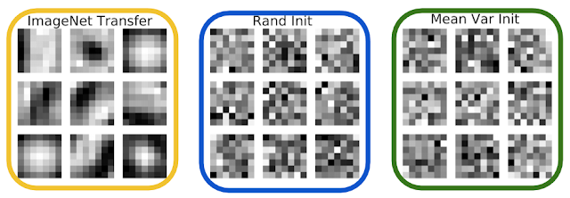
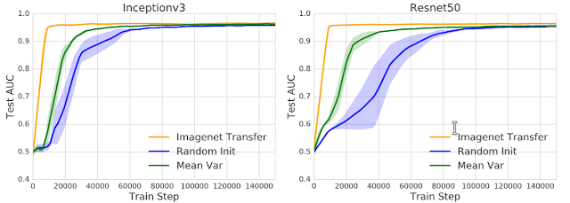
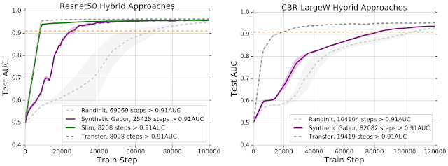
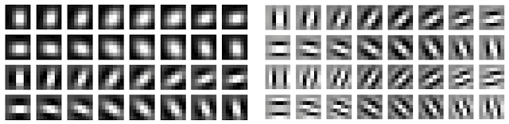

http://ai.googleblog.com/2019/12/understanding-transfer-learning-for.html

# 了解医学影像中的转移学习

随着深度神经网络被应用于越来越多的领域，[转移学习](https://en.wikipedia.org/wiki/Transfer_learning)已经成为开发深度学习模型的一种非常流行的技术。在转移学习中，神经网络的训练分为两个阶段：1）*预*训练，通常在代表大量标签/类别（例如[ImageNet](http://www.image-net.org/)）的大规模基准数据集上训练神经网络；2）*微调*，对预训练的网络进行感兴趣的特定目标任务训练，该目标任务可能比预训练数据集具有更少的标记示例。预训练步骤可帮助网络学习到在目标任务上重用的常规功能。

这种两阶段范例已在许多场合中变得非常流行，尤其是在*医学成像中*。在迁移学习的背景下，针对ImageNet设计的具有相应预训练权重的标准体系结构在医疗任务上进行了微调，从[解释胸部X射线](https://ai.googleblog.com/2019/12/developing-deep-learning-models-for.html)和[识别眼部疾病](https://jamanetwork.com/journals/jamapediatrics/fullarticle/2588763)到[早期发现阿尔茨海默氏病](https://pubs.rsna.org/doi/abs/10.1148/radiol.2018180958)。尽管已广泛使用，但是对迁移学习的确切效果还没有很好的了解。尽管最近的工作挑战了许多常见的假设，包括[对性能改进的影响](http://openaccess.thecvf.com/content_ICCV_2019/papers/He_Rethinking_ImageNet_Pre-Training_ICCV_2019_paper.pdf)，[底层体系结构的贡献](https://arxiv.org/abs/1805.08974)以及[预训练数据集类型和大小的影响](https://arxiv.org/abs/1811.07056)，但这些结果都是在自然图像环境中进行的，因此许多问题需要专门领域解决，例如医学图像。

在我们的[NeurIPS 2019](https://nips.cc/Conferences/2019)论文中，“ [输血:了解医学影像的转移学习](https://arxiv.org/abs/1902.07208)”，我们将研究这些核心问题，以便在医学成像任务中进行转移学习。通过详细的性能评估和对神经网络隐藏表示的分析，我们发现了许多令人惊讶的结论，例如，转移学习对于经过测试的医学成像任务的性能影响有限，对表征如何在不同模型和隐藏层之间的训练过程中演化的方式进行详细描述，以及讨论具有转移学习对于收敛速度的独立好处。

**绩效评估**
我们首先针对转移学习对模型性能的影响进行了深入研究。我们将通过随机初始化训练并直接应用于任务的模型与在ImageNet上预先训练后进行转移学习最终用于相同任务的模型进行了比较。我们研究了两项大型医学成像任务- 从[眼底照片](https://en.wikipedia.org/wiki/Fundus_photography)诊断[糖尿病性视网膜病变](https://www.mayoclinic.org/diseases-conditions/diabetic-retinopathy/symptoms-causes/syc-20371611)，并[从胸部X线](https://arxiv.org/abs/1901.07031)[照片](https://en.wikipedia.org/wiki/Fundus_photography)确定[五种不同的疾病](https://arxiv.org/abs/1901.07031)。我们评估了各种神经网络体系结构，包括流行用于医学成像的标准体系结构（[ResNet50](https://arxiv.org/abs/1512.03385)，[Inception-v3](https://arxiv.org/abs/1512.00567)）以及一系列简单，轻量级的[卷积神经网络](https://en.wikipedia.org/wiki/Convolutional_neural_network)该组成的标准的四或五个层*convolution- [batchnorm](https://arxiv.org/abs/1502.03167) - [RELU](https://en.wikipedia.org/wiki/Rectifier_(neural_networks))*进展，或者CBRS。

在有或没有转移学习的情况下，针对不同任务评估所有这些模型的结果为我们带来了四个主要收获：

- 出人意料的是，迁移学习不会显著影响医学成像任务的性能，从头开始训练的模型几乎与标准ImageNet迁移模型一样好。
- 在医学成像任务上，小得多的CBR模型的性能可与标准ImageNet体系结构相比。
- 由于CBR模型比标准ImageNet模型要小得多和浅得多，因此它们在ImageNet分类上的表现要差得多，这突出说明了ImageNet的性能*并不*表示医疗任务的性能。
- 这两个医疗任务的大小比ImageNet小得多（〜200k对比〜1.2m训练图像），但是在非常小的数据范围内，可能只有数千个训练示例。我们在这种非常小的数据体制下评估了转移学习，发现对于大型模型（ResNet），从头开始的训练和迁移学习之间在性能上存在较大差距，而对于较小的模型（CBR）则并非如此，这表明大型模型的设计对于ImageNet而言，对于非常小的数据体制而言，它可能过于夸张。

**表征分析**
我们接下来研究迁移学习在多大程度上影响神经网络学习的特征和表征的种类。给定相似的性能，迁移学习是否会导致随机初始化产生不同的表征形式？预训练步骤中的知识是否可以重用？如果可以，在哪里？为了找到这些问题的答案，本研究分析并比较了经过训练以解决这些任务的不同神经网络中的*隐藏表征*（即，在网络的隐藏层中学习的表征）。由于不同隐藏层的复杂性和缺乏对齐方式，因此这种定量分析可能具有挑战性。但是[最近](https://ai.googleblog.com/2017/11/interpreting-deep-neural-networks-with.html) [一种方法](https://ai.googleblog.com/2018/06/how-can-neural-network-similarity-help.html)，[奇异向量正则相关分析](https://ai.googleblog.com/2018/06/how-can-neural-network-similarity-help.html)（SVCCA；[代码和教程](https://github.com/google/svcca)）基于[规范的相关性分析](https://en.wikipedia.org/wiki/Canonical_correlation)（CCA），有助于克服这些挑战，并且可用于计算一对隐藏表示之间的*相似性得分*。

从随机初始化训练的网络与从预训练的ImageNet权重训练的网络之间，从网络的顶层隐藏层（更靠近输出层部分）计算一些隐藏表示的相似性分数。作为基准，我们还计算从不同随机初始化中获悉的表征形式的相似性得分。对于大型模型，从随机初始化中学到的表征比从转移学习中学到的表征更加相似。对于较小的模型，表征相似性评分之间存在更大的重叠。

| |
| ------------------------------------------------------------ |
| 从随机初始化训练的网络和从预训练ImageNet权重训练的网络（橙色）之间的表征相似性得分，以及从两个不同的随机初始化训练的表示形式的基线相似性得分（蓝色）。值越高表征相似性越高。对于较大的模型，从随机初始化中学习到的表征比通过迁移学习到的表征更加相似。对于较小的模型则不是这种情况。 |

随着对隐藏表征的进一步研究，大型模型和小型模型之间存在这种差异的原因变得很清楚。大型模型通过训练（*即使*是随机初始化）的变化很小。我们执行了多个实验来说明这一点，从简单的过滤器可视化到通过微调跟踪不同层之间的变化。

当我们结合论文中所有实验的结果时，我们可以汇总一个表格，总结通过跨（i）转移学习，（ii）模型大小和（iii）较低/较高层的医学任务训练而改变了多少表征形式。

**对收敛的影响：功能独立的好处和混合方法**
迁移学习的一个持续影响是模型收敛所需的时间显着加快。但是，在我们具有代表性的研究中看到了特征重用的混合结果之后，我们研究了预训练权重是否还具有其他属性，可能会导致这种加速。令人惊讶的是，我们发现了预训练的*功能独立*优势- *权重缩放*。

就像随机初始化一样，我们将神经网络的权重初始化为独立且均匀分布的（iid）[译者：独立同分布]，但使用预训练权重的均值和方差。我们称此初始化为*Mean Var Init*，它可以保持预训练的权重缩放，但会破坏所有功能。相对于模型架构和任务之间的随机初始化，Mean Var Init提供了显着的加速，表明转移学习的预训练过程也有助于良好的权重调节。

|  |
| ------------------------------------------------------------ |
| 根据预训练的ImageNet权重，随机初始化和均值初始化初始化的权重的过滤器可视化。只有ImageNet Init过滤器具有预训练的（[Gabor式](https://en.wikipedia.org/wiki/Gabor_filter)）结构，因为Rand Init和Mean Var权重是iid。 |

回想一下，我们先前的实验表明，特征重用主要发生在最低层。为了理解这一点，我们进行了*权重注入*实验，在该实验中，仅迁移学习了一部分预训练的权重（对应于一组连续的层），其余权重则被随机初始化。将这些注入网络的收敛速度与完全转移学习进行比较，进一步支持了以下结论：功能重用主要发生在最低层。

|  |
| ------------------------------------------------------------ |
| 学习曲线，将收敛速度与测试集上的[AUC](https://en.wikipedia.org/wiki/Receiver_operating_characteristic#Area_under_the_curve)进行比较。仅使用预训练权重的缩放比例（均值初始值）有助于收敛速度。这些图将标准迁移学习，Mean Var初始化方案和随机初始化的训练进行了比较。 |

这表明了*混合*学习的转移学习方法，而不是重新使用完整的神经网络体系结构，我们可以回收其最低层并重新设计较高层，以更好地适应目标任务。这为我们提供了转移学习的大部分好处，同时进一步实现了灵活的模型设计。在下图中，我们显示了在Resnet50中重用Block2的预训练权重，将其余的通道减半并随机初始化这些层，然后进行端到端训练的效果。这与完全迁移学习的性能和收敛效果相匹配。

|                           |
| ------------------------------------------------------------ |
| 在Resnet50（左）和CBR模型（右）上迁移学习的混合方法-重用部分权重并瘦化网络的其余部分（Slim），并对conv1使用数学合成的Gabor（合成Gabor）。 |

上图还显示了此部分重用的极端版本的结果，仅使用*数学合成的[Gabor滤波器](https://en.wikipedia.org/wiki/Gabor_filter)*迁移学习了第一卷积层（如下图所示）。仅使用这些（合成的）权重就可以显着提高速度，并暗示了许多其他创造性的混合方法。

|                        |
| ------------------------------------------------------------ |
| 如果在本文的某些实验中使用神经网络，则合成Gabor滤波器用于初始化第一层。Gabor滤镜生成为灰度图像，并在RGB通道中重复。**左：**低频。**右图：**高频。 |

**结论和未解决的问题**
转移学习是许多领域的核心技术。在本文中，我们提供了有关其在医学成像环境中的一些基本属性的见解，研究了性能，特征重用，不同体系结构的影响，融合和混合方法。仍然存在许多有趣的未解决问题：模型忘记了多少原始任务？为什么大型模型的变化较少？我们能否获得与预训练权重统计的高阶矩匹配的进一步收益？结果是否与其他任务（例如分割）相似？我们期待着在未来的工作中解决这些问题！