原文：https://www.topbots.com/top-ai-vision-research-papers-2019/

作者：[Mariya Yao](https://www.topbots.com/author/mariya/)

翻译：[Quan Chen](https://github.com/chenquan)

# 从2019年起10篇关于计算机视觉的前沿研究论文

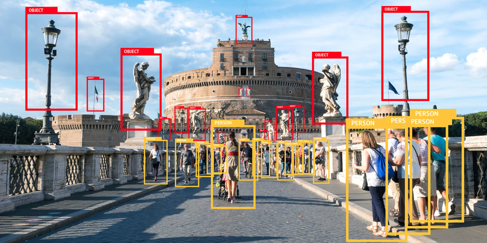

今天，我们可以看到计算机视觉（CV）系统如何通过在医疗保健，安全，运输，零售，银行，农业等领域的成功应用，彻底改变整个行业和业务功能。

在2019年，我们看到了许多新颖的架构和方法，进一步提高了视觉系统的感知和生成能力。为了帮助您浏览今年提交的大量出色的计算机视觉论文，我们精选并总结了2019年的十大CV研究论文，这些论文将帮助您了解该研究领域的最新趋势。

我们选择的论文涵盖了卷积网络的优化，计算机视觉中的无监督学习，图像生成和机器生成图像的评估，视觉语言导航，使用自然语言为两个图像之间的字幕加字幕等。

## 2019年10篇重要的计算机视觉研究论文

 

### 1.[EFFICIENTNET：对卷积神经网络的模型缩放的重新思考](https://arxiv.org/abs/1905.11946v1)， BY MINGXING TAN AND QUOC V. LE

 

#### **原始摘要**

卷积神经网络（ConvNets）通常是在固定资源预算下开发的，然后如果有更多资源可用，则会进行扩展以提高准确性。在本文中，我们系统地研究了模型缩放，并确定仔细平衡网络的深度，宽度和分辨率可以带来更好的性能。基于此观察结果，我们提出了一种新的缩放方法，该方法使用简单而高效的复合系数来均匀缩放深度/宽度/分辨率的所有维度。我们证明了此方法在扩大MobileNets和ResNet方面的有效性。

更进一步，我们使用神经体系结构搜索来设计一个新的基准网络，并对其进行扩展以获得称为EfficientNets的模型系列，该模型系列比以前的ConvNets具有更高的准确性和效率。特别是，我们的EfficientNet-B7在ImageNet上达到了最先进的84.4％top-1 / 97.1％top-5精度，同时比现有的最佳ConvNet缩小了8.4倍，推理速度提高了6.1倍。我们的EfficientNets还可以很好地传输并在CIFAR-100（91.7％），Flowers（98.8％）和其他3个传输学习数据集上达到最先进的精度，而参数要少几个数量级。源代码位于[此URL上](https://github.com/tensorflow/tpu/tree/master/models/official/efficientnet)。

 

#### **我们的总结**

Google Research Brain Team的研究人员介绍了一种更好的扩大卷积神经网络（CNN）的方法。按照惯例，随着可用资源的增多，首先要开发CNN，然后再根据输入图像的深度，宽度或分辨率进行放大。作者表明，如果仅将这些参数之一放大，或者将所有参数任意放大，相对于所需的额外计算能力，这都会导致收益迅速减少。相反，他们证明了存在最佳的深度，宽度和分辨率比率，以使效率和准确性最大化。这称为**复合缩放**。

结果是，EfficientNet的性能比ImageNet上其他CNN的准确性高出6％，而速度和大小方面的效率则高出十倍。

 

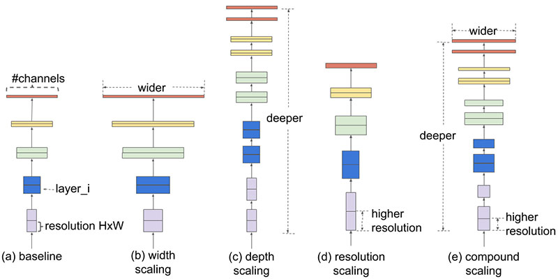

 

#### 本文的核心思想是什么？

- CNN的深度（层数），宽度和输入分辨率应相对于彼此以特定比例放大，而不是任意放大。
- 此外，由于模型缩放的有效性在很大程度上取决于基线网络，因此研究人员利用神经体系结构搜索来开发新的基线模型，并将其按比例缩放以获得一个称为**EfficientNets**的模型系列。
- 您可以根据可用资源选择EfficientNets中的其中一种。

 

#### 关键成就是什么？

- EfficientNets在8个数据集中有5个获得了最新的精度，平均参数减少了9.6倍。
- 特别是，具有66M参数的EfficientNet在ImageNet上可达到84.4％的top-1精度和97-1％的top-5精度，比GPipe（557M参数）小8倍，快6倍，这是以前的最新技术可扩展的CNN。

 

 

#### AI社区怎么看？

- 该论文在机器学习领域的领先会议ICML 2019上进行了口头介绍。

 

#### 未来的研究领域是什么？

- 作者在[Google AI博客上](https://ai.googleblog.com/2019/05/efficientnet-improving-accuracy-and.html)表示，他们希望EfficientNets“充当未来计算机视觉任务的新基础”。

 

#### 有哪些可能的业务应用程序？

- 这项研究的结果对于商业环境中的计算机视觉应用非常重要，因为建议的方法可以更快，更便宜地从CNN获得更准确的结果。

 

#### 在哪里可以获得实现代码？

- 作者已在[此处](https://github.com/tensorflow/tpu/tree/master/models/official/efficientnet)发布了其TensorFlow EfficientNet实现的源代码。
- 还有可用PyTorch实现[这里](https://github.com/lukemelas/EfficientNet-PyTorch)。

 

### 2. [通过观看冷冻的人来学习运动的人群](https://arxiv.org/abs/1904.11111),BY ZHENGQI LI, TALI DEKEL, FORRESTER COLE, RICHARD TUCKER, NOAH SNAVELY, CE LIU, WILLIAM T. FREEMAN

 

#### 原始摘要

我们提出了一种在单眼相机和场景中的人们都在自由移动的情况下预测密集深度的方法。现有的从单眼视频中恢复动态，非刚性对象的深度的方法对对象的运动有很强的假设，并且可能仅恢复稀疏的深度。在本文中，我们采用一种数据驱动的方法，并从一种新的数据源中学习人的先验先验：成千上万的模仿人体模型的互联网视频，即以各种自然姿势冻结，而手持摄像机则在现场浏览。因为人们是固定的，所以可以使用多视图立体声重建来生成训练数据。在推理时，我们的方法使用场景静态区域中的运动视差提示来指导深度预测。我们演示了在移动手持摄像机捕获的复杂人类动作的现实世界序列中的方法，显示了对最新单眼深度预测方法的改进，并显示了使用我们预测的深度产生的各种3D效果。

 

#### 我们的总结

即使在一只眼睛闭上的情况下，人类也能熟练地解释自然场景中移动物体的几何形状和深度，但是当涉及运动时，计算机很难重建深度。当前，深度重建依赖于使静止的物体具有在其周围移动的相机或多相机阵列来捕获运动的物体。Google研究小组提出了一种新的单摄像头方法，用于在对象和摄像头同时运动的情况下生成整个自然场景的深度图。引入的深度神经网络在YouTube视频的新颖数据库中进行了训练，人们可以在其中模仿静态人体模型，从而可以对自然人体姿势进行传统的立体映射。实验证明了该方法在预测许多真实视频序列中的深度方面的有效性。

 

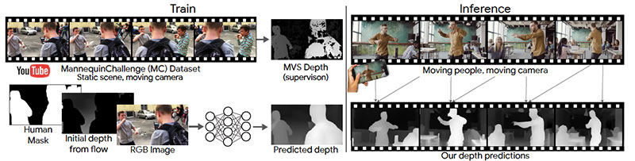

 

#### 本文的核心思想是什么？

- 这项研究解决了在自然场景中以人为对象绘制深度的挑战，其中对象和单个相机同时移动。
- 作者使用YouTube模仿人体模型的视频数据库（“ **人体模型挑战数据集”**）训练了一个深度神经网络，可以使用现有的立体声技术从中映射深度。
- 建议的网络将RGB图像，人类区域的蒙版和初始环境深度作为输入，然后在包括环境和人类在内的整个图像上输出密集的深度图。
- 假设人类在移动而场景的其余部分是静止的，则通过视频中两个帧之间的运动视差来估计初始深度。

 

#### **关键成就是什么？**

- 提出一种模型，该模型与现有方法相比，能够为人类及其周围环境以明显更高的精度重新创建运动场景的深度图。
- 引入了Mannequin Challenge数据集，这是2,000个YouTube视频的集合，当摄像机绕着场景转圈时，人们在其中姿势不动。

 

#### **AI社区怎么看？**

- 该论文在计算机视觉和模式识别的领先会议CVPR 2019上获得了最佳论文奖（荣誉奖）。

 

#### **未来的研究领域是什么？**

- 扩展模型以适用于移动非人类物体，例如汽车和阴影。
- 一次将两个以上的视图合并到模型中，以消除暂时的不一致。

 

#### **有哪些可能的业务应用程序？**

- 产生精确的3D视频效果，包括合成景深，可感知深度的修补以及将虚拟对象插入3D场景。
- 使用多个框架扩展视野，同时保持准确的场景深度。

 

#### **在哪里可以获得实现代码？**

- 实施代码和训练有素的模型在[GitHub](https://github.com/google/mannequinchallenge)上[可用](https://github.com/google/mannequinchallenge)。

 

### 3. [视觉导航的增强型跨模态匹配和自学习模拟学习](https://arxiv.org/abs/1811.10092)，BY XIN WANG, QIUYUAN HUANG, ASLI CELIKYILMAZ, JIANFENG GAO, DINGHAN SHEN, YUAN-FANG WANG, WILLIAM YANG WANG, LEI ZHANG

 

#### 原始摘要

视觉语言导航（VLN）是在实际的3D环境中导航具体的agent以执行自然语言指令的任务。在本文中，我们研究如何解决此任务的三个关键挑战：交叉模式接地，不适定的反馈和泛化问题。首先，我们提出了一种新颖的强化跨模态匹配（RCM）方法，该方法通过强化学习（RL）在本地和全局范围内实施跨模态接地。特别地，匹配评论者用于提供内在奖励，以鼓励指令和轨迹之间的全局匹配，并且推理导航器用于在局部视觉场景中执行跨模式接地。对VLN基准数据集的评估表明，我们的RCM模型在SPL上明显优于以前的方法10％，并达到了最新的最新性能。为了提高学习策略的通用性，我们进一步引入了一种自我监督的模仿学习（SIL）方法，通过模仿自己过去的正确决策来探索看不见的环境。我们证明，SIL可以近似为一种更好，更有效的策略，从而最大程度地减少了可见环境和不可见环境之间的成功率性能差距（从30.7％到11.7％）。

 

#### 我们的总结

视觉语言导航要求机器使用口头指令和视觉感知来导航真实的3D环境。对于人工智能而言，这是一项具有挑战性的任务，因为它需要将语言线索与给定的物理环境相匹配，并且需要解析与该环境有关的语义指令。在本文中，研究人员提出了一种新的**强化跨模态匹配（RCM）**方法，该方法通过强化学习（RL）在本地和全球范围内实施跨模态接地。建议的框架鼓励代理人专注于正确的子指令，并遵循与指令匹配的轨迹。此外，研究人员还介绍了**自我监督的模仿学习（SIL）**探索以前未见过的环境的一种方法，代理可以学习模仿自己的良好体验。RCM方法优于之前的“房间到房间（R2R）”数据集上最新的视觉语言导航方法，将SPL得分从28％提高到35％。

 

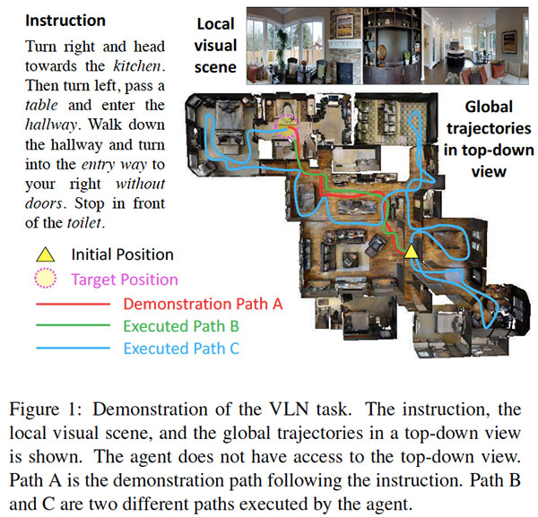

 

#### 本文的核心思想是什么？

- 视觉语言导航需要一台机器来解析语言指令，将这些指令与视觉环境匹配，然后根据语言指令中的子短语来导航该环境。

- 为了解决这一艰巨的任务，研究人员介绍了一种新颖的跨模态匹配方法，该方法利用外部奖励和内在奖励来进行强化学习：

  - 它包括一个**推理导航器**，该**导航器**从自然语言指令和本地视觉场景中学习，以推断出要重点关注的短语以及查找的位置。
- 该代理配备有一个**匹配的注释程序**，该注释程序根据从中重构原始指令的可能性来评估执行路径。
  - 另外，细粒度的**内在奖励**信号会鼓励代理更好地理解文本输入，并对选择不符合指令的轨迹进行惩罚。

- 本文还介绍了一种**自我监督的模仿学习（SIL）**方法，用于探索以前看不见的环境：

  - 导航器执行多个滚动，然后由匹配的注释器确定良好的轨迹，随后将其用于导航器模仿。

 

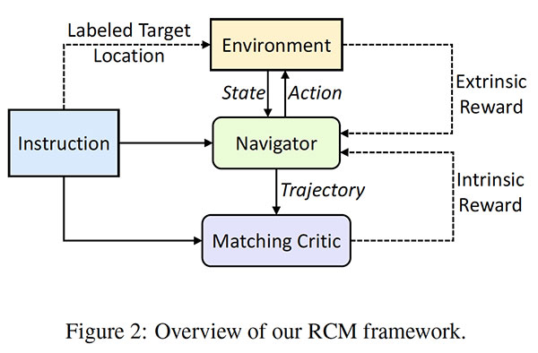

 

#### **关键成就是什么？**

- RCM框架在以下方面优于R2R数据集上的最新视觉语言导航方法：
  - 将SPL分数从28％提高到35％；
  - 成功率提高了8.1％。
- 此外，使用SIL模仿RCM代理先前在训练集上的最佳体验，会导致平均路径长度从15.22m下降到11.97m，而SPL度量的平均结果更好（38％）。

 

#### **AI社区怎么看？**

- 该论文获得了三项“强烈接受”同行评议，并在计算机视觉和模式识别的领先会议СVPR2019上接受了口头报告。

 

#### **未来的研究领域是什么？**

- 使用SIL方法探索其他看不见的环境。

 

#### **有哪些可能的业务应用程序？**

- 引入的框架可以在许多实际应用中使用，包括：
  - 按照指示在家庭或办公室中移动的家用机器人；
  - 私人助理接受口头指示并在复杂的环境中导航以执行某些任务。

 

### 4. [视线形状重构的费马路径理论](http://imaging.cs.cmu.edu/fermat_paths/assets/cvpr2019.pdf)BY SHIJIE XIN, SOTIRIS NOUSIAS, KIRIAKOS N. KUTULAKOS, ASWIN C. SANKARANARAYANAN, SRINIVASA G. NARASIMHAN, IOANNIS GKIOULEKAS

 

#### 原始摘要

我们提出了一个新的费马光路理论，该光路在一个已知的可见场景和一个未知物体之间，不在瞬态相机的视线范围内。这些光路要么服从镜面反射，要么被对象的边界反射，从而对隐藏对象的形状进行编码。我们证明了费马路径对应于瞬态测量中的不连续性。然后，我们得出一个新颖的约束条件，该约束条件将这些不连续处的路径长度的空间导数与表面法线相关联。基于此理论，我们提出了一种称为费马流的算法，用于估计非视线对象的形状。我们的方法首次实现了对复杂对象（从漫反射到镜面反射）的精确形状恢复，这些对象隐藏在拐角处以及隐藏在扩散器后面。最后，我们的方法与用于瞬态成像的特定技术无关。因此，我们展示了使用SPAD和超快激光从皮秒级瞬态中恢复毫米级形状的能力，以及使用干涉仪从飞秒级瞬态中恢复了微米级的形状。我们相信我们的工作是非视线成像技术的最重要的进步。

 

#### 我们的总结

在许多安全保护应用中，从摄像机视图中隐藏的场景引起了极大的兴趣。当前，可以通过测量从其散射的光子的强度来估计隐藏的非视线（NLOS）对象的形状。但是，此方法依赖于容易估计光子强度的单光子雪崩光电探测器，并且需要假设NLOS对象的反射是朗伯型的。研究人员提出了一种新的NLOS光子理论，该理论遵循LOS和NLOS场景之间的特定几何路径（称为**费马路径**）。所得到的方法可以在不依赖于物体反射率的情况下，重建位于某个角或在漫反射器后面的隐藏物体的表面。

 

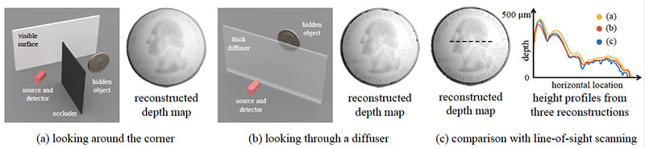

*非视距成像*

 

#### 本文的核心思想是什么？

- 现有的对隐藏物体进行轮廓分析的方法取决于测量反射光子的强度，这需要假设朗伯反射和可靠的光电探测器。

- 研究小组建议通过

  依靠费马原理施加的几何约束来

  重构非视线形状：

  - 费马路径对应于瞬态测量中的不连续性。
  - 具体而言，可以将瞬态测量中的不连续性识别为有助于瞬态的费马路径的长度。
  - 给定费马路径长度的集合，该过程将为NLOS表面生成一个定向的点云。

 

#### 关键成就是什么？

- 源自引入的理论的**Fermat Flow**算法可以成功地重构隐藏物体的表面，而与所使用的特定瞬态成像技术无关。
- 费马路径理论适用于以下情况：
  - 反射型非视距（环角）；
  - 透射型NLOS（透过扩散器观察）。

 

#### AI社区怎么看？

- 该论文在计算机视觉和模式识别的领先会议CVPR 2019上获得了最佳论文奖。

 

#### 未来的研究领域是什么？

- 探索此处描述的几何方法与新介绍的用于对隐藏对象进行概要分析的反投影方法之间的联系。
- 将几何和反投影方法结合起来用于其他相关应用，包括声学和超声成像，无透镜成像和地震成像。

 

#### 有哪些可能的业务应用程序？

- 摄像机或传感器可以“看到”超出其视野的增强的安全性。
- 自动驾驶汽车可能会“看见”拐角处。

 

### 5. [REASONING-RCNN：将自适应全球推理统一到大型对象检测中](http://openaccess.thecvf.com/content_CVPR_2019/html/Xu_Reasoning-RCNN_Unifying_Adaptive_Global_Reasoning_Into_Large-Scale_Object_Detection_CVPR_2019_paper.html),BY HANG XU, CHENHAN JIANG, XIAODAN LIANG, LIANG LIN, ZHENGUO LI

 

#### 原始摘要

在本文中，我们解决了具有数千个类别的大规模对象检测问题，由于长尾数据分布，严重的遮挡和类别模糊性，这带来了严峻的挑战。然而，主要对象检测范式是通过在不考虑对象之间关键的语义依赖性的情况下分别处理每个对象区域而受到限制的。在这项工作中，我们引入了一种新颖的Reasoning-RCNN，通过利用各种人类常识知识，赋予所有检测网络在所有对象区域上自适应全局推理的能力。我们不只是直接在图像上传播视觉特征，而是在全球范围内发展所有类别的高级语义表示，以避免图像中分散注意力或不良的视觉特征。具体来说，以基本检测网络的特征表示为基础，提出的网络首先通过收集每个类别的先前分类层的权重来生成全局语义池，然后通过参加全局语义池中的不同语义上下文来自适应地增强每个对象的特征。我们的自适应全局推理不是从可能嘈杂的所有语义信息中传播信息，而是自动发现特征演变的大多数相对类别。我们的Reasoning-RCNN轻巧灵活，足以增强任何检测主干网络，并且可扩展以集成任何知识资源。在对象检测基准上进行的可靠实验显示了我们的Reasoning-RCNN的优势，例如，在VisualGenome上实现了约16％的改进，在mAP方面实现了ADE的37％的改进，在COCO方面实现了15％的改进。

 

#### 我们的总结

由于图像内的对象类别数量众多，遮挡严重，对象类别之间的歧义性以及图像内的小型对象，图像检测算法难以在复杂场景中进行大规模检测。为了解决这个问题，研究人员引入了一个简单的全局推理框架，**Reasoning-RCNN**，该框架显式地包含了多种常识知识，并且还从所有类别中全局传播了视觉信息。实验表明，该方法在VisualGenome，ADE和COCO基准上明显优于当前的最新对象检测方法。

 

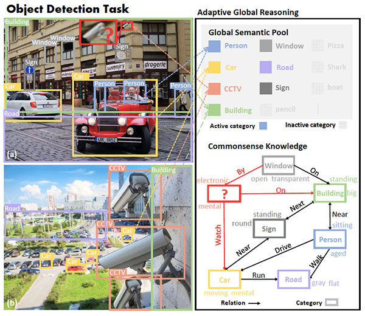

*所提出的自适应全局推理如何促进大规模目标检测的一个示例*

 

#### 本文的核心思想是什么？

- 大规模物体检测面临许多重大挑战，包括高度不平衡的物体类别，沉重的遮挡，类歧义，微小物体等。
- 为了克服这些挑战，研究人员引入了一种新颖的**Reasoning-RCNN**网络，该网络可以对具有某些关系或相似属性的类别进行自适应全局推理：
  - 首先，该模型通过收集先前分类层的权重，在大规模图像中的所有类别上生成**全局语义池**。
  - 其次，按**类别划分的知识图**被设计为对语言知识（例如属性，共现，关系）进行编码。
  - 第三，通过**注意力机制**对当前图像进行编码，以自动发现每个对象最相关的类别。
  - 第四，增强的类别通过**软映射机制**映射回区域，从而可以细化前一阶段的不准确分类结果。
  - 第五，将每个区域的新增强**功能**与原始功能**连接在一起**，以端到端的方式增强分类和定位的性能。

 

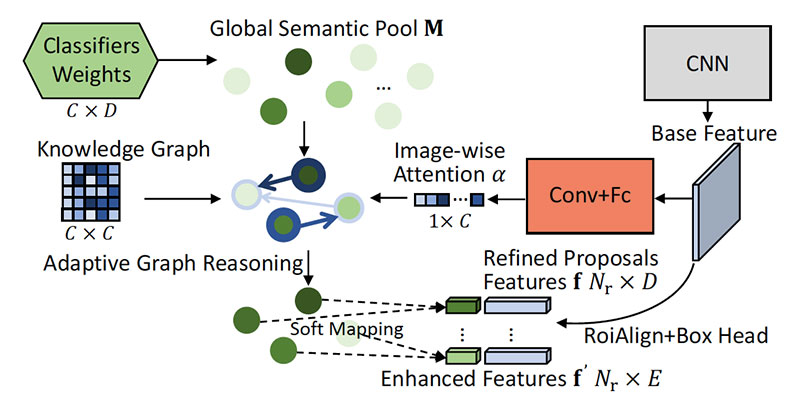

*自适应全局推理模块概述*

 

#### 关键成就是什么？

- Reasoning-RCNN优于当前的最新对象检测方法，包括Faster R-CNN，RetinaNet，RelationNet和DetNet。
- 特别是，该模型在平均平均精度（mAP）方面实现了以下改进：
  - 拥有1000个类别的VisualGenome提升15％；
  - 具有3000个类别的VisualGenome提升16％；
  - ADE提升37％；
  - MS-COCO提升15％；
  - Pascal VOC提升2％。

 

#### AI社区怎么看？

- 该论文在计算机视觉的关键会议CVPR 2019上接受了口头报告。

 

#### 未来的研究领域是什么？

- 将Reasoning-RCNN中使用的推理框架嵌入到其他任务中，包括实例级细分。

 

#### 有哪些可能的业务应用程序？

- 所提出的方法可以显着提高依赖于大规模对象检测（例如，城市街道上的威胁检测）的系统的性能。

 

#### 在哪里可以获得实现代码？

- [GitHub上](https://github.com/chanyn/Reasoning-RCNN)提供了Reasoning-RCNN的实现代码。

 

### 6. [修复培训测试的分辨率差异](https://arxiv.org/abs/1906.06423)， BY HUGO TOUVRON, ANDREA VEDALDI, MATTHIJS DOUZE, HERVÉ JÉGOU

 

#### 原始摘要

数据增强是训练神经网络进行图像分类的关键。本文首先显示，现有的增强会导致分类器在训练和测试时看到的对象的典型大小之间出现显着差异。我们通过实验验证，对于目标测试分辨率，使用较低的火车分辨率可以在测试时提供更好的分类。

然后，我们提出一种简单而有效的策略，以在训练分辨率和测试分辨率不同时优化分类器性能。它仅涉及测试分辨率下的网络计算廉价的微调。这使得可以使用小的训练图像来训练强大的分类器。例如，通过在128×128图像上训练的ResNet-50，在ImageNet上获得77.1％的top-1精度，在224×224图像上训练出的ResNet-50达到79.8％。另外，如果我们使用额外的训练数据，则使用具有224×224图像的ResNet-50火车可获得82.5％的效果。

相反，以224×224的分辨率对9.4亿张公共图像进行弱监督预训练的ResNeXt-101 32×48d并进一步优化测试分辨率320×320时，我们获得的测试top-1准确性为86.4％ （前5名：98.0％）（单作）。据我们所知，这是迄今为止ImageNet最高的单幅，top-1和top-5精度。

 

#### 我们的总结

Facebook AI研究团队将我们的注意力吸引到一个事实，即:即使在训练和测试数据分布匹配时实现了卷积神经网络的最佳性能，但对于训练和测试而言，数据预处理程序通常也会有所不同。这些差异导致训练和测试时对象大小之间的显着差异。为了解决此问题并保持现有预处理协议的优势，研究人员建议在训练和测试时共同优化图像的分辨率和比例。例如，他们证明，与训练时相比，在训练时使用较低分辨率的农作物可以提高分类器的性能，并显着减少加工时间。

 

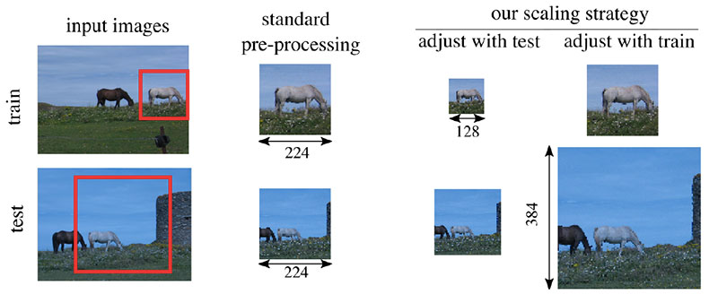

 

#### 本文的核心思想是什么？

- 图像预处理程序在训练和测试时的差异会对图像分类器的性能产生不利影响：

  - 为了增加**训练**数据，通常的做法是从图像（即，分类区域或RoC）中提取具有**随机**坐标的矩形。
  - 在**测试**时，从图像的**中央**部分提取RoC 。
  - 这导致分类器在训练和测试时看到的对象大小之间存在显着差异。

- 为了解决这个问题，研究人员建议在训练和测试时**共同优化**图像的分辨率和比例：

  - 分析表明：
  - 在测试时增加图像作物的大小，可以补偿训练时随机选择RoC；
    - 在训练中使用比测试时使用更低分辨率的农作物可以改善模型的性能。
- 因此，Facebook AI团队建议保持相同的RoC采样，并且仅微调网络的两个层以补偿作物大小的变化。

 

#### 关键成就是什么？

- 通过获取以下内容来提高ResNet-50模型在ImageNet上进行图像分类的性能：

  - 在128×128图像上训练时，top-1精度为77.1％;
  - 在224×224图像上训练时，top-1精度为79.8％;
  - 在带有额外训练数据的224×224图像上进行训练时，top-1的top-1精度为82.5％。

- 使ResNeXt-101 32×48d在9.4亿张公共图像上以224×224图像的分辨率进行预训练，从而在ImageNet上 进行图像分类 的[新技术](https://paperswithcode.com/paper/fixing-the-train-test-resolution-discrepancy)：

  - top-1准确性为86.4％；
  - 前5名的准确性为98.0％。

 

#### 有哪些可能的业务应用程序？

- 建议的方法可以提高用于大型数据库中自动图像组织，股票网站上的图像分类，可视产品搜索等的AI系统的性能。

 

#### 在哪里可以获得实现代码？

- 作者提供了引入的方法的官方[PyTorch实施](https://github.com/facebookresearch/FixRes)，用于解决训练测试分辨率差异。

 

### 7. [SINGAN：从单一自然图像中学习生成模型](https://arxiv.org/abs/1905.01164),BY TAMAR ROTT SHAHAM, TALI DEKEL, TOMER MICHAELI

 

#### 原始摘要

我们介绍SinGAN，这是一种无条件的生成模型，可以从单个自然图像中学习。我们的模型经过训练，可以捕获图像内斑块的内部分布，然后能够生成高质量，多样的样本，并承载与图像相同的视觉内容。SinGAN包含一个完全卷积的GAN金字塔，每个GAN负责学习图像不同比例的面片分布。这样就可以生成具有任意大小和纵横比的新样本，这些样本具有明显的可变性，同时又可以保持训练图像的整体结构和精细纹理。与以前的单图像GAN方案相比，我们的方法不仅限于纹理图像，而且不是有条件的（即，它从噪声中生成样本）。用户研究证实，生成的样本通常被混淆为真实图像。我们将说明SinGAN在各种图像处理任务中的实用性。

 

#### 我们的总结

来自Technion和Google Research的研究人员介绍了**SinGAN**，**SinGAN**是一种新模型，可在给定**单个自然图像**的情况下无条件生成高质量**图像**。他们的方法基于这样一个概念，即单个图像中补丁的内部统计信息通常足以学习强大的生成模型。因此，SinGAN包含一个完全卷积的轻量级GAN金字塔，其中每个GAN负责学习不同规模的补丁分布。引入的模型生成的图像在语义上与训练图像相似，但包含新的对象配置和结构。

 

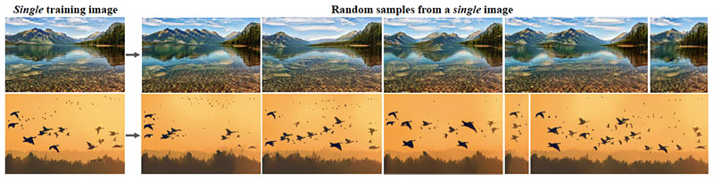

*从单个训练图像中学到的图像生成*

 

#### 本文的核心思想是什么？

- 为了从单个图像中学习无条件生成模型，研究人员建议使用单个图像的补丁作为训练样本，而不是像常规GAN设置中的整个图像样本。

- 该**SinGAN**生成框架：

  - 由补丁GAN的层次结构组成，每个GAN负责捕获补丁在不同规模上的分布（例如，某些GAN了解全局属性和大对象的形状，例如“顶部的天空”和“底部的地面”，以及其他GAN可以学习精细的细节和纹理信息）；
- 不仅可以生成纹理，还可以处理一般的自然图像；
  - 允许生成任意大小和纵横比的图像；
- 通过选择在测试时间开始生成的标度，可以控制生成样本的可变性。

 

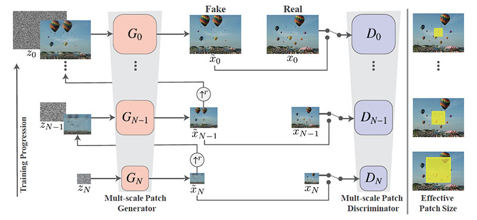

 

#### 关键成就是什么？

- 实验证明SinGAN：
  - 可以生成描述新的现实结构和对象配置的图像，同时保留训练图像的内容；
  - 成功保留全局图像属性和精细细节；
  - 可以现实地合成反射和阴影；
  - 生成难以与真实样本区分开的样本。

 

#### AI社区怎么看？

- 该论文获得了ICCV 2019最佳论文奖，这是计算机视觉领域的领先会议之一。

 

#### 有哪些可能的业务应用程序？

- SinGAN模型可以协助完成许多图像处理任务，包括图像编辑，超分辨率，协调，从绘画生成图像以及[从单个图像创建动画](https://youtu.be/xk8bWLZk4DU)。

 

#### 在哪里可以获得实现代码？

- [GitHub上](https://github.com/tamarott/SinGAN)提供了SinGAN的PyTorch官方实现。

 

### 8. [可视化嵌入无监督学习的局部聚合](https://arxiv.org/abs/1903.12355)，BY CHENGXU ZHUANG, ALEX LIN ZHAI, DANIEL YAMINS

#### 原始摘要

神经网络中的无监督学习方法对于促进人工智能具有重大意义，这既是因为它们无需大量昂贵的注释就能进行网络训练，又因为它们将是通用学习类型的更好模型由人类部署。但是，无监督的网络长期落后于其受监督的网络的性能，尤其是在大规模视觉识别领域。训练深度卷积嵌入以最大化非参数实例分离和聚类目标的最新进展显示出弥合这一差距的希望。在这里，我们描述了一种训练嵌入函数以最大化局部聚合度量的方法，该方法导致相似的数据实例在嵌入空间中一起移动，同时允许不同实例分开。该聚合指标是动态的，允许出现不同规模的软集群。我们在几个大型视觉识别数据集上评估了我们的程序，在ImageNet中的对象识别，Places 205中的场景识别以及PASCAL VOC中的对象检测方面实现了最新的无监督转移学习性能。

 

#### 我们的总结

斯坦福大学的研究团队通过无监督学习解决了对象检测和识别的问题。为了解决此问题，他们引入了**本地聚合（LA）**步骤，该步骤使不相似的输入在嵌入空间中分开，同时允许相似的输入收敛为群集。具体来说，研究人员建议从在低维空间中非线性输入嵌入开始，然后迭代地确定在嵌入空间中的近邻。实验证明了所提出的方法对下游任务的鲁棒性，包括对象识别，场景识别和对象检测。

 

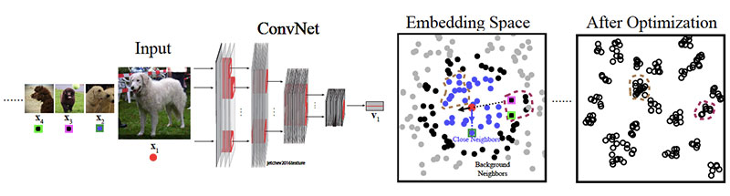

 

#### 本文的核心思想是什么？

- 本文介绍了一种新颖的无监督学习算法，该算法可在潜在特征空间中对相似图像进行局部非参数聚合。

- 所提出的**本地聚合（LA）**步骤的总体目标是学习一种嵌入功能，该功能将图像映射到表示空间中的特征，在该表达空间中，相似的图像分组在一起，而不同的图像则分开：

  - 对于每个输入图像，使用深度神经网络将图像嵌入到低维空间中。
- 然后，该模型识别嵌入相似的近邻和背景近邻，背景近邻用于设置判断邻近度的距离尺度。
  - 通过优化，当前嵌入向量被推到更靠近其近邻，并进一步远离其背景近邻。

- 引入的过程产生的表示形式支持下游计算机视觉任务。

 

#### 关键成就是什么？

- 在以下方面，本地聚合明显优于其他架构：
  - **目标识别**，经过LA培训的ResNet-50 在ImageNet上达到了**60.2％的** top-1准确性–高于直接在受监管任务上接受培训的AlexNet；
  - 通过在Places数据集上以50.1％的精度展示了洛杉矶培训的ResNet-50的强大转移学习性能，从而对**场景进行了分类**；
  - **目标检测**，通过在PASCAL检测任务的无监督转移学习中获得最新结果（即ResNet-50的平均平均精度为69.1％）。

 

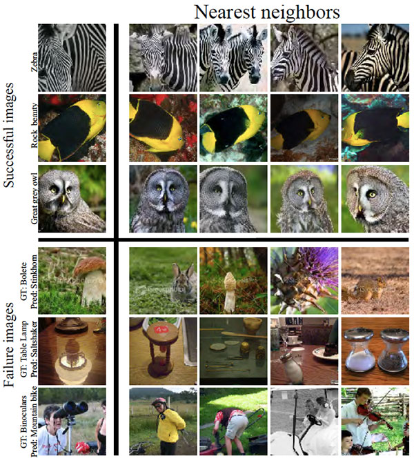

 

#### AI社区怎么看？

- 该论文被提名为ICCV 2019最佳论文奖，这是计算机视觉领域的领先会议之一。

 

#### 未来的研究领域是什么？

- 探索使用基于非局部流形学习的先验检测相似性的可能性。
- 通过分析学习的多个步骤中的代表变化来改善差异检测。
- 将洛杉矶目标应用于其他领域，包括视频和音频。
- 将LA程序与生物视觉系统进行比较。

 

#### 有哪些可能的业务应用程序？

- 这项研究是使无监督学习适用于现实世界中的计算机视觉任务的重要一步，并且使对象检测和对象识别系统能够在不花费昂贵的注释费用的情况下正常运行。

 

#### 在哪里可以获得实现代码？

- [GitHub上](https://github.com/neuroailab/LocalAggregation)提供了Local Aggregation算法的TensorFlow实现。

 

### 9. [健壮的更改字幕](https://arxiv.org/abs/1901.02527)，BY DONG HUK PARK, TREVOR DARRELL, ANNA ROHRBACH

 

#### 原始摘要

描述场景中发生了什么变化对用户可能是有用的，但前提是生成的文本只关注语义相关的内容。因此，将干扰因素（例如视点变化）与相关变化（例如物体已移动）区分开是很重要的。我们提出一种新颖的双重动态注意力模型（DUDA），以执行强大的变更字幕。我们的模型学会了将干扰因素与语义变化区分开来，通过在“之前”和“之后”图像上的双重注意来定位变化，并通过动态地专注于必要的视觉输入（例如“之前”），通过Dynamic Speaker以自然语言准确地描述它们。或“之后”图片）。为了深入研究问题，我们收集了基于CLEVR引擎的CLEVR-Change数据集，其中包含5种类型的场景更改。我们以数据集为基准，并系统地研究不同的变化类型和干扰因素的鲁棒性。我们在更改字幕和本地化方面都展示了DUDA模型的优越性。我们还表明，我们的方法是通用的，它在没有干扰因素的最新逼真的Spot-the-Diff数据集上获得了最新的结果。

 

#### 我们的总结

加利福尼亚大学的研究小组引入了一种新颖的**双重动态注意力（DUDA）**模型，用于跟踪两个图像之间的语义相关变化并以自然语言准确描述这些变化。该模型的“ **双重注意”**组件可以预测“之前”和“之后”图像的空间注意力，而“ **动态扬声器”**组件则通过自适应地关注来自“双重注意”网络的必要视觉输入来生成更改描述。为了解决存在干扰因素时的更改标题，研究人员还提出了一种新的**CLEVR-Change**具有80K图像对的数据集，涵盖5种场景变化类型并包含干扰因素。实验表明，在更改标题和本地化方面，DUDA模型优于CLEVR-Change数据集的基线。

 

 

#### 本文的核心思想是什么？

- 研究团队提出了用于变化检测和字幕的**双重动态注意力模型（DUDA）**：

  - 该模型包括用于更改本地化的**Dual Attention**组件和用于生成更改描述的**Dynamic Speaker**组件。
- 这两个神经网络都是使用字幕级监督进行联合训练的，并且没有有关更改位置的信息。
  - 给出“之前”和“之后”图像后，模型将检测场景是否已更改；如果是这样，它将在两个图像上定位变化，然后生成一个描述变化的句子，该句子基于图像对在空间和时间上。

- 本文还介绍了一个新的**CLEVR-Change**数据集，该数据集是：

  - 包含80K个“之前” /“之后”图像对；
- 考虑5种场景变化类型，例如*颜色*或*材质*变化，*添加*，*放置*或*移动*对象；
  - 包括仅具有干扰项的图像对（即照明/视点更改）和具有干扰项和语义相关的场景更改的图像。

 

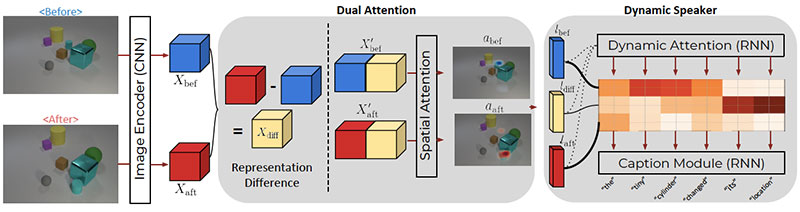

 

#### 关键成就是什么？

- 引入新的CLEVR-Change基准测试，可以帮助研究团体训练新模型，以用于：
  - 当视点移动时，局部场景发生变化；
  - 正确引用复杂场景中的物体；
  - 定义视点移动时对象之间的对应关系。
- 提出一个更改字幕的DUDA模型，当在CLEVR-Change数据集上进行评估时，该模型在以下方面优于所有场景更改类型的基准：
  - 总体句子流利程度和与真实性的相似性（BLEU-4，METEOR，CIDEr和SPICE度量）；
  - 更改本地化（指向游戏评估）。

 

#### AI社区怎么看？

- 该论文被提名为ICCV 2019最佳论文奖，这是计算机视觉领域的领先会议之一。

 

#### 未来的研究领域是什么？

- 使用包含语义上显着变化和干扰因素变化的“之前” /“之后”图像对收集**真实图像数据集**。

 

#### 有哪些可能的业务应用程序？

- DUDA模型可以协助各种实际应用，包括：
  - 更改医学图像中的跟踪；
  - 设施监控；
  - 航空摄影。

 

### 10. [HYPE：生成模型的人眼感知评估基准](https://arxiv.org/abs/1904.01121), BY SHARON ZHOU, MITCHELL L. GORDON, RANJAY KRISHNA, AUSTIN NARCOMEY, LI FEI-FEI, MICHAEL S. BERNSTEIN

 

#### 原始摘要

生成模型通常使用人工评估来评估其输出的感知质量。自动化指标是嘈杂的间接代理，因为它们依赖启发式或预训练的嵌入。但是，到目前为止，直接的人类评估策略都是临时的，既没有标准化也没有经过验证。我们的工作为生成现实主义建立了黄金标准的人类基准。我们构建人眼感知评估（HYPE）的人类基准，该基准是（1）基于感知的心理物理学研究；（2）在模型的随机采样输出的不同集合之间可靠；（3）能够产生可分离的模型性能；以及（4）高效的成本和时间。我们介绍了两种变体：一种在自适应时间约束下测量视觉感知，以确定模型输出呈现真实阈值（例如250ms），另一个价格较便宜的变体，它在没有时间限制的情况下，可以测量伪造和真实图像上的人为错误率。我们使用CelebA，FFHQ，CIFAR-10和ImageNet这四个数据集，通过六个最先进的生成对抗网络和两种采样技术，对有条件和无条件图像生成进行HYPE测试。我们发现HYPE可以跟踪训练期间的模型改进，并且通过引导抽样确认HYPE排名是一致且可复制的。

 

#### 我们的总结

在本文中，斯坦福大学的研究团队致力于图像生成模型的评估。他们引入了黄金标准的人类基准，即人眼感知评估（HYPE），以评估机器生成图像的真实性。第一种评估方法称为$HYPE_{time}$。通过测量区分真实图像和假图像所需的最短时间（以毫秒为单位），评估图像的真实性。第二种方法叫做$HYPE_{\infty}$。用于衡量在给定时间限制下，人类将假图片与真实图片混淆的比率。使用六种最新的GAN架构和四个不同的数据集进行的实验表明，[HYPE](https://hype.stanford.edu/)提供了可轻松，廉价地复制的可靠分数。

 

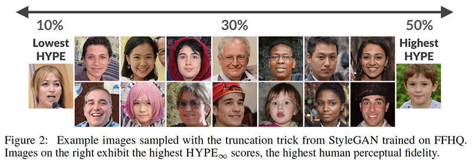

 

#### 本文的核心思想是什么？

- 由于自动度量标准在高维问题上不准确，并且人工评估不可靠且过度依赖任务设计，因此需要用于评估生成模型的**系统性金标准基准**。

- 为了解决这个问题，研究人员介绍了**人眼感知评估（HYPE）**，与评估的方法有两种：

  - $HYPE_{time}$计算一个人需要多少时间来区分特定模型生成的真实图像和伪图像：花费的时间越长，模型越好。
- $HYPE _ {\infty}$ 测量不受时间限制的人为错误率：得分高于50％表示生成的图像看起来比真实图像更真实。

 

#### 关键成就是什么？

- 引入用于评估生成模型的金标准人类基准，即：
  - **扎根**于心理物理学研究；
  - **可靠**且一致；
  - 能够针对不同模型产生统计上**可分离的**结果；
  - 成本和时间**效率**。

 

#### AI社区怎么看？

- 该论文被选为人工智能领先会议NeurIPS 2019的口头报告。

 

#### 未来的研究领域是什么？

- 将HYPE扩展到其他生成任务，包括文本，音乐和视频生成。

 

#### 在哪里可以获得实现代码？

- 作者已经[在线](https://hype.stanford.edu/)部署了[HYPE](https://hype.stanford.edu/)，因此任何研究人员都可以使用Mechanical Turk工作者上载模型并检索HYPE分数。