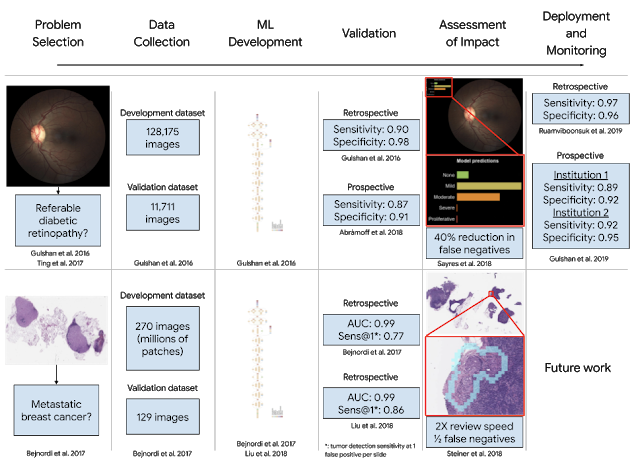
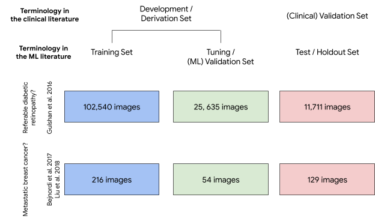

原文：https://ai.googleblog.com/2019/12/lessons-learned-from-developing-ml-for.html

作者：Yun Liu, Research Scientist and Po-Hsuan Cameron Chen, Research Engineer, Google Health

翻译：[Quan Chen](https://github.com/chenquan)

# 医疗保健发展ML的经验教训

机器学习（ML）方法在医学领域并不陌生-传统的技术（例如决策树和Logistic回归）通常用于推导已建立的临床方法，这在医学上并不陌生- 由研究科学家Liu Yun和研究工程师Po-Hsuan Cameron Chen发布决策规则（例如，用于估计冠状动脉事件后患者风险的[TIMI风险评分](https://www.ncbi.nlm.nih.gov/pubmed/10938172)）。但是，近年来，在[各种医学应用中使用](https://ai.googleblog.com/search/label/Health) ML的浪潮激增，例如从[复杂的医学记录中](https://ai.googleblog.com/2018/05/deep-learning-for-electronic-health.html)预测不良事件以及[提高基因组测序的准确性](https://ai.googleblog.com/2017/12/deepvariant-highly-accurate-genomes.html)。除了检测已知疾病外，ML模型还可以找出以前未知的信号，例如视网膜底照片中的[心血管危险因素](https://ai.googleblog.com/2018/02/assessing-cardiovascular-risk-factors.html)和[屈光不正](https://iovs.arvojournals.org/article.aspx?articleid=2683803)。

除了开发这些模型之外，重要的是要了解如何将它们整合到医疗工作流程中。先前的研究表明，在[糖尿病眼病分级](https://ai.googleblog.com/2018/12/improving-effectiveness-of-diabetic.html)和[诊断转移性乳腺癌方面](https://ai.googleblog.com/2018/10/applying-deep-learning-to-metastatic.html)，ML模型辅助的医生比单医生或模型更准确。同样，医生能够以[交互方式利用基于ML的工具](https://ai.googleblog.com/2019/07/building-smily-human-centric-similar.html)来搜索相似的医学图像，从而进一步证明医生可以有效地使用基于ML的辅助工具。

为了改善ML和医疗保健研究的指导，我们撰写了两篇文章，发表在《*[自然材料》](https://www.nature.com/nmat/)*和*[《美国医学会》](https://jamanetwork.com/journals/jama)*杂志（*JAMA*）上。第一个是让ML从业者更好地了解如何为医疗保健开发ML解决方案，第二个是为希望更好地了解ML是否有助于改善临床工作的医生。

**如何为医疗保健开发机器学习模型**
在《[如何**为医疗保健**开发机器学习模型](https://www.nature.com/articles/s41563-019-0345-0)》（[pdf](https://rdcu.be/bxGE4)）中，发表在[《*Nature Materials》*](https://www.nature.com/nmat/)上，我们讨论了确保针对医疗环境的特定需求为该环境开发ML模型的重要性。这应该在医疗保健应用技术开发的整个过程中完成，从问题选择，数据收集和ML模型开发到验证和评估，部署和监视。

首先要考虑的是如何确定既有迫切的临床需求又要基于ML模型进行预测的医疗保健问题，以提供可行的见解。例如，用于检测糖尿病眼病的ML可以帮助减轻在世界上糖尿病盛行且医疗专家人数不足的地区的筛查工作量。一旦发现问题，就必须谨慎处理数据，以确保应用于数据的真实标签或“参考标准”是可靠和准确的。这可以通过与专家对相同数据的解释（例如视网膜眼底照片）进行比较来验证标签，或者通过正交程序（例如活检以确认放射学发现）来完成。这一点特别重要，因为高质量的参考标准对于训练有用的模型和准确地测量模型性能都是必不可少的。因此，至关重要的是，ML从业者必须与临床专家紧密合作，以确保严格的参考标准用于培训和评估。

在医疗保健中，模型性能的验证也大不相同，因为分布偏移的问题很明显。与通常进行单个随机测试分组的典型ML研究相反，医学领域使用多个独立的评估数据集来验证值，每个评估数据集的患者群体不同，可能在人口统计学或疾病亚型方面也有所差异。由于具体情况取决于问题，因此ML从业人员应与临床专家密切合作以设计研究，尤其要确保模型验证和性能指标适合于临床环境。

集成的辅助工具还需要进行周密的设计，以确保无缝集成工作流程，同时还要考虑这些工具对诊断准确性和工作流程效率的影响。重要的是，对这些工具在进行实际患者护理中的前瞻性研究具有重大价值，以更好地了解它们对现实世界的影响。

最后，即使在验证和工作流集成之后，部署之旅才刚刚开始：监管批准以及对意外错误模式或实际使用中的不良事件的持续监控仍然是第一位。

|  |
| ------------------------------------------------------------ |
| 根据我们在检测糖尿病性眼病和转移性乳腺癌方面的工作，以上是医疗保健的ML模型的转换过程（开发，验证和部署）的两个示例。 |

**赋权医生更好地了解机器学习的医疗保健**
在“[医学文献用户指南：如何阅读使用机器学习的文章](https://jamanetwork.com/journals/jama/fullarticle/2754798?guestAccessKey=fd274bef-2813-446f-bb10-e5134640922f)，“ 出版于*[贾玛](https://jamanetwork.com/journals/jama)*，我们总结了关键的ML概念，以帮助医生评估ML研究是否适合其工作流程。本文的目的是解开ML的神秘面纱，以帮助需要使用ML系统的医生了解其基本功能，何时信任它们以及它们的潜在局限性。

医生在评估任何研究时都会问的主要问题（无论是否为ML）仍然存在：参考标准是否可靠？评估是否公正无误，例如评估假阳性和假阴性，并与临床医生进行公平比较？该评估是否适用于我所见的患者人群？ML模型如何帮助我照顾病人？

除了这些问题之外，还应该仔细检查ML模型，以确定在其开发中使用的超参数是否在与最终模型评估所使用的数据集无关的数据集上进行了调优。这一点特别重要，因为不适当的调整会导致对性能的高估，例如，可以训练足够复杂的模型以完全[记住训练数据集](https://arxiv.org/abs/1611.03530)但却很难将其推广到新数据。要确保适当地进行调优，需要注意数据集命名的歧义，尤其是要使用受众最熟悉的术语：

|  |
| ------------------------------------------------------------ |
| ML和医疗保健这两个领域的交集在术语“验证数据集”中造成歧义。ML验证集通常是用于超参数调整的数据集，而“临床”验证集通常用于最终评估。为了减少混淆，我们选择将（ML）验证集称为“调整”集。 |

**未来展望**
现在是从事医疗保健AI的激动人心的时刻。“从实验台到临床”的道路是一条漫长的道路，需要来自多个学科的研究人员和专家在此翻译过程中共同努力。我们希望这两篇文章将促进相互理解，这对于ML从业人员开发医疗保健模型的重要性以及评估这些模型的医生所强调的内容，从而推动各个领域之间的进一步合作，并最终对患者护理产生积极影响。