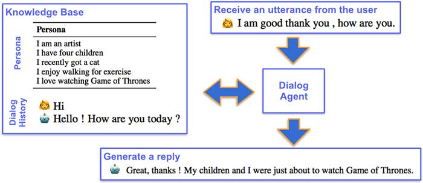
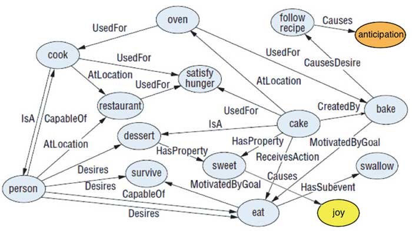
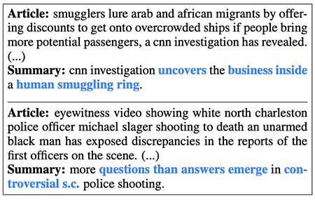

# 在营销和广告中利用NLP的新方法

自然语言处理（NLP）是AI研究历史最悠久的领域之一。能够与计算机说话并被口头或书面理解的想法与人工智能的想法早就存在了。

如今，NLP已经远远不仅仅是一种更好的输入方法-我们能够使用机器学习算法来以前所未有的新方式理解，评估甚至合成文本和语音。鉴于营销在很大程度上依靠文字来传达有关人和产品的信息，因此NLP在营销技术上占据了很大的市场份额也就不足为奇了。

那么，在MarTech中，我们看到NLP起飞的地方有哪些？

 

## 1.捕捉潜在客户的聊天机器人

很少会发现在首页上没有弹出聊天框来帮助您的网站。您甚至可以在Facebook Messenger中“手动构建”聊天机器人以充当自动回复程序。[Drift](https://www.drift.com/)和[Intercom](https://www.intercom.com/live-chat)等平台是典型的平台，提供自动响应平台，该平台还可以收集有关您的访客的信息。当前，一旦对话变得更加复杂，这些聊天机器人往往会变得有些笨拙，或者在事情变得有趣时依赖于能够移交给人类客户支持人员。

现在的最新[研究](https://medium.com/huggingface/how-to-build-a-state-of-the-art-conversational-ai-with-transfer-learning-2d818ac26313)表明，只需输入几行以勾勒出所需的特征，就可以创建具有背景故事甚至个性特征的聊天机器人。这包括镜像与机器人交互的人的能力。很快，我们将看到一个现实的聊天机器人个性的全新世界，能够与被交谈的人保持一致，这已经证明可以发展融洽的关系（并使我们的机器人在移交给人类之前可以获得更多信息）。

 

*具有角色的对话式AI（*[*由HuggingFace设计*](https://medium.com/huggingface/how-to-build-a-state-of-the-art-conversational-ai-with-transfer-learning-2d818ac26313)*）*

 

## 2.通过语音搜索获得更广泛的受众

舒适的打字人数一直是访问数字服务的障碍。近年来，语音搜索已变得越来越流行，从Siri和Google Assistant支持的智能手机到Alexa等“仅语音”扬声器系统的问世。

目前，[有25％的25-49岁年龄段的](https://www.dialogtech.com/blog/search-marketing/voice-search-statistics)人每天至少使用智能设备通话一次，并且智能扬声器的出货量从2017年第三季度到2018年第三季度同比增长了一倍。据估计，到2020年，使声音成为明天营销人员的重要平台。

 

## 3.情感分析，以了解客户

由于NLP功能在过去几年中取得了长足的进步，因此AI能够提取语言背后的意图和情感。就像使用Vibe的“ [会话分析”](https://www.vibes.com/platform/analytics-insights/conversational-analytics/)平台一样，它可以用来推导与单个客户的对话情绪，并引导对话进行转化。如[Remesh](https://remesh.ai/)所提供的，它还可用于查看大型团体的情绪和直接的团体对话。

情感分析的最新研究突破包括[将常识知识](https://aaai.org/ocs/index.php/AAAI/AAAI18/paper/view/16541)整合到深度神经网络中以改善方面和情感极性的识别，或者使用[具有门控机制的卷积神经网络（CNN）](https://arxiv.org/abs/1805.07043)代替传统的长短期记忆网络（LSTM）来获得更大的成就效率和更好的性能。

 

*SenticNet语义网络（*[*Ma，Peng和Cambria，2018年*](https://sentic.net/sentic-lstm.pdf)*）*

 

## 4.自动汇总以及早发现趋势

市场营销中NLP的另一个用例是相关新闻聚合领域。最新的文本汇总方法使营销人员能够从在线新闻，文章和其他数据源中提取有关其品牌的相关内容。

斯坦福大学的Abigail See认为，基于NLP的自动摘要已从简单的[提取摘要发展](http://www.abigailsee.com/2017/04/16/taming-rnns-for-better-summarization.html)而来，在[摘要中](http://www.abigailsee.com/2017/04/16/taming-rnns-for-better-summarization.html)，原始来源的内容被缩短和重新排列。AI越来越能够生成摘要文本，从而创建听起来更加自然的最终产品。[抽象摘要](https://arxiv.org/pdf/1704.04368.pdf)是真正的游戏规则改变者，它可以从各种来源动态生成由生成的内容组成的摘要。

 

*高度抽象的摘要示例，其中用**蓝色**表示新颖的单词（[请参见Liu和Manning，2017年](https://arxiv.org/abs/1704.04368)）*

 

## 5. AI广告撰写器，可高效生成广告

努力创建有效的广告口号？AI可以为您完成这项工作。最近的文本生成技术可以帮助广告商生成优化的关键字，广告标语，产品列表等。

例如，阿里巴巴推出了一款[AI广告撰稿人](https://www.alizila.com/alibaba-debuts-ai-copywriter/)，它承担了创建有效产品说明的繁重工作。该工具在外国公司中特别流行，这些公司利用此AI广告撰稿人来创建中文产品说明。有几家提供类似服务的创业公司，Persado和Motiva只是提供[AI广告优化的](https://thenextweb.com/full-stack/2017/12/29/these-startups-use-ai-to-optimize-marketing-messages/)一些公司。这些bot不可能使任何人失业，尽管如果您想释放自己的写作才能去从事更有趣的任务，它们确实是一个很好的工具。

 

## 6. AI编写器，可有效生成内容

自从图灵第一次提出他著名的测试之前，就产生了产生令人信服的“图灵测试通过”内容的人工智能思想，这可以从启蒙时代自动机的普及中看到，其中包括一个[可编程的作家。](https://www.thisiscolossal.com/2013/11/the-writer-automata/)

250年后，我们终于能够实现那些发明家梦。您可能还记得今年早些时候的[OpenAI案例](https://towardsdatascience.com/openais-gpt-2-the-model-the-hype-and-the-controversy-1109f4bfd5e8)，当时一家公司创建了一种语言生成模型，由于与假新闻生成相关的风险，他们与公众共享时感到不安全。

但是，还有很长的路要走。商业上可用的系统距离生成长的，有意义的和连贯的文本还很远。甚至[OpenAI的“危险” GPT-2](https://www.topbots.com/openai-gpt-2-visualization/)有时也会出现上下文错误，并且众所周知会重复出现。

 

*AI生成的故事样本（来自*[*OpenAI Blog*](https://blog.openai.com/better-language-models/)）

 

## 7.机器转录可搜索的视频内容

语音识别的改进使我们达到了现在可以自动进行视频和音频转录的地步。这为将视频和音频文件转换为包括可搜索内容提供了机会，从而使这些媒体在改善SEO或为随附文章创建人为水平的准确文本方面更加可行。

YouTube已经为其所有视频提供了机器生成的字幕。将来，我们也可以期待即时进行机器音频和视频翻译。

 

## 摘要

简而言之，NLP将继续成为营销人员的主要“首选”人工智能技术之一。在可预见的将来，它还将成为MarTech发展的领先优势的一部分。

这些技术将变得越来越接近人类在未来几年内所能迅速实现的目标，并且在许多情况下将极大地改变营销部门和角色的面貌。就像所有最新的AI开发一样，对于营销人员来说，重要的是要学习如何从这些工具中获得最大收益，如果他们希望在我们走向未来时保持自己和技能的相关性。