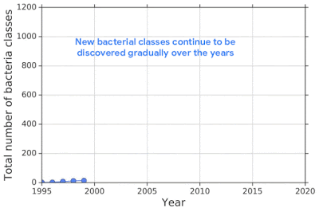
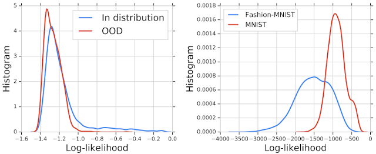
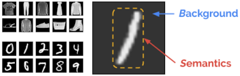
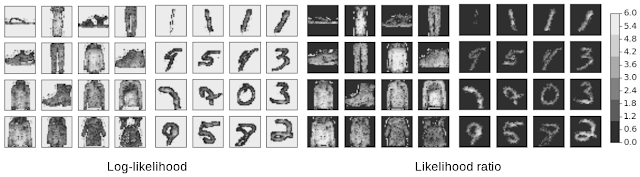

原文：https://ai.googleblog.com/2019/12/improving-out-of-distribution-detection.html

作者：Jie Ren, Research Scientist, Google Research and Balaji Lakshminarayanan, Research Scientist, DeepMind

翻译：[Quan Chen](https://github.com/chenquan)

# 改进机器学习模型中的分布外检测

机器学习系统的成功部署要求系统能够区分异常数据或与培训中使用的数据有显着差异的数据。对于深度神经网络分类器而言，这尤其重要，因为深度分类器可能会以较高的置信度将此类分布失调（OOD）输入分类为分布失调类。当这些预测为现实决策提供依据时，这一点至关重要。

例如，机器学习模型在实际应用中的一项具有挑战性的应用是基于基因组序列的细菌识别。细菌检测对于败血症等传染病的诊断和治疗以及食源性病原体的识别至关重要。多年来，不断发现新的细菌类别，并且通过交叉验证测量的在已知类别上训练的神经网络分类器可实现较高的准确性，但部署模型具有挑战性，因为现实世界中的数据不断发展且不可避免地会包含训练数据中不存在看不见类别的基因组（OOD输入）。

|  |
| ------------------------------------------------------------ |
| 这些年来，逐渐发现了新的细菌种类。在已知类上训练的分类器可实现属于已知类的测试输入的高精度，但会错误地将来自未知类的输入（即分布不当）错误地分类为已知类。 |

在[NeurIPS 2019上](https://nips.cc/Conferences/2019)发表的“ [分布外检测的似然比](https://arxiv.org/abs/1906.02845) ”中，我们提出并[发布](https://git.io/JeP2s)了一种用于OOD检测的实际基因组序列基准数据集，该数据集受到上述现实世界挑战的启发。我们使用基因组序列上的生成模型测试了现有的OOD检测方法，发现*[似然](https://en.wikipedia.org/wiki/Likelihood_function)*值（即，使用分布内数据估算的输入来自分布的模型概率）常常是错误的。在最近的图像深度生成模型研究中也观察到了这种现象。我们通过背景统计的影响解释了这种现象，并提出了*似然比*基于解决方案的解决方案，可显着提高OOD检测的准确性。

**为何密度模型无法进行OOD检测？**
为了模拟真实的问题并系统地评估不同的方法，我们使用来源于[原核基因组序列](https://www.ncbi.nlm.nih.gov/genome/browse#!/prokaryotes/)的公共[NCBI目录中](https://www.ncbi.nlm.nih.gov/genome/browse#!/prokaryotes/)的数据建立了一个新的细菌数据集。为了模拟测序数据，我们将基因组分成250个碱基对的短序列，这是当前测序技术通常产生的长度。然后，我们按发现日期将分布内和分布外的数据分开，以便将在截止时间之前发现的细菌类别定义为分布内，然后将其后发现的细菌类别定义为OOD。

然后，我们针对分布内基因组序列训练了一个深层的生成模型，并通过绘制它们的似然值来检查该模型对分布内输入和分布外输入的区分程度。OOD序列可能性的直方图与分布内序列的直方图在很大程度上重叠，这表明生成模型无法区分两个种群进行OOD检测。类似的结果显示在[早期的](https://arxiv.org/abs/1810.09136) [工作](https://arxiv.org/abs/1810.01392)对图像的深度生成模型，例如，对[Fashion-MNIST](https://github.com/zalandoresearch/fashion-mnist)数据集（包括衣服和鞋类图像）中的图像进行训练的[PixelCNN ++](https://arxiv.org/abs/1701.05517)模型将更高的可能性分配给[MNIST](http://yann.lecun.com/exdb/mnist/)数据集的OOD图像（后者由数字0-9组成）。

| |
| ------------------------------------------------------------ |
| **左：**分布内和分布外（OOD）基因组序列的似然值直方图。这种可能性无法将分布内基因组序列和OOD基因组序列分开。**右：**在Fashion-MNIST上训练并在MNIST上评估的模型的相似图。与分布内图像相比，该模型为OOD（MNIST）分配了更高的似然值。 |

在研究这种故障模式时，我们观察到这种可能性可能会被背景统计数据所混淆。为了更直观地理解该现象，假定输入由两个部分组成：（1）以背景统计为特征的*背景*部分，以及（2）*语义*具有特定于分布内数据的模式特征的组件。例如，可以将MNIST图像建模为背景加语义。当人们解释图像时，我们可以轻松地忽略背景，而主要关注语义信息，例如，下图中的“ /”标记。但是，对于图像中的所有像素（包括语义像素和背景像素）都计算了似然度。尽管我们只想将语义可能性用于决策，但是原始可能性可以由背景决定。

| |
| ------------------------------------------------------------ |
| **左上：** Fashion-MNIST的示例图像。**左下：**来自MNIST的示例图像。**右：** MNIST图像中的背景和语义成分。 |

**OOD检测**
的*似然比*我们提出了一种*似然比方法*，该*方法*去除了背景的影响并着重于语义。首先，我们在扰动的输入上训练背景模型。干扰输入的方法是受到基因突变的启发，然后通过随机选择输入中的位置并用具有相同概率的另一个值替换该值来进行操作。对于成像，这些值是从256个可能的像素值中随机选择的，对于DNA序列，该值是从四个可能的[核苷酸中选择的](https://en.wikipedia.org/wiki/Nucleotide)（A，T，C或G）。适当的扰动会破坏数据中的语义结构，并且仅捕获背景。然后，我们计算完整模型与背景模型之间的似然比，并消除背景成分，从而仅保留语义的似然。可能性比是*背景对比得分*，即*与背景相比*，它捕获了语义的重要性。

为了定性评估似然比与似然比之间的差异，我们在Fashion-MNIST和MNIST数据集中绘制了每个像素的值，从而创建了与图像大小相同的热图。这使我们可以直观地看出哪些像素对这两个项的贡献最大。从对数似然热图可以看出，背景像素对似然性的贡献远大于语义像素。事后看来，这并不奇怪，因为背景像素主要由一串零组成，该模式很容易被模型学习。MNIST和Fashion-MNIST热图之间的比较说明了MNIST为什么返回更高的似然值-它只是具有更多的背景像素！相反，似然比更多地集中在语义像素上。

|               |
| ------------------------------------------------------------ |
| **左图**： Fashion-MNIST和MNIST数据集的对数似然热图。 **右图**：相同的示例显示了似然比的热图。值较高的像素具有较浅的阴影。似然率由“背景”像素决定，而似然比集中于“语义”像素，因此更适合OOD检测。 |

基于针对Fashion-MNIST训练的PixelCNN ++模型， 我们的似然比方法可校正背景效果，并从0.089到0.994 的[AUROC分数](https://en.wikipedia.org/wiki/Receiver_operating_characteristic#Area_under_the_curve)显着改善MNIST图像的OOD检测。当将其应用于基因组基准数据集时，与其他12种基线方法相比，该方法可在此具有挑战性的问题上实现最先进的性能。

有关更多详细信息，请查看我们最近的[论文](https://arxiv.org/abs/1906.02845)在NeurIPS 2019上，我们的似然比方法在基因组数据集上达到了最先进的性能，但其准确性还不足以达到将模型部署到实际应用程序的标准。我们鼓励研究人员为解决这一重要问题做出贡献，并改善当前的最新水平。该数据集可在我们的[GitHub存储库中找到](https://git.io/JeP2s)。