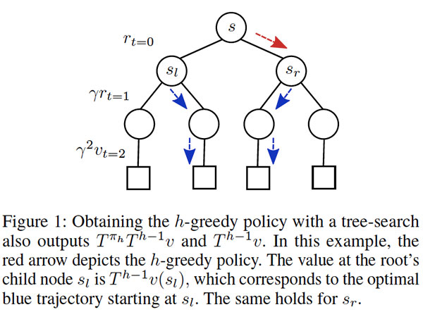
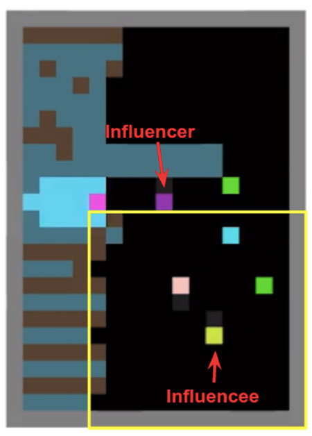
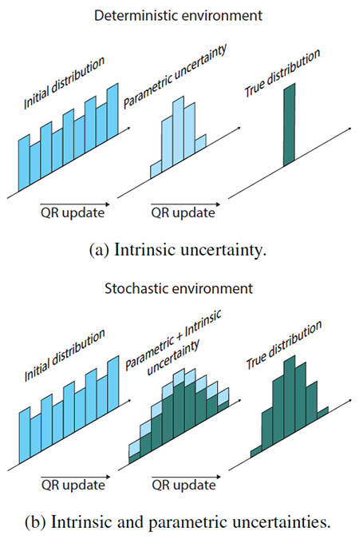
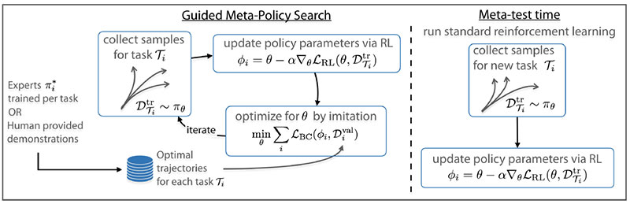
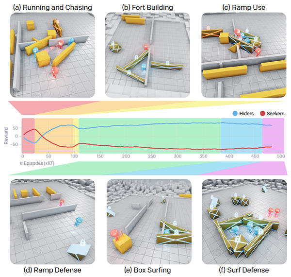
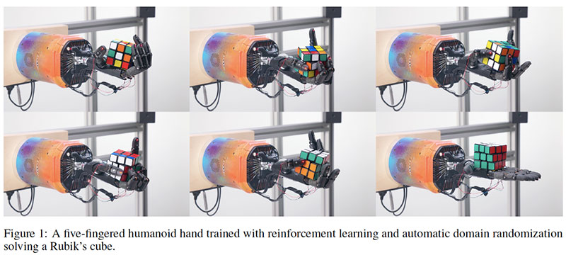
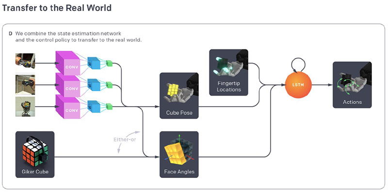

原文：https://www.topbots.com/top-ai-reinforcement-learning-research-papers-2019/

作者：[Mariya Yao](https://www.topbots.com/author/mariya/)

翻译：[Quan Chen](https://github.com/chenquan)

# 自2019年以来强化学习突破性的研究

强化学习（RL）对于业务应用程序的价值仍然比监督学习，甚至是无监督学习低。它仅在可以生成大量模拟数据的领域（例如机器人技术和游戏）中成功应用。

但是，许多专家认为RL是通向人工智能（AGI）或真正智能有前途的道路。因此，来自顶级机构和技术领导者的研究团队正在探索使RL算法更加高效和稳定的方法。

我们选择并总结了10篇我们认为代表强化学习最新研究趋势的研究论文。这些论文探索了多个主体的互动，非策略学习和更有效的探索。

## 2019年10篇重要的强化学习研究论文

### 1. [如何在强化学习中结合树型搜索方法](https://arxiv.org/abs/1809.01843)，BY YONATHAN EFRONI, GAL DALAL, BRUNO SCHERRER, SHIE MANNOR

 

#### 原始摘要

强化学习中大量使用了有限水平的前瞻性策略，并显示出令人印象深刻的实验性成功。通常，先行策略是通过特定的规划方法（例如在AlphaZero中“蒙特卡洛树搜索”）实施的。将规划问题称为树搜索，在这些实现中的合理实践是仅在叶子处备份值，而在根部获得的信息除了用于更新策略外，不利用其信息。在这里，我们质疑了这种方法的效力。即，后一种过程通常是非收敛性的，并且不能保证其收敛性。我们提出一种简单明了的增强：使用最佳树路径的返回值来备份根节点后代的值。这导致了*γh*收缩过程，其中*γ*是折现因子，*h*是树的深度。为了建立我们的结果，我们首先引入一个称为*多步贪婪一致性*的概念。然后，在存在注入到树搜索阶段和值估计阶段的噪声的情况下，为上述增强的两个算法实例提供收敛速率。

 

#### 我们的总结

在本文中，Technion研究团队探索了改善前瞻性策略实施的方法。通常的做法是仅在叶子处备份值，但是这种方法除了更新策略外，算法无法利用从根获得的信息。因此，研究人员发现，即使是Alpha Zero中使用的最先进的实现（例如蒙特卡洛树搜索），也不一定会收敛到最佳值。为了解决这个问题，作者提出了一个简单的增强：通过使用最佳树路径的返回值来备份根的后代中的值。本文的实验表明，该增强算法的性能优于“朴素”树搜索算法，后者支持本文的理论分析。

 

 

#### 本文的核心思想是什么?

- 树搜索实现通常仅备份叶子处的值。此过程不会利用从根获得的信息，因此不能保证收敛。
- 本文介绍了一种新过程，该过程使用最佳树路径的返回值来备份根的后代中的值。
- 这种新方法可以引导从*h – 1*层最佳计划问题中获得的最优值，而不是“通常”值函数。

 

#### 关键成就是什么？

- 本文中的实验表明，增强效果明显优于传统方法，尤其是与短视距评估相结合时。

 

#### 人工智能界对此有何看法？

- 该论文获得了AAAI 2019杰出论文奖。

 

#### 未来的研究领域是什么？

- 进一步分析非收敛性算法并了解它们的性能。
- 利用规划副产品对结果进行更深入的分析。

 

#### 有哪些可能的业务应用程序？

- 即使本文的贡献主要是理论上的，所提出的方法也可以使各种应用受益，包括最新的游戏玩AI，路线查找和调度。

 

### 2. [社会影响力是多主体深度强化学习的内在动力](https://arxiv.org/abs/1810.08647)，BY NATASHA JAQUES, ANGELIKI LAZARIDOU, EDWARD HUGHES, CAGLAR GULCEHRE, PEDRO A. ORTEGA, DJ STROUSE, JOEL Z. LEIBO, NANDO DE FREITAS

 

#### 原始摘要

我们提出了一个统一的机制来实现多智能体强化学习(MARL)中的协调和沟通，通过奖励对其他智能体行为具有因果影响力的智能体。使用反事实推理来评估因果影响。在每个时间步骤中，智能体模拟它可能采取的替代操作，并计算它们对其他智能体行为的影响。导致其他智能体的行为发生更大变化的行为被认为是有影响力的，并且是有回报的。我们证明这等价于奖励智能体,因为他们的行为之间拥有高度相关的互信息。实证结果表明，在具有挑战性的社会困境中，影响力会导致协调和沟通的增强，极大地增加了深层RL智能体的学习曲线，并促使更有意义的学习通信协议。通过使用深度神经网络使智能体学习其他智能体的模型，可以分散地计算所有智能体的影响力报酬。相比之下，以前在MARL环境中关于紧急通信的主要著作无法以分散的方式学习不同的策略，只能求助于集中的训练。因此，影响力奖励为这一领域的研究打开了一扇新机会的窗口。

 

#### 我们的总结

在本文中，作者考虑了在多智能体强化学习（MARL）中从其他智能体衍生内在的社会影响力的问题。该方法是为了奖励对其他智能体的行为具有因果关系以实现两者协调的智能体

MARL中的交流。具体而言，证明了导致另一智能体行为相对较高变化的奖励行为与最大化智能体行为之间的互信息流有关。结果表明，这样的归纳偏差会激励智能体学习协调行为。实验证实了提出的社会影响力奖励在增强智能体之间的协调和沟通方面的有效性。

 

*紫色影响者发出信号的信号，表示黄色影响者的视场外有苹果（绿色方块）（黄色轮廓框）*

 

#### 本文的核心思想是什么？

- 本文解决了多个智能体之间长期存在的**协调和沟通**问题，包括集中训练和奖励功能或策略参数共享等局限性。
- 作者建议，给予对其他智能体的行为有因果关系的智能体进行额外的奖励。
- 下一步，他们通过包含明确的通信协议来增强**社会影响力奖励**。
- 最后，他们为每个智能体配备了**内部神经网络**，该**网络**经过训练可以预测其他智能体的行为。这样就可以对智能体进行独立训练。

 

#### 关键成就是什么？

- 证明社会影响力奖励最终会导致更高的集体奖励，并在没有其他可能的情况下允许智能体们学习有意义的沟通协议。
- 引入一个框架来独立训练智能体，同时仍然确保他们之间的协调和沟通。

 

#### 人工智能界对此有何看法？

- 该论文在ICML 2019上获得了荣誉提名奖，ICML是机器学习方面的领先会议之一。

 

#### 未来的研究领域是什么？

- 使用提议的方法使智能体中形成一种“同理心”，以便他们可以模拟其行为如何影响另一个智能体的价值函数。
- 应用影响力奖励来鼓励网络的不同模块集成来自其他网络的信息，例如，防止分层RL崩溃。

 

#### 有哪些可能的业务应用程序？

- 试图在操纵和控制任务中进行协作的机器人中驱动协调行为。

 

### 3. [通过概率上下文变量进行高效的非策略元强化学习](https://arxiv.org/abs/1903.08254)，BY KATE RAKELLY, AURICK ZHOU, DEIRDRE QUILLEN, CHELSEA FINN, SERGEY LEVINE

 

#### 原始摘要

深度强化学习算法需要大量经验才能学习单个任务。原则上，元强化学习（meta-RL）算法使智能体能够从少量经验中学习新技能，但一些重大挑战阻碍了它们的实用性。当前的方法严重依赖于策略经验，从而限制了其采样效率。他们在适应新任务时也缺乏推理任务不确定性的机制，从而限制了它们在稀疏奖励问题中的有效性。在本文中，我们通过开发一种脱离策略的元RL算法来解决这些挑战，该算法可以分离任务推理和控制。在我们的方法中，我们对潜在任务变量执行在线概率过滤，以从少量经验中推断出如何解决新任务。这种概率解释可以进行后验采样，以进行结构化和有效的探索。我们演示了如何将这些任务变量与非策略RL算法集成在一起以实现元训练和适应效率。在几个meta-RL基准测试中，我们的方法在采样效率和渐近性能方面都比以前的算法好20-100倍。

 

#### 我们的总结

加州大学伯克利分校的研究小组解决了有效的非策略元强化学习（meta-RL）问题。具体来说，他们提出将“概率上下文变量的在线推断与现有的非策略RL算法集成”以在元训练和快速适应过程中获得样本效率。引入的非策略元RL算法称为**PEARL：Actor-critic RL的概率嵌入**，实际上是对任务假设进行采样，尝试执行这些任务，然后评估这些假设是否成立。实验表明，PEARL在元训练样本效率方面比现有的最新方法高20-100倍，并且证明了渐进性能的显著改善。

 

#### 本文的核心思想是什么？

- Meta-RL算法使用策略上的数据时采样效率低下，但是在非策略数据上训练meta-RL模型会带来挑战，例如元训练(meta-train)时间与元测试(meta-tset)时间之间不匹配。

- 为了解决这些挑战，研究人员介绍了 **PEARL：Actor-critic RL的概率嵌入**  ，它结合了现有的非策略算法和概率上下文变量的在线推断：

  - 在元训练中，概率编码器将从过去的经验中收集必要的统计信息到上下文变量中。
  - 在元测试时间，可以通过采样上下文变量并使它们在情节持续时间内保持不变来启用时间扩展的探索。
  - 然后，通过使用收集的轨迹更新上下文变量的后验来实现快速的轨迹级适应。

- 实际上，引入的方法允许使用策略外数据优化策略，同时使用策略数据训练概率编码器。因此，最小化了元训练和元测试之间的分布不匹配。

 

#### 关键成就是什么？

- 对六个连续控制元学习环境的实验评估表明，PEARL在以下方面优于以前的最新方法：
  - 通过元训练减少20-100倍**样本，提高样本效率** ;
  - **渐近性能**，结果在六个域中的五个域中提高了50-100％。

 

#### 人工智能界对此有何看法？

- 该论文在机器学习领域领先的会议之一ICML 2019上接受了口头报告。

 

#### 有哪些可能的业务应用程序？

- 引入的方法使我们能够显著提高训练自主智能体的效率。

 

#### 在哪里可以获得实现代码？

- [GitHub上](https://github.com/katerakelly/oyster)提供了PEARL的开源实现。

 

###  4. [策略证书：迈向负责任的强化学习](https://arxiv.org/abs/1811.03056)，BY CHRISTOPH DANN, LIHONG LI, WEI WEI, EMMA BRUNSKILL

 

#### 原始摘要

由于探索，强化学习算法的性能在学习过程中可能会发生巨大变化。现有算法在执行前几乎无法提供有关其当前策略质量的信息，因此在医疗保健等高风险应用中的使用受到限制。我们通过提出算法输出策略证书来解决这种缺乏责任感的问题。这些证书限制了下一个策略的次优性和策略的退回，允许人们在认证质量不令人满意时进行干预。我们进一步介绍了两种带有证书的新算法，并提出了一种用于理论分析的新框架，以保证其策略和证书的质量。对于表格MDPs，我们证明了计算证书甚至可以提高基于乐观的探索的样本效率。

 

#### **我们的总结** 

强化学习（RL）算法无法预测的性能波动限制了它们在医疗保健等高风险应用中的使用。为了解决这一局限性，本文的作者建议算法在学习过程中揭示其性能。具体来说，研究人员提出使用**策略证书**，该**证书**输出在下一个情节中算法预期收益的置信区间，以及性能可以达到最佳收益的界限。有了策略证书，当RL算法的性能降至某个最低阈值以下时，人们将可以进行干预。另外，作者介绍了**IPOC**框架，要求算法是高效的学习者，并保证算法的性能在策略证书中显示的限制内。最后，本文提供了一种新的RL演算法，用于满足有限IPOC要求的间歇式马尔可夫决策过程（MDP），并证明了比现有方法更强大的最小后悔值准则和PAC保证。

 

#### 本文的核心思想是什么？

- 卡内基梅隆大学，谷歌研究部和斯坦福大学的联合研究小组探索了使强化学习算法更具责任感的方法。

- 为此，他们建议RL算法在情节RL中输出**策略证书**  。这些证书应包括：

  - 下一个情节中算法的预期奖励总和的置信区间；
  - 性能离最佳回报有多远的界限。

- 除问责制外，研究人员还希望RL算法具有抽样效率。因此，他们引入了一个新的理论分析框架**IPOC**  ：

- 确保策略证书确实限制了情节中算法的预期性能；
  - 规定了通过更多数据改进算法的策略和证书的速率。

 

#### 关键成就是什么？

- 引入策略证书和IPOC框架，共同提高了RL算法的责任感和样本效率。
- 提出了一种针对表格MDP的新算法，该算法在遗憾和PAC保证方面要优于以前的最新方法。

 

#### 人工智能界对此有何看法？

- 该论文在机器学习领域领先的会议之一ICML 2019上接受了口头报告。

 

#### 未来的研究领域是什么？

- 将提出的想法扩展到连续状态空间，并将其扩展到无模型RL。
- 为获得的奖励提供每集风险敏感的保证。

 

#### 有哪些可能的业务应用程序？

- 在医疗保健和金融交易等高风险应用中使用强化学习。

 

### 5. [有效探索的分布强化学习](https://arxiv.org/abs/1905.06125)，BY BORISLAV MAVRIN, SHANGTONG ZHANG, HENGSHUAI YAO, LINGLONG KONG, KAIWEN WU, YAOLIANG YU

#### 原始摘要

在分布强化学习（RL）中，价值函数的估计分布对参数不确定性和内在的不确定性进行建模。我们提出了一种新颖且有效的深层RL探索方法，该方法包括两个部分。首先是衰减时间表以抑制内在的不确定性。第二个是根据学习分布的较高分位数并计算出的探索奖励。在Atari 2600游戏中，我们的方法在14个困难游戏中的12个中表现优于QR-DQN（在49个游戏中，QR-DQN的累积奖励平均获得483％的收益，在风投中获得了巨大的胜利）。我们还将具有挑战性的3D驾驶模拟器（CARLA）中的QR-DQN算法与我们的算法进行了比较。结果表明，我们的算法获得的最佳安全回报比QRDQN快两倍。

 

#### 我们的总结

在本文中，研究人员研究了通过密度函数RL方法学习的分布如何提高探索效率。他们以分位数回归深层Q网络（[QR-DQN](https://arxiv.org/abs/1710.10044)）开始，以了解值函数的分布。然后，使用衰减进度表来抑制固有不确定性。最后，他们通过使用学习分布的较高分位数来估计QR-DQN的积极探索奖励。实验表明，在Atari 2600游戏和3D驾驶模拟器中，引入的算法明显优于QR-DQN。

 

 

#### **本文的核心思想是什么？**

- 作者提出了一种新颖有效的探索方法，该方法基于使用通过分布RL方法学习的分布：
  - 作者表明，这些分布模拟了由内在和参数不确定性引起的随机性。
  - 内在和参数不确定性的综合影响可能对有效探索不利。
- 因此，他们建议使用分位数回归深层Q网络（QR-DQN）来学习值函数的分布，然后添加两个组件：
  - 一个**衰减的时间表**，以抑制内在的不确定性;
  - 从估计分布的较高分位数得出的**探索奖励**。

 

#### **关键成就是什么？**

- 建议的算法优于QR-DQN（使用with-贪婪策略）：
  - 在14款困难的Atari 2600游戏中，有12款在49款游戏中的累积奖励中平均获得483％；
  - 在3D驾驶模拟器CARLA中，通过获得几乎最佳的安全奖励快一倍。

 

#### **人工智能界对此有何看法？**

- 该论文在机器学习领域领先的会议之一ICML 2019上接受了口头报告。

 

#### **未来的研究领域是什么？**

- 将引入的方法与深度RL的其他最新进展（例如[Rainbow](https://arxiv.org/abs/1710.02298)）相结合，可以获得更好的结果。

 

### **6.** [**BETTER EXPLORATION WITH OPTIMISTIC ACTOR-CRITIC**](https://arxiv.org/abs/1910.12807)**, BY KAMIL CIOSEK, QUAN VUONG, ROBERT LOFTIN, KATJA HOFMANN**

 

#### **原始摘要** 

Actor-critic方法是一种无模型的强化学习，已成功地应用于具有挑战性任务的连续控制中，通常可以达到最先进的性能。但是，由于采样效率低，很难在现实世界中广泛采用这些方法。我们从理论上和经验上都解决了这个问题。从理论上讲，我们确定了两种现象，这些现象阻碍了诸如Soft Actor Critic之类的现有最新算法的有效探索。首先，将贪婪的Actor更新与critic悲观估计结合起来，可以避免未知的行动，这种现象我们称为悲观的探索不足。其次，目前的算法在方向上是未知的，从当前平均值向相反方向以相等概率进行采样操作。这是很浪费，因为我们通常需要沿着某些方向采取的行动比其他方向要多得多。为了解决这两种现象，我们引入了一种新算法Optimistic Actor-Critic，该算法近似估计状态作用值函数的上下置信区间。这使我们能够在不确定性的情况下应用乐观原则，以上限进行定向探索，同时仍然使用下限以避免高估。我们在一些挑战性的连续控制任务中评估OAC，以达到最先进的采样效率。乐观Actor-Critic，它逼近状态作用值函数的上下置信区间。这使我们能够在不确定性的情况下应用乐观原则，以上限进行定向探索，同时仍然使用下限以避免高估。我们在一些挑战性的连续控制任务中评估OAC，以达到最先进的采样效率。乐观Actor-Critic，它逼近状态作用值函数的上下置信区间。这使我们能够在不确定性的情况下应用乐观原则，以上限进行定向探索，同时仍然使用下限以避免高估。我们在一些挑战性的连续控制任务中评估OAC，达到了最先进的采样效率。

 

#### **我们的总结** 

Actor-critic方法通常遭受不良的采样效率。Microsoft Research团队旨在通过建议更有效的探索来缓解此问题。具体来说，他们指出，最先进的算法（例如[Soft Actor-Critic](https://arxiv.org/abs/1801.01290)和[TD3）](https://arxiv.org/abs/1802.09477)使用下限来调整探索策略，这可以提高稳定性，但是如果下界距离真实Q函数很远，则会抑制探索。其次，高斯策略也没有方向性，因为它们以与当前均值相反的方向以相等的概率对行动进行采样。本文介绍了**乐观Actor-Critic（OAC）**，它使用非策略探索策略和上限来确定探索协方差。该算法是有方向性的，因为不需要探索策略具有与目标策略相同的均值。实验表明，引入的算法可在Humanoid基准上实现最先进的采样效率。

 

#### **本文的核心思想是什么？**

- 该论文解决了参与者批评方法的采样效率低下的问题。

- 作者介绍了**乐观Actor-Critic（OAC）**算法，该算法可通过“在不确定性的情况下应用乐观原则”实现更有效的探索：

  - OAC使用了脱离政策的探索策略。
- 该策略最大程度地提高了批判者的置信度上限，该置信度上限是通过使用引导程序定义的Q函数的估计值获得的。
  - OAC是有方向性的，不会对已经探究过的行为空间部分进行采样。
- 通过探索策略和目标策略之间的KL约束解决非策略RL算法的不稳定性。
  - 最后，为避免高估，引入的算法使用对评论者较低的置信度来更新其目标策略。

 

#### **关键成就是什么？**

- 经验评估表明，OAC在类人动物基准上达到了最先进的采样效率，并且优于Soft Actor-Critic，后者是用于连续任务的最高效的无模型RL算法。

 

#### **人工智能界对此有何看法？**

- 该论文在人工智能领先会议NeurIPS 2019上的Spotlight演示文稿中被接受。

 

#### **有哪些可能的业务应用程序？**

- 乐观Actor-Critic可应用于连续控制中的挑战性任务，以提高样品效率。

 

### 7. [指导性元策略搜索](https://arxiv.org/abs/1904.00956)，BY RUSSELL MENDONCA, ABHISHEK GUPTA, ROSEN KRALEV, PIETER ABBEEL, SERGEY LEVINE, CHELSEA FINN

 

#### 原始摘要

强化学习（RL）算法在复杂任务上显示出令人振奋的结果，但由于需要从零开始学习，因此通常需要令人不可思议的样本数量。Meta-RL旨在通过利用先前任务中的经验来解决这一挑战，以便更快地解决新任务。但是，实际上，这些算法在元训练过程中通常也需要大量的策略经验，这使得它们在许多问题中不切实际。为此，我们建议通过模仿解决以前见过的任务的专家策略来学习强化学习程序。这涉及嵌套优化，内层循环使用RL，外层循环进行监督的模仿学习。由于外环模仿学习可以通过非政策数据来完成，我们可以在元学习采样效率方面取得重大进展。在本文中，我们展示了如何将这个一般思想用于元强化学习和从多任务演示数据中快速学习RL程序。前者导致一种方法，该方法可以利用在元训练期间不需要大量策略数据的情况下就先前任务所学到的策略，而后者在个人易于演示的情况下特别有用。在许多连续控制的meta-RL问题中，我们证明了与以前的工作相比，meta-RL样本效率有了显著提高，并且可以通过视觉观察扩展到域。我们展示了如何将这一总体思想用于元强化学习和从多任务演示数据中学习快速RL程序。前者导致一种方法，该方法可以利用在元训练期间不需要大量策略数据的情况下就先前任务所学到的策略，而后者在个人易于演示的情况下特别有用。在许多连续控制的meta-RL问题中，我们证明了与以前的工作相比，meta-RL样本效率有了显着提高，并且可以通过视觉观察扩展到域。我们展示了如何将这一总体思想用于元强化学习和从多任务演示数据中学习快速RL程序。前者导致一种方法，该方法可以利用在元训练期间不需要大量策略数据的情况下就先前任务所学到的策略，而后者在个人易于演示的情况下特别有用。在许多连续控制的meta-RL问题中，我们证明了与以前的工作相比，meta-RL样本效率有了显着提高，并且可以通过视觉观察扩展到域。而后者在个人易于演示的情况下特别有用。在许多连续控制的meta-RL问题中，我们证明了与以前的工作相比，meta-RL样本效率有了显着提高，并且可以通过视觉观察扩展到域。而后者在个人易于演示的情况下特别有用。在许多连续控制的meta-RL问题中，我们证明了与以前的工作相比，meta-RL样本效率有了显着提高，并且可以通过视觉观察扩展到域。

 

#### **我们的总结** 

加州大学伯克利分校的研究团队介绍了一种新方法，可提高元强化学习（meta-RL）的样本效率。他们建议使用稳定有效的**监督式模仿学习**方法进行元优化，同时在优化任务的内部循环中享受强化学习的好处。模仿的专家策略可以来自人类提供的示范，也可以通过非策略RL算法获得。实验证实，所提方法的有效性适用于现实世界。

 

 

#### **本文的核心思想是什么？**

- 元强化学习是一种构建灵活智能体有前途的方法，该智能体将能够利用以前的经验以新方式操纵新对象。但是，元RL算法通常在元训练过程中需要大量策略数据，这对于实际应用来说是不切实际的。

- 为了应对这一挑战，研究人员建议在 meta-level中使用更稳定，更有效的算法进行监督，即**监督模仿学习**  ：

  - 在外部循环中，利用专家行动进行更直接的监督。这些专家策略可以是：
    - 通过标准RL方法自动生产；
    - 使用高效的非策略RL算法获取；
    - 从人类提供的示范中收集。
  - 在内部循环中，强化学习用于快速学习新任务。

 

#### **关键成就是什么？**

- 实验表明，引入的RL算法元训练方法：
  - 与标准meta-RL相比，学习相类似的适应技能所需的互动事件最多减少10倍；
  - 可以应用于奖励稀少的任务。

 

#### **人工智能界对此有何看法？**

- 该论文在人工智能领先会议NeurIPS 2019上的Spotlight演示文稿中被接受。

 

#### **未来的研究领域是什么？**

- 研究所提出的方法在现实环境中的应用。

 

#### **有哪些可能的业务应用程序？**

- 引入的带监督模仿的meta-RL算法可以应用：
  - 在视觉观察领域；
  - 在物理机器人系统中。

 

#### **在哪里可以获得实现代码？**

- [GitHub上](https://github.com/RussellM2020/GMPS)提供了本文的实现代码。

 

### 8. [使用对数映射在强化学习中启用较低的折扣因子](https://arxiv.org/abs/1906.00572)，BY HARM VAN SEIJEN, MEHDI FATEMI, ARASH TAVAKOLI

 

#### 原始摘要

为了更好地理解折现因子影响强化学习中优化过程的不同方式，我们设计了一组实验来单独研究每种效果。我们的分析表明，人们普遍认为低折扣因素的不佳表现是由于（太）小的行为gap造成的。我们提出了另一种假设，该假设将整个状态空间中行为gap的大小差异确定为主要原因。然后，我们引入一种新方法，该方法通过将值估计值映射到对数空间来实现更均一的动作差距。我们在标准假设下证明了该方法的收敛性，并通过经验证明了它确实为近似的强化学习方法提供了较低的折现因子。

 

#### 我们的总结

折现因子通过帮助避免直接优化无折扣目标时出现的一些优化挑战，在强化学习中扮演着超参数的角色。人们认为，由于行动gap过小（即最佳和次佳行动的价值之差），低折扣因素的表现不佳。在本文中，作者表明这种感知需要修正，实际上，定义折现因子性能的主要因素是**行动gap**的**大小差异**。研究人员介绍了一种新方法，该方法可确保针对稀疏奖励问题的动作差距大小更均匀。实验表明，该方法在低折现率方面比以前有更好的性能，从而支持了理论分析。

 

#### **本文的核心思想是什么？**

- 人们普遍认为，低折扣因素是由于（太）小的行动差距而导致的绩效不佳。
- 当行为**gap**大小差异较大时,跨越状态空间可能会是导致近似RL业绩不佳的主要因素。
- 本文介绍了一种新方法，该方法可确保更均匀的行为**gap**大小，从而针对低折现因子提高RL算法的性能：
  - 更新目标被映射到对数空间，并且更新在该空间中执行。

 

#### **关键成就是什么？**

- 实验证明，一种名为**LogDQN的**，具有更均匀行为**gap**大小的新方法即使在折现系数较低的情况下也能很好地**发挥**作用。
- 本文的分析和经验结果表明，在某些任务中，低折现因子的渐近表现优于较高的折现因子。这意味着引入的方法可以向RL解锁以前无法实现的新任务。

 

#### **人工智能界对此有何看法？**

- 该论文在领先的人工智能会议NeurIPS 2019上接受了口头报告。

 

#### **未来的研究领域是什么？**

- 重新评估低折现率区域中的其他超参数。

 

#### **在哪里可以获得实现代码？**

- 在[GitHub上](https://github.com/microsoft/logrl)提供了本文线性实验的实现代码以及RL Atari 2600的深入实例。

 

### 9. [多智能体AUTOCURRICULA中的紧急工具使用](https://arxiv.org/abs/1909.07528v1),BY BOWEN BAKER, INGMAR KANITSCHEIDER, TODOR MARKOV, YI WU, GLENN POWELL, BOB MCGREW, IGOR MORDATCH

 

#### 原始摘要

通过多智能体竞争，捉迷藏的简单目标以及大规模的标准强化学习算法，我们发现主体创建了自我监督的AUTOCURRICULA，引发了多轮不同的紧急策略，其中许多轮需要使用复杂的工具和协调。我们发现在我们的环境中智能体策略中出现了六个紧急阶段的明确证据，每个阶段都为对立团队施加新的压力。例如，特工学会使用可移动的盒子来建造多目标掩体，这反过来又导致特工发现他们可以使用坡道克服障碍。我们进一步提供的证据表明，与其他自我监督的强化学习方法（例如内在动机）相比，多智能体竞争可能会随着环境复杂性的提高而得到更好地扩展，并导致更多以人类相关技能为中心的行为出现。最后，我们提出迁移学习和微调作为定量评估目标能力的一种方法，并在一组领域特定的智力测试中将捉迷藏的智能体与内在动机和随机初始化基准进行比较。

 

#### **我们的总结**

在人工智能代理中复制人类有关的解决问题复杂的能力是一个持续的挑战。在本文中，OpenAI研究团队演示了隐式的AUTOCURRICULA，竞争的智能体不断地为彼此创建新任务，从而导致了不断发展的智能体策略。研究人员介绍了一种新的竞争与合作环境，智能体们可以在其中玩简单的捉迷藏游戏。通过仅基于可见性的奖励函数和竞争，特工便能够制定复杂的策略，包括协作工具的使用，路障门，建造多目标堡垒以及使用坡道跳入藏身者的庇护所。此外，作者介绍了一种在开放式环境中评估智能体的框架。

 

 

#### **本文的核心思想是什么？**

- 在本文中，OpenAI团队希望证明与人类和动物一样，AI代理可以通过相互竞争来实现最佳发展。
- 为了证明这一点，他们开发了一种竞争性和合作性的，基于物理学的环境，智能体们可以在其中玩捉迷藏游戏：
  - 智能体使用自己的观察结果和隐藏的记忆独立行动，并且没有受到激励与游戏环境互动。
  - 他们将获得基于团队的奖励。具体来说，如果所有藏匿者都被藏匿，藏匿者将获得奖励；如果寻求者看见任何藏匿者，则将受到惩罚,寻求者获得相反的奖励。
- 作者还表明，具有竞争性和外部动机的特工比具有内在动力的特工更有可能使用工具和建造庇护所。

 

#### **关键成就是什么？**

- 提供证据表明多主体AUTOCURRICULA促使了复杂策略和工具使用的发展。
- 引入了一个在开放式环境中评估智能体的框架，其中包括五个用于定量评估AUTOCURRICULA功能的智能测试。
- 开源了新的基于物理的环境，以鼓励该领域的未来研究。

 

#### **未来的研究领域是什么？**

- 减少采样的复杂性。
- 进一步改进策略学习算法和体系结构。
- 研究方法以创建可以更好地防止有害智能体行为的环境。

 

#### **有哪些可能的业务应用程序？**

- 人为冲突的优化建模。
- 模拟病原体和宿主免疫系统之间的复杂竞争行为。

 

#### **在哪里可以获得实现代码？**

- [GitHub上](https://github.com/openai/multi-agent-emergence-environments)提供了用于环境构建的代码。

 

### 10. [用机器人手解决魔方](https://arxiv.org/abs/1910.07113), BY ILGE AKKAYA, MARCIN ANDRYCHOWICZ, MACIEK CHOCIEJ, MATEUSZ LITWIN, BOB MCGREW, ARTHUR PETRON, ALEX PAINO, MATTHIAS PLAPPERT, GLENN POWELL, RAPHAEL RIBAS, JONAS SCHNEIDER, NIKOLAS TEZAK, JERRY TWOREK, PETER WELINDER, LILIAN WENG, QIMING YUAN, WOJCIECH ZAREMBA, LEI ZHANG

#### **原始摘要**

我们证明了仅在模拟中训练的模型可以用于解决实际机器人上去解决前所未有的复杂性的操纵问题。它可以通过两个关键组件来实现：新颖的算法（我们称为自动域随机化（ADR））和为机器学习而构建的机器人平台。ADR自动在难度不断增加的随机环境中生成分布。经过ADR训练的控制策略和视觉状态估计器可以极大地改善模拟传输。对于控制策略，在ADR生成的环境分布上训练的记忆增强模型在测试时显示出明显的元学习迹象。ADR与我们的定制机器人平台的结合使我们能够用人形机器人手解决魔方，这既涉及控制问题，又涉及状态估计问题。https://openai.com/blog/solving-rubiks-cube/

 

#### **我们的总结**

在物理系统上对机器人进行训练通常过于昂贵且耗时，而仿真大多无法充分捕捉环境中足够的细节。但是，在本文中，OpenAI研究团队证明了仅对模拟数据进行训练的机器人可以解决现实世界中的操纵问题的方法-在这种情况下，可以解决魔方的问题。为了创建足以捕获现实世界物理特征的仿真环境，他们开发了一种新算法，即**自动域随机化（ADR）**，该算法会逐渐在仿真中生成更加困难的环境。根据这种初始状态的复杂程度，使用这种方法训练的机器人手可以在20％-60％的时间内解决真实世界的魔方。

 

 

#### **本文的核心思想是什么？**

- OpenAI团队提出了以下框架来训练类人动物手以解决魔方：
  - 使用**自动域随机化（ADR）**收集有关不断增长的随机环境分布的模拟数据。
  - 使用递归神经网络（即LSTM）和强化学习训练基于指尖位置和立方体状态选择下一个位置的控制策略。
  - 与控制策略分开训练卷积神经网络（CNN），以在给定三个模拟摄像机图像的情况下预测下一个立方体状态。
  - 通过将CNN的状态估计与控制策略结合起来，将任务转移到现实世界。
- 此外，研究人员在测试时发现了紧急学习的迹象。他们表明，这种隐式元学习是通过在不断增长的ADR分布上训练LSTM来实现的。

 

 

#### **关键成就是什么？**

- 机械手能够成功地将魔方转换为已解决状态：
  - 最大难度的启动块需要20％的时间，需要26个面开关；
  - 60％的时间用于需要15次旋转的较简单的scrambles 。
- 机械手的强度足以应付操作过程中的干扰，例如将手指绑在一起或在立方体上盖上毯子。

 

#### **人工智能界对此有何看法？**

- “这项工作令人兴奋的是系统学习。它不是记住一种方法去解决问题,而是去学习。”  怀俄明大学的机器人学[教授Jeff Clune说](https://www.nytimes.com/2019/10/15/technology/robot-hand-rubiks-cube.html)。
- “这项工作本身令人印象深刻，但表述却不正确……一个更好的称呼是'通过强化学习来操纵魔方”或'利用敏捷机器人手进行操纵的进展'” – Robust.ai的创始人兼首席执行官Gary Marcus，[详细介绍他](https://twitter.com/garymarcus/status/1185679169360809984?lang=en)对本文成就的看法。
- 加利福尼亚大学伯克利分校的教授肯·戈德伯格[说：](https://www.nytimes.com/2019/10/15/technology/robot-hand-rubiks-cube.html) “这是向前迈出的有趣而积极的一步，但重要的是不要夸大它。”

 

#### **未来的研究领域是什么？**

- 扩展到可以快速适应不断变化的环境的通用系统。
- 在操作任务的前几个动作中，改善对现实世界动态的适应性。

 

#### **有哪些可能的业务应用程序？**

- 在模拟环境中训练算法的建议方法可用于训练机械手，以进一步在制造和仓库操作中应用。
