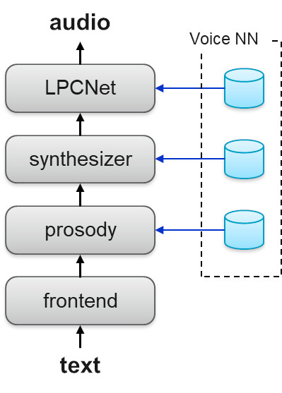

原文： https://www.ibm.com/blogs/research/2019/09/tts-using-lpcnet/ 

作者： [Zvi Kons](https://www.ibm.com/blogs/research/author/zvi-kons/), [Slava Shechtman](https://researcher.watson.ibm.com/researcher/view.php?person=il-SLAVA), and [Alex Sorin](https://researcher.watson.ibm.com/researcher/view.php?person=il-SORIN) 

翻译：[@Chen Quan](https://github.com/chenquan )

# 使用LPCNet的高质量，轻量级和自适应文本语音转换（TTS）

深度学习的最新进展通过更有效地学习说话者的语音和说话方式以及更自然地生成高质量的输出语音，极大地改善了语音合成（TTS）系统的开发。

然而，为了产生这种高质量的语音，大多数TTS系统都依赖于大型且复杂的神经网络模型，这些模型难以训练，甚至在利用GPU时也无法进行实时语音合成。

为了应对这些挑战，我们的IBM Research AI团队开发了一种基于模块化体系结构的神经语音合成新方法，该方法将三个深度神经网络（DNN）与网络输出的中间信号处理相结合。我们在Interspeech 2019的论文“ [使用LPCNet的高质量，轻量级和自适应TTS](https://arxiv.org/abs/1905.00590) ”中介绍了这项工作。[TTS](https://arxiv.org/abs/1905.00590)体系结构轻巧，可以实时合成高质量的语音。每个网络都学习说话者语音的不同方面，从而可以有效地独立训练每个组件。

*图1：TTS系统架构*

我们方法的另一个优势是，一旦对基础网络进行了训练，即使使用少量的训练数据，也可以轻松地将其适应于新的讲话风格或语音，例如用于品牌和个性化目的。

综合过程应用特定于语言的前端模块，该模块将输入文本转换为一系列语言功能。然后依次应用以下三个DNN：

**1.韵律预测**

韵律特征表示为每个TTS单元的二维韵律向量（约为手机[HMM](https://en.wikipedia.org/wiki/Hidden_Markov_model)状态的三分之一），包括该单元的对数持续时间，初始对数间距，最终对数间距和对数能量。这些特征是在训练时学习的，因此可以从合成时前端提取的文本特征中进行预测。韵律非常重要，不仅有助于使语音听起来自然生动，而且在训练或自适应数据中最能代表特定说话者的风格。基于变奏自动编码器（VAE）针对未知说话者进行韵律匹配。有关网络架构的更多详细信息，请参见我们的论文以及[1]。

*图2：韵律生成器的训练和再训练*

**2.声学特征预测**

声学特征向量在短的10毫秒帧处提供语音的频谱表示，从中可以生成实际的音频。声学特征是在训练时学习的，因此可以在合成过程中根据语音标签和韵律对其进行预测。

*图3：合成器网络*

创建的DNN模型代表训练或自适应数据中说话者的声音。该体系结构基于卷积层和循环层，用于提取语音序列和音高模式中的局部上下文和时间相关模式。DNN沿其一阶和二阶导数预测声学特征。随后是最大似然过程和共振峰增强滤波器，有助于生成听起来更好的语音。

**3.神经声码器**

神经声码器负责根据声学特征生成实际语音样本。它针对说话者的自然语音样本及其相应功能进行训练。具体来说，我们是第一个在完全商业化的TTS系统中使用新型，轻便，高质量的神经声码器LPCNet [2]的公司。

这种声码器的新颖之处在于它不会尝试直接通过DNN预测复杂的语音信号。相反，DNN仅预测不太复杂的声门残留信号，然后使用LPC滤波器将其转换为最终语音信号。

*图4：LPCNet神经声码器*

**语音自适应**

根据来自目标说话者的少量数据，通过重新训练这三个网络，可以轻松实现对目标说话者的语音适应。在我们的论文中，我们根据语音质量和与目标说话者的相似性介绍了自适应实验的结果。在此[样本页面](http://ibm.biz/IS2019TTS)中，还提供了适用于八种不同VCTK [3]扬声器（四位男性，四位女性）的适应性[样本](http://ibm.biz/IS2019TTS)。

**听力测试结果**

下图显示了听众测试结果。对于质量评估，MOS（平均意见得分）值基于听众对VCTK说话者的许多合成样本和自然样本给出的平均质量分数（1-5）。为了进行相似性评估，向听众提供了成对的样本，并要求他们评估它们之间的相似性（以1-4为标准）。

我们使用五分钟，十分钟和二十分钟的目标语音以及目标说话人的自然语音，评估了使用女性/男性自适应语音与合成语音的目标说话人的质量和相似性。

测试结果表明，即使语音仅经过5分钟的训练，我们仍可以保持与原始扬声器的高质量和高度相似性。

*图5：质量和相似性听力测试结果*

这项工作是由[IBM Watson](https://medium.com/ibm-watson/ibm-watson-text-to-speech-neural-voices-added-to-service-e562106ff9c7)生产的，是新的IBM Watson TTS服务发行版的基础，该服务版本具有升级的高质量语音（在[IBM Watson TTS](https://text-to-speech-demo.ng.bluemix.net/)演示中选择“ V3”语音）。

*“ [使用LPCNet的高质量，轻量级和自适应TTS](https://arxiv.org/abs/1905.00590) ”的所有作者[对此都](https://arxiv.org/abs/1905.00590)做出了贡献：Zvi Kons，Slava Shechtman，Alex Sorin，Carmel Rabinovitz和Ron Hoory。*

 **参考文献** 

[1] Z. Kons, S. Shechtman, A. Sorin, R. Hoory, C. Rabinovitz and E. Da Silva Morais, “Neural TTS Voice Conversion,” 2018 IEEE Spoken Language Technology Workshop (SLT), Athens, Greece, 2018, pp. 290-296

[2] J. Valin and J. Skoglund, “LPCNET: Improving Neural Speech Synthesis through Linear Prediction,” ICASSP 2019, Brighton, United Kingdom, 2019, pp. 5891-5895

[3] Veaux, Christophe; Yamagishi, Junichi; MacDonald, Kirsten. (2017). “CSTR VCTK Corpus: English Multi-speaker Corpus for CSTR Voice Cloning Toolkit”, [sound]. University of Edinburgh. The Centre for Speech Technology Research (CSTR). https://doi.org/10.7488/ds/1994