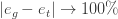

原文：https://calculatedcontent.com/2018/04/01/rethinking-or-remembering-generalization-in-neural-networks/ 

作者： [**Charles H Martin, PhD**](https://calculatedcontent.com/author/charlesmartin14/) 

翻译：[muzhoubai](https://github.com/muzhoubai)

#          神经网络中的重新思考或记忆化  

我刚从ICLR 2019回来，并在AI理论物理研讨会上展示了2张海报（Michael做了很好的演讲！）。 令我惊讶的是，有些人仍然认为VC理论适用于深度学习，而令人惊讶的是Deep Nets可以过度拟合随机标记的数据。 来龙去脉是什么 ？ 让我分享我对此的看法的更新版本。

去年ICLR 2017上，谷歌发表了一篇非常有趣的论文，声称“了解深度学习需要重新考虑泛化”，基本上是在问，VC理论为什么不适用于深度学习？作为回应，加州大学伯克利分校的迈克尔·马奥尼（Michael Mahoney）和我发表了这样的回应：重新思考泛化需要从统计力学重新审视旧观念……

在这篇文章中，我讨论了本文动机的一部分。

 

**走向学习理论**

在传统的监督式机器学习理论（即VC，PAC）中，我们尝试了解什么是算法学习的充分条件。 为此，我们寻求即使在最坏的情况下也可以学习的数学保证。

最糟糕的情况是什么？ 当然，我们学习随机噪声中的模式。

理论分析：一个实际的例子

“在理论上，理论和实践是相同的。 实际上，它们是不同的。”

 

Google的论文分析了神经网络的Rademacher复杂性。 这是什么，为什么有意义？ Rademacher的复杂度衡量模型在数据中适合随机噪声的程度。 让我提供一种实际的思考方式：想象一下，有人给您m个训练示例，将其标记为$\ mathb f {X}，\ mathbf {y}$数据，并要求您建立一个简单的模型。 您如何知道数据未损坏？

如果您可以建立一个简单的模型，并且在套用集上非常准确，那么您可能会认为自己很好。你确定吗 ？一个非常简单的测试是将所有标签随机化，然后重新训练模型。保持结果应该不比随机结果好，否则很不对劲。

我们的实际示例是以下示例的变体：

建立一个简单的模型。就像线性SVM。然后优化。假设我们获得了95％的训练准确度和90％的测试（一般化）准确度，这是相当不错的。

将训练数据中的某些标签随机化。就像％10。当然，您现在可能会过度训练。因此，再次优化。这意味着调整正则化。重复多次（即100x）。找到最糟糕的训练和概括精度。

通过规范化模型，我们期望可以减少模型容量，并避免过度训练。那么会发生什么呢？

 

1、简单案例：如果数据确实很干净，并且由于第一个模型（1）很好，我们可以预期，最差的训练精度（2）应该比第一个模型低约10％。毕竟，如果在数据中添加了噪声，您怎么能很好地概括？因此，对于（2），我们可能会发现训练精度为85％，泛化精度为90％。

2、困难案例：最差的训练准确性（2）仍然是95％。泛化精度保持在80％左右。您随机分配了10％的标签，但没有真正改变吗？您只是训练过度吗？还是标签损坏了？

记住，我们选择了一个非常简单的线性SVM。它有1个可调参数-正则化参数。也许那甚至没有太大变化。而且，如果您过度训练，则训练误差将为零，并且泛化误差会更大。

因此，数据损坏了。并要求您使用非常嘈杂的数据建立良好的模型。去过那里，这没什么好玩的。

注意，在两种情况下，训练误差$e_ {t}$和泛化误差$e_ {g}$的差值几乎保持固定或至少有界

 

3、病理案例：Google论文声称：“即使失落和体重下降，Inception V3仍然能够很好地适应随机训练集。”但泛化精度不高。

似乎无论标签如何，有些深网都可以容纳任何数据集？ 即使使用标准正则化。 但是像VC和PAC理论这样的计算学习理论表明，应该有一些正则化方案来减少模型的容量并防止过度训练。那么，Deep Nets如何如此出色地推广？ 这是难题。

神经网络的有效VC维度：Vapnik和LeCun

在我们学习统计力学之前，我首先提到Vapnik，Levin和LeCun的一篇旧论文，《测量学习机的VC维度》（1994年）。

众所周知，VC边界太松散而没有实际用途。但是，可以为线性分类器测量有效的VC维度。只需在增加数据大小的同时测量误差的最大差异，并将其拟合为合理的函数即可。实际上，这种有效的VC调光在许多情况下似乎很普遍。

“将这项工作扩展到多层网络面临[许多]困难。不能将现有的学习算法视为将网络可实现的全部功能的经验风险降到最低……[因为]很可能……搜索将仅限于[这些]函数的子集...此集合的容量可能远低于整个集合的容量... [并且]可能随观察次数而变化。这可能需要一种理论来考虑具有“活动”功能子集的非恒定容量的概念”。

因此，甚至是Vapnik本人也可以怀疑，追溯到1994年，他自己的理论并未直接应用于神经网络！

是什么改变了人们的想法？他们开始意识到，DNN中的损失函数（和能级$E [（W，b）]）$实际上可能是凸的。但这在90年代后期也众所周知

事情就是这样-只是因为问题在本地看起来很凸，并不意味着它在全球范围内都很复杂。也就是说，在Vapnik的功能子集中，“能源格局”和/或“损失”在局部看起来是凸的。因此，作为一个老人，我并不感到惊讶。

既然我们进入了过去……那么旧的物理学怎么说？

统计力学：

在物理学中，VC理论只是关于统计学习机制的300页书中的一页附录。但是请不要全部阅读，让我给您提供执行摘要：

热力学极限

我们认为，查看最坏情况边界的整个想法与我们在实践中实际所做的不一致，因为我们有效地考虑了一个不同的限制，而不只是固定m并让N增长（反之亦然）。

我们很少会向深度网络添加更多数据（m）。相反，我们通常也会增加网络（N）的大小，因为我们知道我们可以从数据中捕获更详细的功能/信息。因此，为了赢得练习，我们将同时增加m和N。

在统计力学中，我们还考虑了连接极限$m，N \rightarrow \infty…$，但比率m / N是固定的。

但是，这两种想法并非完全不兼容。实际上，Engle…给出了在热力学极限中将VC边界应用于模型问题的很好的示例。

典型行为和相行为

与试图限制模型最坏情况的VC / PAC理论相反，统计力学试图准确描述模型的典型行为。但是典型的并不仅仅意味着最可能的。我们要求将非典型的情况任意减小-在热力学极限范围内

之所以可行，是因为相关热力学量（例如，最可能的平均能量）的概率分布在其最大值附近急剧达到峰值。

许多结果在《学习统计力学》中众所周知。分析要复杂得多，但结果导致结构更丰富，可以解释深度学习中的许多现象。

特别是，众所周知，统计中的许多界限变得微不足道，或者不适用于非平滑概率分布，或者当变量采用离散值时。在神经网络中，由于不连续（在激活函数中），会出现非平凡的行为，从而导致相变（在热力学极限中出现）。

学习的三个阶段

对于典型的神经网络，可以识别系统的3个阶段，由负载参数$\alpha = \dfrac {m}{N}$控制，训练数据量m相对于可调网络参数N的数量（并且忽略其他旋钮）

 

记住：$\alpha$非常小。

过度训练：$\alpha$太小

泛化$\alpha$大

现在，也许整个问题就在于Deep Nets具有如此之大的容量以至于他们正在记住（$\alpha$很小）。

一般而言，记忆类似于原型学习，原型学习只需要一个示例即可描述每类数据。这出现在某些简单的文本分类问题中，然后可以使用Convex NMF解决（请参阅我先前的博客文章）。

也许DNN正在记忆？但让我们提出一个替代方案：

什么是过度训练？

在SLT中，过度训练是系统的一个完全不同的阶段，其特征是一种病理性的非凸性-无限数量的（退化的）局部最小值，由无限高的障碍隔开。这就是所谓的（平均场）自旋玻璃相。

SLT过度培训/自旋玻璃相具有无限多个深度最小值

 

那么，为什么这对应于数据的随机标记呢？ 假设我们有一个二进制分类器，并且我们随机化了L个标签。 这为2 ^ {L}提供了新的可能的标签：

原始训练数据的不同随机标记

 

我们在论文中指出，这降低了有效负载$\alpha$。 如果$L \ll N$非常小，那么$\alpha$不会有太大变化，我们将停留在泛化阶段。 但是，如果$L \sim \mathcal {O}(N)$约为N（例如10％），则$\alpha$可能会减小到足以使我们进入过度训练阶段。

每个随机标记对应于全球能源格局$E_DNN（[W，b]）$上的一个不同的，深的（几乎）简并极小值

此外，我们现在有$2 ^ {L}$个新的，可能无法满足的分类问题。

当然，每个问题都有不同的损失函数……因此它们天真的看起来像是不同的问题。但是所有这些解决方案都产生了一个最终的，经过训练的神经网络，该网络具有共享的最终“能源格局” E_DNN（[W，b]），仅由最终的权重和训练中的学习偏差来定义。

因此，最终的能源格局将几乎退化。但是其中许多将很难学习，因为许多标签是错误的，因此解决方案可能具有很高的能源壁垒-即它们很难找到，也很难摆脱。

因此，我们假设通过随机分配大部分标签，将系统推入“过度训练/旋转玻璃”阶段-这就是为什么传统VC样式正则化无法正常工作的原因-无法将我们带出这个阶段。至少，这就是理论。

要了解更多信息，请参阅《学习统计力学》 Engle和Van der Broeck的著作。