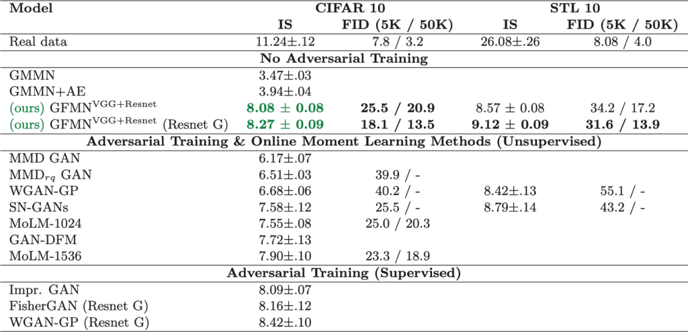

原文： https://www.ibm.com/blogs/research/2019/10/learning-implicit-generative-models/ 

作者： [Inkit Padhi](https://www.ibm.com/blogs/research/author/inkit-padhi/) and [Youssef Mroueh](https://www.ibm.com/blogs/research/author/youssef-mroueh/) 

翻译：[@Chen Quan](https://github.com/chenquan )

**通过匹配感知特征学习隐式生成模型**

计算机视觉社区在通过大型数据集上的预训练模型训练深度卷积神经网络（DCNN）方面取得了成功，从而在对象检测，样式转换，视频识别和超分辨率方面实现了最新的性能。这些功能被称为感知功能（PF），可用于通过微调或转移学习来解决其他问题。但是，存在一个子问题，这些PF的丰富程度未得到充分探讨：隐含的生成模型。

 我们可以使用PF来学习隐式生成模型吗？我们在10月31日上午9:18在韩国首尔举行的[ICCV 2019上](http://iccv2019.thecvf.com/)以口头报告的形式介绍了“ [通过匹配感知特征学习隐式生成模型](https://arxiv.org/abs/1904.02762) ”这一问题，我们试图回答这个问题。（地点：口头3.1A ，D1厅）。该代码可在GitHub上找到：[https](https://github.com/IBM/gfmn)：[//github.com/IBM/gfmn](https://github.com/IBM/gfmn)。 

特别是，我们提出了一种新的“矩匹配”方法，该方法通过匹配从预训练卷积神经网络提取的PF的统计信息来学习隐式生成模型。我们称此框架为生成特征匹配网络（GFMN），该框架通过匹配从预训练的DCNN的所有卷积层提取的均值和协方差统计信息来学习隐式生成模型。

基于最大平均差异（MMD）的方法通过将两个分布嵌入到无限维映射中来捕获它们之间的差异。定义内核（或相似性度量）以区分真实样本和机器生成的样本具有挑战性。现有解决方案之一涉及使用对抗训练来在线学习内核功能。但是，对抗训练涉及最小-最大优化训练，这可能导致不稳定。我们提出的方法通过以下方式克服了现有最小-最大策略的缺点：

1. 非对抗性：不应对最小-最大优化的挑战
2. 感知特征（PF）和固定特征匹配：不涉及内核功能的在线学习，而是利用感知特征的丰富性及其区分真实数据和机器生成数据的能力
3. 可扩展：涉及基于ADAM的移动平均线；容纳较小的批量

**近距离观察**

  

E = Pre-trained Feature Extractor (PF)

𝓏**i**= Noise Signal

μ jp-data = Features Mean of Real Data

X̂i = Generated Image = G(zi,q)

为了训练GFMN，我们使用从正态分布采样的噪声矢量，并将其传递给神经网络生成器。我们获取这些生成图像的PF，并尝试将其统计信息（均值/方差）与实际训练数据统计信息进行匹配。由于GPU可扩展性问题，我们仅匹配对角协方差，而不是完全协方差。可以在训练开始之前预先计算训练数据的统计信息。

**ADAM移动平均线**

为了更好地估计生成图像的统计量，我们需要一个大的小批量。有限的GPU功能很难做到这一点。为了解决这个问题，我们对真实图像和生成图像应用了统计之间差异的移动平均值（MA）。

  

 Vj =第j层统计差异的移动平均值 

 在训练期间，我们还可以借助ADAM优化器优化MAs损失值来估计更好的MA。 

  

**特征提取器的类型**

为了研究PF的丰富度对学习隐式生成模型的影响，我们主要尝试了两个特征提取器：

1. 来自自动编码器的PF：在这里，我们训练一个自动编码器，其中解码器具有与生成器相似的签名（DCGAN）。经过训练后，我们将编码器用作特征提取器。

   i）编码器：DCGAN鉴别器/ VGG19

   ii）解码器：DCGAN / ResNet

2. 分类器中的PF：我们使用各种DCNN模型（VGG19-Resnet18）在大型数据集上进行有监督的预训练，并将其用作特征提取器。由于任务的性质，这些特征似乎比自动编码器提取的特征更丰富的信息。

**实验**

我们在CIFAR10数据集上使用预先训练的自动编码器或跨域分类器作为特征提取器对GFMN-进行了基准测试。根据两个指标评估生成的图像：初始分数IS（越高越好）和Fchetchet初始距离FID（越低越好）。当我们使用预训练的VGG19和Resnet18中的PF以及类似于Resnet的Generator架构时，我们将获得最佳性能。

此外，我们还在CIFAR10和STL10上针对各种现有的对抗和非对抗生成模型对GFMN进行了基准测试。GFMN与大多数方法（包括最新的频谱GAN（SN-GAN））相比具有可比性或更好。

