# Improving forecasting accuracy of time series data using a new ARIMA-ANN hybrid method and empirical mode decomposition

## 摘要

不同域中的许多应用程序会产生大量的时间序列数据。对许多决策者而言，做出准确的预测至关重要。存在各种时间序列预测方法，它们分别使用线性和非线性模型或两者结合使用。研究表明，线性模型和非线性模型的组合可以有效地提高预测性能。但是，这些现有方法所做的一些假设可能会限制它们在某些情况下的性能。我们提供了一种新的自回归综合移动平均（ARIMA）-人工神经网络（ANN）混合方法，该方法可在更通用的框架中工作。实验结果表明，在整个杂交过程中分解原始数据以及组合线性和非线性模型的策略是预测方法性能的关键因素。通过使用适当的策略，我们的混合方法可以有效地提高传统混合方法以及单独使用的任何一种方法获得的预测准确性。

**关键词：时间序列预测，ANN，ARIMA，混合方法，经验模式分解（EMD）**

### 1.Introduction and related work

Time series include data points listed in time order. It is generally a sequence of discrete-time data which consists of points equally spaced in time. In time series forecasting, we try to predict the future points by analyzing observed points in the series. It has been widely used in various applications of science, engineering, and business fields. However, time series data might show different characteristics and show increasing or decreasing trends. Some time series has seasonal trends in which variations are specific to a particular time range, e.g coat and boot sales increase in winter season while decrease in summer season. On the other hand, some time series are not seasonal, such as stock market data. Moreover, time series data might show different level of volatility. While USD/EUR (United States dollar/Euro) exchange rate shows high volatility, growth of an animal, plant, or human being show a linear change. Over past several decades, a considerable effort has been devoted to develop and improve time series forecasting models [1]. In the literature, various forecasting methods have been proposed which use linear and nonlinear models separately or combination of both. In this paper, we propose a hybrid algorithm of linear and nonlinear methods where we choose Autoregressive Integrated Moving Average (ARIMA) as a linear method and Artificial Neural Networks (ANNs) as a nonlinear method.

### 1.引言及相关工作

时间序列包括按时间顺序列出的数据点。通常，它是一系列离散时间数据，由时间间隔相等的点组成。在时间序列预测中，我们尝试通过分析序列中的观察点来预测未来点。它已广泛用于科学，工程和商业领域的各种应用中。但是，时间序列数据可能显示出不同的特征，并显示出增加或减少的趋势。某些时间序列具有季节性趋势，其中特定时间范围内存在特定的变化，例如，冬季的外套和靴子销量增加而夏季的销量减少。另一方面，某些时间序列不是季节性的，例如股市数据。此外，时间序列数据可能显示不同程度的波动性。尽管美元/欧元（美元/欧元）汇率显示出高波动性，但动植物或人类的生长却呈线性变化。在过去的几十年中，已经投入了大量精力来开发和改进时间序列预测模型[1]。在文献中，已经提出了各种预测方法，它们分别使用线性和非线性模型或两者结合使用。在本文中，我们提出了一种线性和非线性方法的混合算法，其中选择自回归综合移动平均（ARIMA）作为线性方法，选择人工神经网络（ANN）作为非线性方法。

ARIMA is widely used linear time series forecasting method that is used in numerous applications including finance [2], engineering [3], social sciences [4], and agriculture [5]. ARIMA models are integration of Autoregressive models (AR) and Moving Average models (MA). The model building process of ARIMA depends on Box-Jenkins methodology [6] where it provides a step-by-step procedure for AR and MA analysis. ARIMA models give good accuracy in forecasting relatively stationary time series data. However it makes a strong assumption that the future data values are linearly dependent on the current and past data values. In addition, it also assumes that there is no missing data in the given time series [7]. However, many real world time series data presents complex nonlinear patterns which might not be modeled by ARIMA effectively.

ARIMA是广泛使用的线性时间序列预测方法，在许多应用中使用，包括金融[2]，工程[3]，社会科学[4]和农业[5]。ARIMA模型是自回归模型（AR）和移动平均模型（MA）的集成。ARIMA的模型构建过程取决于Box-Jenkins方法[6]，它为AR和MA分析提供了逐步的过程。ARIMA模型在预测相对平稳的时间序列数据时具有良好的准确性。但是，它有一个很强的假设，即将来的数据值线性依赖于当前和过去的数据值。另外，它还假定在给定的时间序列中没有丢失数据[7]。但是，许多现实世界的时间序列数据都呈现出复杂的非线性模式，ARIMA可能无法有效地对其建模。

For the nonlinear time series modeling, Artificial Neural Networks (ANNs) are one of the most widely used algorithms [8] in many fields, such as finance [9], energy [10], hydrology [11], and network communications [12]. ANNs have several advantages over ARIMA and other forecasting models. Firstly, ANNs are capable of fitting a complex nonlinear function, therefore it does not need to make data stationary as ARIMA does. This ability helps ANNs to approximate any continuous measurable function with arbitrarily desired accuracy [13], [14]. Moreover, ANNs are adaptively data-driven in nature which means ANN models can be adaptively formed based on the features of time series data [15].

对于非线性时间序列建模，人工神经网络（ANN）是许多领域中使用最广泛的算法之一[8]，例如财务[9]，能源[10]，水文学[11]和网络通信[12]。 ]。与ARIMA和其他预测模型相比，人工神经网络具有多个优势。首先，人工神经网络能够拟合复杂的非线性函数，因此它不需要像ARIMA那样使数据保持平稳。这种能力可以帮助人工神经网络以任意期望的精度逼近任何连续的可测量函数[13]，[14]。而且，人工神经网络本质上是自适应数据驱动的，这意味着可以基于时间序列数据的特征自适应地形成人工神经网络模型[15]。

In the literature, there are studies which show the success of linear and nonlinear methods over each other. For example, [16, 17, 18] report that statistical and linear models give better results than ANNs. On the other hand, [19, 20, 21] report that ANN performs better than linear models when data exhibit high volatility and multicollinearity.

在文献中，有研究表明线性方法和非线性方法相互之间的成功。例如，[16，17，18]报告说，统计模型和线性模型比人工神经网络具有更好的结果。另一方面，[19，20，21]报告说，当数据表现出高波动性和多重共线性时，ANN的性能优于线性模型。

In short, each type of model outperform in different domains. It is apparent that there is no universal model which is suitable for all circumstances. In order to overcome this limitation, various hybrid techniques have been proposed which aim to take advantage of the unique strength of each different type of models. The common practice in hybrid techniques is to decompose time series data into its linear and nonlinear forms, then use appropriate type of models on them separately. A hybrid ANN-ARIMA model proposed by Zhang [15] achieves more accurate forecast results in time series data as compared to using individual models, in applications such as electricity price forecasting [22] and water quality prediction [23]. Another successful hybrid ARIMA-ANN technique is presented by Khashei and Bijari [24] which defines functional relationship between components. Moreover, Babu and Reddy [25] offers a solution to volatility problem in time series data by smoothing out dataset with moving average filter. Each hybrid method in the literature bring different perspectives to time series forecasting problem. However strong assumptions that these methods make might degenerate their performances if the contrary situations occur. [15] and [24] do not decompose time series data into linear and nonlinear components. Rather, they assume that linear component of the data is the output of the ARIMA model. Moreover, [15] and [25] assume that the output of their hybrid methods is linear combination of components. However, different datasets can suggest different type of relationships between output and the components. In this study, we propose a novel hybrid method for time series forecasting which aims to overcome the limitations of the traditional hybrid methods by eliminating the need to make strong assumptions. In this method, nature of nonlinearity is first characterized by the help of moving-average (MA) filter, then ARIMA is applied to the linear component. In the final step, ANN is used to combine the output of ARIMA, the nonlinear component, and the original data. Three benchmark datasets, the Wolf’s sunspot data, the Canadian lynx data, and the British pound/US dollar exchange rate data and an additional public dataset, Turkey Intraday Electricity Market Price data are used in order to show the effectiveness of the proposed method in time series forecasting.

简而言之，每种类型的模型在不同的领域都表现出色。显然，没有适用于所有情况的通用模型。为了克服这一限制，已提出了各种混合技术，旨在利用每种不同类型模型的独特优势。混合技术的常规做法是将时间序列数据分解为线性和非线性形式，然后分别在其上使用适当类型的模型。Zhang [15]提出的混合ANN-ARIMA模型在电价预测[22]和水质预测[23]等应用中，与使用单个模型相比，可以在时间序列数据中获得更准确的预测结果。Khashei和Bijari [24]提出了另一种成功的ARIMA-ANN混合技术，它定义了组件之间的功能关系。此外，Babu和Reddy [25]通过用移动平均滤波器平滑数据集，为时间序列数据中的波动性问题提供了解决方案。文献中的每种混合方法都为时间序列预测问题带来了不同的见解。但是，如果发生相反的情况，这些方法所做的强大假设可能会使它们的性能下降。 [15]和[24]没有将时间序列数据分解为线性和非线性分量。相反，他们假设数据的线性成分是ARIMA模型的输出。此外，[15]和[25]假设他们的混合方法的输出是成分的线性组合。但是，不同的数据集可以建议输出和组件之间关系的不同类型。在这项研究中，我们提出了一种用于时间序列预测的新型混合方法，旨在通过消除进行强大假设的需要来克服传统混合方法的局限性。在这种方法中，首先通过移动平均（MA）滤波器来表征非线性的性质，然后将ARIMA应用于线性分量。在最后的步骤中，使用ANN组合ARIMA的输出，非线性分量和原始数据。使用三个基准数据集，即沃尔夫的黑子数据，加拿大山猫数据和英镑/美元汇率数据，以及一个附加的公共数据集，即土耳其当日电市场价格数据，以及时显示所提出方法的有效性系列预测。

In addition, we propose an improvement to all hybrid methods mentioned in this paper, including ours, by adding Empirical mode decomposition (EMD) technique [26] to the models. When accuracy results of the hybrid methods with different types of datasets are compared, we observe that accuracy performance gets better with the increasing level of linearity in time series. Then, time series data can be considered as a merge of sub-series which each of them demonstrates more linearity. For this purpose, a well-known multiscale decomposition technique, EMD is used in the proposed hybrid method. The components achieved by EMD are relatively stationary and have simpler frequency range which make them strongly correlated in themselves. Thus, more accurate predictions can be obtained through the models [27, 28].

另外，通过对模型添加经验模式分解（EMD）技术[26]，我们提出了对本文中提到的所有混合方法（包括我们的方法）的改进。当比较不同类型数据集的混合方法的精度结果时，我们观察到精度性能随着时间序列线性度的提高而变得更好。然后，可以将时间序列数据视为子序列的合并，每个子序列都显示出更高的线性度。为此，在提出的混合方法中使用了众所周知的多尺度分解技术EMD。通过EMD实现的组件是相对固定的，并且具有更简单的频率范围，这使其本身具有很强的相关性。因此，可以通过模型[27、28]获得更准确的预测。

The rest of the paper is organized as follows. In the next section, we present existing different time series forecasting methods. In section 3 we present our proposed model. In Section 4, we show the evaluation results of our model and present comparison results with the other methods. In section 5, we present the positive effect of using EMD technique with the hybrid methods and our new method. We show that our method consistently outperforms other linear, nonlinear and even hybrid methods.

本文的其余部分安排如下。在下一节中，我们将介绍现有的不同时间序列预测方法。在第3节中，我们介绍我们提出的模型。在第4节中，我们展示了模型的评估结果，并提出了与其他方法的比较结果。在第5节中，我们介绍了将EMD技术与混合方法和我们的新方法结合使用的积极效果。我们证明了我们的方法始终优于其他线性，非线性甚至混合方法。

### 2.Time series forecasting methods

### 2.时间序列预测方法

In order to give overall review before we present our method, we want to give a brief information about other time series forecasting methods, such as ARIMA, ANN, and the well-known hybrid methods.

为了在介绍我们的方法之前进行全面回顾，我们想简要介绍其他时间序列预测方法，例如ARIMA，ANN和众所周知的混合方法。

#### 2.1. Autoregressive Integrated Moving Average Method

#### 2.1 自回归综合移动平均法

ARIMA is a linear method which means future value of a variable to be forecasted is assumed to be linear function of past observations. As a consequence, time series data that is fed to ARIMA is expected to be linear and stationary. The method is composed of three main steps in order: Identification, estimation parameters and forecasting steps. In the identification step, stationarity check is performed on given time series data. A stationary time series’ statistical characteristics such as mean and autocorrelation patterns constant over time. When a trend or heteroscedasticity is observed on a time serie data, differencing or power transformation methods are generally applied to remove the trend and make variance stabilize. If stationary property is not satisfied after first attempt, differencing (or power transformation) method is performed continuously until non-stationary property is disposed. If this operation is performed d times, the integration order of ARIMA model is set to be d. Thereafter, an autoregressive moving average(ARMA) is applied on the resultant data as follows: Let the actual data value is $y_t$ and random error $\epsilon_t$ at any given time t. This actual value  is considered as a linear function of the past p observation values, say  $y_{t-1},y_{t-2},\dots,y_{t-p}$  and $p$ random erros, say  $\epsilon_t,\epsilon_{t-1},\dots,\epsilon_{t-q}$ . The corresponding ARMA equation is given in the following equation:

$$
y_t = a_1y_{t-1}+a_2y_{t-2}+\dots+a_py_{t-p}+\epsilon_t+\theta_1\epsilon_{t-1}-\theta_2\epsilon_{t-2}-\dots-\theta_q\epsilon_{t-q}
$$

ARIMA是一种线性方法，这意味着要预测的变量的未来值被假定为过去观测值的线性函数。结果，预计馈送到ARIMA的时间序列数据是线性且固定的。该方法按顺序由三个主要步骤组成：识别，估计参数和预测步骤。在识别步骤中，对给定的时间序列数据执行平稳性检查。固定时间序列的统计特征，例如均值和自相关模式随时间恒定。当在时间序列数据上观察到趋势或异方差时，通常采用差异或幂变换方法来消除趋势并使方差稳定。如果在第一次尝试后仍未满足固定属性，则将连续执行差分（或功率变换）方法，直到处置非固定属性为止。如果执行此操作d次，则ARIMA模型的积分顺序将设置为d。此后，将自回归移动平均值（ARMA）应用于结果数据，如下所示：假定实际数据值为 $y_t$，并且在任何给定时间t为随机误差 $p$ 。该实际值被认为是过去$p$个观察值的线性函数，例如 $y_{t-1},y_{t-2},\dots,y_{t-p}$  和$q$个随机错误，例如 $\epsilon_t,\epsilon_{t-1},\dots,\epsilon_{t-q}$ 。下式给出了相应的ARMA公式：

$$
y_t = a_1y_{t-1}+a_2y_{t-2}+\dots+a_py_{t-p}+\epsilon_t+\theta_1\epsilon_{t-1}-\theta_2\epsilon_{t-2}-\dots-\theta_q\epsilon_{t-q}
$$

In Equation 1, the coefficients from $a_1$ to $a_p$ are Autoregression coefficients, $\theta_1$ to$\theta_q$are Moving Average coefficients. Note that random errors$\epsilon_t$ are identically distributed with a mean of zero and a constant variance.

在等式1中，从$a_1$到$a_p$的系数是自回归系数，从$\theta_1$到 $\theta_q$的系数是移动平均系数。请注意，随机误差均$\epsilon_t$ 等地分布，均值为零且方差恒定。

Similar to the d parameter, p and q coefficients are referred to as the orders of the model. When q equals to zero, the model is reduced to AR model of order p. If p is equal to zero, the model becomes MA model of order q. The main issue in ARIMA modeling is to determine the appropriate model orders ($p,d,q$ ). In order to estimate order of the ARIMA model, Box and Jenkins [6] proposed to use correlation analyses tools, such as the autocorrelation function (ACF) and the partial autocorrelation function (PACF). When model coefficient estimation is finalized, the future values of the time series data are forecasted using available past data values and estimated model coefficients.

类似于d参数，p和q系数被称为模型的阶数。当q等于零时，将模型简化为p阶的AR模型。如果p等于零，则模型变为q阶的MA模型。ARIMA建模中的主要问题是确定适当的模型顺序（$p,d,q$）。为了估计ARIMA模型的阶数，Box和Jenkins [6]提出使用相关分析工具，例如自相关函数（ACF）和部分自相关函数（PACF）。完成模型系数估计后，将使用可用的过去数据值和估计的模型系数来预测时间序列数据的未来值。

2.2. Artificial Neural Networks Method ANN provides flexible computation framework for nonlinear modeling in wide range of applications. Due to its flexible architecture, number of layers and the neurons at each layer can be easily varied. In addition, ANN does not require any prior assumption, such as data stationarity, in model building process. Therefore, the network model is largely determined by the characteristics of the data.

2.2。人工神经网络方法ANN为广泛应用中的非线性建模提供了灵活的计算框架。由于其灵活的架构，层数和每一层的神经元都可以轻松变化。此外，在模型构建过程中，ANN不需要任何先验假设，例如数据平稳性。因此，网络模型在很大程度上取决于数据的特征。

The architecture of the most widely used ANN model in time series forecasting, which is also called as multilayer perceptrons, contains three-layers. The neurons of the processing units are acyclically linked. In order to model time series data using such a network, nonlinear function f of $y_t$ sequence from $y_{t-1}$ to$y_{t-N}$is constructed as shown in the following equation: 
$$
y_t = w_0 + \sum_{j=1}^{H}w_jf(w_{0j}+\sum w_{ij}y_{t-i}) +e_t
$$
where, at any given time $t$, $w_{ij}$and  $w_j$are model weights and H and N are the number of hidden and input nodes, respectively. In this equation, $e_t$corresponds to a noise or error term. The transfer function of the hidden layers f in ANN architecture is generally a sigmoid function.

时间序列预测中使用最广泛的ANN模型的架构（也称为多层感知器）包含三层。处理单元的神经元无环连接。为了使用这样的网络对时间序列数据建模，$y_{t-1}$到y_{t-N}的$y_t$序列的非线性函数f如下式所示：
$$
y_t = w_0 + \sum_{j=1}^{H}w_jf(w_{0j}+\sum w_{ij}y_{t-i}) +e_t
$$
其中在任何给定时间$t$处， $w_{ij}$和  $w_j$是模型权重，H和N分别是隐藏节点和输入节点的数量。在该等式中，$e_t$对应于噪声或误差项。ANN体系结构中隐藏层f的传递函数通常是S型函数。

The power of ANN comes from its flexibility to approximate any continuous function by changing the number of layers N and hidden nodes H. The choice of number of layers and the nodes at each of them play important role in ANNs’ forecasting performance. Large numbers of N and H can give very high training accuracies, but since it tends to memorize the training data, it suffers from overfitting. On the other hand, a too simple network of ANN leads to poor generalization. Unfortunately, there is no systematic set of rules to decide the value of these parameters. Thus, extensive number of experiments are required to tune functions and the parameters.

ANN的强大之处在于其灵活性，可以通过更改层数N和隐藏节点H来近似任何连续函数。层数的选择以及每个层的节点在人工神经网络的预测性能中起着重要作用。大量的N和H可以提供非常高的训练精度，但是由于它倾向于记忆训练数据，因此会导致过度拟合。另一方面，ANN网络太简单会导致泛化不佳。不幸的是，没有一套系统的规则来决定这些参数的值。因此，需要大量的实验来调整功能和参数。

#### 2.3 Zhang的混淆方法

For time series forecasting, Zhang proposed a hybrid ARIMA-ANN model[15]. According to this model, it is assumed that time series data is a sum of linear and nonlinear components, given in the form of:

$$
y_t = L_t+N_t
$$

对于时间序列预测，张提出了一种混合ARIMA-ANN模型[15]。根据此模型，假设时间序列数据是线性和非线性分量的总和，形式为：
$$
y_t = L_t+N_t
$$

where $L_t$ denotes the linear and $N_t$denotes the nonlinear component.

Firstly, ARIMA is used with the given time series data and linear forecasts are obtained. Residuals from linear component is assumed to contain only nonlinear relationship. This method uses ARIMA to make forecast from the linear component and ANN from the nonlinear component. Then, these models are combined to improve overall forecasting performance. This method gives better foreceasting accuracy than using ARIMA and ANN methods individually, as seen in the experimental results in three well-known real data sets - the Wolfs sunspot data, the Canadian lynx data, and the British pound/US dollar exchange rate data.

其中$L_t$ 表示线性，而 $N_t$表示非线性分量。

首先，将ARIMA与给定的时间序列数据一起使用，并获得线性预测。假定线性分量的残差仅包含非线性关系。该方法使用ARIMA从线性分量进行预测，并从非线性分量进行预测。然后，将这些模型组合起来以提高整体预测性能。这种方法比分别使用ARIMA和ANN方法提供更好的预测准确性，如在三个著名的真实数据集中的实验结果中看到的那样-沃尔夫斯黑子数据，加拿大山猫数据和英镑/美元汇率数据。

#### 2.4 Khashei and Bijari's Hybrid Method

For time series forecasting, Khashei and Bijari proposed another hybrid ARIMA-ANN [24]. Similar to Zhang’s model, this model also assumes that any time series data is composed of linear and nonlinear components. Likewise, ARIMA is used to extract linear component and make forecast on it and residuals, which are nonlinear components, are fed into ANN along with the original data, and linear forecast of ARIMA output. The difference from the Zhang’s model is to avoid the assumption that the relationship between linear and nonlinear components is additive. Rather, this method builds functional relationship between the components as shown in the following equation:

$$
y_t = L_t+N_t
$$

where $L_t$ denotes the linear and $N_t$denotes the nonlinear component

对于时间序列预测，Khashei和Bijari提出了另一种混合ARIMA-ANN [24]。与Zhang的模型类似，该模型还假定任何时间序列数据都由线性和非线性成分组成。同样，ARIMA用于提取线性成分并对其进行预测，而作为非线性成分的残差将与原始数据一起馈入ANN，并对ARIMA输出进行线性预测。与张氏模型的不同之处在于避免了线性和非线性成分之间的关系是可加的假设。而是，此方法建立了组件之间的功能关系，如以下等式所示：
$$
y_t = L_t+N_t
$$

其中$L_t$ 表示线性，而 $N_t$表示非线性分量。

In addition, one may not guarantee that the residuals of the linear component may comprise valid nonlinear patterns. Khashei and Bijari suggest that residuals should not put into ANN as an input alone.

另外，可能不能保证线性分量的残差可以包括有效的非线性模式。Khashei和Bijari建议不要将残差单独作为输入输入ANN。

The hybrid ARIMA-ANN method proposed by Babu and Reddy [25] integrates moving average filter into hybrid ANN-ARIMA model. Like other methods, this model also assumes that any time series data is composed of linear and nonlinear components. However, this study emphasizes that neither Zhang nor Khashei and Bijari’s methods decompose original time series data into its linear and nonlinear components; instead, they use a linear ARIMA model to extract the linear component and the error sequences is assumed to be nonlinear component. On the other hand, this study separates the linear and nonlinear components, then feed them into appropriate methods.

Babu和Reddy [25]提出的混合ARIMA-ANN方法将移动平均滤波器集成到混合ANN-ARIMA模型中。与其他方法一样，该模型还假设任何时间序列数据都由线性和非线性成分组成。但是，这项研究强调，无论是Zhang还是Khashei和Bijari的方法都不会将原始时间序列数据分解为线性和非线性成分。取而代之的是，他们使用线性ARIMA模型提取线性分量，并且错误序列被假定为非线性分量。另一方面，本研究将线性和非线性分量分开，然后将它们输入适当的方法。

This method tries to fix Moving Average (MA) filter length until kurtosis value of the data becomes approximately 3. Kurtosis is a shape of a probability distribution which measure thickness or heaviness of the tails of a distribution. The kurtosis value is 3 if the data has normal distribution. Shortly, the method aims to find out normal distributed component, which shows low volatility, in time series data by using kurtosis value. When the low-volatile component is separated from the original data, high-volatile component, which is assumed to be nonlinear, is achieved. In the final step, like in Zhang’s method, the decomposed components are fed into ARIMA and ANN accordingly and forecast results are summed up to achieve final forecast.

该方法尝试固定移动平均（MA）滤波器的长度，直到数据的峰度值变为大约3。峰度是概率分布的形状，它可以测量分布尾部的粗细或沉重。如果数据具有正态分布，则峰度值为3。简而言之，该方法旨在使用峰度值在时间序列数据中找出波动性低的正态分布分量。当低挥发性成分与原始数据分离时，可以实现假定为非线性的高挥发性成分。在最终步骤中，就像Zhang的方法一样，将分解后的分量相应地输入ARIMA和ANN，并汇总预测结果以实现最终预测。

### 3.Proposed Method

### 3.提出的方法

Many decision processes need high forecasting accuracies in time series applications. Although there are numerous available time series models, none of them consistently gives the best results in various situation. There are two main challenges for making an accurate forecast. The first challenge is that underlying data generating process of time series cannot easily identified [29]. The second one is that non-hybrid individual models are generally insufficient to determine all the characteristics of the time series [15]. Many researches in time series forecasting literature show that hybrid models improve the forecasting performances [30]. By taking the advantage of each individual method in a combined model, error risk of using an inappropriate method is reduced and more accurate results are obtained.

在时间序列应用程序中，许多决策过程都需要较高的预测精度。尽管有许多可用的时间序列模型，但是它们在任何情况下都不能始终提供最佳结果。进行准确的预测有两个主要挑战。第一个挑战是时间序列的基础数据生成过程不容易识别[29]。第二个问题是，非混合个体模型通常不足以确定时间序列的所有特征[15]。时间序列预测文献中的许多研究表明，混合模型可以提高预测性能[30]。通过在组合模型中利用每种方法的优势，可以减少使用不合适方法的错误风险，并获得更准确的结果。

Each hybrid method mentioned in this paper bring different perspectives into time series forecasting problem. However, strong assumptions these methods make might degenerate their performances in certain circumstances. For example, Zhang’s and Babu-Reddy’s methods assume that the relationship between linear and nonlinear components is additive. If linear and nonlinear components are not additively associated and the relation is different (i.e., it can be multiplicative), the possible complex relationship between components might be overlooked and the forecasting performance might be degenerated. Another assumption that might not always hold is that residuals might not show nonlinear pattern property. Additionally, Zhang’s and Khashei-Bijari’s methods do not actually decompose data into linear and nonlinear components, but they assume that linear component can be extracted by ARIMA and error sequences shows nonlinear pattern. As a result; such assumptions may lead to low forecasting performances when unexpected scenarios happen.

本文提到的每种混合方法都将不同的观点带入了时间序列预测问题。但是，在某些情况下，这些方法做出的强大假设可能会降低其性能。例如，Zhang的方法和Babu-Reddy的方法假定线性和非线性分量之间的关系是可加的。如果线性和非线性分量没有加性关联，并且该关系是不同的（即可以是可乘的），则可能会忽略分量之间可能存在的复杂关系，并且可能会降低预测性能。可能并不总是成立的另一个假设是残差可能不会显示非线性图案属性。此外，Zhang的方法和Khashei-Bijari的方法实际上并未将数据分解为线性和非线性分量，但是他们假设可以通过ARIMA提取线性分量，并且误差序列显示出非线性模式。结果是;当意外情况发生时，这种假设可能导致较低的预测性能。

In this study, we propose to novel hybrid method for time series forecasting which aims to overcome the limitations of traditional hybrid methods by eliminating strong assumptions. The architecture of the proposed hybrid method is shown in Figure 1.

在这项研究中，我们提出了一种用于时间序列预测的新型混合方法，旨在通过消除强大的假设来克服传统混合方法的局限性。所提出的混合方法的体系结构如图1所示。

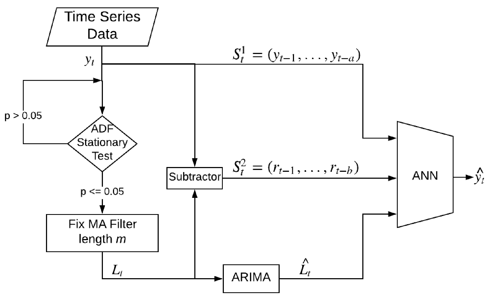

*Figure 1: Proposed Hybrid Method*

*图1：建议的混合方法*

The algorithm starts with data decomposition. In this method time series data $y_t$is considered as a function of linear $L_t$ and nonlinear $N_t$components in the same way as given in Equation 4.

该算法从数据分解开始。在此方法中，时间序列数据 $y_t$被视为线性$L_t$和非线性 $N_t$分量的函数，与公式4中给出的方式相同。

These two components are separated from the original data by using moving average (MA) filter with the length of m, as given in Equation 5. While the linear component $l_t$ has low volatility, the residual $r_t$ , which is the difference between the original data and the decomposed linear data in Equation 6, shows high fluctuation.

如公式5所示，使用长度为m的移动平均（MA）滤波器将这两个分量与原始数据分开。线性分量$l_t$ 具有较低的波动性，而残余$r_t$（即公式6中原始数据与分解后的线性数据之间的差异）则显示出较高的波动。
$$
l_t = \frac{1}{m} \sum_{i=t-m+1}^ty_i，公式5
$$

$$
r_t = y_t-l_t ，公式6
$$

In order for a proper decomposition, the length of the MA filter m has to be adjusted. Augmented Dickey Fuller (ADF) test which is unit root test can be performed to determine whether a given data series is stationary or not. The existence of a unit root on a given dataset indicates that there is an unpredictable systematic pattern. The more negative ADF test result means the stronger rejection of the existence of unit root for a given time series. Therefore, a negative ADF result implies that the given dataset is stationary. The well accepted threshold is 0.05 which is also used in this study to adjust MA filter length.

为了进行适当的分解，必须调整MA过滤器m的长度。可以执行增强的Dickey Fuller（ADF）测试（它是单位根测试）来确定给定的数据序列是否稳定。给定数据集上存在单位根表明存在不可预测的系统模式。ADF测试结果越负面，意味着在给定的时间序列中，对单位根存在的否定越强。因此，负ADF结果表示给定的数据集是固定的。公认的阈值为0.05，该阈值在本研究中也用于调整MA滤波器的长度。

After the linear component is achieved with MA filter, a linear model is constructed as shown in Equation 7. The stationary component l is modeled as a linear function of past values of the data series $l_{t-1},l_{t-2},\dots,l+t_{t-p}$ and random error series $\epsilon_{t-1},\epsilon_{t-2},\dots,\epsilon+t_{t-p}$ in Equation 1 using ARIMA model.

$$
\hat{L_t^{}} =g(l_{t-1},l_{t-2},\dots,l_{t-p},\epsilon_{t-1},\epsilon_{t-2},\dots,\epsilon_{t-q})
$$

where $g$ is a linear function of ARIMA.

使用MA滤波器实现线性分量后，将构建线性模型，如公式7所示。使用ARIMA模型在方程式1中将静态分量l建模为数据序列$l_{t-1},l_{t-2},\dots,l+t_{t-p}$和随机误差序列$\epsilon_{t-1},\epsilon_{t-2},\dots,\epsilon+t_{t-p}$的过去值的线性函数。

$$
\hat{L_t^{}} =g(l_{t-1},l_{t-2},\dots,l_{t-p},\epsilon_{t-1},\epsilon_{t-2},\dots,\epsilon_{t-q})
$$

其中$g$是ARIMA的线性函数。

Finally, nonlinear modeling ANN is used to implement functional relationship between components as indicated in Equation 4. The past observed data $y_{t-1}, y_{t-2}, \dots, y_{t-a}$ present ARIMA forecast result of the decomposed stationary data $L_t$, and residuals of the data decomposition $r_{t-1},r_{t-2}, \dots, r_{t-b}$are fed to ANN as indicated in Equation 8:

最后，非线性建模ANN用于实现组件之间的功能关系，如公式4所示。过去的观测数据$y_{t-1}, y_{t-2}, \dots, y_{t-a}$，当前ARIMA预测的分解后的固定数据$L_t$的预测结果以及数据分解$r_{t-1},r_{t-2}, \dots, r_{t-b}$的残差如公式8所示被馈送到ANN：

$$
 S_{t}^{1} =\left(y_{t-1}, y_{t-2}, \ldots, y_{t-a}\right) \\ S_{t}^{2} =\left(r_{t-1}, r_{t-2}, \ldots, r_{t-b}\right) \\ \hat{y}_{t} =f\left(S_{t}^{1}, \hat{L}_{t}, S_{t}^{2}\right) \\ \hat{y}_{t} =f\left(y_{t-1}, y_{t-2}, y_{t-a}, \hat{L}_{t}, r_{t-1}, r_{t-2}, \ldots, r_{t-b}\right)
$$

where f is the nonlinear function of ANN, a and b are parameters of the model which show how much we will go back in time to use as features to ANN. Time series data determines how many of those features in the residual path and observed data path are going to be used in the nonlinear model. For example, if the given data does not show volatility, then the residual variable b in Equation 8 might come out even as zero in tuning process. Likewise, a variable in Equation 8 is also empirically determined in the tuning process.

其中f是ANN的非线性函数，a和b是模型的参数，这些参数显示了我们将及时回溯用作ANN的特征。时间序列数据决定了在非线性模型中将使用剩余路径和观测数据路径中的那些特征中的多少。例如，如果给定数据未显示波动性，则公式8中的残差变量b在调整过程中甚至可能为零。同样，公式8中的变量也是在调整过程中根据经验确定的。

The proposed model does not only exploit the unique strength of single models, but also eliminates the three strong assumptions performed by other hybrid methods. Therefore, risk of low forecasting performance in unexpected situations is highly avoided. The competitive performance of our proposed algorithm is shown in our experimental results by using various type of datasets.

提出的模型不仅利用了单个模型的独特优势，而且消除了其他混合方法执行的三个强假设。因此，高度避免了在意外情况下预测性能低下的风险。通过使用各种类型的数据集，我们的实验结果显示了我们提出的算法的竞争性能。

### 4.Empirical Results

### 4.实证结果

The performance results of the proposed hybrid method along with the other methods discussed in this paper are evaluated on four different datasets. Three of them are well-known benchmark datasets - the Wolf’s sunspot data, the Canadian lynx data, and the British pound/US dollar exchange rate data which have been widely used in statistics and the neural network literature [15, 24, 25, 27]. The other dataset is publicly available electricity price of Turkey Intraday Market [31].

在四个不同的数据集上评估了所提出的混合方法以及本文讨论的其他方法的性能结果。其中三个是著名的基准数据集-沃尔夫的黑子数据，加拿大山猫数据和英镑/美元汇率数据，这些数据已广泛用于统计和神经网络文献[15，24，25，27 ]。另一个数据集是土耳其当日市场的公开可用电价[31]。

In the experiments, only one-step-ahead forecasting is considered.  In orderto  compare  accuracy  performances,  three  evaluation  metrics  are  used:  MeanAbsolute Error (MAE), Mean Squared Error (MSE) and Mean Absolute ScaledError (MASE) whose formulations are indicated as follows respectively:

在实验中，只考虑了一步一步的预测。为了比较精度性能，使用了三个评估指标：均值绝对误差（MAE），均方误差（MSE）和均值绝对比例误差（MASE），其公式分别表示如下：
$$
\begin{aligned} & \mathrm{MAE}=\frac{1}{n} \sum_{t=1}^{n}\left|e_{t}\right| \\ & \mathrm{MSE}=\frac{1}{n} \sum_{t=1}^{n} e_{t}^{2} \\ \operatorname{MASE} &=\frac{n-1}{n} \frac{\sum_{t=1}^{n}\left|e_{t}\right|}{\sum_{t=2}^{n}\left|y_{t}-y_{t-1}\right|} \end{aligned}
$$

where $e_{t}=y_{t}-\hat{y}_{t}$ and $y_t$ is the actual data value, $\hat{y_t}$is the forecasted value at given time t. While MAE specifies the average of the absolute errors over the performed prediction, MSE measures the average of the squared error. Since both MAE and MSE results depend on the scale of the given data, when comparing time series which have different scales, they are not preferable. Therefore, scale-free error metric MASE can be used to compare forecast accuracy between series.

其中$e_{t}=y_{t}-\hat{y}_{t}$和$y_t$是实际数据值，$\hat{y_t}$是在给定时间t的预测值。当MAE指定所执行的预测上的绝对误差的平均值时，MSE则测量平方误差的平均值。由于MAE和MSE结果均取决于给定数据的规模，因此在比较具有不同规模的时间序列时，它们不是可取的。因此，无标度误差度量MASE可用于比较系列之间的预测准确性。

*Table 1: Performance Comparison for All Datasets*

*表1：所有数据集的性能比较*

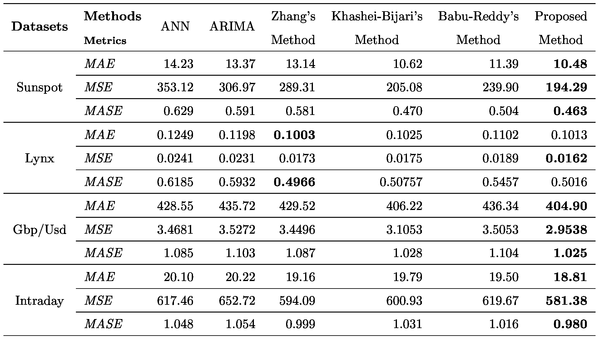

* MAE and MSE results are multiplied with 10−5 in Gbp/Usd dataset

* MAE和MSE结果在Gbp / Usd数据集中乘以10-5

To assess the forecasting performance of the different methods, each dataset is divided into training and testing sets. While the training data is used for model development, the test data is used to evaluate the established model. In order to tune the hyper-parameters the methods, the last 20% of training dataset is used as validation set.

为了评估不同方法的预测性能，将每个数据集分为训练集和测试集。当训练数据用于模型开发时，测试数据用于评估已建立的模型。为了调整超参数方法，将训练数据集的最后20％用作验证集。

In addition, due to the fact that ANN performs random initialization and produces different results at each run, the methods which include ANN algorithm are executed 50 times and average results are reported. Table 1 gives the forecasting results of all examined methods on these all four datasets.

此外，由于ANN执行随机初始化并在每次运行时产生不同的结果，因此包含ANN算法的方法执行了50次，并报告了平均结果。表1给出了这四个数据集上所有已检验方法的预测结果。

#### 4.1  Forecasts for Sunspot dataset

#### 4.1 太阳黑子数据集的预测

The Wolf’s sunspot series, which contains annual activity of spots visible on the face of the sun, has been extensively used in numerous linear and nonlinear models [24]. The data includes the annual count of sunspots from 1700 to 1987 (see Figure 2) giving a total of 288 observations. ADF stationarity test result of the dataset is 0.083 which is greater than the threshold 0.05. This implies

沃尔夫的太阳黑子序列包含年度活动的太阳表面可见光斑，已广泛用于许多线性和非线性模型[24]。数据包括从1700年到1987年的太阳黑子的年度计数（见图2），共进行了288次观测。数据集的ADF平稳性测试结果为0.083，大于阈值0.05。这意味着

that there is a unit root on the dataset, thus the dataset can be regarded as non-stationary time series. 288 observations in the dataset is divided into two samples: 221 observations between 1700-1920 years are considered as training data to develop the model, the last 67 observations between 1921-1987 years are considered as test data and used to evaluate the model performance.

数据集上存在单位根，因此该数据集可视为非平稳时间序列。数据集中的288个观测值分为两个样本：1700-1920年之间的221个观测值被视为训练模型的训练数据，1921-1987年之间的最后67个观测值被视为测试数据并用于评估模型的性能。

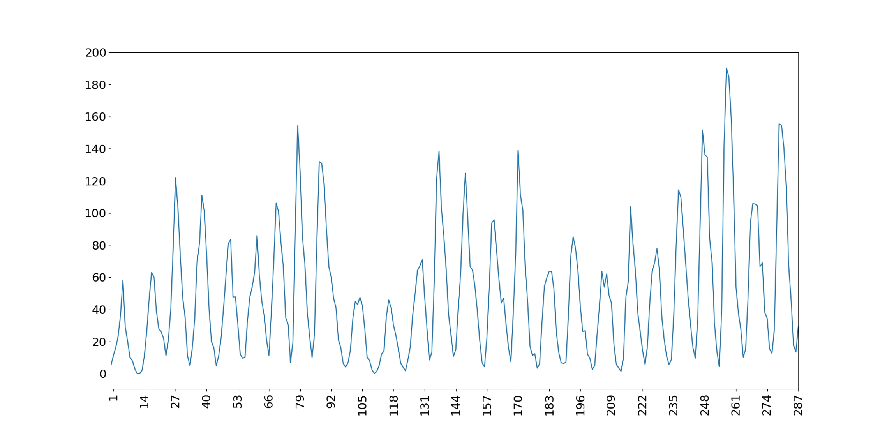

*Figure 2: Sunspot series (1700-1987)*

*图2：黑子系列（1700-1987）*

In Sunspot dataset, when ARIMA is individually used as a forecasting method, we also set the order of ARIMA to 9 (AR(9)) as same as the other many studies [15, 24, 25]. When ANN is individually used as a forecasting method, similar to these studies, three layered 4 x 4 x 1 ANN architecture is used which is composed of four input nodes, four hidden nodes, and one output node.

在Sunspot数据集中，当ARIMA单独用作预测方法时，我们也将ARIMA的顺序设置为9（AR（9）），与其他许多研究一样[15、24、25]。当将ANN单独用作预测方法时，类似于这些研究，将使用三层4 x 4 x 1 ANN架构，该架构由四个输入节点，四个隐藏节点和一个输出节点组成。

In the proposed method, the linear component comes out when the MA filter length is 15. After using the filter, the achieved linear component has 0.006 stationary test result which indicates its stationarity, since it is a value less than the threshold, 0.05. The best fitted neural network in the final step of the proposed hybrid method has 7 nodes in the input layer where 4 of them are observed values, 2 of them are residuals, and one node is assigned for the result

在提出的方法中，当MA滤波器长度为15时，线性分量出现。使用滤波器后，获得的线性分量的固定测试结果为0.006，表明其平稳性，因为该值小于阈值0.05。在提出的混合方法的最后一步中，最佳拟合神经网络在输入层中有7个节点，其中有4个是观测值，其中2个是残差，并为结果分配了一个节点

of linear component forecast. According to our experiments, when the number of hidden nodes are adjusted to same number of nodes as in the input layer, the best fitted ANN model is achieved.

线性成分预测。根据我们的实验，当将隐藏节点的数量调整为与输入层相同的节点数量时，将获得最佳拟合的ANN模型。

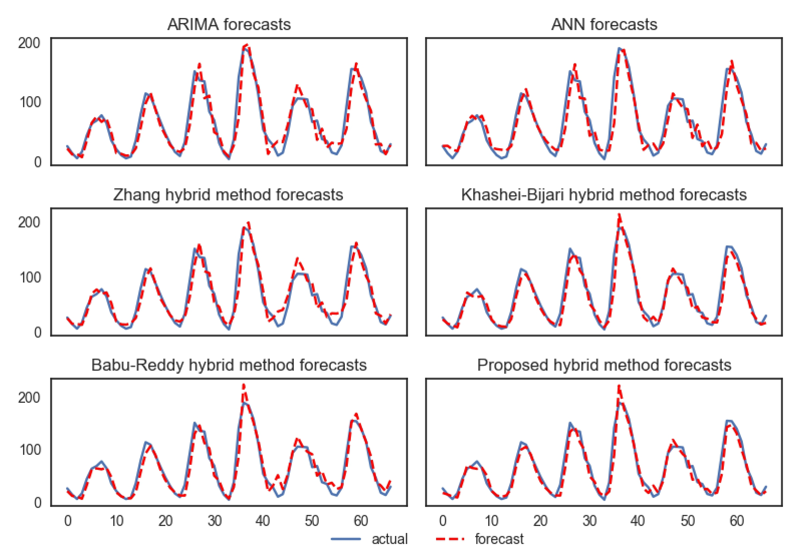

*Figure 3: Sunspot data forecasts using various methods*

*图3：使用各种方法进行的黑子数据预测*

When numerical results of Sunspot dataset given in Table 1 are analyzed, individual methods such as ARIMA, ANN have apparently lowest performance as compared to hybrid methods. This suggests that either ARIMA or ANN, when individually used, do not capture all patterns in the data series. Therefore, combining two methods by taking advantage of each of them can be an effective way to overcome this limitation. We indeed observe in Table 1 that the hybrid methods Zhang, Khashei-Bijari, and Babu-Reddy methods produce better results as compared to individual ones. However, they produce lower forecasting performance than our proposed hybrid method. The assumptions

分析表1中给出的Sunspot数据集的数值结果后，与混合方法相比，诸如ARIMA，ANN之类的单个方法的性能显然最低。这表明，ARIMA或ANN在单独使用时不会捕获数据序列中的所有模式。因此，通过利用每种方法的组合来组合两种方法可能是克服此限制的有效方法。我们确实在表1中观察到，与单独的方法相比，混合方法Zhang，Khashei-Bijari和Babu-Reddy方法产生了更好的结果。但是，与我们提出的混合方法相比，它们产生的预测性能较低。假设

those hybrid methods make can be restricting in many situations as mentioned in Section 3. Our proposed hybrid method eliminates those assumptions and yields better generalization performance.

如第3节所述，这些混合方法可能会在许多情况下受到限制。我们提出的混合方法消除了这些假设，并产生了更好的泛化性能。

#### 4.2. Forecasts for Lynx dataset

#### 4.2  Lynx数据集的预测

The lynx dataset, which contains the number of lynx trapped per year in the Mackenzie River district of Northern Canada, is an another extensively analyzed time series data in the literature [15, 24]. The data shows a periodicity of approximately 10 years as seen in Figure 4. Moreover, ADF stationary test results of the dataset is 0.056 which implies that the dataset is almost stationary. There are 114 observations in the data, corresponding to the period of 1821-1934.

lynx数据集包含加拿大北部Mackenzie河地区每年被困的lynx数量，是文献中另一个经过广泛分析的时间序列数据[15，24]。数据显示大约10年的周期，如图4所示。此外，数据集的ADF固定测试结果为0.056，这意味着该数据集几乎是固定的。数据中有114个观测值，对应于1821年到1934年。

The first 100 observations between 1821-1920 years are considered as training data to develop the model, the last 14 observations between 1921-1934 years are used as test data to evaluate the model performance. In addition, like in other studies [15, 24], the logarithms (to the base 10) of the data are used in the analysis.

1821年至1920年之间的前100个观测值被认为是建立模型的训练数据，1921-1934年之间的后14个观测值被用作测试数据以评估模型的性能。此外，像其他研究[15，24]一样，在分析中使用数据的对数（以10为底）。

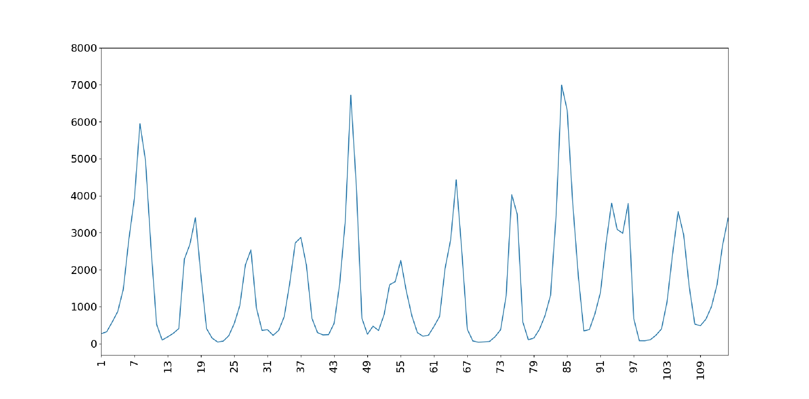

*Figure 4: Canadian lynx data series (1821-1934)*

*图4：加拿大天猫座数据系列（1821-1934）*

When ARIMA is used as an individual model, we used the AR model of order 12 (AR(12)) for Lynx dataset which is also used by [15, 24]. Similar to these studies, three layered 7 X 5 X 1 ANN architecture is used when ANN is individually used as a forecasting method.

当ARIMA用作单个模型时，我们对Lynx数据集使用12阶AR模型（AR（12）），[15，24]也使用了该模型。与这些研究类似，当将ANN单独用作预测方法时，将使用三层7 X 5 X 1 ANN架构。

In the proposed method, the linear component is extracted from the Lynx dataset when the MA filter length is 5. The relatively short MA filter length was expected, since the ADF test result shows a certain level of stationarity in the data. As a result of MA filter, the achieved linear component has 0.006 stationary test result which indicates even more stationarity to be properly modeled by ARIMA. The best fitted neural network in the final step of the proposed hybrid method has 9 nodes in the input layer where 5 of them are observed values, 3 of them are residuals, and one node is assigned for the result of linear component forecast. According to our tuning experiments, when the number of hidden nodes are adjusted to the same number of nodes as in the input layer, the best fitted ANN model is achieved.

在提出的方法中，当MA滤波器长度为5时，从Lynx数据集中提取线性分量。由于ADF测试结果显示出数据中的一定水平的平稳性，因此预期MA滤波器的长度相对较短。MA滤波器的结果是，所获得的线性分量具有0.006的静态测试结果，这表明有更多的平稳性可以通过ARIMA进行正确建模。在提出的混合方法的最后一步中，最佳拟合神经网络在输入层有9个节点，其中5个是观测值，其中3个是残差，并且为线性分量预测的结果分配了一个节点。根据我们的调整实验，当将隐藏节点的数量调整为与输入层相同的节点数量时，将获得最佳拟合的ANN模型。

In this dataset, among the individually used methods, ARIMA gives better accuracy as compared to ANN in contrast to the Sunspot dataset (see in Table 1). This is most likely due to the fact that Lynx dataset is more stationary dataset compared to Sunspot dataset. Due to this relative stationarity, the effect of hybrid methods might not be easily observed. Although we have circumstances which do not necessarily favor the data decomposition and model combination, hybrid methods do not give a lower performance than the individual linear models, and they even provide better results. The highest performance is mostly achieved by our proposed hybrid method. Figure 5 compares the actual and forecast values for all examined methods.

在该数据集中，与Sunspot数据集相比，与ANN相比，ARIMA的准确性更高（请参见表1）。这很可能是由于Lynx数据集比Sunspot数据集更稳定的事实。由于这种相对平稳性，可能不容易观察到混合方法的效果。尽管我们的情况不一定支持数据分解和模型组合，但是混合方法的性能并不比单个线性模型低，甚至可以提供更好的结果。最高性能主要通过我们提出的混合方法来实现。图5比较了所有检查方法的实际值和预测值。

#### 4.3 Forecasts for Gbp/Usd dataset

#### 4.3 英镑与美元汇率数据集

The other benchmark dataset is the exchange rate between British pound and US dollar which contains weekly observation from 1980 to 1993, giving 731 data points in the time series. Predicting exchange rate is an important yet difficult task due to high volatility. ADF stationary test result of the dataset is 0.58 which is highly greater than the threshold 0.05. This implies that the dataset is highly volatile and non-stationary. This non-stationarity can be even seen in the plot, given in Figure 6, which shows numerous changing turning points in the series. Similar to other datasets, the experimental setup is same as in previous hybrid studies [15, 24] where data is transformed using natural logarithmic function and separated into two samples. The first 679 observations from 1980-1992 years are considered as training data to develop the model, the last 52 observations between 1992-1993 years are used as test data to evaluate the model performance.

另一个基准数据集是英镑与美元之间的汇率，该汇率包含1980年至1993年的每周观察值，在时间序列中提供731个数据点。由于波动性高，预测汇率是一项重要而困难的任务。数据集的ADF固定测试结果为0.58，远大于阈值0.05。这意味着数据集是高度易变且不稳定的。这种不平稳性甚至可以在图6所示的图中看出，该图显示了该系列中许多变化的转折点。与其他数据集相似，实验设置与以前的混合研究[15，24]相同，在该研究中，数据是使用自然对数函数进行转换并分为两个样本。1980-1992年的前679个观测值被视为训练模型的训练数据，1992-1993年之间的后52个观测值用作测试数据以评估模型的性能。

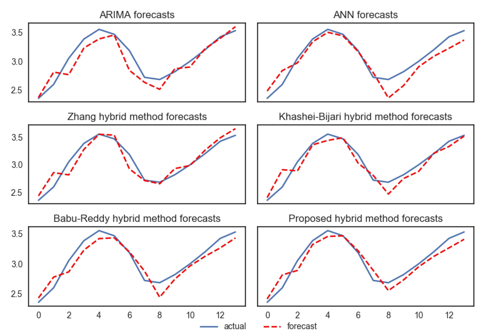

*Figure 5: Lynx data forecasts using various methods*

*图5：使用各种方法的Lynx数据预测*

In this dataset, when ARIMA is individually used, rather than using regression type of model in the ARIMA itself, random walk model is chosen as best-fitted ARIMA model. This approach has been used by Zhang [15] and also been suggested by many studies in the exchange rate literature [32]. In this model, the most recent observation is the best guide for the next forecast. When ANN is individually used as a forecasting method, the best fitted ANN is set as three layered 7 x 6 x 1 architecture.

在该数据集中，当单独使用ARIMA而不是在ARIMA本身中使用回归类型的模型时，随机游走模型被选为最佳ARIMA模型。Zhang [15]已经使用了这种方法，汇率文献[32]中的许多研究也提出了这种方法。在此模型中，最新的观测值是下次预测的最佳指南。当将ANN单独用作预测方法时，拟合最佳的ANN被设置为三层7 x 6 x 1的体系结构。

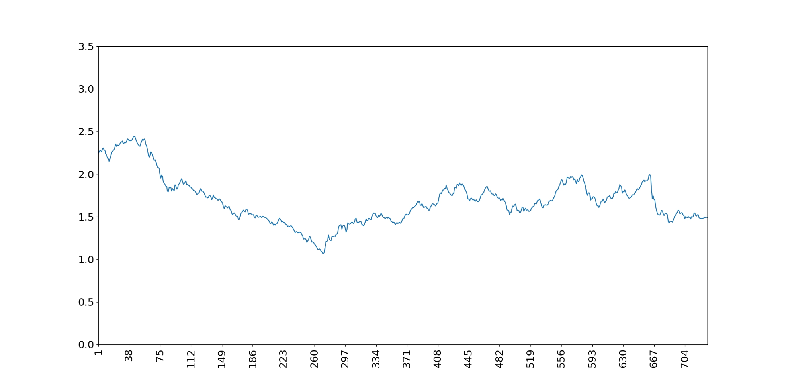

*Figure 6: Weekly British pound/US dollar exchange rate series (1980-1993)*

*图6：英镑/美元每周汇率系列（1980-1993）*

In the proposed method, in order to decompose this highly volatile data, MA filter length comes out to be 40. As a result of this decomposition, ADF test result of the obtained component is 0.007 which indicates the stationarity of the component. To compute the best final forecast in the proposed model, the ANN is constructed as three layered 9 x 9 x 1 architecture. In this architecture, input layer is composed of the last 5 of observed values, the last 3 of residuals, and the result of linear component forecast.

在提出的方法中，为了分解这种高度易变的数据，MA滤波器的长度为40。作为该分解的结果，所获得的组分的ADF测试结果为0.007，表明该组分的平稳性。为了计算建议模型中的最佳最终预测，将ANN构建为三层9 x 9 x 1架构。在此体系结构中，输入层由观察值的最后5个，残差的最后3个以及线性分量预测的结果组成。

Results of the Gbp/Usd dataset forecasts are compared in Figure 7. Both ANN and hybrid methods have much better performance than the individual ARIMA method for a highly fluctuating forecast horizon. The proposed hybrid method is able to capture this volatile pattern much better and outperforms the other methods in all error metrics.

图7比较了Gbp / Usd数据集预测的结果。对于高度波动的预测范围，ANN和混合方法都比单独的ARIMA方法具有更好的性能。所提出的混合方法能够更好地捕获此易失性模式，并且在所有误差指标上均优于其他方法。

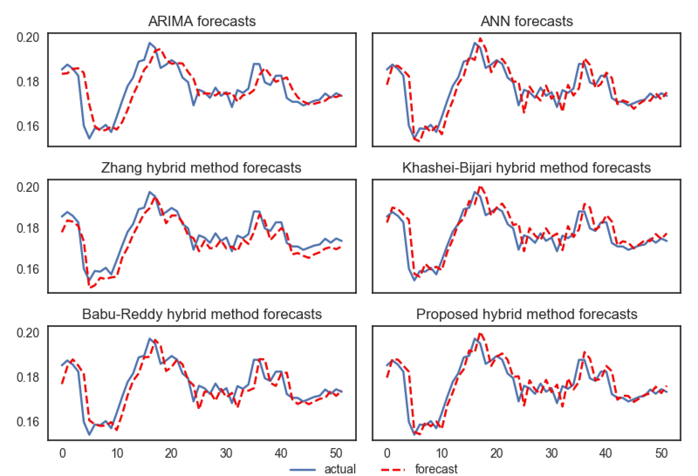

*Figure 7: Gbp/Usd data forecasts using various methods*

*图7：使用各种方法的Gbp / Usd数据预测*

#### 4.4. Forecasts for Intraday dataset

#### 4.4 日内数据集的预测

The last analyzed dataset is Turkey intraday electricity market price data which is publicly available [31]. The dataset contains 581 observations which consist of daily averaged prices from July 2015 to December 2017. As compared to datasets such as Sunspot and Lynx, data pattern in this dataset is also highly fluctuating (see Figure 8). ADF stationary test result of the dataset shows 0.27 value which is highly greater than the threshold of 0.05. Natural logarithmic transformation is applied on the dataset for scaling purposes.

最后分析的数据集是公开提供的土耳其当日电力市场价格数据[31]。数据集包含581个观察值，其中包括2015年7月至2017年12月的每日平均价格。与Sunspot和Lynx等数据集相比，该数据集中的数据模式也非常不稳定（请参见图8）。数据集的ADF固定测试结果显示0.27的值大大高于0.05的阈值。自然对数转换应用于数据集以进行缩放。

In this dataset, when ARIMA is individually used as a forecasting method, we found autoregressive model of order 9 (AR(9)) to be the most parsimonious one among all ARIMA models. The best fitted individual ANN model is achieved in three layered 3 X 6 X 1 architecture, after our tuning process.

在此数据集中，当将ARIMA单独用作预测方法时，我们发现9阶自回归模型（AR（9））是所有ARIMA模型中最简约的模型。经过我们的优化过程，在三层3 X 6 X 1架构中获得了最佳拟合的个体ANN模型。

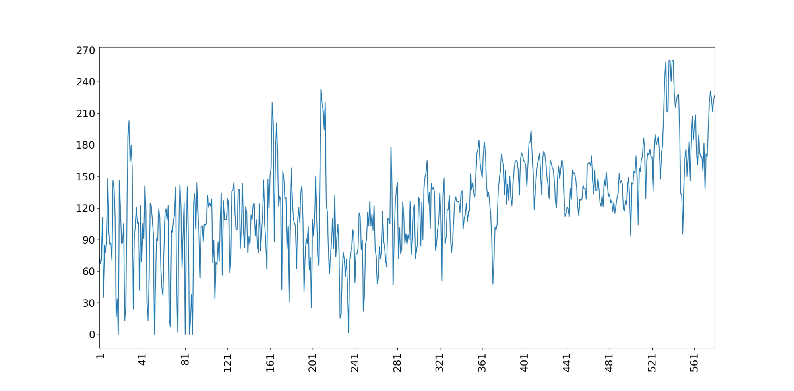

*Figure 8: Electricity Price of Intraday Market in Turkey (Jul. 2015 - Dec. 2017)*

*图8：土耳其当日市场电价（2015年7月-2017年12月）*

In this dataset, the length of MA filter which we use in the proposed hybrid method comes out as 6. The obtained linear component after the MA filter has 0.004 ADF stationary test result; this implies that the component can be properly modeled by ARIMA method in our architecture. The best fitted ANN in the final step of the proposed method has 17 x 17 x 1 architecture. Input layer is composed of the last 8 of original data, the last 8 of residuals and the result of linear component forecast.

在该数据集中，我们在提出的混合方法中使用的MA滤波器的长度为6。MA滤波器后获得的线性分量具有0.004 ADF固定测试结果；这意味着可以在我们的体系结构中使用ARIMA方法对组件进行正确建模。在提出的方法的最后一步中，拟合效果最好的ANN具有17 x 17 x 1的体系结构。输入层由原始数据的最后8个，残差的最后8个以及线性分量预测的结果组成。

Similar to Gbp/Usd dataset, Intraday dataset is highly volatile and nonstationary which cannot be effectively modeled by using only a linear model. As can be seen in Table 1, ANN and hybrid methods significantly outperform the individual linear model of ARIMA. Furthermore, the proposed method gives remarkably superior accuracy as compared to other hybrid methods in all error metrics. The comparison of the actual and forecast values for all examined method are given in Figure 9.

与Gbp / Usd数据集相似，Indayday数据集具有高度的波动性和非平稳性，仅使用线性模型就无法有效地对其进行建模。如表1所示，人工神经网络和混合方法明显优于ARIMA的单个线性模型。此外，与其他混合方法相比，该方法在所有误差指标上均具有极高的准确性。图9给出了所有检查方法的实际值和预测值的比较。

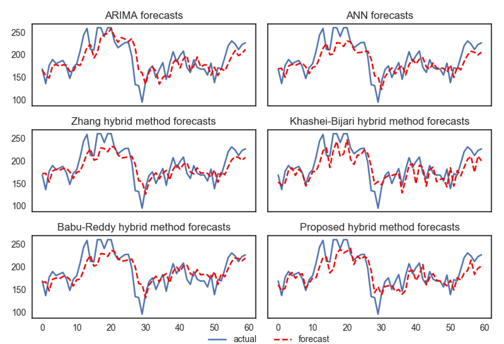

*Figure 9: Intraday data forecasts using various methods*

*图9：使用各种方法进行的日内数据预测*

### 5. Discussion and Improvement

### 5.讨论与改进

There are several important results obtained in our experiments Firstly, when individual methods’ results are compared among themselves, we see that ARIMA outperforms ANN for the datasets which present more linearity and vice versa (see Table 1). Moreover, hybrid methods have better performance as compared to individual ones especially in more fluctuating datasets. Finally, the assumptions made by other hybrid methods degenerate the forecasting performance when unexpected situations occur in the data. Our proposed hybrid method which avoids these assumptions apparently creates more general models and outperforms the other examined methods.

在我们的实验中获得了几个重要的结果。首先，当将各个方法的结果进行比较时，我们发现ARIMA在表现出更高线性度的数据集上优于ANN（反之亦然）（请参见表1）。而且，与单个方法相比，混合方法具有更好的性能，尤其是在波动较大的数据集中。最后，当数据中出现意外情况时，其他混合方法所做的假设会降低预测性能。我们提出的混合方法避免了这些假设，显然可以创建更通用的模型，并且优于其他方法。

Figure 10 compares the distribution of MASE results of datasets with ADF test results of the corresponding dataset. In this figure, boxplots are drawn by using MASE values of all examined methods for each dataset, presented in Table 1. When we compare error results among time series data by using a scaleinvariant error metric MASE, it is observed that the more non-stationarity in a dataset leads to a higher error value. For example, Lynx dataset, which turns out to be the most linear among all datasets according to ADF test results, has the lowest MASE results. On the other hand, Gbp/Usd dataset, which shows the most non-linearity according to ADF test results, has the highest MASE results. As a result of this, we can conclude that having more regular data distribution in a time series leads to more accurate results in forecasting. This conclusion motivates us to propose an improvement on our already best performing proposed hybrid method. This improved method aims to produce more stationary subseries from given time series by using a multi-scale decomposition technique. Then, those achieved linear subseries can be modeled with a higher accuracy using the proposed hybrid method.

图10比较了数据集的MASE结果与相应数据集的ADF测试结果的分布。在此图中，通过使用每个数据集的所有检验方法的MASE值绘制箱形图，如表1所示。当我们使用尺度不变误差度量MASE比较时间序列数据之间的误差结果时，观察到数据集中的非平稳性越高，误差值越大。例如，根据ADF测试结果，Lynx数据集在所有数据集中是最线性的，而MASE结果最低。另一方面，根据ADF测试结果，非线性度最高的Gbp / Usd数据集的MASE结果最高。结果，我们可以得出结论，在时间序列中具有更规则的数据分布会导致更准确的预测结果。这个结论激励我们提出对我们已经表现最好的提出的混合方法的改进。这种改进的方法旨在通过使用多尺度分解技术从给定的时间序列中生成更多的平稳子序列。然后，可以使用提出的混合方法以更高的精度对那些获得的线性子系列进行建模。

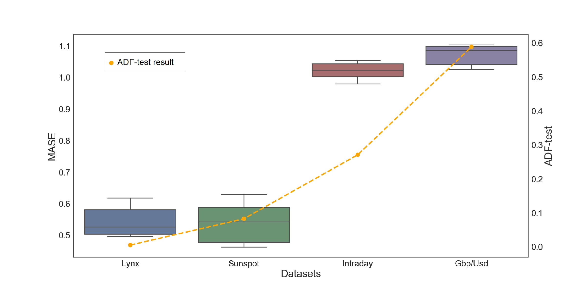

*Figure 10: Comparison of MASE distribution with ADF test results for all datasets*

*图10：所有数据集的MASE分布与ADF测试结果的比较*

In the literature there are several multi-scale decomposition methods such as Empirical Mode Decomposition (EMD), Wavelet Packet Decomposition (WPD), Fourier Transform (FT) and etc. [33]. Since EMD does not make a priori assumption about the given time series and preserves time scale of the data throughout the decomposition, it is a more prefer technique than the others for decomposing time series [26].

在文献中，有几种多尺度分解方法，例如经验模式分解（EMD），小波包分解（WPD），傅里叶变换（FT）等[33]。由于EMD不会对给定的时间序列进行先验假设，并且在整个分解过程中都保留了数据的时间尺度，因此它比其他方法更能分解时间序列[26]。

*Figure 11: The hybrid architecture using EMD*

*图11：使用EMD的混合架构*

The main principle of EMD is to decompose a given time series data into asum of several subseries.  Those subseries are calledIntrinsic  Mode  Functions(IMFs)and the remaining component after subtracting the summation of IMFsfrom  the  original  data  is  calledresidue.   These  subseries  have  two  importantproperties which allow them to be easily modeled:  Each subseries has its ownlocal characteristic time scale and they are relatively stationary subseries.  Let $y(t)$ be a given time series data, and then the EMD calculation can be described as follows:

EMD的主要原理是将给定的时间序列数据分解为几个子序列的总和。这些子系列称为本征函数（IMF），从原始数据中减去IMF的总和后的其余分量称为残差。这些子系列具有两个重要的属性，可轻松对其进行建模：每个子系列都有自己的局部特征时间尺度，并且它们是相对固定的子系列。假设$y(t)$是给定的时间序列数据，则EMD计算可以描述如下：
$$
y(t)=\sum_{i=1}^{n} I M F_{i}(t)+R_{n}(t)
$$

$i=1$ where $IMF_i(t),(i=1,2,\dots,n)$ represents the different subseries, and$R_n(t)$is the residue after summation of n IMFs are subtracted from the original data. The EMD-based methods includes three main steps, as seen in Figure 11: In the first step, the original time series data is decomposed into IMFs. In the second step, forecasting is performed by usinf our hybr’dd method on each IMF. In the last step, forecast results of each individual model are summed up to achieve the final forecast of the original time series. We use an additive function in the end to capture the additive relation of IMFs with the original data.

$i = 1$，其中$IMF_i(t),(i=1,2,\dots,n)$表示不同的子序列，而$R_n(t)$是从原始数据中减去n个IMF的总和后的残差。基于EMD的方法包括三个主要步骤，如图11所示：在第一步中，将原始时间序列数据分解为IMF。第二步，使用我们的hybr’dd方法对每个IMF进行预测。在最后一步中，对每个模型的预测结果进行汇总，以实现对原始时间序列的最终预测。最后，我们使用加法函数来捕获IMF与原始数据的加法关系。

*Table 2: Performance Comparison of methods using EMD for All Datasets*

*表2：对所有数据集使用EMD的方法的性能比较*

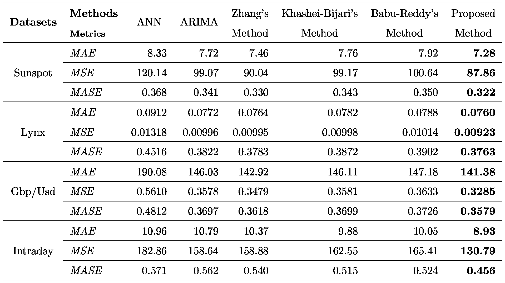

\* MAE and MSE results are multiplied with 10−5 in Gbp/Usd dataset

\* MAE和MSE结果在Gbp / Usd数据集中乘以10-5

The EMD-based methods are evaluated on the same datasets by using the experimental setup in Figure 11. In order to evaluate the effect of EMD, all examined methods are executed in the second step of the algorithm (see Figure 11). Table 2 gives the forecasting results of all examined methods with EMD on four all datasets. When these results are compared with the previous

通过使用图11中的实验设置，可以在相同的数据集上评估基于EMD的方法。为了评估EMD的效果，所有检查的方法都在算法的第二步中执行（请参见图11）。表2给出了在所有四个数据集上使用EMD进行的所有检验方法的预测结果。将这些结果与之前的结果进行比较时

ones showed in Table 1, the methods with EMD give significantly higher accuracies. The percentage improvement for all datasets are presented in Table 3. The improvements at each dataset varies between 23% and 89% for all error metrics. We also provide a bar chart (see Figure 12) that shows the MASE results for each method which are averaged over the results of all datasets. The chart indicates that methods with EMD achieve remarkably less error in their forecasts. Further analysis shows that EMD-based methods give even greater improvements in the accuracies for non-stationary datasets. This is most likely due to the fact that EMD is able to resolve high volatility problem in time series data. For example, while our hybrid method with EMD improves MASE results of relatively stationary datasets Sunspot and Lynx 30% and 28% respectively, this improvement jump over 50% in Gbp/Usd and Intraday datasets which are highly non-stationary. Another indication of EMD’s capability of solving volatility problem is that ARIMA is able to achieve better results than ANN for all datasets (see Table 3), although ANN without using EMD was better in non-stationary datasets (see Table 1).

表1所示的方法，采用EMD的方法的准确度要高得多。表3列出了所有数据集的改进百分比。对于所有误差指标，每个数据集的改进幅度在23％到89％之间。我们还提供了一个条形图（参见图12），该条形图显示了每种方法的MASE结果，这些结果是在所有数据集的结果上平均的。图表表明，采用EMD的方法在预测中实现的误差明显减少。进一步的分析表明，基于EMD的方法对非平稳数据集的准确性有了更大的提高。这很可能是由于EMD能够解决时间序列数据中的高波动性问题这一事实。例如，虽然我们的EMD混合方法将相对平稳的数据集Sunspot和Lynx的MASE结果分别提高了30％和28％，但在Gbp / Usd和Intraday数据集（高度不稳定）中，这一改进超过了50％。EMD解决波动性问题的能力的另一个迹象是，尽管在非平稳数据集中，不使用EMD的ANN效果更好，但对于所有数据集，ARIMA都能比ANN获得更好的结果（参见表1）。

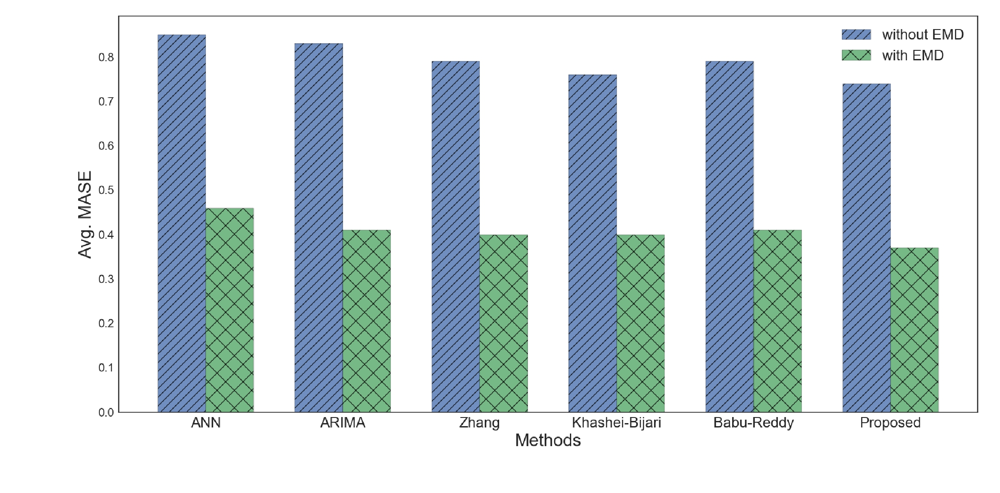

*Figure 12: Average MASE results of the methods with/without using EMD*

*图12：使用或不使用EMD的方法的平均MASE结果*

In final, we want to point out that our proposed hybrid method with EMD gives the best results as compared to other methods (see Table 3). Subseries obtained from EMD are relatively stationary as compared to original data however, they still show fluctuations in their frequency range. Performing one more decomposition on these subseries using MA filter and constituting functional relation between the stationary part, residuals, and the original data values outperforms all other remaining methods.

最后，我们要指出的是，与其他方法相比，我们提出的EMD混合方法提供了最好的结果（参见表3）。与原始数据相比，从EMD获得的子序列相对静止，但是它们仍显示出其频率范围内的波动。使用MA滤波器对这些子系列执行另一分解，并在固定部分，残差和原始数据值之间构成函数关系，其性能优于所有其他方法。

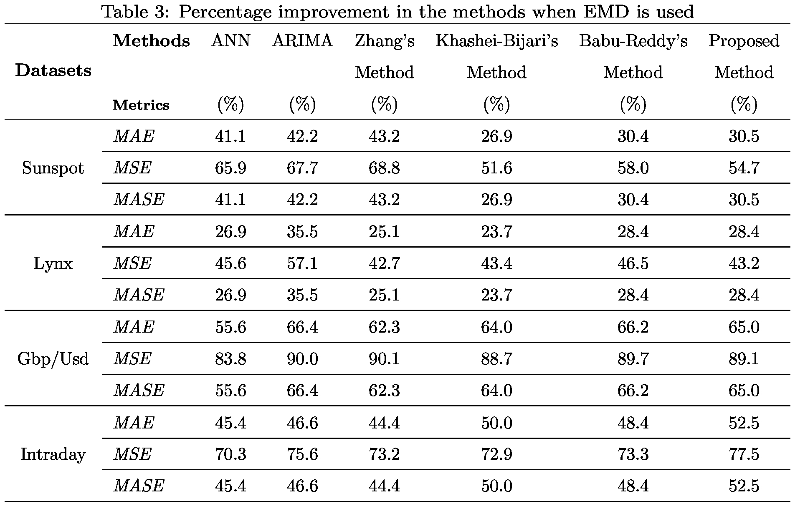

### 6. Conclusions

### 6.结论

Time series forecasting is an important yet often a challenging task used in many different application domains. The studies in the litreture mainly focus on either linear or nonlinear modelings individually or a combination of them. While linear models such as ARIMA gives better forecasting accuracy with stationary time series data, nonlinear methods such as ANN is more appropriate for non-stationary datasets. In order to take advantage of the unique strength of each different type of methods in a more general setting, hybrid methods are proposed. Hybrid methods basically use linear and nonlinear modeling, ARIMA and ANN respectively on the corresponding decomposed components and then combine the results. Hybrid ARIMA-ANN methods give better results in general as compared to the cases where they are individually used. However, they generally suffer from the assumptions they make while constructing their model. These assumptions lead to produce inconsistent results and give low accuracies in overall if unexpected situations occur.

时间序列预测是在许多不同的应用程序领域中使用的重要但通常具有挑战性的任务。文学的研究主要集中于线性或非线性建模的单独或组合。虽然线性模型（例如ARIMA）使用固定的时间序列数据可以提供更好的预测精度，但非线性方法（例如ANN）更适合于非平稳数据集。为了在更一般的环境中利用每种不同类型方法的独特优势，提出了混合方法。混合方法主要在相应的分解分量上分别使用线性和非线性建模，ARIMA和ANN，然后合并结果。与单独使用它们的情况相比，混合ARIMA-ANN方法通常可获得更好的结果。但是，他们通常会在构建模型时服从其假设。这些假设导致产生不一致的结果，并且在发生意外情况时总体上准确性较低。

In this study, a new hybrid ARIMA-ANN model based forecasting method is proposed to overcome three main assumptions made by traditional hybrid ARIMA-ANN models. Firstly, the proposed method removes the assumption that the linear component is the ARIMA model output of the given data. Rather, it extracts the linear component by using MA filter. It is known that data showing linear characteristics can be more accurately modeled by linear methods. Therefore, properly decomposed data yields more accurate linear forecasting and consequently more accurate final results in the hybrid methods. Secondly, the proposed method does not directly model residuals via a nonlinear method ANN, since the assumption of that residuals might comprise valid nonlinear patterns, does not always hold. Thirdly, the proposed method does not restrict linear and nonlinear component modeling and also combining the results of them. Rather, it can capture structures of the linear and nonlinear components in a better way, and produces more general models than those existing hybrid models.

在这项研究中，提出了一种新的基于ARIMA-ANN混合模型的预测方法，以克服传统ARIMA-ANN混合模型所做的三个主要假设。首先，所提出的方法消除了线性分量是给定数据的ARIMA模型输出的假设。而是使用MA滤波器提取线性分量。众所周知，可以通过线性方法更精确地建模显示线性特征的数据。因此，在混合方法中，适当地分解的数据可以产生更准确的线性预测，因此最终结果也更准确。其次，由于假设残差可能包含有效的非线性模式，因此提出的方法不能直接通过非线性方法ANN对残差进行建模，因此并不总是成立。第三，所提出的方法不限制线性和非线性组件建模，并且也将它们的结果结合起来。相反，与现有的混合模型相比，它可以更好地捕获线性和非线性组件的结构，并生成更通用的模型。

In the light of our experimental results, we can conclude that forecasting performance gets better if more stationary time series data is provided. This result motives us to make original time series data more stationary in order to improve accuracy results. We show that when EMD multi-scale data decomposition is combined with all examined methods, accuracy results can be remarkably improved. Our experimental results indicate that our hybrid method with EMD gives remarkably superior accuracy as compared to all other examined methods.

根据我们的实验结果，我们可以得出结论，如果提供更多的固定时间序列数据，则预测性能会更好。该结果促使我们使原始时间序列数据更加平稳，以提高准确性结果。我们表明，将EMD多尺度数据分解与所有检查的方法结合使用时，可以显着提高准确性结果。我们的实验结果表明，与所有其他检查的方法相比，我们的EMD混合方法提供了非常优越的精度。